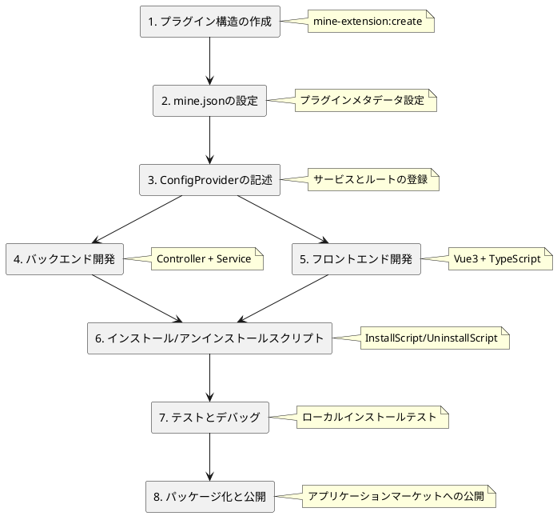

# プラグイン開発ガイド

このガイドは実際のMineAdmin公式プラグインコードに基づき、プラグインの完全な開発プロセスを詳細に説明します。

## 開発プロセスの概要



## プラグイン構造の規約

`app-store`と`code-generator`プラグインの実際のコードに基づき、MineAdminプラグインには2つの典型的な構造があります：

### シンプルなプラグイン構造（純粋なバックエンドまたは単純な機能向け）

```
plugin/mine-admin/plugin-name/
├── mine.json                      # プラグイン設定ファイル
├── install.lock                   # インストールマーカー（自動生成）
└── src/
    ├── ConfigProvider.php         # 設定プロバイダー
    ├── Controller/                # コントローラー
    │   └── IndexController.php
    └── Service/                   # サービス層
        └── Service.php
```

### 完全なプラグイン構造（複雑なビジネス向け）

```
plugin/mine-admin/plugin-name/
├── mine.json                      # プラグイン設定ファイル
├── install.lock                   # インストールマーカー（自動生成）
├── README.md                      # プラグイン説明
├── src/                          # バックエンドコード
│   ├── ConfigProvider.php        # 設定プロバイダー
│   ├── InstallScript.php         # インストールスクリプト
│   ├── UninstallScript.php       # アンインストールスクリプト
│   ├── Http/
│   │   ├── Controller/           # コントローラー
│   │   ├── Request/              # リクエスト検証
│   │   └── Vo/                   # 値オブジェクト
│   ├── Model/                    # データモデル
│   ├── Repository/               # リポジトリ層
│   └── Service/                  # サービス層
├── web/                          # フロントエンドコード
│   ├── index.ts                  # プラグインエントリ
│   ├── api/                      # APIインターフェース
│   ├── views/                    # Vueコンポーネント
│   └── locales/                  # 言語パック
├── Database/                     # データベース
│   ├── Migrations/               # マイグレーションファイル
│   └── Seeder/                   # シードデータ
├── languages/                    # バックエンド言語パック
│   └── zh_CN/
└── publish/                      # 公開リソース
    └── template/                 # テンプレートファイル
```

## バックエンド開発

### 1. ConfigProvider 設定プロバイダー

app-storeプラグインの実際の実装に基づく：

```php
<?php
declare(strict_types=1);

namespace Plugin\MineAdmin\AppStore;

class ConfigProvider
{
    public function __invoke(): array
    {
        return [
            // アノテーションスキャン設定 - 必須設定
            'annotations' => [
                'scan' => [
                    'paths' => [
                        __DIR__,
                    ],
                ],
            ],
            // 依存注入（オプション）
            'dependencies' => [
                // Interface::class => Implementation::class
            ],
            // コマンドライン（オプション）
            'commands' => [
                // Command::class
            ],
            // ミドルウェア（オプション）
            'middlewares' => [
                'http' => [
                    // Middleware::class
                ],
            ],
            // イベントリスナー（オプション）
            'listeners' => [
                // Listener::class
            ],
        ];
    }
}
```

### 2. コントローラー開発

app-storeのIndexController実装を参考：

```php
<?php
declare(strict_types=1);

namespace Plugin\MineAdmin\AppStore\Controller;

use Hyperf\Di\Annotation\Inject;
use Hyperf\HttpServer\Annotation\Controller;
use Hyperf\HttpServer\Annotation\GetMapping;
use Hyperf\HttpServer\Annotation\PostMapping;
use Mine\Annotation\Auth;
use Mine\Annotation\Permission;
use Mine\Annotation\RemoteState;
use Plugin\MineAdmin\AppStore\Service\Service;
use Psr\Http\Message\ResponseInterface;

#[Controller(prefix: "admin/plugin/store")]
#[Auth]
class IndexController extends AbstractController
{
    #[Inject]
    protected Service $service;

    /**
     * リモートプラグインリスト
     */
    #[GetMapping("index")]
    #[Permission("plugin:store:index")]
    public function index(): ResponseInterface
    {
        return $this->success(
            $this->service->getAppList($this->request->all())
        );
    }

    /**
     * プラグインのダウンロード
     */
    #[PostMapping("download")]
    #[Permission("plugin:store:download")]
    public function download(): ResponseInterface
    {
        $params = $this->request->all();
        $this->service->download($params);
        return $this->success();
    }

    /**
     * プラグインのインストール
     */
    #[PostMapping("install")]
    #[Permission("plugin:store:install")]
    public function install(): ResponseInterface
    {
        $params = $this->request->all();
        $this->service->install($params);
        return $this->success();
    }

    /**
     * プラグインのアンインストール
     */
    #[PostMapping("unInstall")]
    #[Permission("plugin:store:uninstall")]
    public function unInstall(): ResponseInterface
    {
        $params = $this->request->all();
        $this->service->unInstall($params);
        return $this->success();
    }

    /**
     * ローカルプラグインインストールリスト
     */
    #[GetMapping("getInstallList")]
    #[RemoteState]
    public function getInstallList(): ResponseInterface
    {
        return $this->success(
            $this->service->getLocalAppInstallList()
        );
    }

    /**
     * ローカルアップロードインストール
     */
    #[PostMapping("uploadInstall")]
    #[Permission("plugin:store:uploadInstall")]
    public function uploadInstall(): ResponseInterface
    {
        return $this->success(
            $this->service->uploadLocalApp($this->request->all())
        );
    }
}
```

**主要なアノテーション説明**：
- `#[Controller]`: コントローラールートプレフィックスの定義
- `#[Auth]`: ログイン認証が必要
- `#[Permission]`: 権限検証
- `#[GetMapping]`/`#[PostMapping]`: ルートメソッドの定義
- `#[Inject]`: 依存注入
- `#[RemoteState]`: リモート状態管理

### 3. サービス層開発

app-storeのService実装パターンに基づく：

```php
<?php
declare(strict_types=1);

namespace Plugin\MineAdmin\AppStore\Service;

use App\Service\MineAppStoreService;
use Hyperf\Di\Annotation\Inject;
use Mine\AppStore\Plugin;
use Mine\Exception\MineException;

class Service
{
    #[Inject]
    protected MineAppStoreService $service;

    /**
     * アプリケーションリストの取得
     */
    public function getAppList(array $params): array
    {
        return $this->service->getAppList($params);
    }

    /**
     * アプリケーションのダウンロード
     */
    public function download(array $params): void
    {
        $app = $this->service->getAppInfo($params['identifier']);
        
        if (empty($app['download_url'])) {
            throw new MineException('このアプリケーションはダウンロードできません', 500);
        }
        
        if (Plugin::hasLocalInstalled($params['identifier'])) {
            throw new MineException('アプリケーションは既にローカルに存在します。再ダウンロードする場合は、まずローカルアプリケーションを削除してください', 500);
        }
        
        $this->service->download($params);
    }

    /**
     * アプリケーションのインストール
     */
    public function install(array $params): void
    {
        $pluginName = $params['name'];
        
        if (!Plugin::hasLocal($pluginName)) {
            throw new MineException('プラグインが存在しません', 500);
        }
        
        if (Plugin::hasLocalInstalled($pluginName)) {
            throw new MineException('プラグインは既にインストールされています', 500);
        }
        
        Plugin::forceRefreshJsonPath($pluginName);
        Plugin::install($pluginName);
    }

    /**
     * アプリケーションのアンインストール
     */
    public function unInstall(array $params): void
    {
        $pluginName = $params['name'];
        
        if (!Plugin::hasLocalInstalled($pluginName)) {
            throw new MineException('プラグインがインストールされていません', 500);
        }
        
        Plugin::uninstall($pluginName);
    }

    /**
     * ローカルにインストールされたプラグインリストの取得
     */
    public function getLocalAppInstallList(): array
    {
        $list = [];
        $plugins = Plugin::getLocalPlugins();
        
        foreach ($plugins as $name => $info) {
            $app = ['identifier' => $name];
            $app['name'] = $info['name'] ?? '未知';
            $app['status'] = $info['status'] ?? false;
            $app['version'] = $info['version'] ?? '0.0.0';
            $app['description'] = $info['description'] ?? '説明なし';
            $app['created_at'] = $info['created_at'] ?? '';
            $list[] = $app;
        }
        
        return $list;
    }

    /**
     * ローカルアップロードインストール
     */
    public function uploadLocalApp(array $params): void
    {
        if (empty($params['path'])) {
            throw new MineException('プラグインパッケージをアップロードしてください', 500);
        }
        
        // プラグインパッケージの解凍と検証
        $zipFile = new \ZipArchive();
        $result = $zipFile->open($params['path']);
        
        if ($result !== true) {
            throw new MineException('プラグインパッケージの解凍に失敗しました', 500);
        }
        
        // プラグイン情報の取得とインストール
        $mineJson = $zipFile->getFromName('mine.json');
        if (!$mineJson) {
            throw new MineException('プラグインパッケージ形式が不正です。mine.jsonが不足しています', 500);
        }
        
        $config = json_decode($mineJson, true);
        $pluginName = $config['name'] ?? null;
        
        if (!$pluginName) {
            throw new MineException('プラグインパッケージの設定が不正です', 500);
        }
        
        // プラグインディレクトリに解凍
        $targetPath = Plugin::getPluginPath($pluginName);
        $zipFile->extractTo($targetPath);
        $zipFile->close();
        
        // キャッシュの更新とインストール
        Plugin::forceRefreshJsonPath($pluginName);
        Plugin::install($pluginName);
    }
}
```

### 4. モデル層（データベースが必要な場合）

code-generatorプラグインのモデル実装を参考：

```php
<?php
declare(strict_types=1);

namespace Plugin\MineAdmin\CodeGenerator\Model;

use Mine\MineModel;

class SettingGenerateColumns extends MineModel
{
    protected ?string $table = 'setting_generate_columns';
    
    protected array $fillable = [
        'id', 'table_id', 'column_name', 'column_comment',
        'column_type', 'default_value', 'is_nullable',
        'is_pk', 'is_list', 'is_query', 'is_required',
        'is_sort', 'is_edit', 'is_readonly', 'query_type',
        'view_type', 'dict_type', 'extra', 'sort',
        'created_by', 'updated_by', 'created_at', 'updated_at'
    ];
    
    protected array $casts = [
        'is_pk' => 'boolean',
        'is_list' => 'boolean', 
        'is_query' => 'boolean',
        'is_required' => 'boolean',
        'is_sort' => 'boolean',
        'is_edit' => 'boolean',
        'is_readonly' => 'boolean',
    ];
}
```

## フロントエンド開発

### 1. プラグインエントリファイル (index.ts)

app-storeのフロントエンド実装に基づく：

```typescript
import type { App } from 'vue'
import type { Plugin } from '#/global'

const pluginConfig: Plugin.PluginConfig = {
  install(app: App) {
    // Vueプラグインインストールフック
    console.log('app-store plugin install')
  },
  config: {
    enable: true,
    info: {
      name: 'app-store',
      version: '1.0.0',
      author: 'MineAdmin Team',
      description: 'MineAdminアプリケーションマーケット可視化プラグイン'
    }
  },
  views: [
    {
      name: 'plugin:store',
      path: '/plugin/store',
      meta: {
        title: 'app_store.app_store',
        i18n: true,
        icon: 'material-symbols:app-shortcut',
        type: 'M',
        hidden: false,
        componentPath: '/plugin/mine-admin/app-store/views/index.vue',
        componentName: 'plugin:mine-admin:app-store:index',
      },
      component: () => import('./views/index.vue'),
    }
  ],
}

export default pluginConfig
```

### 2. API インターフェースのカプセル化

```typescript
// api/app-store.ts
import { request } from '@/utils/request'

// リモートプラグインリストの取得
export const getAppList = (params: any) => {
  return request.get('/admin/plugin/store/index', { params })
}

// プラグインのダウンロード
export const downloadApp = (data: any) => {
  return request.post('/admin/plugin/store/download', data)
}

// プラグインのインストール
export const installApp = (data: any) => {
  return request.post('/admin/plugin/store/install', data)
}

// プラグインのアンインストール
export const uninstallApp = (data: any) => {
  return request.post('/admin/plugin/store/unInstall', data)
}

// ローカルにインストールされたプラグインの取得
export const getInstalledList = () => {
  return request.get('/admin/plugin/store/getInstallList')
}

// ローカルアップロードインストール
export const uploadInstall = (data: any) => {
  return request.post('/admin/plugin/store/uploadInstall', data)
}
```

### 3. Vue コンポーネント開発

```vue
<!-- views/index.vue -->
<template>
  <div class="app-store-container">
    <el-tabs v-model="activeTab">
      <el-tab-pane label="アプリケーションマーケット" name="market">
        <AppMarket />
      </el-tab-pane>
      <el-tab-pane label="インストール済み" name="installed">
        <InstalledApps />
      </el-tab-pane>
      <el-tab-pane label="ローカルアップロード" name="upload">
        <LocalUpload />
      </el-tab-pane>
    </el-tabs>
  </div>
</template>

<script setup lang="ts">
import { ref } from 'vue'
import AppMarket from './components/AppMarket.vue'
import InstalledApps from './components/InstalledApps.vue'
import LocalUpload from './components/LocalUpload.vue'

const activeTab = ref('market')
</script>
```

### 4. 国際化サポート

```typescript
// locales/ja_JP.ts
export default {
  app_store: {
    app_store: 'アプリケーションマーケット',
    app_list: 'アプリケーションリスト',
    installed: 'インストール済み',
    install: 'インストール',
    uninstall: 'アンインストール',
    download: 'ダウンロード',
    upload: 'アップロード',
    local_upload: 'ローカルアッ