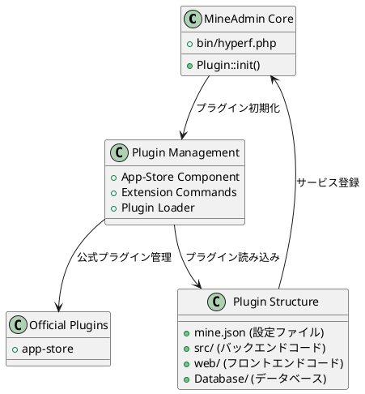

# MineAdmin プラグインシステム

MineAdmin プラグインシステムは強力な拡張機能を提供し、開発者が再利用可能な機能モジュールを作成し、システムのモジュール化と拡張性を実現できます。

## プラグインシステムアーキテクチャ

MineAdmin のプラグインシステムは Hyperf フレームワークの ConfigProvider メカニズムに基づいており、完全なプラグインライフサイクル管理と自動展開機能を提供します。



## コアコンポーネント

### 1. プラグインローダー
- **ファイル**: `bin/hyperf.php` ([GitHub](https://github.com/mineadmin/mineadmin/blob/master/bin/hyperf.php))
- **原理**: `Plugin::init()` メソッドでアプリケーション起動時に自動的にすべてのインストール済みプラグインを読み込み
- **実装**: `plugin/` ディレクトリ内のすべてのプラグインをスキャンし、ConfigProvider を登録

### 2. App-Store コンポーネント
- **リポジトリ**: [mineadmin/appstore](https://github.com/mineadmin/appstore)
- **機能**: プラグインのダウンロード、インストール、アンインストール、更新などの管理機能を提供
- **設定**: `ConfigProvider` を通じてサービスと設定を登録

### 3. プラグイン設定システム
- **コアファイル**: `mine.json` 
- **原理**: プラグインのメタデータ、依存関係、インストールスクリプトなどの情報を定義
- **読み込み**: プラグインインストール時に解析しシステムに登録

## 公式プラグイン

MineAdmin はデフォルトで以下の公式プラグインを提供します：

| プラグイン名 | 機能説明 | リポジトリURL |
|---------|----------|----------|
| app-store | アプリストア管理プラグイン、プラグインのダウンロード、インストール、アンインストール、更新などの管理機能を提供 | [GitHub](https://github.com/mineadmin/appstore) |

> 注：コードジェネレータ、スケジュールタスク管理などの他のプラグインはアプリストアから取得するか、独自に開発可能

## プラグインタイプ

MineAdmin は3種類のプラグインをサポートしています：

### Mixed (混合型プラグイン)
フロントエンドとバックエンドの完全な機能を含むプラグインで、完全なビジネスモジュールを提供します。

### Backend (バックエンドプラグイン) 
バックエンドロジックのみを含むプラグインで、主にAPIサービスとビジネスロジックを提供します。

### Frontend (フロントエンドプラグイン)
フロントエンドインターフェースのみを含むプラグインで、主にユーザーインターフェースコンポーネントを提供します。

## クイックスタート

### 環境準備

MineAdmin プラグインの開発には以下が必要です：

1. **技術スタックの理解**：MineAdmin と Hyperf フレームワーク
2. **AccessToken の取得**：
   - [MineAdmin 公式サイト](https://www.mineadmin.com/login)にログイン
   - 個人センター → [設定ページ](https://www.mineadmin.com/member/setting)に移動
   - AccessToken を取得

3. **環境変数の設定**：
```ini
# .env ファイル
MINE_ACCESS_TOKEN=あなたのAccessToken
```

::: warning 注意
AccessToken は適切に保管し、漏洩しないように注意してください！
:::

### 開発者認証

- **ローカル開発**：認証不要、自由に開発と配布が可能
- **アプリストア公開**：開発者認証が必要、MineAdmin チームに連絡して権限を開通

## 関連ドキュメント

- [クイックスタートガイド](./guide.md) - 最初のプラグイン作成
- [開発ガイド](./develop.md) - 詳細な開発フロー
- [プラグイン構造](./structure.md) - ディレクトリ構造規約
- [ライフサイクル管理](./lifecycle.md) - インストール/アンインストールフロー
- [API リファレンス](./api.md) - インターフェースドキュメント
- [サンプルコード](./examples.md) - 実践的なケーススタディ