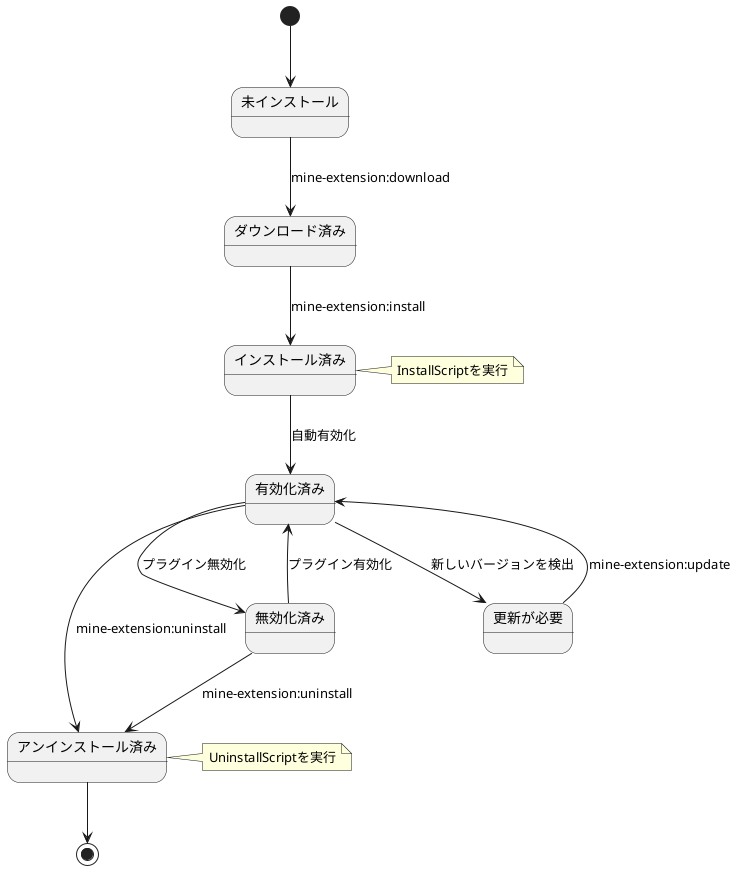
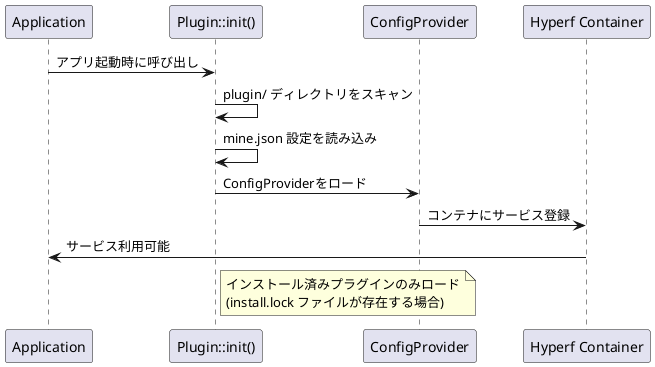
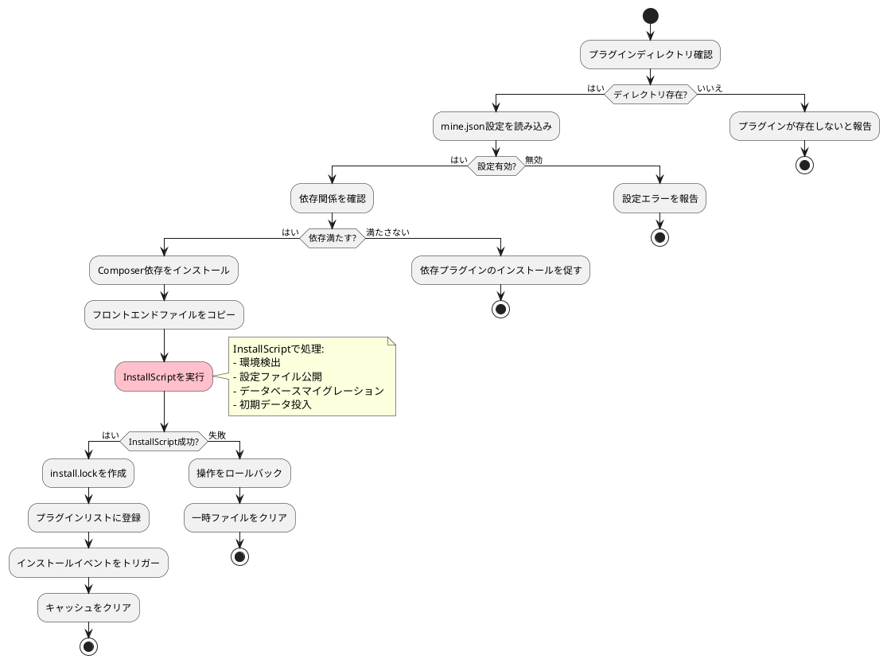
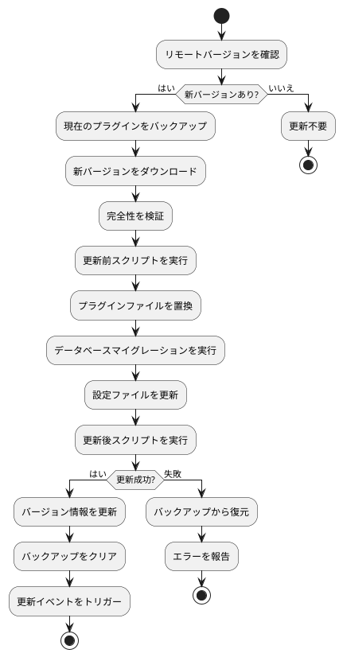
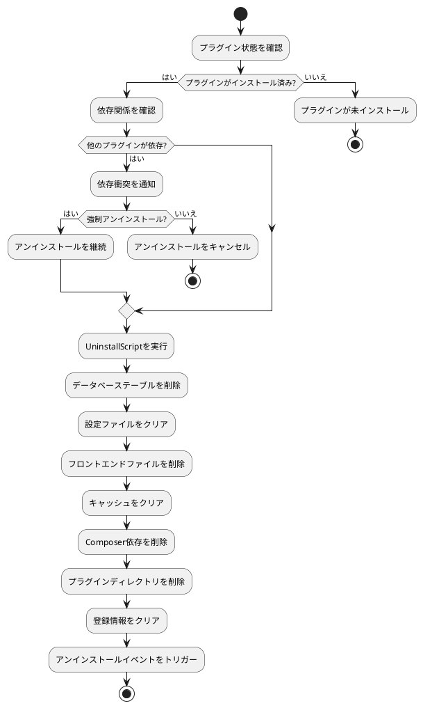

# プラグインライフサイクル管理

MineAdminプラグインのライフサイクル管理について詳細に説明します。インストール、有効化、無効化、更新、アンインストールの完全なプロセスを含みます。

## ライフサイクル概要

MineAdminプラグインのライフサイクルには以下の段階があります:



## プラグイン発見とロード

### 1. プラグイン発見メカニズム

**コア実装**: `Plugin::init()` メソッドが `bin/hyperf.php` ([GitHub](https://github.com/mineadmin/mineadmin/blob/master/bin/hyperf.php)) で呼び出される



### 2. ロードプロセス詳細

1. **プラグインディレクトリスキャン**: `plugin/` 配下の全サブディレクトリを走査
2. **インストール状態確認**: `install.lock` ファイルの存在を確認
3. **設定読み込み**: `mine.json` 設定ファイルを解析
4. **ConfigProviderロード**: プラグインサービスをHyperfコンテナに登録
5. **ルート登録**: コントローラールートを自動登録
6. **ミドルウェアロード**: プラグインミドルウェアを登録
7. **イベントリスナー登録**: イベントリスナーをロード

## ダウンロード段階

### コマンド使用

```bash
# 指定プラグインをダウンロード
php bin/hyperf.php mine-extension:download --name plugin-name

# ダウンロード可能なプラグイン一覧を表示
php bin/hyperf.php mine-extension:list
```

### ダウンロードプロセス

1. **AccessToken検証**: `MINE_ACCESS_TOKEN` 環境変数を確認
2. **リモートリポジトリにリクエスト**: MineAdmin公式リポジトリからプラグイン情報を取得
3. **プラグインパッケージダウンロード**: 一時ディレクトリにzipファイルをダウンロード
4. **ファイル解凍**: `plugin/vendor/plugin-name/` ディレクトリに展開
5. **完全性検証**: `mine.json` ファイルの存在と形式を確認

### 実装原理

**コアサービス**: App-Storeコンポーネント ([GitHub](https://github.com/mineadmin/appstore)) がダウンロード機能を提供

```php
// 疑似コード例
class DownloadService 
{
    public function download(string $pluginName): bool
    {
        // 1. アクセストークン検証
        $this->validateAccessToken();
        
        // 2. プラグイン情報取得
        $pluginInfo = $this->getPluginInfo($pluginName);
        
        // 3. プラグインパッケージダウンロード
        $packagePath = $this->downloadPackage($pluginInfo['download_url']);
        
        // 4. ターゲットディレクトリに解凍
        $this->extractPackage($packagePath, $this->getPluginPath($pluginName));
        
        return true;
    }
}
```

## インストール段階

### コマンド使用

```bash
# プラグインをインストール
php bin/hyperf.php mine-extension:install vendor/plugin-name --yes

# 強制再インストール
php bin/hyperf.php mine-extension:install vendor/plugin-name --force
```

### インストールフロー詳細

> ⚠️ **重要**: 設定ファイル公開、環境検出、データベースマイグレーションは `InstallScript` で処理し、ConfigProviderのpublish機能に依存しないこと。



### 1. 事前チェック

```php
// インストール前チェックロジック
class InstallChecker
{
    public function check(string $pluginPath): array
    {
        $errors = [];
        
        // プラグインディレクトリ確認
        if (!is_dir($pluginPath)) {
            $errors[] = 'プラグインディレクトリが存在しません';
        }
        
        // mine.json確認
        $configPath = $pluginPath . '/mine.json';
        if (!file_exists($configPath)) {
            $errors[] = 'mine.json 設定ファイルが存在しません';
        }
        
        // 依存関係確認
        $config = json_decode(file_get_contents($configPath), true);
        foreach ($config['require'] ?? [] as $dependency => $version) {
            if (!$this->isDependencyMet($dependency, $version)) {
                $errors[] = "依存 {$dependency} バージョン {$version} が満たされていません";
            }
        }
        
        return $errors;
    }
}
```

### 2. Composer依存インストール

プラグインのComposer依存を処理:

```json
// mine.json のcomposer設定
{
  "composer": {
    "require": {
      "hyperf/async-queue": "^3.0",
      "symfony/console": "^6.0"
    },
    "psr-4": {
      "Plugin\\Vendor\\PluginName\\": "src"
    }
  }
}
```

システムが自動実行:
```bash
composer require hyperf/async-queue:^3.0 symfony/console:^6.0
```

### 3. InstallScript処理 ⭐

> **ベストプラクティス**: データベースマイグレーション、設定公開、環境検出は `InstallScript` で処理:

```php
// InstallScriptですべてのインストールロジックを処理
class InstallScript
{
    public function handle(): bool
    {
        // 1. 環境検出
        if (!$this->checkEnvironment()) {
            echo "環境要件を満たしていません\n";
            return false;
        }
        
        // 2. 設定ファイル公開（ConfigProviderのpublishを使用しない）
        $this->publishConfig();
        
        // 3. データベースマイグレーション実行
        if (!$this->runMigrations()) {
            echo "データベースマイグレーション失敗\n";
            return false;
        }
        
        // 4. データ初期化
        $this->seedData();
        
        return true;
    }
    
    private function publishConfig(): void
    {
        $source = __DIR__ . '/../publish/config/plugin.php';
        $target = BASE_PATH . '/config/autoload/plugin.php';
        
        if (!file_exists($target)) {
            copy($source, $target);
            echo "設定ファイルが公開されました\n";
        }
    }
    
    private function runMigrations(): bool
    {
        $migrationPath = __DIR__ . '/../Database/Migrations';
        
        if (is_dir($migrationPath)) {
            // Hyperfのマイグレーションコマンドを使用
            $container = \Hyperf\Context\ApplicationContext::getContainer();
            $application = $container->get(\Hyperf\Contract\ApplicationInterface::class);
            
            $input = new \Symfony\Component\Console\Input\ArrayInput([
                'command' => 'migrate',
                '--path' => $migrationPath,
            ]);
            
            $output = new \Symfony\Component\Console\Output\BufferedOutput();
            $exitCode = $application->run($input, $output);
            
            return $exitCode === 0;
        }
        
        return true;
    }
}
```

### 4. フロントエンドファイルコピー

`web/` ディレクトリのファイルをフロントエンドプロジェクトにコピー:

```
plugin/vendor/plugin-name/web/    →    フロントエンドプロジェクト対応ディレクトリ
├── views/example.vue             →    src/views/plugin/vendor/plugin-name/example.vue
├── components/ExampleComp.vue    →    src/components/plugin/vendor/plugin-name/ExampleComp.vue
└── api/example.js                →    src/api/plugin/vendor/plugin-name/example.js
```

### 5. 設定ファイル公開 ⚠️

> **注意**: ConfigProviderの `publish` 機能はプラグインシステムで信頼性が低いため、InstallScriptで手動処理:

```php
// 非推奨：ConfigProviderのpublishは動作しない可能性あり
'publish' => [
    // プラグインではこの方法は実行されない可能性あり
]

// 推奨：InstallScriptで手動公開
protected function publishConfig(): void
{
    $configs = [
        [
            'source' => __DIR__ . '/../publish/config/plugin.php',
            'target' => BASE_PATH . '/config/autoload/plugin.php',
        ],
        [
            'source' => __DIR__ . '/../publish/config/routes.php',
            'target' => BASE_PATH . '/config/routes/plugin.php',
        ],
    ];
    
    foreach ($configs as $config) {
        if (!file_exists($config['target'])) {
            copy($config['source'], $config['target']);
            echo "設定ファイルが公開されました: {$config['target']}\n";
        }
    }
}
```

### 6. インストールロックファイル作成

インストール成功時に `install.lock` ファイルを作成:

```
plugin/vendor/plugin-name/install.lock
```

ファイル内容にインストール情報を含む:
```json
{
  "installed_at": "2024-01-01 12:00:00",
  "version": "1.0.0",
  "installer": "admin",
  "checksum": "abc123..."
}
```

## 有効化/無効化管理

### プラグイン状態制御

MineAdminはプラグインをアンインストールせずに一時無効化可能:

```bash
# プラグインを無効化
php bin/hyperf.php mine-extension:disable vendor/plugin-name

# プラグインを有効化  
php bin/hyperf.php mine-extension:enable vendor/plugin-name

# プラグイン状態を確認
php bin/hyperf.php mine-extension:status vendor/plugin-name
```

### 状態管理メカニズム

状態情報は `install.lock` ファイルに保存:

```json
{
  "installed_at": "2024-01-01 12:00:00",
  "version": "1.0.0",
  "status": "enabled",  // enabled | disabled
  "disabled_at": null,
  "disabled_reason": null
}
```

## 更新段階

### 更新チェック

```bash
# プラグイン更新を確認
php bin/hyperf.php mine-extension:check-updates

# 指定プラグインを更新
php bin/hyperf.php mine-extension:update vendor/plugin-name

# 全プラグインを更新
php bin/hyperf.php mine-extension:update-all
```

### 更新フロー



### バージョン互換性処理

更新時にバージョン互換性を確認:

```php
class UpdateManager
{
    public function checkCompatibility(string $currentVersion, string $newVersion): bool
    {
        // メジャーバージョンの互換性確認
        $current = $this->parseVersion($currentVersion);
        $new = $this->parseVersion($newVersion);
        
        // メジャーバージョンが異なる場合は破壊的変更の可能性
        if ($current['major'] !== $new['major']) {
            return $this->checkBreakingChanges($currentVersion, $newVersion);
        }
        
        return true;
    }
}
```

## アンインストール段階

### コマンド使用

```bash
# プラグインをアンインストール
php bin/hyperf.php mine-extension:uninstall vendor/plugin-name --yes

# 強制アンインストール (エラーを無視)
php bin/hyperf.php mine-extension:uninstall vendor/plugin-name --force
```

### アンインストールフロー



### アンインストールスクリプト実行

```php
// UninstallScript例
class UninstallScript
{
    public function handle(): bool
    {
        try {
            // 1. データベースクリーンアップ
            $this->cleanDatabase();
            
            // 2. 設定ファイルクリーンアップ
            $this->cleanConfigFiles();
            
            // 3. キャッシュデータクリーンアップ
            $this->cleanCache();
            
            // 4. ログファイルクリーンアップ
            $this->cleanLogs();
            
            // 5. カスタムクリーンアップロジック