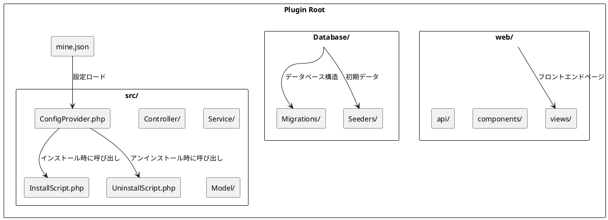

# プラグインのディレクトリ構造

MineAdminプラグインの標準的なディレクトリ構造、ファイル規約、組織方法について詳しく説明します。

## 標準ディレクトリ構造

完全なMineAdminプラグインのディレクトリ構造は以下の通りです：

```
plugin/vendor/plugin-name/           # プラグインルートディレクトリ
├── mine.json                        # プラグインコア設定ファイル ⭐
├── README.md                        # プラグイン説明ドキュメント
├── LICENSE                          # ライセンスファイル
├── composer.json                    # Composer依存設定 (オプション)
├── src/                            # バックエンドソースディレクトリ ⭐
│   ├── ConfigProvider.php          # 設定プロバイダ ⭐
│   ├── InstallScript.php           # インストールスクリプト ⭐
│   ├── UninstallScript.php         # アンインストールスクリプト ⭐
│   ├── Controller/                 # コントローラディレクトリ
│   │   ├── AdminController.php     # 管理者コントローラ
│   │   └── ApiController.php       # APIコントローラ
│   ├── Service/                    # サービス層ディレクトリ
│   │   └── ExampleService.php      # ビジネスサービスクラス
│   ├── Repository/                 # リポジトリ層ディレクトリ
│   │   └── ExampleRepository.php   # データリポジトリクラス
│   ├── Model/                      # モデルディレクトリ
│   │   └── Example.php             # データモデル
│   ├── Request/                    # リクエスト検証ディレクトリ
│   │   ├── CreateRequest.php       # 作成リクエスト検証
│   │   └── UpdateRequest.php       # 更新リクエスト検証
│   ├── Resource/                   # リソース変換ディレクトリ
│   │   └── ExampleResource.php     # リソース変換クラス
│   ├── Middleware/                 # ミドルウェアディレクトリ
│   │   └── ExampleMiddleware.php   # カスタムミドルウェア
│   ├── Command/                    # コマンドラインディレクトリ
│   │   └── ExampleCommand.php      # カスタムコマンド
│   ├── Listener/                   # イベントリスナーディレクトリ
│   │   └── ExampleListener.php     # イベントリスナー
│   └── Exception/                  # 例外処理ディレクトリ
│       └── ExampleException.php    # カスタム例外
├── web/                            # フロントエンドソースディレクトリ ⭐
│   ├── views/                      # ページコンポーネントディレクトリ
│   │   ├── index.vue               # メインページ
│   │   ├── list.vue                # リストページ
│   │   └── form.vue                # フォームページ
│   ├── components/                 # 共通コンポーネントディレクトリ
│   │   └── ExampleComponent.vue    # 汎用コンポーネント
│   ├── api/                        # APIインターフェースディレクトリ
│   │   └── example.js              # インターフェース定義
│   ├── router/                     # ルーティング設定ディレクトリ
│   │   └── index.js                # ルーティング設定
│   ├── store/                      # 状態管理ディレクトリ
│   │   └── example.js              # 状態管理
│   └── assets/                     # 静的リソースディレクトリ
│       ├── images/                 # 画像リソース
│       └── styles/                 # スタイルファイル
├── Database/                       # データベース関連ディレクトリ ⭐
│   ├── Migrations/                 # データベースマイグレーションファイル
│   │   └── 2024_01_01_000000_create_example_table.php
│   └── Seeders/                    # データシードファイル
│       └── ExampleSeeder.php       # データシードクラス
├── config/                         # 設定ファイルディレクトリ
│   └── example.php                 # プラグイン設定ファイル
├── publish/                        # 公開ファイルディレクトリ
│   ├── config/                     # 設定ファイルテンプレート
│   │   └── example.php             # 設定ファイルテンプレート
│   └── assets/                     # 静的リソーステンプレート
├── tests/                          # テストファイルディレクトリ
│   ├── Unit/                       # ユニットテスト
│   ├── Feature/                    # 機能テスト
│   └── TestCase.php                # テスト基底クラス
├── docs/                           # ドキュメントディレクトリ
│   ├── installation.md             # インストールドキュメント
│   ├── usage.md                    # 使用ドキュメント
│   └── api.md                      # APIドキュメント
└── .gitignore                      # Git無視ファイル
```

## コアファイルの詳細

### 1. mine.json (プラグイン設定ファイル)

**ファイルパス**: `mine.json` ([設定詳細](./mineJson.md))

プラグインのコア設定ファイルで、プラグインの基本情報、依存関係、ロード設定を定義します：

```json
{
  "name": "vendor/plugin-name",
  "description": "プラグイン説明",
  "version": "1.0.0",
  "type": "mixed",
  "author": [
    {
      "name": "Author Name",
      "email": "author@example.com",
      "role": "developer"
    }
  ],
  "keywords": ["mineadmin", "plugin"],
  "homepage": "https://github.com/vendor/plugin-name",
  "license": "MIT",
  "require": {
    "php": ">=8.1",
    "hyperf/framework": "^3.0"
  },
  "package": {
    "dependencies": {
      "vue": "^3.0",
      "element-plus": "^2.0"
    }
  },
  "composer": {
    "require": {
      "hyperf/async-queue": "^3.0"
    },
    "psr-4": {
      "Plugin\\Vendor\\PluginName\\": "src"
    },
    "config": "Plugin\\Vendor\\PluginName\\ConfigProvider"
  }
}
```

### 2. ConfigProvider.php (設定プロバイダ)

**ファイルパス**: `src/ConfigProvider.php`
**実装原理**: Hyperf ConfigProviderメカニズムに基づく ([GitHub](https://github.com/hyperf/hyperf/blob/master/src/config-provider/src/ConfigProvider.php))

> ⚠️ **注意**: ConfigProviderの`publish`機能はプラグインシステムで問題があるため、InstallScriptで設定ファイルの公開を処理することを推奨します。

```php
<?php

namespace Plugin\Vendor\PluginName;

class ConfigProvider
{
    public function __invoke(): array
    {
        return [
            'dependencies' => [],
            'annotations' => [
                'scan' => [
                    'paths' => [__DIR__],
                ],
            ],
            'commands' => [],
            'listeners' => [],
            // プラグインではpublish機能は推奨されません
            // InstallScriptで設定ファイルの公開を処理してください
        ];
    }
}
```

### 3. InstallScript.php (インストールスクリプト) ⭐

**ファイルパス**: `src/InstallScript.php`
**呼び出しタイミング**: `mine-extension:install`コマンド実行時
**重要性**: 設定公開、環境検出、データベースマイグレーションをここで処理することを推奨

```php
<?php

namespace Plugin\Vendor\PluginName;

use Hyperf\Contract\ApplicationInterface;
use Hyperf\Database\Commands\Migrations\MigrateCommand;

class InstallScript
{
    public function handle(): bool
    {
        // 1. 環境依存のチェック
        if (!$this->checkEnvironment()) {
            echo "環境チェック失敗\n";
            return false;
        }
        
        // 2. 設定ファイルの公開
        $this->publishConfig();
        
        // 3. データベースマイグレーションの実行
        $this->runMigrations();
        
        // 4. データの初期化
        $this->seedData();
        
        echo "プラグインインストール成功\n";
        return true;
    }
    
    protected function checkEnvironment(): bool
    {
        // PHPバージョンのチェック
        if (version_compare(PHP_VERSION, '8.1.0', '<')) {
            echo "PHPバージョンは >= 8.1が必要です\n";
            return false;
        }
        
        // 必要な拡張のチェック
        $requiredExtensions = ['redis', 'pdo', 'json'];
        foreach ($requiredExtensions as $ext) {
            if (!extension_loaded($ext)) {
                echo "PHP拡張が不足しています: {$ext}\n";
                return false;
            }
        }
        
        return true;
    }
    
    protected function publishConfig(): void
    {
        $source = __DIR__ . '/../publish/config/plugin.php';
        $target = BASE_PATH . '/config/autoload/plugin.php';
        
        if (!file_exists($target)) {
            copy($source, $target);
            echo "設定ファイルが公開されました: {$target}\n";
        }
    }
    
    protected function runMigrations(): void
    {
        $migrationPath = __DIR__ . '/../Database/Migrations';
        
        if (is_dir($migrationPath)) {
            // マイグレーションコマンドの実行
            $container = \Hyperf\Context\ApplicationContext::getContainer();
            $application = $container->get(ApplicationInterface::class);
            $application->setAutoExit(false);
            
            $input = new \Symfony\Component\Console\Input\ArrayInput([
                'command' => 'migrate',
                '--path' => $migrationPath,
            ]);
            
            $output = new \Symfony\Component\Console\Output\BufferedOutput();
            $application->run($input, $output);
            
            echo "データベースマイグレーション完了\n";
        }
    }
    
    protected function seedData(): void
    {
        // デフォルトデータの初期化
        // 例: デフォルト設定、メニューの作成など
    }
}
```

### 4. UninstallScript.php (アンインストールスクリプト) ⭐

**ファイルパス**: `src/UninstallScript.php`
**呼び出しタイミング**: `mine-extension:uninstall`コマンド実行時
**重要性**: 設定ファイル、データテーブル、関連リソースのクリーンアップ

```php
<?php

namespace Plugin\Vendor\PluginName;

use Hyperf\DbConnection\Db;

class UninstallScript
{
    public function handle(): bool
    {
        // 1. 重要なデータのバックアップ（オプション）
        $this->backupData();
        
        // 2. データベーステーブルの削除
        $this->dropTables();
        
        // 3. 設定ファイルのクリーンアップ
        $this->removeConfig();
        
        // 4. キャッシュのクリア
        $this->clearCache();
        
        echo "プラグインアンインストール完了\n";
        return true;
    }
    
    protected function backupData(): void
    {
        // 重要なデータを指定ディレクトリにバックアップ
        $backupPath = BASE_PATH . '/runtime/backup/plugin_' . date('YmdHis') . '.sql';
        // バックアップロジックの実装
    }
    
    protected function dropTables(): void
    {
        // プラグインが作成したデータテーブルの削除
        $tables = ['plugin_example_table', 'plugin_settings'];
        
        foreach ($tables as $table) {
            if (Db::schema()->hasTable($table)) {
                Db::schema()->drop($table);
                echo "データテーブルが削除されました: {$table}\n";
            }
        }
    }
    
    protected function removeConfig(): void
    {
        $configFile = BASE_PATH . '/config/autoload/plugin.php';
        
        if (file_exists($configFile)) {
            unlink($configFile);
            echo "設定ファイルが削除されました: {$configFile}\n";
        }
    }
    
    protected function clearCache(): void
    {
        // プラグイン関連キャッシュのクリア
        $redis = \Hyperf\Context\ApplicationContext::getContainer()
            ->get(\Hyperf\Redis\Redis::class);
        
        $redis->del('plugin:cache:*');
        echo "キャッシュがクリアされました\n";
    }
}
```

## ディレクトリ構造図解



## 異なるタイプのプラグインの構造の違い

### Mixed (混合型プラグイン)
完全な`src/`と`web/`ディレクトリを含み、フロントエンドとバックエンドの完全な機能を提供します。

### Backend (バックエンドプラグイン)
`src/`ディレクトリのみを含み、APIサービスとビジネスロジックに焦点を当てます：

```
plugin/vendor/backend-plugin/
├── mine.json
├── src/
│   ├── ConfigProvider.php
│   ├── Controller/
│   ├── Service/
│   └── Model/
└── Database/
```

### Frontend (フロントエンドプラグイン)
`web/`ディレクトリのみを含み、フロントエンドインターフェースとインタラクションに焦点を当てます：

```
plugin/vendor/frontend-plugin/
├── mine.json
├── web/
│   ├── views/
│   ├── components/
│   └── assets/
└── src/
    └── ConfigProvider.php  # 最小設定
```

## 命名規則

### 1. ディレクトリ命名
- 小文字とハイフンを使用：`user-management`
- アンダースコアとスペースは避ける

### 2. ファイル命名
- PHPクラスファイルはPascalCase：`UserController.php`
- VueコンポーネントはPascalCase：`UserList.vue`
- 設定ファイルは小文字：`user.php`

### 3. 名前空間規則
PSR-4オートロード標準に従います：

```php
// プラグインパス: plugin/mineadmin/user-manager/
// 名前空間: Plugin\MineAdmin\UserManager\
namespace Plugin\MineAdmin\UserManager\Controller;
```

## ファイル権限とセキュリティ

### 1. ファイル権限設定
```bash
# 適切なファイル権限を設定
find plugin/ -type f -name "*.php" -exec chmod 644 {} \;
find plugin/ -type d -exec chmod 755 {} \;
```

### 2. セキュリティ注意事項
- 機密設定には環境変数を使用
- コード内でのキーのハードコーディングを避ける
- ユーザー入力を検証・フィルタリング
- 機密データの転送にはHTTPSを使用

## ベストプラクティス

### 1. ファイル組織
- 機能モジュールごとにコードを整理
- ディレクトリ構造を明確に保つ
- 意味のあるファイル名を使用

### 2. コード規約
- PSR-12コーディング標準に従う
- 適切なコメントを追加
- 型宣言を使用

### 3. バージョン管理
- `.gitignore`で不要なファイルを除外
- 明確なコミットメッセージを作成
- セマンティックバージョニングを使用

## サンプルプロジェクト構造

公式プラグインの実際の構造を参照：

**App-Storeプラグイン**: MineAdmin公式アプリケーションマーケットプラグイン、標準的な混合型プラグイン構造を示す

## よくある質問

### Q: プラグインディレクトリはどこに配置すべきですか？
A: プロジェクトルートの`plugin/`