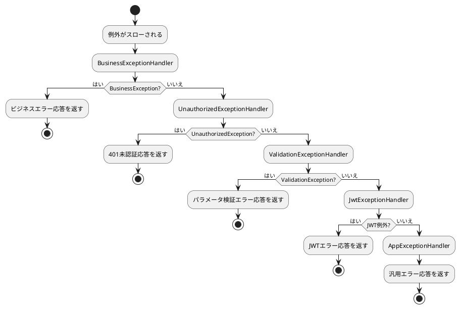

# エラー処理

## 目次

- [デフォルトの例外処理メカニズム](#デフォルトの例外処理メカニズム)
- [例外処理フロー](#例外処理フロー)
- [コア例外ハンドラ](#コア例外ハンドラ)
- [ビジネス例外処理](#ビジネス例外処理)
- [カスタム例外ハンドラ](#カスタム例外ハンドラ)
- [デバッグモードの特徴](#デバッグモードの特徴)
- [ベストプラクティス](#ベストプラクティス)
- [よくある質問](#よくある質問)

## デフォルトの例外処理メカニズム

::: tip 前提知識
MineAdmin の例外処理を理解するには、まず [Hyperf](https://hyperf.io) のエラー処理についてある程度の知識が必要です。
この記事では基本的な説明は行いません。まず Hyperf の例外処理の基本概念を理解してください。
:::

MineAdmin は Hyperf フレームワークに基づいて、完善された例外処理メカニズムを実装しています。`config/autoload/exceptions.php` に複数の例外ハンドラが設定され、チェーン・オブ・レスポンシビリティパターンを採用して、異なるタイプの例外を順に処理します。

## 例外処理フロー



## コア例外ハンドラ

### 例外ハンドラ設定

::: code-group

```php [exceptions.php]
<?php

declare(strict_types=1);
/**
 * This file is part of MineAdmin.
 *
 * @link     https://www.mineadmin.com
 * @document https://doc.mineadmin.com
 * @contact  root@imoi.cn
 * @license  https://github.com/mineadmin/MineAdmin/blob/master/LICENSE
 */
use App\Exception\Handler\AppExceptionHandler;
use App\Exception\Handler\BusinessExceptionHandler;
use App\Exception\Handler\JwtExceptionHandler;
use App\Exception\Handler\UnauthorizedExceptionHandler;
use App\Exception\Handler\ValidationExceptionHandler;
use Hyperf\ExceptionHandler\Listener\ErrorExceptionHandler;
use Hyperf\HttpServer\Exception\Handler\HttpExceptionHandler;

return [
    'handler' => [
        'http' => [
            // ビジネス例外を処理 - 最優先
            BusinessExceptionHandler::class,
            // 未認証例外を処理
            UnauthorizedExceptionHandler::class,
            // バリデーター例外を処理
            ValidationExceptionHandler::class,
            // JWT例外を処理
            JwtExceptionHandler::class,
            // アプリケーション例外を処理 - 最終的なフォールバック
            AppExceptionHandler::class,
        ],
    ],
];
```

:::

::: warning 注意事項
- 例外ハンドラの順序は重要で、先頭にあるハンドラほど優先度が高くなります
- `AppExceptionHandler` はフォールバックハンドラとして、常に最後に配置する必要があります
- その影響を完全に理解していない限り、ハンドラの順序を変更しないでください
:::

### 基本例外ハンドラクラス

すべての例外ハンドラは `AbstractHandler` を継承し、統一された処理ロジックを提供します:

::: code-group

```php [AbstractHandler.php]
<?php

declare(strict_types=1);
/**
 * This file is part of MineAdmin.
 *
 * @link     https://www.mineadmin.com
 * @document https://doc.mineadmin.com
 * @contact  root@imoi.cn
 * @license  https://github.com/mineadmin/MineAdmin/blob/master/LICENSE
 */

namespace App\Exception\Handler;

use App\Http\Common\Result;
use Hyperf\Codec\Json;
use Hyperf\Context\Context;
use Hyperf\Contract\ConfigInterface;
use Hyperf\Contract\StdoutLoggerInterface;
use Hyperf\ExceptionHandler\ExceptionHandler;
use Hyperf\ExceptionHandler\Formatter\FormatterInterface;
use Hyperf\HttpMessage\Stream\SwooleStream;
use Hyperf\Logger\LoggerFactory;
use Mine\Support\Logger\UuidRequestIdProcessor;
use Mine\Support\Traits\Debugging;
use Psr\Container\ContainerInterface;
use Swow\Psr7\Message\ResponsePlusInterface;

abstract class AbstractHandler extends ExceptionHandler
{
    use Debugging;

    public function __construct(
        private readonly ConfigInterface $config,
        private readonly ContainerInterface $container,
        private readonly LoggerFactory $loggerFactory
    ) {}

    /**
     * サブクラスはこのメソッドを実装し、例外の処理方法と結果の返却方法を定義する必要があります
     */
    abstract public function handleResponse(\Throwable $throwable): Result;

    /**
     * 例外を処理するメインエントリーメソッド
     */
    public function handle(\Throwable $throwable, ResponsePlusInterface $response)
    {
        // 例外ログを報告
        $this->report($throwable);
        
        return value(function (ResponsePlusInterface $responsePlus) use ($throwable) {
            // デバッグモードの場合、自動的にCORSを処理し、詳細なエラー情報を記録
            if ($this->isDebug()) {
                $responsePlus
                    ->setHeader('Access-Control-Allow-Origin', '*')
                    ->setHeader('Access-Control-Allow-Credentials', 'true')
                    ->setHeader('Access-Control-Allow-Methods', 'GET, POST, PATCH, PUT, DELETE, OPTIONS')
                    ->setHeader('Access-Control-Allow-Headers', 'DNT,Keep-Alive,User-Agent,Cache-Control,Content-Type,Authorization');
                
                // 詳細な例外情報をコンテキストに記録
                Context::set(self::class . '.throwable', [
                    'message' => $throwable->getMessage(),
                    'file' => $throwable->getFile(),
                    'line' => $throwable->getLine(),
                    'trace' => $throwable->getTrace(),
                ]);
            }
            return $responsePlus;
        }, $this->handlerRequestId(
            $this->handlerResult(
                $response,
                $this->handleResponse($throwable)
            )
        ));
    }

    /**
     * コンソール出力とファイル記録を含む例外ログを報告
     */
    public function report(\Throwable $throwable)
    {
        // デバッグモードの場合、コンソールにフォーマットされたエラー情報を表示
        if ($this->isDebug()) {
            $this->container->get(StdoutLoggerInterface::class)->error(
                $this->container->get(FormatterInterface::class)->format($throwable)
            );
        }
        
        // エラーログファイルに例外を記録
        $this->loggerFactory
            ->get('error')
            ->error($throwable->getMessage(), ['exception' => $throwable]);
    }

    /**
     * 結果をレスポンスボディにラップする
     */
    protected function handlerResult(ResponsePlusInterface $responsePlus, Result $result): ResponsePlusInterface
    {
        $responsePlus->setHeader('Content-Type', 'application/json; charset=utf-8');

        // デバッグモードでは詳細な例外情報を返す
        if ($this->isDebug()) {
            $result = $result->toArray();
            $result['throwable'] = Context::get(self::class . '.throwable');
            return $responsePlus
                ->setBody(new SwooleStream(Json::encode($result)));
        }

        return $responsePlus
            ->setBody(new SwooleStream(Json::encode($result)));
    }

    /**
     * 問題追跡のために、レスポンスにリクエストIDヘッダーを追加
     */
    private function handlerRequestId(ResponsePlusInterface $responsePlus): ResponsePlusInterface
    {
        return $responsePlus->setHeader('Request-Id', UuidRequestIdProcessor::getUuid());
    }
}
```

```php [AppExceptionHandler.php]
<?php

declare(strict_types=1);

namespace App\Exception\Handler;

use App\Http\Common\Result;
use App\Http\Common\ResultCode;

/**
 * アプリケーション最終例外ハンドラ
 * 他のハンドラで処理されなかったすべての例外をキャッチするフォールバックハンドラ
 */
final class AppExceptionHandler extends AbstractHandler
{
    /**
     * 例外を処理し、統一されたエラー応答を返す
     */
    public function handleResponse(\Throwable $throwable): Result
    {
        // 例外の伝播を停止
        $this->stopPropagation();
        
        return new Result(
            ResultCode::FAIL,
            $throwable->getMessage() ?: 'システムエラーが発生しました。後でもう一度お試しください'
        );
    }
    
    /**
     * このハンドラはすべてのタイプの例外を処理
     */
    public function isValid(\Throwable $throwable): bool
    {
        return true;
    }
}
```

:::

## Result と ResultCode コアクラス

### Result 統一応答クラス

`Result` クラスは MineAdmin のすべてのインターフェース応答の標準フォーマットです。`Arrayable` インターフェースを実装し、OpenAPI ドキュメントアノテーションをサポートします:

::: code-group

```php [Result.php]
<?php

declare(strict_types=1);

namespace App\Http\Common;

use Hyperf\Contract\Arrayable;
use Hyperf\Swagger\Annotation as OA;

/**
 * @template T
 */
#[OA\Schema(title: 'Api Response', description: 'Api Response')]
class Result implements Arrayable
{
    /**
     * @param T $data
     */
    public function __construct(
        #[OA\Property(ref: 'ResultCode', title: '応答コード')]
        public ResultCode $code = ResultCode::SUCCESS,
        #[OA\Property(title: '応答メッセージ', type: 'string')]
        public ?string $message = null,
        #[OA\Property(title: '応答データ', type: 'array')]
        public mixed $data = []
    ) {
        // メッセージが提供されていない場合、ResultCode からデフォルトメッセージを自動取得
        if ($this->message === null) {
            $this->message = ResultCode::getMessage($this->code->value);
        }
    }

    public function toArray(): array
    {
        return [
            'code' => $this->code->value,
            'message' => $this->message,
            'data' => $this->data,
        ];
    }
}
```

:::

#### 使用例

::: code-group

```php [成功応答]
// 成功応答 - デフォルト成功コードを使用
$result = new Result();

// 成功応答 - データ付き
$result = new Result(data: ['id' => 1, 'name' => '田中']);

// 成功応答 - カスタムメッセージ
$result = new Result(message: '操作が正常に完了しました');
```

```php [失敗応答]
// 失敗応答 - デフォルト失敗コードを使用
$result = new Result(ResultCode::FAIL, '操作に失敗しました');

// 失敗応答 - 特定のステータスコードを使用
$result = new Result(ResultCode::UNAUTHORIZED, 'ユーザーがログインしていません');

// 失敗応答 - エラーデータ付き
$result = new Result(
    ResultCode::UNPROCESSABLE_ENTITY, 
    'パラメータ検証に失敗しました',
    ['errors' => ['email' => ['メールアドレスの形式が間違っています']]]
);
```

:::

### ResultCode ステータスコード列挙型

`ResultCode` は PHP 8.1 列挙型に基づくステータスコード定義で、Hyperf の Constants 機能を使用して国際化メッセージをサポートします:

::: code-group

```php [ResultCode.php]
<?php

declare(strict_types=1);

namespace App\Http\Common;

use Hyperf\Constants\Annotation\Constants;
use Hyperf\Constants\Annotation\Message;
use Hyperf\Constants\ConstantsTrait;
use Hyperf\Swagger\Annotation as OA;

#[Constants]
#[OA\Schema(title: 'ResultCode', type: 'integer', default: 200)]
enum ResultCode: int
{
    use ConstantsTrait;

    #[Message('result.success')]
    case SUCCESS = 200;

    #[Message('result.fail')]
    case FAIL = 500;

    #[Message('result.unauthorized')]
    case UNAUTHORIZED = 401;

    #[Message('result.forbidden')]
    case FORBIDDEN = 403;

    #[Message('result.not_found')]
    case NOT_FOUND = 404;

    #[Message('result.method_not_allowed')]
    case METHOD_NOT_ALLOWED = 405;

    #[Message('result.not_acceptable')]
    case NOT_ACCEPTABLE = 406;

    #[Message('result.conflict')]
    case UNPROCESSABLE_ENTITY = 422;

    #[Message('result.disabled')]
    case DISABLED = 423;
}
```

:::

#### ステータスコード説明

| 定数名 | 数値 | HTTP ステータスコード | 説明 | 使用シーン |
|--------|------|-------------|------|----------|
| `SUCCESS` | 200 | 200 OK | 操作成功 | 正常な業務処理成功 |
| `FAIL` | 500 | 500 Internal Server Error | システムエラー | 汎用的なシステム例外または業務処理失敗 |
| `UNAUTHORIZED` | 401 | 401 Unauthorized | 未認証 | ユーザー未ログインまたはトークン無効 |
| `FORBIDDEN` | 403 | 403 Forbidden | アクセス禁止 | ユーザーにリソースアクセス権限がない |
| `NOT_FOUND` | 404 | 404 Not Found | リソースが存在しない | リクエストされたリソースが存在しない |
| `METHOD_NOT_ALLOWED` | 405 | 405 Method Not Allowed | メソッド不許可 | HTTP メソッドがサポートされていない |
| `NOT_ACCEPTABLE` | 406 | 406 Not Acceptable | 受け入れ不可 | リクエストのコンテンツ特性を満たせない |
| `UNPROCESSABLE_ENTITY` | 422 | 422 Unprocessable Entity | 処理不能なエンティティ | パラメータ検証失敗、業務ルール検証失敗 |
| `DISABLED` | 423 | 423 Locked | リソースがロック中 | ユーザーまたはリソースが無効 |

#### 国際化サポート

`ResultCode` は Hyperf の多言語メカニズムを介して対応するメッセージテキストを取得できます:

::: code-group

```php [言語ファイル - lang/ja_JP/result.php]
<?php

return [
    'success' => '操作成功',
    'fail' => '操作失敗',
    'unauthorized' => '未認証ユーザー',
    'forbidden' => 'アクセス禁止',
    'not_found' => 'リソースが存在しません',
    'method_not_allowed' => '許可されていないメソッドです',
    'not_acceptable' => '受け入れ不可能なリクエストです',
    'conflict' => 'パラメータ検証に失敗しました',
    'disabled' => 'リソースは無効化されています',
];
```

```php [国際化メッセージの取得]
// ResultCode からメッセージを取得
$message = ResultCode::getMessage(ResultCode::SUCCESS->value);
// 出力: '操作成功'

// Result 構築時に自動的にメッセージを取得
$result = new Result(ResultCode::NOT_FOUND);
// $result->message は自動的に 'リソースが存在しません'
```

:::

## ビジネス例外処理

### BusinessException ビジネス例外クラス

ビジネス関連の例外をスローするには、`throw new Exception` を直接使用するのではなく、`BusinessException` を使用することをお勧めします:

::: code-group

```php [BusinessException.php]
<?php

declare(strict_types=1);
/**
 * This file is part of MineAdmin.
 *
 * @link     https://www.mineadmin.com
 * @document https://doc.mineadmin.com
 * @contact  root@imoi.cn
 * @license  https://github.com/mineadmin/MineAdmin/blob/master/LICENSE
 */

namespace App\Exception;

use App\Http\Common\Result;
use App\Http\Common\ResultCode;

/**
 * ビジネス例外クラス
 * ビジネスロジックに関連する例外をスローするために使用
 */
class BusinessException extends \RuntimeException
{
    private Result $response;

    /**
     * @param ResultCode $code 結果ステータスコード
     * @param string|null $message エラーメッセージ
     * @param mixed $data 追加データ
     */
    public function __construct(ResultCode $code = ResultCode::FAIL, ?string $message = null, mixed $data = [])
    {
        $this->response = new Result($code, $message, $data);
        parent::__construct($message ?? ResultCode::getMessage($code->value));
    }

    /**
     * 構造化された応答オブジェクトを取得
     */
    public function getResponse(): Result
    {
        return $this->response;
    }
}
```

```php [BusinessExceptionHandler.php]
<?php

declare(strict_types=1);

namespace App\Exception\Handler;

use App\Exception\BusinessException;
use App\Http\Common\Result;

/**
 * ビジネス例外ハンドラ
 * BusinessException タイプの例外を専門的に処理
 */
class BusinessExceptionHandler extends AbstractHandler
{
    /**
     * ビジネス例外を処理し、例外に含まれる結果を直接返す
     */
    public function handleResponse(\Throwable $throwable): Result
    {
        $this->stopPropagation();
        
        if ($throwable instanceof BusinessException) {
            return $throwable->getResponse();
        }
        
        // フォールバック処理
        return new Result(
            ResultCode::FAIL,
            $throwable->getMessage()
        );
    }
    
    /**
     * BusinessException タイプの例外のみを処理
     */
    public function isValid(\Throwable $throwable): bool
    {
        return $throwable instanceof BusinessException;
    }
}
```

:::

### 実際の使用例

::: code-group

```php [UserService.php]
<?php

declare(strict_types=1);

namespace App\Service;

use App\Exception\BusinessException;
use App\Http\Common\ResultCode;

class UserService
{
    /**
     * ユーザーログイン認証
     */
    public function login(string $username, string $password): array
    {
        // ユーザー名の形式をチェック
        if (empty($username)) {
            throw new BusinessException(
                ResultCode::UNPROCESSABLE_ENTITY,
                trans('validation.required', ['attribute' => 'ユーザー名'])
            );
        }
        
        // ユーザーを検索
        $user = $this->findUserByUsername($username);
        if (!$user) {
            throw new BusinessException(
                ResultCode::NOT_FOUND,
                trans('auth.user_not_found')
            );
        }
        
        // パスワードを検証
        if (!$this->verifyPassword($password, $user['password'])) {
            throw new BusinessException(
                ResultCode::UNAUTHORIZED,
                trans('auth.invalid_credentials')
            );
        }
        
        // ユーザーステータスをチェック
        if ($user['status'] !== 'active') {
            throw new BusinessException(
                ResultCode::DISABLED,
                trans('auth.user_disabled'),
                ['reason' => $user['disable_reason'] ?? '不明な理由']
            );
        }
        
        return $user;
    }

    /**
     * ユーザープロフィールを更新
     */
    public function updateProfile(int $userId, array $data): bool
    {
        $user = $this->findUserById($userId);
        if (!$user) {
            throw new BusinessException(
                ResultCode::NOT_FOUND,
                'ユーザーが存在しません'
            );
        }

        // メールアドレスが既に使用されていないかチェック
        if (isset($data['email']) && $this->isEmailExists($data['email'], $userId)) {
            throw new BusinessException(
                ResultCode::UNPROCESSABLE_ENTITY,
                'メールアドレスは既に他のユーザーが使用しています'
            );
        }

        return $this->updateUser($userId, $data);
    }
}
```

```php [UserController.php]
<?php

declare(strict_types=1);

namespace App\Controller;

use App\Service\UserService;
use App\Http\Common\Result;
use App\Http\Common\ResultCode;

class UserController extends AbstractController
{
    public function __construct(
        private readonly UserService $userService
    ) {}
    
    /**
     * ユーザーログイン
     * 
     * ビジネス例外は BusinessExceptionHandler によって自動的にキャッチされ、対応する応答に変換されます
     */
    public function login(): Result
    {
        $username = $this->request->input('username');
        $password = $this->request->input('password');
        
        // UserService が BusinessException をスローした場合、
        // 自動的にキャッチされ、対応するエラー応答が返されます
        $user = $this->userService->login($username, $password);
        
        // トークン生成などの後続ロジック...
        $token = $this->generateToken($user);
        
        return $this->success([
            'token' => $token,
            'user' => $user
        ]);
    }

    /**
     * ユーザープロフィールを更新
     */
    public function updateProfile(): Result
    {
        $userId = $this->getUserId();
        $data = $this->request->all();
        
        $this->userService->updateProfile($userId, $data);
        
        return $this->success(message: 'プロフィールが更新されました');
    }
}
```

:::

## カスタム例外ハンドラ

特定のタイプの例外を処理する必要がある場合は、カスタム例外ハンドラを作成できます。

### カスタム例外クラスの作成

::: code-group

```php [PaymentException.php]
<?php

declare(strict_types=1);

namespace App\Exception;

use App\Http\Common\ResultCode;

/**
 * 支払い関連例外
 */
class PaymentException extends \RuntimeException
{
    public function __construct(
        private readonly string $paymentMethod,
        private readonly string $transactionId,
        string $message = '支払い処理に失敗しました',
        int $code = 0,
        ?\Throwable $previous = null
    ) {
        parent::__construct($message, $code, $previous);
    }

    public function getPaymentMethod(): string
    {
        return $this->paymentMethod;
    }

    public function getTransactionId(): string
    {
        return $this->transactionId;
    }
}
```

:::

### カスタム例外ハンドラの作成

::: code-group

```php [PaymentExceptionHandler.php]
<?php

declare(strict_types=1);

namespace App\Exception\Handler;

use App\Exception\PaymentException;
use App\Http\Common\Result;
use App\Http\Common\ResultCode;

/**
 * 支払い例外ハンドラ
 */
class PaymentExceptionHandler extends AbstractHandler
{
    public function handleResponse(\Throwable $throwable): Result
    {
        $this->stopPropagation();
        
        if ($throwable instanceof PaymentException) {
            // 支払い例外の詳細情報を記録
            $this->loggerFactory
                ->get('payment')
                ->error('支払い例外', [
                    'payment_method' => $throwable->getPaymentMethod(),
                    'transaction_id' => $throwable->getTransactionId(),
                    'message' => $throwable->getMessage(),
                    'trace' => $throwable->getTraceAsString(),
                ]);
            
            return new Result(
                ResultCode::FAIL,
                '支払い処理に失敗しました。後でもう一度お試しいただくか、カスタマーサポートにお問い合わせください',
                [
                    'transaction_id' => $throwable->getTransactionId(),
                    'support_contact' => config('payment.support_contact'),
                ]
            );
        }
        
        return new Result(
            ResultCode::FAIL,
            $throwable->getMessage()
        );
    }
    
    public function isValid(\Throwable $throwable): bool
    {
        return $throwable instanceof PaymentException;
    }
}
```

:::

### カスタム例外ハンドラの登録

`config/autoload/exceptions.php` でカスタムハンドラを登録します:

::: code-group

```php [exceptions.php]
<?php

return [
    'handler' => [
        'http' => [
            // ビジネス例外ハンドラ
            BusinessExceptionHandler::class,
            // カスタム支払い例外ハンドラ
            PaymentExceptionHandler::class,
            // その他のハンドラ...
            UnauthorizedExceptionHandler::class,
            ValidationExceptionHandler::class,
            JwtExceptionHandler::class,
            AppExceptionHandler::class,
        ],
    ],
];
```

:::

### カスタム例外の使用

::: code-group

```php [PaymentService.php]
<?php

declare(strict_types=1);

namespace App\Service;

use App\Exception\PaymentException;

class PaymentService
{
    public function processPayment(string $method, float $amount, string $transactionId): bool
    {
        try {
            // サードパーティの支払いAPIを呼び出す
            $result = $this->callPaymentGateway($method, $amount, $transactionId);
            
            if (!$result['success']) {
                throw new PaymentException(
                    paymentMethod: $method,
                    transactionId: $transactionId,
                    message: "支払いに失敗しました: {$result['error_msg']}"
                );
            }
            
            return true;
        } catch (\Throwable $e) {
            // すべての支払い関連例外を PaymentException にラップ
            throw new PaymentException(
                paymentMethod: $method,
                transactionId: $transactionId,
                message: "支払い処理で例外が発生しました: {$e->getMessage()}",
                previous: $e
            );
        }
    }
}
```

:::

## デバッグモードの特徴

### デバッグモードの有効化

`.env` ファイルで設定:

```env
APP_DEBUG=true
```

### デバッグモード機能

`APP_DEBUG=true` の場合、例外ハンドラは以下の追加機能を提供します:

1. **詳細な例外情報**: 応答に例外のファイル、行番号、コールスタックが含まれます
2. **コンソール出力**: 例外情報がコマンドラインコンソールに出力されます
3. **CORS ヘッダー**: フロントエンドのデバッグ用に、クロスオリジンリクエストヘッダーが自動的に追加されます
4. **Request-Id**: 各応答に一意のリクエストIDが含まれ、ログ追跡が容易になります

### デバッグ応答フォーマット

デバッグモードでの応答例:

::: code-group

```json [デバッグモード応答]
{
  "code": 500,
  "message": "ユーザーが存在しません",
  "data": null,
  "throwable": {
    "message": "ユーザーが存在しません",
    "file": "/app/Service/UserService.php",
    "line": 45,
    "trace": [
      {
        "file": "/app/Controller/UserController.php",
        "line": 23,
        "function": "findUser",
        "class": "App\\Service\\UserService",
        "type": "->"
      }
    ]
  }
}
```

```json [本番モード応答]
{
  "code": 500,
  "message": "ユーザーが存在しません",
  "data": null
}
```

:::

::: warning セキュリティ注意
本番環境では必ずデバッグモードを無効にしてください（`APP_DEBUG=false`）。機密情報の漏洩を防ぎます。
:::

## ベストプラクティス

### 1. 例外の階層化処理

```php
// 推奨: セマンティックな例外タイプを使用
throw new BusinessException(ResultCode::NOT_FOUND, trans('user.not_found'));

// 非推奨: 汎用例外を直接スロー
throw new \Exception('ユーザーが存在しません');
```

### 2. ResultCode の適切な使用

```php
// 推奨: セマンティックな結果コードを使用
throw new BusinessException(
    ResultCode::UNPROCESSABLE_ENTITY,
    trans('validation.email_format')
);

// 非推奨: 汎用の失敗コードを使用
throw new BusinessException(
    ResultCode::FAIL,
    'メールアドレスの形式が間違っています'
);
```

### 3. 例外情報の国際化

```php
// 推奨: 多言語サポートを使用
throw new BusinessException(
    ResultCode::NOT_FOUND,
    trans('auth.user_not_found')
);

// 許容範囲: 特定の状況で固定テキストを使用
throw new BusinessException(
    ResultCode::FAIL,
    'システムメンテナンス中です。後でもう一度お試しください'
);
```

### 4. 詳細なコンテキスト情報の記録

```php
public function processOrder(int $orderId): bool
{
    try {
        // ビジネスロジック...
        return true;
    } catch (\Throwable $e) {
        // 詳細なコンテキスト情報を記録
        logger('order')->error('注文処理に失敗しました', [
            'order_id' => $orderId,
            'user_id' => $this->getCurrentUserId(),
            'error' => $e->getMessage(),
            'trace' => $e->getTraceAsString(),
        ]);
        
        throw new BusinessException(
            ResultCode::FAIL,
            '注文処理に失敗しました。後でもう一度お試しください'
        );
    }
}
```

## よくある質問

### Q1: 例外が正しくキャッチされない？

**考えられる原因:**
- 例外ハンドラの `isValid` メソッドが `false` を返している
- 例外ハンドラが正しく登録されていない
- 例外ハンドラの順序が正しくない

**解決策:**
1. 例外ハンドラの `isValid` メソッドのロジックを確認
2. 例外ハンドラが `exceptions.php` に登録されていることを確認
3. 例外ハンドラの順序を調整し、より具体的なハンドラを前に配置

### Q2: デバッグ情報が本番環境で漏洩する？

**解決策:**
- 本番環境の `.env` ファイルで `APP_DEBUG=false` が設定されていることを確認
- 環境変数または設定管理ツールを使用して、異なる環境の設定が分離されていることを確認

### Q3: 例外ハンドラの実行順序が混乱している？

**解決策:**
- `exceptions.php` で、より具体的な例外ハンドラを前に配置
- `AppExceptionHandler` が常に最後のフォールバックハンドラであることを確認

### Q4: 同じ例外が複数のハンドラで記録され、ログが重複する？

**解決策:**
- 具体的な例外ハンドラで `$this->stopPropagation()` を呼び出して、例外の伝播を停止
- 最終ハンドラでのみログ記録を実行

### Q5: 非同期タスクでの例外を処理するには？

**解決策:**
```php
// 非同期タスクで try-catch を使用してビジネスロジックをラップ
use Hyperf\AsyncQueue\Job;

class SendEmailJob extends Job
{
    public function handle()
    {
        try {
            // メール送信のビジネスロジック
            $this->sendEmail();
        } catch (BusinessException $e) {
            // ビジネス例外を記録
            logger('job')->warning('メール送信のビジネス例外', [
                'job_id' => $this->getJobId(),
                'message' => $e->getMessage(),
            ]);
        } catch (\Throwable $e) {
            // システム例外を記録し、再スローしてキューシステムに再試行を任せる
            logger('job')->error('メール送信のシステム例外', [
                'job_id' => $this->getJobId(),
                'error' => $e->getMessage(),
                'trace' => $e->getTraceAsString(),
            ]);
            throw $e;
        }
    }
}
```

上記の例外処理メカニズムにより、MineAdmin は完全で拡張可能なエラー処理能力を提供し、開発者が安定した信頼性の高いアプリケーションシステムを構築するのに役立ちます。