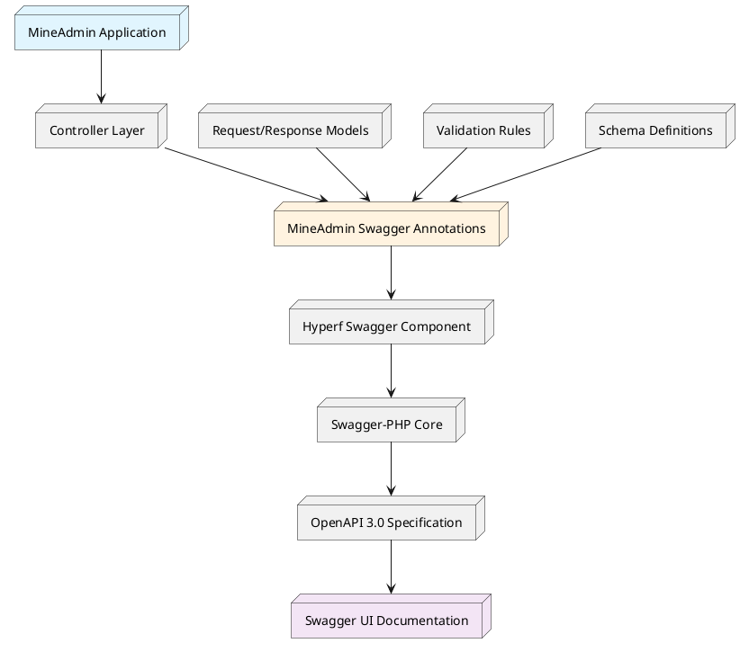
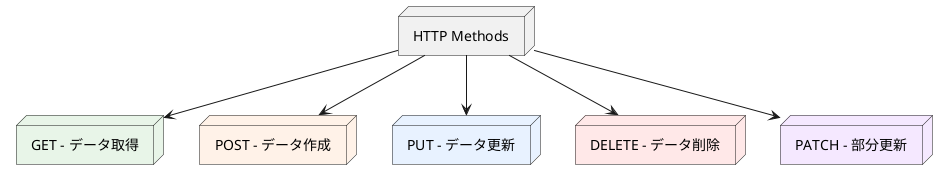
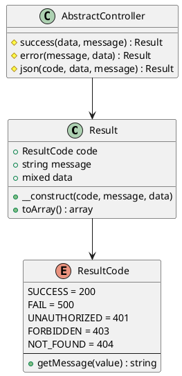
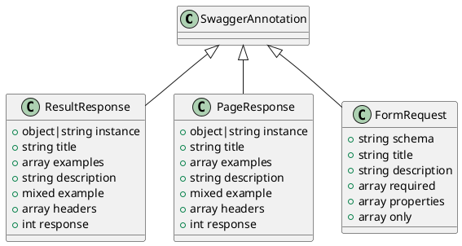
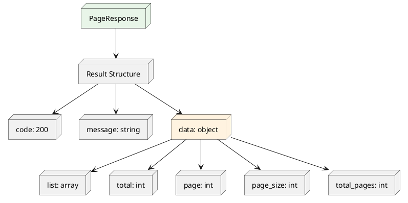

# ルーティングとAPIドキュメントシステム

## 目次

1. [概要とアーキテクチャ](#_1-概要とアーキテクチャ)
2. [クイックスタート](#_2-クイックスタート)
3. [HTTP仕様とベストプラクティス](#_3-http仕様とベストプラクティス)
4. [レスポンス構造体システム](#_4-レスポンス構造体システム)
5. [MineAdminカスタムアノテーション](#_5-mineadminカスタムアノテーション)
6. [実際のアプリケーション例](#_6-実際のアプリケーション例)
10. [よくある質問と解決策](#_10-よくある質問と解決策)

---

## 1. 概要とアーキテクチャ

### 1.1 システム概要

MineAdmin には、[Swagger/OpenAPI 3.0](https://swagger.io) 仕様に基づいた完全な API ドキュメント生成システムが組み込まれており、開発者に強力な API ドキュメントの自動生成および管理機能を提供します。

**アクセス方法**: ローカル開発時は `http://localhost:9503/swagger` にアクセスして完全な API ドキュメントを表示します。

### 1.2 アーキテクチャ階層

::: tip 技術スタックアーキテクチャ

MineAdmin の API ドキュメントシステムは多層アーキテクチャ設計を採用しています：

- **[mineadmin/swagger](https://github.com/mineadmin/Swagger)** - MineAdmin 専用の Swagger アノテーションカプセル化層
- **[hyperf/swagger](https://github.com/hyperf/swagger)** - Hyperf フレームワークの Swagger 統合コンポーネント
- **[zircote/swagger-php](https://github.com/zircote/swagger-php)** - PHP Swagger アノテーション処理コア
- **[OpenAPI 仕様](https://github.com/OAI/OpenAPI-Specification)** - 業界標準の API ドキュメント仕様

:::

### 1.3 システムアーキテクチャ図



### 1.4 コアとなる利点

- **自動ドキュメント生成**: コードアノテーションに基づいて完全な API ドキュメントを自動生成
- **型安全性**: 強力な型サポートにより、ドキュメントと実際のコードの一貫性を保証
- **リアルタイム同期**: コード変更時にドキュメントが自動更新
- **インタラクティブテスト**: 組み込みの Swagger UI で API を直接テスト可能
---

## 2. クイックスタート

### 2.1 基本設定

プロジェクトに MineAdmin Swagger コンポーネントが正しくインストールされていることを確認します：

```bash
composer require mineadmin/swagger
```

### 2.2 初めての API インターフェース

シンプルな API インターフェースを作成します：

```php
<?php

namespace App\Http\Admin\Controller;

use App\Http\Common\Result;
use Mine\Swagger\Attributes\ResultResponse;
use Hyperf\Swagger\Annotation as OA;

#[OA\Tag(name: "ユーザー管理", description: "ユーザー関連のAPIインターフェース")]
class UserController extends AbstractController
{
    #[OA\Get(
        path: "/admin/user/info",
        summary: "ユーザー情報を取得",
        description: "ユーザーIDに基づいて詳細なユーザー情報を取得します"
    )]
    #[ResultResponse(
        instance: new Result(data: ["id" => 1, "name" => "张三"]),
        title: "取得成功",
        description: "ユーザー情報の取得成功"
    )]
    public function getUserInfo(): Result
    {
        return $this->success([
            'id' => 1,
            'name' => '张三',
            'email' => 'zhangsan@example.com'
        ]);
    }
}
```

### 2.3 ドキュメントへのアクセス

サービスを起動したら、`http://localhost:9503/swagger` にアクセスして生成されたドキュメントを表示します。

---

## 3. HTTP仕様とベストプラクティス

### 3.1 RESTful API 設計原則

MineAdmin は RESTful アーキテクチャスタイルに従い、API インターフェースの一貫性と予測可能性を確保することを推奨します。

#### 3.1.1 HTTP メソッドマッピング



#### 3.1.2 標準ルーティングデザインパターン

ユーザー管理モジュールを例に、標準的な RESTful API 設計を示します：

| HTTPメソッド | ルートパス | 機能説明 | レスポンスデータ |
|------------|-----------|---------|--------------|
| `GET` | `/admin/user/list` | ユーザーリストの取得（ページネーション） | ユーザーリストデータ |
| `GET` | `/admin/user/{id}` | 単一ユーザー詳細の取得 | 単一ユーザーデータ |
| `POST` | `/admin/user` | 新規ユーザーの作成 | 作成されたユーザーデータ |
| `PUT` | `/admin/user/{id}` | ユーザー情報の完全更新 | 更新後のユーザーデータ |
| `PATCH` | `/admin/user/{id}` | ユーザー情報の部分更新 | 更新後のユーザーデータ |
| `DELETE` | `/admin/user/{id}` | ユーザーの削除 | 削除確認情報 |

#### 3.1.3 ベストプラクティスの提案

::: tip 設計原則

1. **リソースの命名**: 動詞ではなく名詞を使用し、複数形を採用
   ```
   ✅ /admin/users
   ❌ /admin/getUsers
   ```

2. **ネストされたリソース**: リソース間の階層関係を表現
   ```
   ✅ /admin/users/{id}/roles
   ❌ /admin/user-roles?user_id={id}
   ```

3. **ステータスコードの意味**: HTTP ステータスコードを正しく使用
   ```
   200 - リクエスト成功
   201 - リソース作成成功
   400 - リクエストパラメータエラー
   401 - 未承認アクセス
   403 - 権限不足
   404 - リソースが存在しない
   500 - サーバー内部エラー
   ```

4. **柔軟性を優先**: 規範は基礎、ビジネス要件が核心
   - RESTful 原則に従うが、厳格な規範に固執しない
   - ビジネスの持続可能な反復を主な考慮事項とする
   - チーム内の一貫性を維持する

:::

### 3.2 URL 設計規範

#### 3.2.1 命名規則

```php
// 推奨される命名方法
GET    /admin/users              // ユーザーリストの取得
GET    /admin/users/{id}         // 指定ユーザーの取得
POST   /admin/users              // ユーザーの作成
PUT    /admin/users/{id}         // ユーザーの更新
DELETE /admin/users/{id}         // ユーザーの削除

// 特殊操作の命名
POST   /admin/users/{id}/enable  // ユーザーの有効化
POST   /admin/users/{id}/disable // ユーザーの無効化
GET    /admin/users/search       // ユーザーの検索
```

#### 3.2.2 パラメータ渡しの規範

```php
// クエリパラメータ - フィルタリング、ソート、ページネーションに使用
GET /admin/users?page=1&page_size=20&status=active&sort=created_at,desc

// パスパラメータ - リソースの一意識別に使用
GET /admin/users/123

// リクエストボディパラメータ - 複雑なデータ渡しに使用
POST /admin/users
Content-Type: application/json
{
    "username": "zhangsan",
    "email": "zhangsan@example.com",
    "roles": [1, 2, 3]
}
```

---

## 4. レスポンス構造体システム

### 4.1 統一レスポンス形式

MineAdmin は統一されたレスポンス構造 `\App\Http\Common\Result` を採用し、すべての API インターフェースの返却形式の一貫性を確保します。

### 4.2 Result クラスアーキテクチャ



### 4.3 コア実装コード

#### 4.3.1 Result レスポンスクラス

::: code-group

```php [Result.php]
<?php

declare(strict_types=1);
/**
 * This file is part of MineAdmin.
 */

namespace App\Http\Common;

use Hyperf\Contract\Arrayable;
use Hyperf\Swagger\Annotation as OA;

/**
 * 統一されたAPIレスポンス構造
 * @template T
 */
#[OA\Schema(title: 'API レスポンス構造', description: '統一されたAPIレスポンス形式')]
class Result implements Arrayable
{
    public function __construct(
        #[OA\Property(ref: 'ResultCode', title: 'レスポンスステータスコード', description: 'ビジネスステータスコード、HTTPステータスコードとは異なります')]
        public ResultCode $code = ResultCode::SUCCESS,
        
        #[OA\Property(title: 'レスポンスメッセージ', type: 'string', description: 'レスポンスの説明情報')]
        public ?string $message = null,
        
        #[OA\Property(title: 'レスポンスデータ', type: 'mixed', description: '実際のビジネスデータ')]
        public mixed $data = []
    ) {
        if ($this->message === null) {
            $this->message = ResultCode::getMessage($this->code->value);
        }
    }

    /**
     * 配列形式に変換
     */
    public function toArray(): array
    {
        return [
            'code' => $this->code->value,
            'message' => $this->message,
            'data' => $this->data,
        ];
    }
}
```

```php [AbstractController.php]
<?php

namespace App\Http\Common\Controller;

use App\Http\Common\Result;
use App\Http\Common\ResultCode;

/**
 * 基本コントローラークラス
 * 統一されたレスポンスメソッドを提供
 */
abstract class AbstractController
{
    /**
     * 成功レスポンス
     */
    protected function success(mixed $data = [], ?string $message = null): Result
    {
        return new Result(ResultCode::SUCCESS, $message, $data);
    }

    /**
     * エラーレスポンス
     */
    protected function error(?string $message = null, mixed $data = []): Result
    {
        return new Result(ResultCode::FAIL, $message, $data);
    }

    /**
     * カスタムレスポンス
     */
    protected function json(ResultCode $code, mixed $data = [], ?string $message = null): Result
    {
        return new Result($code, $message, $data);
    }
    
    /**
     * ページネーションレスポンス
     */
    protected function paginate(array $list, int $total, int $page = 1, int $pageSize = 10): Result
    {
        return $this->success([
            'list' => $list,
            'total' => $total,
            'page' => $page,
            'page_size' => $pageSize,
            'total_pages' => ceil($total / $pageSize)
        ]);
    }
}
```

```php [AdminController.php]
<?php

namespace App\Http\Admin\Controller;

use App\Http\Common\Controller\AbstractController as Base;
use Hyperf\Context\ApplicationContext;
use Hyperf\HttpServer\Contract\RequestInterface;

/**
 * 管理バックエンドコントローラーベースクラス
 * ページネーション処理機能を拡張
 */
abstract class AbstractController extends Base
{
    /**
     * 現在のページ番号を取得
     */
    protected function getCurrentPage(): int
    {
        return (int) $this->getRequest()->input('page', 1);
    }

    /**
     * 1ページあたりのサイズを取得
     */
    protected function getPageSize(int $default = 10, int $max = 100): int
    {
        $size = (int) $this->getRequest()->input('page_size', $default);
        return min($size, $max); // 最大ページサイズを制限
    }

    /**
     * リクエストインスタンスを取得
     */
    protected function getRequest(): RequestInterface
    {
        return ApplicationContext::getContainer()->get(RequestInterface::class);
    }
    
    /**
     * ソートパラメータを取得
     */
    protected function getOrderBy(string $default = 'id'): array
    {
        $sort = $this->getRequest()->input('sort', $default);
        $order = $this->getRequest()->input('order', 'asc');
        
        return [$sort, in_array(strtolower($order), ['asc', 'desc']) ? $order : 'asc'];
    }
}
```

:::

### 4.4 ResultCode 列挙クラス

MineAdmin は、API レスポンスのステータス情報を標準化するための完全なビジネスステータスコード列挙システムを提供します。

#### 4.4.1 コア実装

```php
<?php

declare(strict_types=1);
/**
 * This file is part of MineAdmin.
 */

namespace App\Http\Common;

use Hyperf\Constants\Annotation\Constants;
use Hyperf\Constants\Annotation\Message;
use Hyperf\Constants\ConstantsTrait;
use Hyperf\Swagger\Annotation as OA;

/**
 * ビジネスステータスコード列挙
 * 標準化されたAPIレスポンスステータスコードを提供
 */
#[Constants]
#[OA\Schema(title: 'ResultCode', type: 'integer', default: 200, description: 'ビジネスステータスコード')]
enum ResultCode: int
{
    use ConstantsTrait;

    // 成功ステータス
    #[Message('操作成功')]
    case SUCCESS = 200;

    // 汎用エラーステータス
    #[Message('操作失敗')]
    case FAIL = 500;

    #[Message('未承認アクセス')]
    case UNAUTHORIZED = 401;

    #[Message('権限不足')]
    case FORBIDDEN = 403;

    #[Message('リソースが存在しません')]
    case NOT_FOUND = 404;

    #[Message('リクエストメソッドが許可されていません')]
    case METHOD_NOT_ALLOWED = 405;

    #[Message('リクエスト形式が受け入れられません')]
    case NOT_ACCEPTABLE = 406;

    #[Message('リクエストエンティティ処理エラー')]
    case UNPROCESSABLE_ENTITY = 422;
    
    // ビジネス関連エラー
    #[Message('パラメータ検証失敗')]
    case VALIDATION_ERROR = 10001;
    
    #[Message('ビジネスロジックエラー')]
    case BUSINESS_ERROR = 10002;
    
    #[Message('データベース操作失敗')]
    case DATABASE_ERROR = 10003;
    
    #[Message('外部サービス呼び出し失敗')]
    case EXTERNAL_SERVICE_ERROR = 10004;
}
```

#### 4.4.2 レスポンス形式の例

異なるステータスコードに対応するレスポンス形式：

```json
// 成功レスポンス
{
    "code": 200,
    "message": "操作成功",
    "data": {
        "id": 1,
        "username": "admin"
    }
}

// エラーレスポンス
{
    "code": 10001,
    "message": "パラメータ検証失敗",
    "data": {
        "errors": {
            "username": ["ユーザー名は空にできません"]
        }
    }
}

// ページネーションレスポンス
{
    "code": 200,
    "message": "操作成功",
    "data": {
        "list": [...],
        "total": 100,
        "page": 1,
        "page_size": 20,
        "total_pages": 5
    }
}
```

### 4.5 使用上のベストプラクティス

#### 4.5.1 コントローラーでの使用

```php
class UserController extends AbstractController
{
    public function index(): Result
    {
        try {
            $users = $this->userService->getList();
            return $this->success($users, 'ユーザーリストの取得成功');
        } catch (ValidationException $e) {
            return $this->json(ResultCode::VALIDATION_ERROR, [], $e->getMessage());
        } catch (\Exception $e) {
            return $this->error('システム異常です。後ほど再試行してください');
        }
    }
}
```

---

## 5. MineAdminカスタムアノテーション

MineAdmin は、API ドキュメントの作成と保守を簡素化するための 3 つのコアカスタム Swagger アノテーションを提供します。すべてのアノテーションは `Mine\Swagger\Attributes\` 名前空間にあります。

### 5.1 アノテーションアーキテクチャ概要



### 5.2 ResultResponse アノテーション

単一リソースまたは操作のレスポンス構造を定義し、標準的な API レスポンスドキュメントを自動生成します。

#### 5.2.1 コンストラクタシグネチャ

```php
ResultResponse::__construct(
    object|string $instance,           // レスポンスデータのクラスインスタンスまたはクラス名
    ?string $title = null,             // レスポンスタイトル
    ?array $examples = null,           // 複数のサンプル配列
    ?string $description = null,       // レスポンス説明
    mixed $example = Generator::UNDEFINED, // 単一サンプル
    ?array $headers = null,            // レスポンスヘッダー情報
    ?int $response = 200               // HTTPステータスコード
)
```

#### 5.2.2 パラメータ詳細

| パラメータ | 型 | 必須 | 説明 |
|---------|------|------|------|
| `$instance` | `object\|string` | ✅ | レスポンスデータのクラスインスタンスまたはクラス名。アノテーションの自動解析をサポート |
| `$title` | `string` | ❌ | レスポンスのタイトル。ドキュメント表示用 |
| `$examples` | `array` | ❌ | 複数のレスポンスサンプル。キーと値のペア形式 |
| `$description` | `string` | ❌ | 詳細なレスポンス説明 |
| `$example` | `mixed` | ❌ | 単一のレスポンスサンプル。JSON文字列またはオブジェクト |
| `$headers` | `array` | ❌ | カスタムレスポンスヘッダー情報 |
| `$response` | `int` | ❌ | HTTPステータスコード。デフォルトは200 |

#### 5.2.3 実際のアプリケーション例

ユーザーログインインターフェースに基づく完全な例：

::: code-group

```php [ログインコントローラー]
<?php

namespace App\Http\Admin\Controller;

use App\Http\Common\Result;
use App\Http\Admin\Request\PassportLoginRequest;
use App\Schema\PassportLoginVo;
use Mine\Swagger\Attributes\ResultResponse;
use Hyperf\Swagger\Annotation as OA;

class PassportController extends AbstractController
{
    #[OA\Post(
        path: '/admin/passport/login',
        summary: 'ユーザーログイン',
        description: '管理者ユーザーログインインターフェース',
        tags: ['認証管理']
    )]
    #[ResultResponse(
        instance: new Result(data: new PassportLoginVo()),
        title: 'ログイン成功',
        description: 'ユーザーログイン成功後に返されるトークン情報',
        example: '{"code":200,"message":"ログイン成功","data":{"access_token":"eyJ0eXAiOiJKV1QiLCJhbGciOiJIUzI1NiJ9...","refresh_token":"eyJ0eXAiOiJKV1QiLCJhbGciOiJIUzI1NiJ9...","expire_at":7200}}'
    )]
    public function login(PassportLoginRequest $request): Result
    {
        $credentials = $request->validated();
        $tokenData = $this->authService->login($credentials);
        
        return $this->success($tokenData, 'ログイン成功');
    }
}
```

```php [レスポンスデータモデル]
<?php

namespace App\Schema;

use Hyperf\Swagger\Annotation as OA;

/**
 * ログイン成功レスポンスデータモデル
 */
#[OA\Schema(
    title: 'ログインレスポンスデータ',
    description: 'ユーザーログイン成功後に返されるトークン情報',
    type: 'object'
)]
final class PassportLoginVo
{
    #[OA\Property(
        property: 'access_token',
        description: 'アクセストークン。APIリクエスト認証用',
        type: 'string',
        example: 'eyJ0eXAiOiJKV1QiLCJhbGciOiJIUzI1NiJ9.eyJpYXQiOjE3MjIwOTQwNTY...'
    )]
    public string $access_token;

    #[OA\Property(
        property: 'refresh_token',
        description: 'リフレッシュトークン。新しいアクセストークンの取得用',
        type: 'string',
        example: 'eyJ0eXAiOiJKV1QiLCJhbGciOiJIUzI1NiJ9.eyJpYXQiOjE3MjIwOTQwNTY...'
    )]
    public string $refresh_token;

    #[OA\Property(
        property: 'expire_at',
        description: 'トークン有効期限。単位：秒',
        type: 'integer',
        example: 7200
    )]
    public int $expire_at;

    #[OA\Property(
        property: 'user_info',
        description: 'ユーザー基本情報',
        type: 'object',
        properties: [
            'id' => ['type' => 'integer', 'description' => 'ユーザーID'],
            'username' => ['type' => 'string', 'description' => 'ユーザー名'],
            'nickname' => ['type' => 'string', 'description' => 'ニックネーム'],
        ]
    )]
    public array $user_info;
}
```

:::

#### 5.2.4 ベストプラクティス

::: warning 注意事項

1. **instance パラメータ**: クラス名ではなく具体的なクラスインスタンスを使用することを推奨。アノテーションが正しく解析できるようにするため
2. **サンプルデータ**: フロントエンド開発者が理解しやすいよう、実際の完全なサンプルデータを提供
3. **説明情報**: レスポンスのビジネス上の意味と使用シナリオを詳細に説明
4. **ステータスコード**: 実際のビジネス状況に応じて適切な HTTP ステータスコードを設定

:::

### 5.3 PageResponse アノテーション

ページネーションデータのレスポンス構造に特化したアノテーション。ページネーション情報を含む標準レスポンスドキュメントを自動生成します。

#### 5.3.1 コンストラクタシグネチャ

`PageResponse` のコンストラクタは `ResultResponse` と完全に同じですが、意味的にはページネーションレスポンス専用です。

```php
PageResponse::__construct(
    object|string $instance,           // ページネーションデータ項目のクラスインスタンスまたはクラス名
    ?string $title = null,             // レスポンスタイトル
    ?array $examples = null,           // 複数のサンプル配列
    ?string $description = null,       // レスポンス説明
    mixed $example = Generator::UNDEFINED, // 単一サンプル
    ?array $headers = null,            // レスポンスヘッダー情報
    ?int $response = 200               // HTTPステータスコード
)
```

#### 5.3.2 ページネーションレスポンス構造



### 5.4 FormRequest アノテーション

リクエストパラメータの構造化ドキュメントアノテーションに特化。既存の Schema クラスに基づいてリクエストパラメータドキュメントを自動生成します。

#### 5.4.1 コンストラクタシグネチャ

```php
FormRequest::__construct(
    ?string $schema = null,        // 解析する schema クラス名
    ?string $title = null,         // フォームタイトル
    ?string $description = null,   // フォーム説明
    ?array $required = null,       // 必須フィールド配列
    ?array $properties = null,     // 追加のプロパティ定義
    array $only = []               // 指定されたフィールドのみ表示
)
```

#### 5.4.2 パラメータ詳細

| パラメータ | 型 | 必須 | 説明 |
|---------|------|------|------|
| `$schema` | `string` | ❌ | ベースとなる Schema クラス名。フィールド解析用 |
| `$title` | `string` | ❌ | リクエストフォームのタイトル |
| `$description` | `string` | ❌ | リクエストフォームの詳細説明 |
| `$required` | `array` | ❌ | 必須フィールドリスト |
| `$properties` | `array` | ❌ | 追加のフィールドプロパティ定義 |
| `$only` | `array` | ❌ | 指定されたフィールドのみ表示。フィールドフィルタリング用 |

---

## 6. 実際のアプリケーション例

### 6.1 完全なCRUDインターフェース例

記事管理を例に、完全なCRUDインターフェースの実装を示します：

```php
<?php

namespace App\Http\Admin\Controller;

use App\Http\Common\Result;
use App\Http\Admin\Request\ArticleRequest;
use App\Schema\ArticleSchema;
use Mine\Swagger\Attributes\{ResultResponse, PageResponse, FormRequest};
use Hyperf\Swagger\Annotation as OA;

#[OA\Tag(name: "記事管理", description: "記事に関するCRUD操作")]
class ArticleController extends AbstractController
{
    /**
     * 記事リストの取得
     */
    #[OA\Get(
        path: "/admin/articles",
        summary: "記事リストの取得",
        description: "ページネーションで記事リストを取得します。検索フィルタリングをサポート"
    )]
    #[PageResponse(instance: ArticleSchema::class, title: "記事リスト")]
    public function index(): Result
    {
        $filters = $this->getRequest()->all();
        $page = $this->getCurrentPage();
        $pageSize = $this->getPageSize();
        
        $result = $this->articleService->paginate($filters, $page, $pageSize);
        return $this->paginate($result['list'], $result['total'], $page, $pageSize);
    }

    /**
     * 単一記事の取得
     */
    #[OA\Get(
        path: "/admin/articles/{id}",
        summary: "記事詳細の取得",
        description: "IDに基づいて単一記事の詳細情報を取得します"
    )]
    #[OA\Parameter(name: "id", description: "記事ID", in: "path", required: true, schema: new OA\Schema(type: "integer"))]
    #[ResultResponse(instance: new Result(data: new ArticleSchema()), title: "記事詳細")]
    public function show(int $id): Result
    {
        $article = $this->articleService->findById($id);
        return $this->success($article);
    }

    /**
     * 記事の作成
     */
    #[OA\Post(
        path: "/admin/articles",
        summary: "記事の作成",
        description: "新しい記事を作成します"
    )]
    #[OA\RequestBody(content: new OA\JsonContent(ref: ArticleRequest::class))]
    #[ResultResponse(instance: new Result(data: new ArticleSchema()), title: "作成成功", response: 201)]
    public function store(ArticleRequest $request): Result
    {
        $data = $request->validated();
        $article = $this->articleService->create($data);
        return $this->success($article, '記事作成成功');
    }

    /**
     * 記事の更新
     */
    #[OA\Put(
        path: "/admin/articles/{id}",
        summary: "記事の更新",
        description: "指定された記事の情報を更新します"
    )]
    #[OA\Parameter(name: "id", description: "記事ID", in: "path", required: true, schema: new OA\Schema(type: "integer"))]
    #[OA\RequestBody(content: new OA\JsonContent(ref: ArticleRequest::class))]
    #[ResultResponse(instance: new Result(data: new ArticleSchema()), title: "更新成功")]
    public function update(int $id, ArticleRequest $request): Result
    {
        $data = $request->validated();
        $article = $this->articleService->update($id, $data);
        return $this->success($article, '記事更新成功');
    }

    /**
     * 記事の削除
     */
    #[OA\Delete(
        path: "/admin/articles/{id}",
        summary: "記事の削除",
        description: "指定された記事を削除します"
    )]
    #[OA\Parameter(name: "id", description: "記事ID", in: "path", required: true, schema: new OA\Schema(type: "integer"))]
    #[ResultResponse(instance: new Result(), title: "削除成功")]
    public function destroy(int $id): Result
    {
        $this->articleService->delete($id);
        return $this->success([], '記事削除成功');
    }
}
```

### 6.2 リクエスト検証クラスの例

```php
<?php

namespace App\Http\Admin\Request;

use App\Schema\ArticleSchema;
use Hyperf\Validation\Request\FormRequest;
use Mine\Swagger\Attributes\FormRequest as FormRequestAnnotation;

#[FormRequestAnnotation(
    schema: ArticleSchema::class,
    title: "記事リクエストパラメータ",
    description: "記事作成または更新時のリクエストパラメータ",
    required: ['title', 'content', 'status'],
    only: ['title', 'content', 'excerpt', 'status', 'category_id', 'tags']
)]
class ArticleRequest extends FormRequest
{
    public function authorize