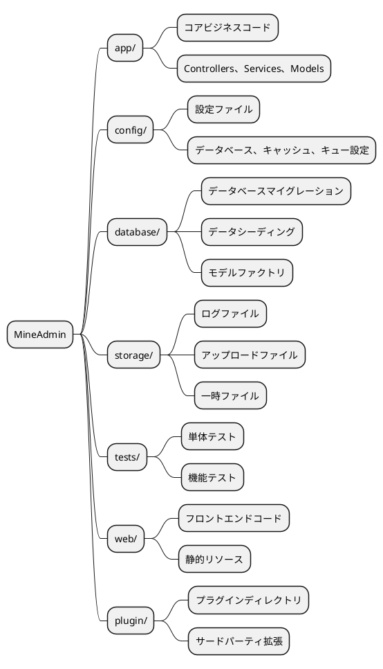
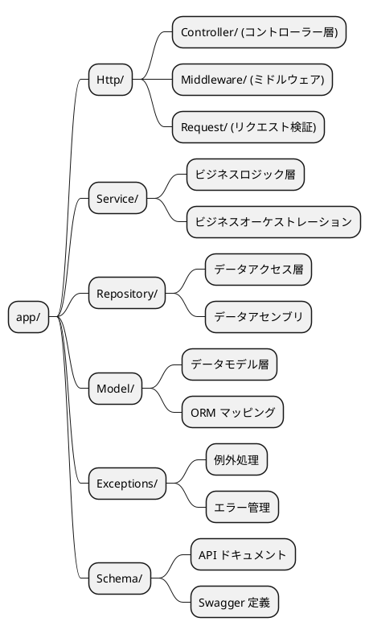
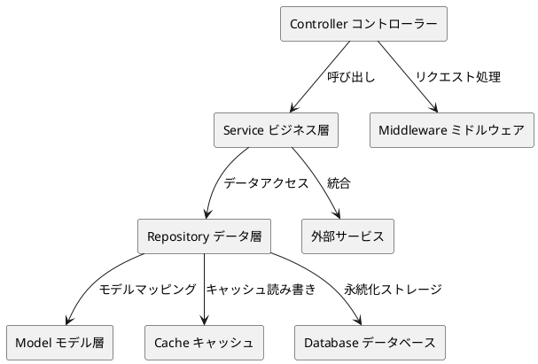

# プロジェクトディレクトリ構造

MineAdminは近代的な階層型アーキテクチャ設計を採用し、明確なコード編成構造とベストプラクティスを提供します。本ドキュメントでは、プロジェクトのディレクトリ構造、設計理念、開発規範について詳しく説明します。

## 概要

MineAdminのプロジェクト構造は [Laravel](https://laravel.com/) フレームワークの設計理念を参考にしつつ、近代的な階層型アーキテクチャパターンを組み合わせています。Laravel開発に精通している方であれば、MineAdminの構造を理解するのは非常に容易です。

### アーキテクチャ理念

MineAdminは以下のコア設計原則を採用しています。

- **階層型アーキテクチャ**：Controller → Service → Repository → Model の明確な階層
- **責務分離**：各ディレクトリに明確な責務境界
- **拡張性**：プラグイン開発とモジュール拡張をサポート
- **標準化**：PSR規範とベストプラクティスに準拠

## プロジェクトルートディレクトリ構造



### ディレクトリ詳細説明

#### `/app` - アプリケーションコアディレクトリ

アプリケーションのコアビジネスロジックが配置される場所で、コントローラー、サービス層、データ層などのコアコンポーネントを含みます。

**主な特徴：**
- 99%のビジネスコードを含む
- MVC階層型アーキテクチャに準拠
- モジュール開発をサポート

#### `/config` - 設定ディレクトリ

すべてのアプリケーション設定ファイルを格納し、柔軟な環境設定管理を提供します。

**代表的な設定ファイル：**
- `database.php` - データベース設定
- `cache.php` - キャッシュ設定
- `queue.php` - キュー設定

#### `/database` - データベースディレクトリ

データベース関連のすべてのファイルを管理し、構造変更やテストデータを含みます。

**ディレクトリ構造：**
```
database/
├── migrations/     # データベースマイグレーションファイル
├── seeders/        # データシーダーファイル
```

#### `/storage` - ストレージディレクトリ

アプリケーションの実行時に生成されるファイルやデータを格納します。

**ディレクトリ用途：**
- `uploads/` - ユーザーアップロードファイル
- `swagger/` - API ドキュメントファイル

#### `/tests` - テストディレクトリ

自動化テストスイートを含み、コード品質と機能の正確性を確保します。

**テストタイプ：**
- **単体テスト** - 単一のクラスやメソッドをテスト
- **機能テスト** - 完全なビジネスプロセスをテスト
- **API テスト** - API インターフェースをテスト

#### `/web` - フロントエンドディレクトリ

フロントエンドアプリケーションのコードと静的リソースファイルを格納します。

#### `/plugin` - プラグインディレクトリ

プラグインマーケットからダウンロードしたプラグインパッケージを格納し、システム機能拡張をサポートします。

## App ディレクトリ詳細解析

`app` ディレクトリはアプリケーション全体の中核であり、厳格な階層型アーキテクチャ設計を採用しています。



### Http ディレクトリ - リクエスト処理層

すべての HTTP リクエストを処理するエントリ層であり、コントローラー、ミドルウェア、リクエスト検証を含みます。

#### ディレクトリ構造
```
Http/
├── Admin/              # 管理バックエンドモジュール
│   ├── Controller/     # 管理バックエンドコントローラー
│   ├── Middleware/     # 管理バックエンドミドルウェア
│   ├── Request/        # 管理バックエンドリクエスト検証クラス
│   ├── Subscriber/     # イベント購読者
│   └── Vo/            # 値オブジェクトクラス
├── Api/                # API インターフェースモジュール
│   ├── Controller/     # API コントローラー
│   │   └── V1/        # API バージョン管理
│   ├── Middleware/     # API ミドルウェア
│   └── Request/        # API リクエスト検証クラス
│       └── V1/        # API バージョンリクエストクラス
├── Common/             # 共通モジュール
│   ├── Controller/     # 共通コントローラー
│   ├── Event/         # イベントクラス
│   ├── Middleware/     # 共通ミドルウェア
│   ├── Request/        # 共通リクエストクラス
│   ├── Result.php      # レスポンス結果クラス
│   ├── ResultCode.php  # 結果ステータスコード
│   └── Swagger/        # API ドキュメント設定
└── CurrentUser.php     # 現在のユーザーコンテキスト
```

#### モジュール型アーキテクチャ説明

**Admin モジュール** - 管理バックエンド機能
- 権限管理、ユーザー管理、メニュー管理などのバックエンド機能を含む
- 完全な MVC 構造を採用し、イベント購読者と値オブジェクトを含む

**Api モジュール** - 外部 API インターフェース
- バージョン管理（V1、V2など）をサポート
- 独立した認証ミドルウェアとリクエスト検証
- RESTful API 設計規範

**Common モジュール** - 共通コンポーネント
- モジュール間で共有される基本機能を提供
- 統一されたレスポンス形式とステータスコード管理
- API ドキュメント自動生成設定

### Service ディレクトリ - ビジネスロジック層

Service 層はコアビジネスロジックの実装場所であり、ビジネスルールのオーケストレーションと実行を担当します。

#### 設計原則

1. **単一責務** - 各 Service クラスは1つのビジネスドメインのみ処理
2. **依存性注入** - コンストラクタインジェクションによる依存関係注入
3. **トランザクション管理** - ビジネス操作の原子性を確保
4. **例外処理** - 統一された例外処理メカニズム

#### Service 層の責務

**コア機能：**
- ビジネスロジックのオーケストレーションと実行
- トランザクション管理とデータ整合性
- Repository 層を呼び出しデータ操作を実施
- ビジネスルール検証と処理

### Repository ディレクトリ - データアクセス層

Repository パターンはデータアクセスの抽象レイヤーを提供し、データクエリと操作ロジックをカプセル化します。

#### 設計特長

- **データソース抽象化** - データソースの簡単な切り替え（MySQL、Redis、ESなど）
- **クエリ再利用** - 共通クエリロジックの再利用
- **キャッシュ統合** - 透過的なキャッシュレイヤーの統合
- **パフォーマンス最適化** - クエリ最適化とバッチ操作

#### Repository 層の特長

**主な責務：**
- データアクセス抽象化層
- 複雑なクエリロジックのカプセル化
- キャッシュ戦略の実装
- データソース切り替えと最適化

### Model ディレクトリ - データモデル層

Model 層は Hyperf の Eloquent ORM に基づき、データベーステーブルのオブジェクト関係マッピングを提供します。

#### モデル特性

- **関連関係** - テーブル間の関連を定義
- **アクセサ/ミューテータ** - データフォーマット
- **イベントリスニング** - モデルライフサイクルイベント
- **ソフトデリート** - 論理削除サポート

#### Model 層の特性

**コア機能：**
- データテーブルマッピングと関連定義
- 属性アクセサとミューテータ
- モデルイベントとオブザーバー
- データ型変換と検証

### Exceptions ディレクトリ - 例外処理

統一された例外処理メカニズムにより、ユーザーフレンドリーなエラーメッセージとログ記録を提供します。

### Schema ディレクトリ - API ドキュメント

Swagger/OpenAPI ドキュメント定義を含み、API ドキュメント生成に使用されます。

::: danger 重要注意
Schema クラスはビジネスロジックのスケジューリングに一切関与してはならず、API ドキュメント生成にのみ使用します。
:::

## 開発ベストプラクティス

### コード編成規範

1. **命名規則**
   - クラス名は `PascalCase` を使用
   - メソッド名は `camelCase` を使用
   - 定数は `UPPER_SNAKE_CASE` を使用

2. **ファイル編成**
   - 1ファイル1クラス
   - ファイル名はクラス名と一致させる
   - 適切に名前空間を使用する

3. **依存性注入**
   - コンストラクタインジェクションを優先
   - 静的呼び出しを避ける
   - インターフェース指向プログラミング

### アーキテクチャパターン推奨



### エラー処理戦略

1. **例外分類**
   - ビジネス例外 - 予測可能なエラー
   - システム例外 - 予測不可能なエラー
   - 検証例外 - データ形式エラー

2. **ログ記録**
   - 重要な操作の記録
   - 例外情報の記録
   - パフォーマンス監視の記録

## 関連リソース

### 参考ドキュメント

- [Laravel 公式ドキュメント](https://laravel.com/docs/11.x)
- [Laravel 日本語ドキュメント](https://readouble.com/laravel/10.x/ja/)
- [Hyperf コルーチンフレームワーク](https://hyperf.wiki/3.1/#/ja/)

::: warning ORM 差異説明
MineAdmin は [Hyperf](https://github.com/hyperf/hyperf) がメンテナンスするコルーチン版 Eloquent ORM を使用しており、使用方法において Laravel 公式バージョンと一定の差異があります。開発時はコルーチン環境での特殊な使用方法に注意してください。
:::