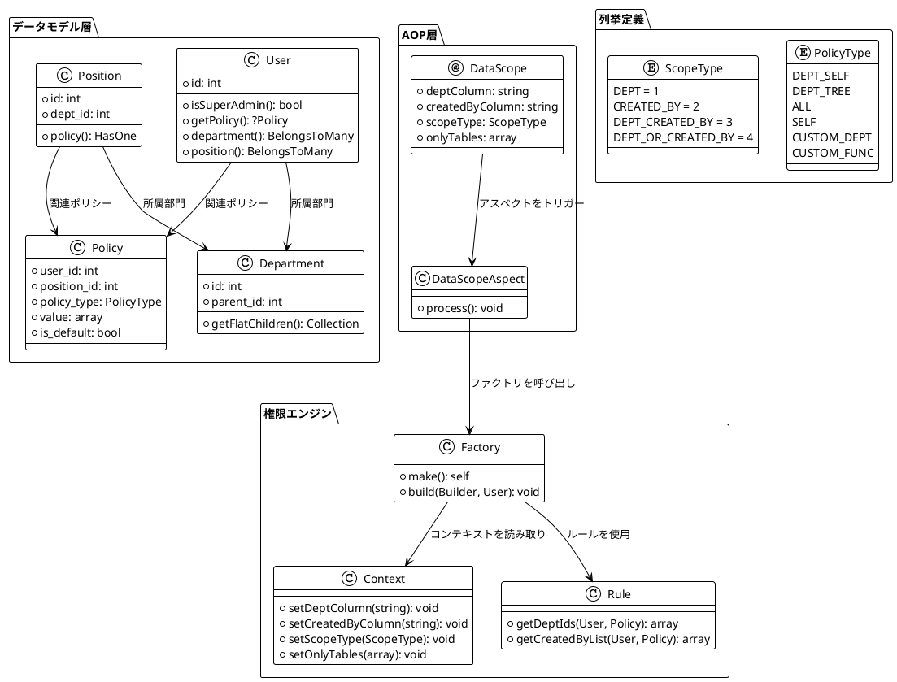
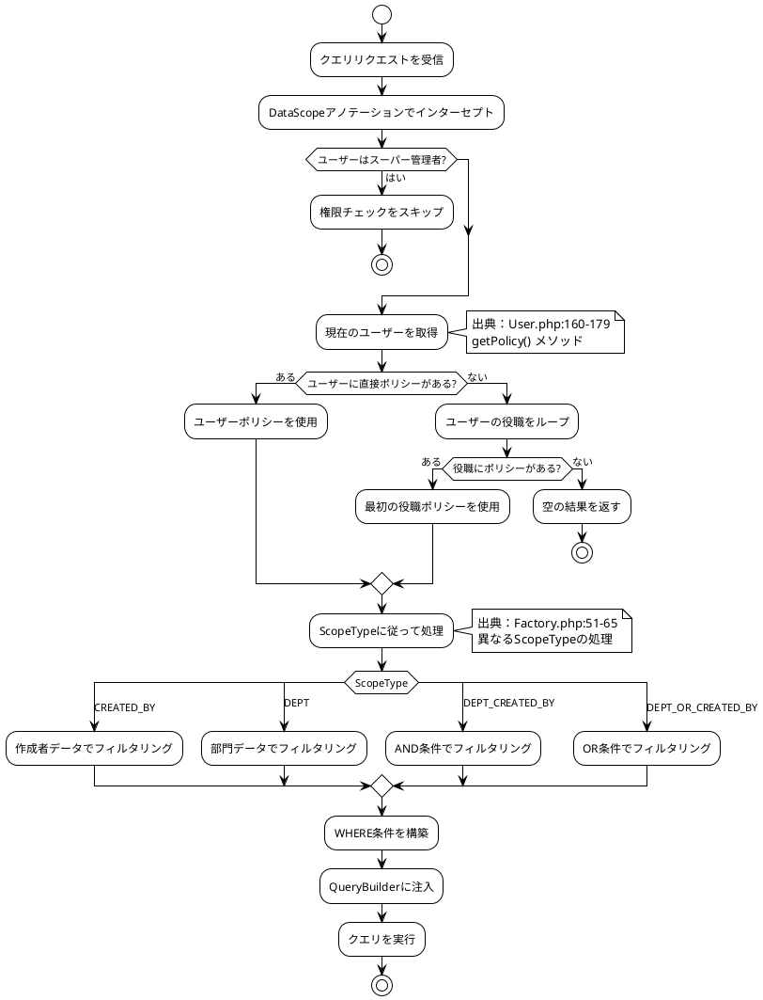
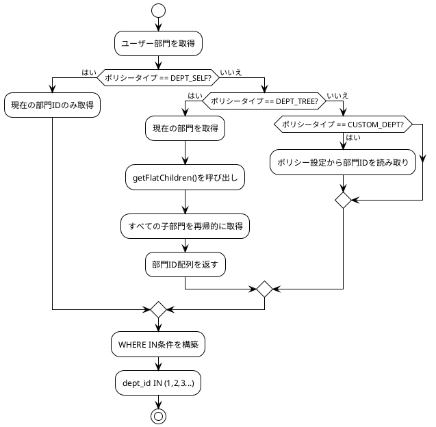
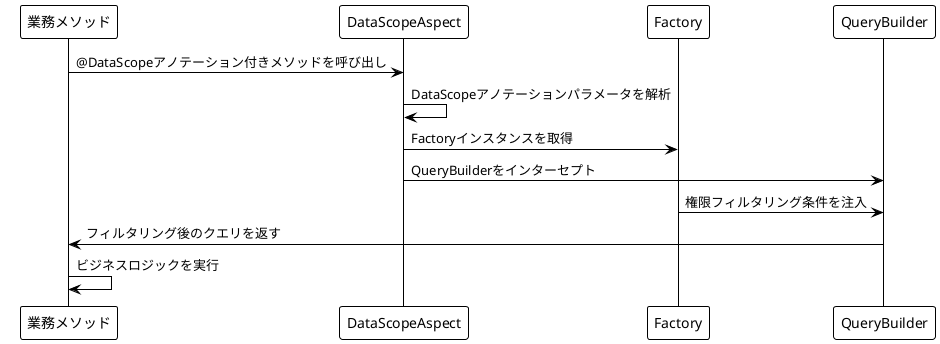

# システムアーキテクチャ

## データ権限システムアーキテクチャ設計

MineAdminのデータ権限システムはAOP（アスペクト指向プログラミング）に基づいて設計されており、アノテーションとアスペクトインターセプトにより、データクエリに自動的に権限フィルタリング条件を注入します。

## コアコンポーネントアーキテクチャ図



## 権限解析フロー



## データ権限実行メカニズム

### Factoryクラス

権限フィルタリングの中核実装：

```php
// /mineadmin/app/Library/DataPermission/Factory.php
class Factory
{
    public function build(Builder $builder, User $user): void 
    {
        // 1. スーパー管理者はチェックをバイパス
        if ($user->isSuperAdmin()) {
            return;
        }
        
        // 2. ユーザーポリシーを取得
        if (($policy = $user->getPolicy()) === null) {
            return;
        }
        
        // 3. 現在のScopeTypeを取得
        $scopeType = Context::getScopeType();
        
        // 4. カスタム関数を処理
        if ($policy->policy_type === PolicyType::CustomFunc) {
            $customFunc = $policy->value[0] ?? null;
            $this->rule->loadCustomFunc($customFunc, $builder, $user, $policy, $scopeType);
        }
        
        // 5. ScopeTypeに応じて異なるフィルタリングロジックを処理
        switch ($scopeType) {
            case ScopeType::CREATED_BY:
                $this->handleCreatedBy($user, $policy, $builder);
                break;
            case ScopeType::DEPT:
                $this->handleDept($user, $policy, $builder);
                break;
            case ScopeType::DEPT_CREATED_BY:
                $this->handleDeptCreatedBy($user, $policy, $builder);
                break;
            case ScopeType::DEPT_OR_CREATED_BY:
                $this->handleDeptOrCreatedBy($user, $policy, $builder);
                break;
        }
    }
}
```

### 具体的なフィルタリング実装

各種フィルタリング条件の具体的な実装：

```php
// /mineadmin/app/Library/DataPermission/Factory.php:67-102

// 作成者フィルタリング
private function handleCreatedBy(User $user, Policy $policy, Builder $builder): void
{
    $builder->when($this->rule->getCreatedByList($user, $policy), 
        static function (Builder $query, array $createdByList) {
            $query->whereIn(Context::getCreatedByColumn(), $createdByList);
        });
}

// 部門フィルタリング
private function handleDept(User $user, Policy $policy, Builder $builder): void
{
    $builder->when($this->rule->getDeptIds($user, $policy), 
        static function (Builder $query, array $deptList) {
            $query->whereIn(Context::getDeptColumn(), $deptList);
        });
}

// 部門 AND 作成者フィルタリング
private function handleDeptCreatedBy(User $user, Policy $policy, Builder $builder): void
{
    $builder->when($this->rule->getDeptIds($user, $policy), 
        static function (Builder $query, array $deptList) {
            $query->whereIn(Context::getDeptColumn(), $deptList);
        })->when($this->rule->getCreatedByList($user, $policy), 
        static function (Builder $query, array $createdByList) {
            $query->whereIn(Context::getCreatedByColumn(), $createdByList);
        });
}

// 部門 OR 作成者フィルタリング
private function handleDeptOrCreatedBy(User $user, Policy $policy, Builder $builder): void
{
    $createdByList = $this->rule->getCreatedByList($user, $policy);
    $deptList = $this->rule->getDeptIds($user, $policy);
    
    $builder->where(static function (Builder $query) use ($createdByList, $deptList) {
        if ($createdByList) {
            $query->whereIn(Context::getCreatedByColumn(), $createdByList);
        }
        if ($deptList) {
            $query->orWhereIn(Context::getDeptColumn(), $deptList);
        }
    });
}
```

## Contextコンテキスト管理

### コンテキスト格納メカニズム

```php
// /mineadmin/app/Library/DataPermission/Context.php
final class Context
{
    private const DEPT_COLUMN_KEY = 'data_permission_dept_column';
    private const CREATED_BY_COLUMN_KEY = 'data_permission_created_by_column';
    private const SCOPE_TYPE_KEY = 'data_permission_scope_type';
    private const ONLY_TABLES_KEY = 'data_permission_only_tables';

    public static function setDeptColumn(string $column = 'dept_id'): void
    {
        Ctx::set(self::DEPT_COLUMN_KEY, $column);
    }

    public static function getDeptColumn(): string
    {
        return Ctx::get(self::DEPT_COLUMN_KEY, 'dept_id');
    }
    
    // ... その他のメソッドも同様
}
```

## 部門階層処理

### 再帰的部門ツリーアルゴリズム

```php
// /mineadmin/app/Model/Permission/Department.php
public function getFlatChildren(): Collection
{
    $flat = collect();
    $this->load('children'); // 子部門を事前読み込み
    
    $traverse = static function ($departments) use (&$traverse, $flat) {
        foreach ($departments as $department) {
            $flat->push($department);
            if ($department->children->isNotEmpty()) {
                $traverse($department->children); // 再帰処理
            }
        }
    };
    
    $traverse($this->children);
    return $flat->prepend($this); // 自身を含める
}
```

### 部門権限処理フロー



## AOPアスペクトメカニズム

### DataScopeアノテーション定義

```php
// /mineadmin/app/Library/DataPermission/Attribute/DataScope.php
#[\Attribute(\Attribute::TARGET_CLASS | \Attribute::TARGET_METHOD)]
class DataScope extends AbstractAnnotation
{
    public function __construct(
        private readonly string $deptColumn = 'dept_id',
        private readonly string $createdByColumn = 'created_by',
        private readonly ScopeType $scopeType = ScopeType::DEPT_CREATED_BY,
        private readonly ?array $onlyTables = null
    ) {}
}
```

### アスペクトインターセプト処理



## カスタム関数拡張

### カスタム関数設定

```php
// /mineadmin/config/autoload/department/custom.php
return [
    'testction' => function (Builder $builder, ScopeType $scopeType, Policy $policy, User $user) {
        // 特定のユーザーのみに適用
        if ($user->id !== 2) {
            return;
        }
        
        $createdByColumn = Context::getCreatedByColumn();
        $deptColumn = Context::getDeptColumn();
        
        switch ($scopeType) {
            case ScopeType::CREATED_BY:
                $builder->where($createdByColumn, $user->id);
                break;
            case ScopeType::DEPT:
                $builder->whereIn($deptColumn, 
                    $user->department()->get()->pluck('id'));
                break;
            case ScopeType::DEPT_CREATED_BY:
                $builder->whereIn($deptColumn, 
                    $user->department()->get()->pluck('id'));
                $builder->where($createdByColumn, $user->id);
                break;
            case ScopeType::DEPT_OR_CREATED_BY:
                $builder->whereIn($deptColumn, 
                    $user->department()->get()->pluck('id'));
                $builder->orWhere($createdByColumn, $user->id);
                break;
        }
    }
];
```

## 実際の使用例

### Serviceでの使用

```php
// /mineadmin/app/Service/Permission/UserService.php:94-98
class UserService
{
    #[DataScope(
        scopeType: ScopeType::CREATED_BY,
        onlyTables: ['user'],
        createdByColumn: 'id'
    )]
    public function page(array $params, int $page = 1, int $pageSize = 10): array
    {
        return parent::page($params, $page, $pageSize);
    }
}
```

この実際の使用例は、MineAdminでデータ権限アノテーションを適用してユーザーリストのアクセス権限を制御する方法を示しています。

このアーキテクチャ設計により、MineAdminは宣言的なデータ権限制御を実現しており、開発者はメソッドに`@DataScope`アノテーションを追加するだけで、システムが自動的に現在のユーザーの権限ポリシーに従ってデータをフィルタリングします。