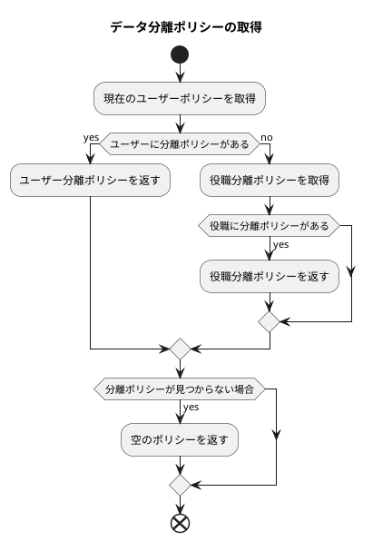

# データ権限設定と使用例

本記事では、データ権限設定における各種ポリシーの設定と使用方法について説明します。

## データ分離方式

データ分離は現在、行レベルの分離のみサポートしていますが、複数の分離ポリシーをサポートしています。

主に作成者、所属部署に基づく分離方式に分けられます。

* `部署`分離は、ユーザーの現在所属部署に基づき、データ検索時に自動的に部署フィルタ条件を追加します。
* `作成者`分離は、データ作成者に基づき、データ検索時に自動的に作成者フィルタ条件を追加します。

## 優先順位

現在、`指定ユーザーに分離ポリシーを設定する`、`ユーザーに役職を指定し、役職に分離ポリシーを設定する`の2つの方法をサポートしています。
ユーザーに分離ポリシーと役職分離ポリシーの両方が設定されている場合、指定ユーザーに設定された分離ポリシーが優先されます。



ロジックコードは以下の通りです。

```php
// /mineadmin/app/Model/Permission/User.php:160-179

public function getPolicy(): ?Policy
{
    /**
     * @var null|Policy $policy
     */
    $policy = $this->policy()->first();
    if (! empty($policy)) {
        return $policy;
    }

    $this->load('position');
    $positionList = $this->position;
    foreach ($positionList as $position) {
        $current = $position->policy()->first();
        if (! empty($current)) {
            return $current;
        }
    }
    return null;
}

```

## 例

現在のテーブル `user` を分離テーブルとし、以下のデータがあると仮定します。

### サンプルデータ

部署テーブル

---

| id | name | parent_id |
|----|------|-----------|
| 1  | 部署1 | 0         |
| 2  | 部署2 | 1         |
| 3  | 部署3 | 0         |

部署1は最上位部署で、親部署はありません。
部署2は部署1の子部署です。
部署3は最上位部署で、親部署はありません。

---

役職テーブル

| id | name | dept_id |
|----|------|---------|
| 1  | 役職1 | 1       |
| 2  | 役職2 | 2       |
| 3  | 役職3 | 3       |

部署1には役職1、部署2には役職2、部署3には役職3があります。

---

ユーザーテーブル

| id | name    | dept_id | created_by | post_id |
|----|---------|---------|------------|---------|
| 1  | スーパー管理者 | 0       | 0          | 0       |
| 2  | a1      | 1       | 1          | 1       |
| 3  | a2      | 2       | 1          | 1       |
| 4  | a3      | 1       | 2          | 2       |
| 5  | a4      | 2       | 2          | 0       |
| 6  | a5      | 0       | 4          | 0       |

ユーザーテーブルで、`dept_id` が0のユーザーは部署なしを示し、`created_by` が0のユーザーは作成者なしを示します。
スーパー管理者はすべてのデータを表示できます。

a1、a3は部署1に属し、a2、a4は部署2に属します。

a1、a2の作成者はスーパー管理者、a3、a4の作成者はa1です。

a1、a2の役職は役職1、a3の役職は役職2、a4には役職がありません。

以下に、異なるポリシーにおけるデータの検索結果の例を挙げます。

### PolicyType::SELF `自身のみ検索`

現在のユーザーIDが2のa1ユーザーが、自身のみ検索ポリシーを設定していると仮定します。

1. 分離方式が作成者のみに基づく場合。検索条件として`作成者が現在のユーザーID`が結合され、つまりユーザーa3、a4が検索されます。

```sql
SELECT * FROM user WHERE created_by in (4,5);
```

2. 分離方式が部署のみに基づく場合。検索条件として`部署が現在のユーザーの所属部署`が結合され、つまりユーザーa1、a3が検索されます。

```sql
SELECT * FROM user WHERE dept_id in(1);
```

3. 分離方式が作成者と部署に基づく場合。検索条件として`作成者が現在のユーザーID` かつ `部署が現在のユーザーの所属部署`が結合され、つまりユーザーa3が検索されます。

```sql
SELECT * FROM user WHERE created_by in(2) AND dept_id in(1);
```

4. 分離方式が部署または作成者フィルタに基づく場合。検索条件として`作成者が現在のユーザーID` または `部署が現在のユーザーの所属部署`が結合され、つまりユーザーa1、a3、a4が検索されます。

```sql
SELECT * FROM user WHERE dept_id in(1) OR created_by in(2);
```

### PolicyType::DEPT_SELF `自部署のみ検索`

現在のユーザーIDが2のa1ユーザーが、自部署のみ検索ポリシーを設定していると仮定します。

1. 分離方式が作成者のみに基づく場合。検索条件として`作成者が現在のユーザーと同じ部署の全ユーザーID`が結合され、つまりユーザーa3、a4、a5が検索されます。

```sql

SELECT * FROM user WHERE created_by in (2,4,5);

```

2. 分離方式が部署のみに基づく場合。検索条件として`部署が現在のユーザーの所属部署`が結合され、つまりユーザーa1、a3が検索されます。

```sql

SELECT * FROM user WHERE dept_id in(1);
```

3. 分離方式が作成者と部署に基づく場合。検索条件として`作成者が現在のユーザーと同じ部署の全ユーザーID` かつ `部署が現在のユーザーの所属部署`が結合され、つまりユーザーa3が検索されます。

```sql
SELECT * FROM user WHERE created_by in(2,4,5) AND dept_id in(1);
```

4. 分離方式が部署または作成者フィルタに基づく場合。検索条件として`作成者が現在のユーザーと同じ部署の全ユーザーID` または `部署が現在のユーザーの所属部署`が結合され、つまりユーザーa1、a3、a4、a5が検索されます。

```sql
SELECT * FROM user WHERE created_by in(2,4,5) OR dept_id in(1);
```

### PolicyType::DEPT_TREE `自部署及び子部署を検索`

現在のユーザーIDが2のa1ユーザーが、自部署及び子部署を検索ポリシーを設定していると仮定します。

1. 分離方式が作成者のみに基づく場合。検索条件として`作成者が現在のユーザーと同じ部署及び下位部署の全ユーザーID`が結合され、つまりユーザーa3、a4、a5が検索されます。

```sql
SELECT * FROM user WHERE created_by in (2,4,5);
```

2. 分離方式が部署のみに基づく場合。検索条件として`部署が現在のユーザーの所属部署及び下位部署`が結合され、つまりユーザーa1、a2、a3、a4が検索されます。

```sql

SELECT * FROM user WHERE dept_id in(1,2);
```

3. 分離方式が作成者と部署に基づく場合。検索条件として`作成者が現在のユーザーと同じ部署及び下位部署の全ユーザーID` かつ `部署が現在のユーザーの所属部署及び下位部署`が結合され、つまりユーザーa3、a4が検索されます。

```sql
SELECT * FROM user WHERE created_by in(2,4,5) AND dept_id in(1,2);
```

4. 分離方式が部署または作成者フィルタに基づく場合。検索条件として`作成者が現在のユーザーと同じ部署及び下位部署の全ユーザーID` または `部署が現在のユーザーの所属部署及び下位部署`が結合され、つまりユーザーa1、a2、a3、a4、a5が検索されます。

```sql
SELECT * FROM user WHERE created_by in(2,4,5) OR dept_id in(1,2);
```

### PolicyType::ALL `全て検索`
現在のユーザーIDが2のa1ユーザーが、全て検索ポリシーを設定している場合、全ての制限が解除されます。

### PolicyType::CUSTOM_DEPT `カスタム部署`

現在のユーザーIDが2のa1ユーザーが、部署2と3のデータのみ表示できるように設定していると仮定します。

1. 分離方式が作成者のみに基づく場合。検索条件として`作成者の所属部署が2と3の全ユーザーID`が結合され、つまりユーザーa2、a4、a5が検索されます。

```sql
SELECT * FROM user WHERE created_by in (2,4,5);
```

2. 分離方式が部署のみに基づく場合。検索条件として`部署が2と3`が結合され、つまりユーザーa2、a4が検索されます。

```sql
SELECT * FROM user WHERE dept_id in(2,3);
```

3. 分離方式が作成者と部署に基づく場合。検索条件として`作成者の所属部署が2と3の全ユーザーID` かつ `部署が2と3`が結合され、つまりユーザーa2、a4が検索されます。

```sql
SELECT * FROM user WHERE created_by in(2,4,5) AND dept_id in(2,3);
```

4. 分離方式が部署または作成者フィルタに基づく場合。検索条件として`作成者の所属部署が2と3の全ユーザーID` または `部署が2と3`が結合され、つまりユーザーa2、a4、a5が検索されます。

```sql
SELECT * FROM user WHERE created_by in(2,4,5) OR dept_id in(2,3);
```

### PolicyType::CUSTOM_FUNC `カスタム関数`

現在のユーザーIDが2のa1ユーザーが、カスタム関数 `testction` のポリシーを設定していると仮定します。

`/Users/zhuzhu/project/mineadmin/config/autoload/department/custom.php` でカスタム関数 `testction` が定義されています。

```php
// /mineadmin/config/autoload/department/custom.php
return [
    'testction' =>  function (Builder $builder, ScopeType $scopeType, Policy $policy, User $user) {
        // IDが2のユーザーのみ有効
        if ($user->id !== 2) {
            return;
        }
        // 現在のコンテキストの作成者フィールド名を取得
        $createdByColumn = Context::getCreatedByColumn();
        // 現在のコンテキストの部署フィールド名を取得
        $deptColumn = Context::getDeptColumn();
        switch ($scopeType){
            // 分離タイプが作成者に基づく場合
            case ScopeType::CREATED_BY:
                // 作成者フィールドが現在のユーザー
                $builder->where($createdByColumn, $user->id);
                break;
            case ScopeType::DEPT:
                // 部署フィールドが現在のユーザーの部署
                $builder->whereIn($deptColumn, $user->department()->get()->pluck('id'));
                break;
            case ScopeType::DEPT_CREATED_BY:
                // 部署フィールドが現在のユーザーの部署
                $builder->whereIn($deptColumn, $user->department()->get()->pluck('id'));
                // 作成者が現在のユーザー
                $builder->where($createdByColumn, $user->id);
                break;
            case ScopeType::DEPT_OR_CREATED_BY:
                // 部署フィールドが現在のユーザーの部署
                $builder->whereIn($deptColumn, $user->department()->get()->pluck('id'));
                // 作成者が現在のユーザー
                $builder->orWhere($createdByColumn, $user->id);
                break;
        }
    }
];

```

分離が有効になると、現在のコンテキストのユーザー、分離方式、権限ポリシーがカスタム関数 `testction` に渡されて処理されます。
これにより、開発者が複雑な分離ロジックをカスタマイズできます。