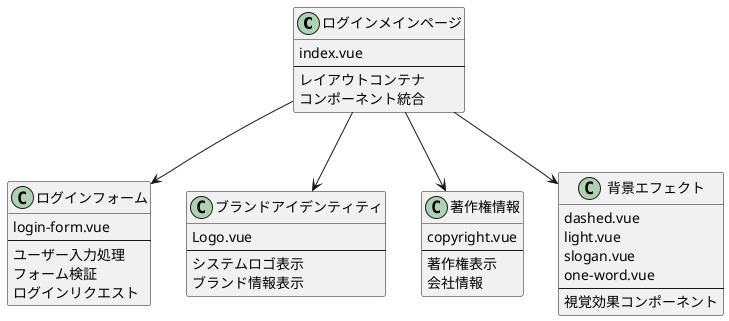
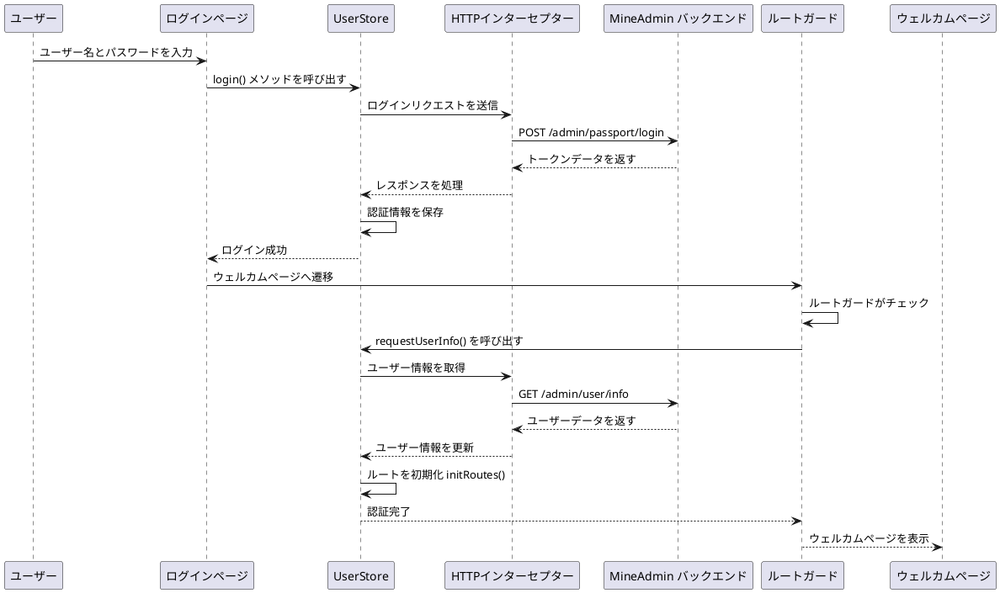
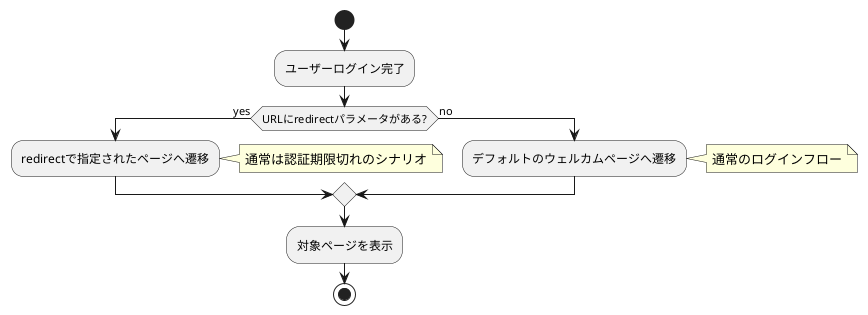

# ログインページとウェルカムページ

:::tip 概要
本章では、MineAdmin 3.0のログインページのアーキテクチャ、ログインフローの処理、トークン管理メカニズム、およびログイン成功後のウェルカムページ設定について詳しく説明します。コンポーネント構造分析、データフロー、ルートガードメカニズム、カスタム設定方法が含まれます。

**重要**: このドキュメントのすべてのコード例は、MineAdmin オープンソースプロジェクトの実際のコードに基づいており、ソースコードは [GitHub リポジトリ](https://github.com/mineadmin/mineadmin) にあります。
:::

## ログインページのアーキテクチャ

### ページコンポーネント構造

ログインページのメインファイルは `src/modules/base/views/login/index.vue` にあります。コンポーネント設計を採用し、ログイン機能を複数の独立したサブコンポーネントに分割することで、コードの保守性と再利用性を向上させています。

**ソースコードの場所**:
- **GitHub アドレス**: [mineadmin/web/src/modules/base/views/login/index.vue](https://github.com/mineadmin/mineadmin/blob/master/web/src/modules/base/views/login/index.vue)
- **ローカルパス**: `src/modules/base/views/login/index.vue`



### レスポンシブレイアウト設計

ログインページはレスポンシブデザインを採用し、デスクトップとモバイルに対応しています:

```vue
<template>
  <div class="h-full min-w-[380px] w-full flex items-center justify-center overflow-hidden border-1 bg-blue-950 lg:justify-between lg:bg-white">
    <!-- デスクトップ左側の装飾エリア -->
    <div class="relative hidden h-full w-10/12 md:hidden lg:flex">
      <div class="gradient-rainbow" />
      <Dashed />
      <Light />
      <Slogan />
      <OneWord />
    </div>
    
    <!-- ログインフォームエリア -->
    <div class="login-form-container">
      <Logo />
      <LoginForm />
      <CopyRight />
    </div>
    
    <!-- モバイル背景エフェクト -->
    <div class="min-[380px] relative left-0 top-0 z-4 h-full max-w-[1024px] w-full flex lg:hidden">
      <Dashed />
      <Light />
    </div>
  </div>
</template>
```

### コンポーネントライブラリについて

::: warning コンポーネントライブラリに関する注意事項
ログインページのフォームコンポーネントは `Element Plus` コンポーネントライブラリを使用せず、MineAdmin 独自のベースコンポーネントライブラリに基づいて構築されています。これらのコンポーネントはシステム専用に設計されており、以下の特徴があります:

- **軽量設計**: 必要なログイン機能のみを含み、依存関係を削減
- **統一されたスタイル**: システム全体のデザイン言語と一貫性を維持
- **カスタマイズ性が高い**: ビジネスニーズに応じて柔軟に調整可能

**カスタマイズの推奨**:
- 今後のバージョンアップグレードに影響を与える可能性があるため、ソースコードの直接変更は推奨しません
- [プラグインシステム](/v3/front/high/plugins.md) を使用してログインコンポーネントを置き換えることを推奨
- ルート設定でデフォルトの `login` ルートコンポーネントを上書き可能
:::

## ログインフローとデータ処理

### ログインフローの概要

ログインフローはモダンなフロントエンド・バックエンド分離アーキテクチャを採用し、JWT トークンベースの認証を行い、トークンの自動更新と権限検証をサポートします。



### コアデータフロー

::: info 開発ヒント
ログインページの UI のみを変更し、ログインロジックに関与しない場合は、本セクションの詳細なフロー説明をスキップして、[ウェルカムページ設定](#デフォルトのウェルカムページ設定)部分を直接参照してください。
:::

#### 1. ユーザーログイン認証

**ファイルの場所**: `src/store/modules/useUserStore.ts`

`login()` メソッドはユーザー認証プロセスを処理します:

```typescript
// ログインメソッドのコアロジック
async login(loginParams: LoginParams) {
  try {
    // ログインリクエストを送信
    const response = await http.post('/admin/passport/login', loginParams)
    
    // 認証情報をローカルストレージに保存
    const { access_token, refresh_token, expire_at } = response.data
    
    // Pinia Store に保存
    this.token = access_token
    this.refreshToken = refresh_token
    this.expireAt = expire_at
    
    // ブラウザキャッシュに保存
    cache.set('token', access_token)
    cache.set('refresh_token', refresh_token)
    cache.set('expire', useDayjs().unix() + expire_at, { exp: expire_at })
    
    return Promise.resolve(response)
  } catch (error) {
    return Promise.reject(error)
  }
}
```

#### 2. ルートガードによるインターセプト

ログイン成功後のページ遷移時にルートガードがトリガーされ、ユーザー情報の取得が自動的に実行されます:

```typescript
// ルートガードのロジック（簡略版）
router.beforeEach(async (to, from, next) => {
  const userStore = useUserStore()
  
  if (to.path !== '/login' && !userStore.isLogin) {
    // 未ログイン、ログインページへ遷移
    next('/login')
  } else if (userStore.isLogin && !userStore.userInfo) {
    // ログイン済みだがユーザー情報未取得
    try {
      await userStore.requestUserInfo()
      next()
    } catch (error) {
      // ユーザー情報取得失敗、ログイン状態をクリア
      await userStore.logout()
      next('/login')
    }
  } else {
    next()
  }
})
```

#### 3. ユーザー情報の取得

**ファイルの場所**: `src/store/modules/useUserStore.ts`

`requestUserInfo()` メソッドはユーザーの基本データと権限情報を取得します:

```typescript
async requestUserInfo() {
  try {
    // ユーザーデータ、メニュー権限、ロール情報を並行リクエスト
    const [userInfo, menuList, roleList] = await Promise.all([
      http.get('/admin/user/info'),          // ユーザー基本情報
      http.get('/admin/menu/index'),         // メニュー権限データ
      http.get('/admin/role/index')          // ロール権限データ
    ])
    
    // Store の状態を更新
    this.userInfo = userInfo.data
    this.menuList = menuList.data
    this.roleList = roleList.data
    
    // ルートシステムを初期化
    const routeStore = useRouteStore()
    await routeStore.initRoutes()
    
    return Promise.resolve(userInfo)
  } catch (error) {
    return Promise.reject(error)
  }
}
```

#### 4. 動的ルートの初期化

**ファイルの場所**: `src/store/modules/useRouteStore.ts`

`initRoutes()` メソッドはユーザー権限に基づいて動的にルートを生成します:

```typescript
async initRoutes() {
  const userStore = useUserStore()
  const { menuList } = userStore
  
  // メニューデータに基づいてルート設定を生成
  const routes = this.generateRoutes(menuList)
  
  // ルートを動的に追加
  routes.forEach(route => {
    router.addRoute(route)
  })
  
  // ルート状態を更新
  this.isRoutesInitialized = true
}
```

### トークン管理メカニズム

システムはデュアルトークンメカニズムを採用し、セキュリティとユーザーエクスペリエンスを確保します:

- **Access Token**: 短期有効（デフォルト1時間）、APIリクエスト認証に使用
- **Refresh Token**: 長期有効（デフォルト2時間）、Access Tokenの更新に使用

詳細なトークン更新メカニズムについては、[リクエストとインターセプター](/v3/front/advanced/request.md#トークン更新メカニズム) のドキュメントを参照してください。

## ウェルカムページの設定とルート管理

### ログイン後の遷移ロジック

MineAdmin は複数のログイン後遷移戦略をサポートし、ユーザーエクスペリエンスの継続性を確保します:



#### 遷移ルールの説明

1. **リダイレクトパラメータ付きログイン**
   ```
   /#/login?redirect=/admin/user/index
   ```
   ログイン成功後、自動的に `redirect` パラメータで指定されたページに遷移します。この状況は通常以下の場合に発生します:
   - ユーザーが権限が必要なページにアクセスしようとしたがログインしていない場合
   - トークン期限切れ後、自動的にログインページにリダイレクトされた場合

2. **デフォルトログイン遷移**
   ```
   /#/login
   ```
   `redirect` パラメータがない場合、ログイン成功後、システム設定のデフォルトウェルカムページに遷移します。

### ウェルカムページ設定の詳細

#### デフォルト設定構造

**設定ファイルの場所**: `src/provider/settings/index.ts`

MineAdmin の実際のデフォルトウェルカムページ設定:

```typescript
// MineAdmin デフォルトウェルカムページ設定
welcomePage: {
  name: 'welcome',                    // ルート名
  path: '/welcome',                   // ルートパス
  title: 'ウェルカムページ',                  // ページタイトル
  icon: 'icon-park-outline:jewelry',  // メニューアイコン
},
```

注意: MineAdmin では、ウェルカムページのコンポーネントパスはルートシステムによって自動的に解析され、`src/modules/base/views/welcome/index.vue` にあります。

#### 設定項目の詳細説明

| 設定項目 | タイプ | 必須 | デフォルト値 | 説明 |
|--------|------|------|---------|------|
| `name` | `string` | ✅ | `'welcome'` | ルート名、グローバルに一意である必要があります |
| `path` | `string` | ✅ | `'/welcome'` | アクセスパス、動的ルートをサポート |
| `title` | `string` | ✅ | `'ウェルカムページ'` | ページタイトル、ブラウザタブとパンくずリストに表示 |
| `icon` | `string` | ❌ | `'icon-park-outline:jewelry'` | アイコン識別子、メニュー表示に使用 |
| `component` | `Function` | ❌ | 動的インポートコンポーネント | ページコンポーネント、非同期ロードをサポート |

### ウェルカムページのカスタム設定

::: tip ベストプラクティス
システムアップグレード時に設定が上書きされないようにするため、`index.ts` ファイルを直接変更するのではなく、`settings.config.ts` でカスタム設定を行うことを強く推奨します。
:::

#### 設定方法

**ステップ 1**: `src/provider/settings/settings.config.ts` を編集

注意: このファイルは MineAdmin プロジェクトに既に存在するため、作成する必要はありません。

```typescript
import type { SystemSettings } from '#/global'

const globalConfigSettings: SystemSettings.all = {
  // カスタムウェルカムページ設定
  welcomePage: {
    name: 'dashboard',                        // ダッシュボードに変更
    path: '/dashboard',                       // パスをダッシュボードパスに変更
    title: 'データ概要',                       // カスタムタイトル
    icon: 'mdi:view-dashboard-outline',       // ダッシュボードアイコンを使用
  },
  
  // その他のシステム設定...
  app: {
    // アプリケーション関連設定
  }
}

export default globalConfigSettings
```

**ステップ 2**: システムが自動的に設定をマージ

システム起動時に、`settings.config.ts` の設定がデフォルト設定と自動的にディープマージされます:

```typescript
// MineAdmin の実際の設定マージロジック
import { defaultsDeep } from 'lodash-es'
import globalConfigSettings from '@/provider/settings/settings.config.ts'

// デフォルト設定とユーザー設定をマージ
const systemSetting = defaultsDeep(globalConfigSettings, defaultGlobalConfigSettings)
```

### 高度な設定例

#### 1. 条件付きウェルカムページ

ユーザーのロールや権限に応じて異なるウェルカムページを設定:

```typescript
const globalConfigSettings: SystemSettings.all = {
  welcomePage: {
    name: 'adaptive-welcome',
    path: '/adaptive-welcome',
    title: 'パーソナライズされたウェルカムページ',
    icon: 'mdi:account-star',
    // 条件ロジックを処理するカスタムコンポーネントを使用
    component: () => import('@/views/custom/AdaptiveWelcome.vue')
  }
}
```

#### 2. 多言語サポート

国際化設定と組み合わせて多言語ウェルカムページを設定:

```typescript
const globalConfigSettings: SystemSettings.all = {
  welcomePage: {
    name: 'welcome',
    path: '/welcome',
    // 国際化キーを使用
    title: 'menu.welcome', 
    icon: 'icon-park-outline:jewelry',
  }
}
```

#### 3. 外部リンクへの遷移

ログイン後に外部システムに遷移するように設定:

```typescript
const globalConfigSettings: SystemSettings.all = {
  welcomePage: {
    name: 'external-system',
    path: 'https://external-dashboard.com',  // 外部リンク
    title: '外部システム',
    icon: 'mdi:open-in-new',
    // 外部リンクタイプに設定
    meta: {
      isExternal: true,
      target: '_blank'
    }
  }
}
```

### ウェルカムページコンポーネントの開発

#### 基本コンポーネント構造

```vue
<!-- src/views/custom/CustomWelcome.vue -->
<template>
  <div class="welcome-container">
    <div class="welcome-header">
      <h1>{{ $t('welcome.title') }}</h1>
      <p>{{ $t('welcome.subtitle') }}</p>
    </div>
    
    <div class="welcome-content">
      <!-- ユーザー情報カード -->
      <UserInfoCard :user="userInfo" />
      
      <!-- クイックアクション -->
      <QuickActions :actions="quickActions" />
      
      <!-- データ統計 -->
      <DataStatistics :stats="systemStats" />
    </div>
  </div>
</template>

<script setup lang="ts">
import { ref, onMounted } from 'vue'
import { useUserStore } from '@/store/modules/useUserStore'
import UserInfoCard from '@/components/UserInfoCard.vue'
import QuickActions from '@/components/QuickActions.vue'
import DataStatistics from '@/components/DataStatistics.vue'

const userStore = useUserStore()
const userInfo = ref(userStore.userInfo)
const systemStats = ref({})
const quickActions = ref([
  { name: 'ユーザー管理', icon: 'mdi:account-group', path: '/admin/user' },
  { name: 'ロール権限', icon: 'mdi:shield-account', path: '/admin/role' },
  { name: 'システム設定', icon: 'mdi:cog', path: '/admin/system' },
])

// MineAdmin のウェルカムページは動的データを読み込む必要はありません
// すべてのデータは静的で、コンポーネント内で直接定義されています

// MineAdmin では、ウェルカムページは静的データを使用しており、API 呼び出しは不要です
// 動的データが必要な場合は、対応する API 呼び出しを追加できます
// 例: useHttp().get('/admin/user/info') などの実際に存在する API
</script>

<style scoped>
.welcome-container {
  padding: 24px;
  max-width: 1200px;
  margin: 0 auto;
}

.welcome-header {
  text-align: center;
  margin-bottom: 32px;
}

.welcome-content {
  display: grid;
  grid-template-columns: repeat(auto-fit, minmax(300px, 1fr));
  gap: 24px;
}
</style>
```

## セキュリティの考慮事項とベストプラクティス

### 認証セキュリティ

1. **トークンの安全な保存**
   - Access Token はメモリに保存され、XSS 攻撃を回避
   - Refresh Token は HttpOnly Cookie に保存
   - 機密情報は localStorage に保存しない

2. **ルート権限の検証**
   ```typescript
   // ルートガードでの権限チェック
   router.beforeEach(async (to, from, next) => {
     const userStore = useUserStore()
     
     // ルートが認証を必要とするかチェック
     if (to.meta.requiresAuth && !userStore.isLogin) {
       next(`/login?redirect=${to.fullPath}`)
       return
     }
     
     // ユーザー権限をチェック
     if (to.meta.permissions && !userStore.hasPermissions(to.meta.permissions)) {
       next('/403') // 権限不足ページ
       return
     }
     
     next()
   })
   ```

### パフォーマンス最適化

1. **コンポーネントの遅延読み込み**
   
   MineAdmin はモジュール化されたルート読み込みを使用し、コンポーネントは自動的に遅延読み込みされます:
   ```typescript
   // MineAdmin の動的コンポーネント読み込み
   const moduleViews = import.meta.glob('../../modules/**/views/**/**.{vue,jsx,tsx}')
   const pluginViews = import.meta.glob('../../plugins/*/**/views/**/**.{vue,jsx,tsx}')
   
   // コンポーネントパスを自動解析
   if (moduleViews[`../../modules/${item.component}${suffix}`]) {
     component = moduleViews[`../../modules/${item.component}${suffix}`]
   }
   ```

2. **データのプリロード**
   
   MineAdmin はルートガードでユーザー情報の読み込みを処理:
   ```typescript
   // MineAdmin のデータプリロードメカニズム
   router.beforeEach(async (to, from, next) => {
     if (userStore.isLogin) {
       if (userStore.getUserInfo() === null) {
         // ユーザー情報、メニュー、権限データをプリロード
         await userStore.requestUserInfo()
         next({ path: to.fullPath, query: to.query })
       }
       else {
         next()
       }
     }
   })
   ```

## よくある質問と解決策

### Q: ログイン成功後にページが遷移しない？

**MineAdmin で考えられる原因と解決策**:

1. **ルート設定の問題**
   ```typescript
   // ウェルカムページのルートが正しく登録されているか確認
   const routes = [
     {
       name: 'welcome',
       path: '/welcome',
       component: () => import('@/views/Welcome.vue'),
       meta: { requiresAuth: true }
     }
   ]
   ```

2. **権限検証の失敗**
   ```typescript
   // ユーザーがウェルカムページにアクセスする権限を持っていることを確認
   if (!userStore.hasPermission('welcome:access')) {
     // 権限不足のケースを処理
   }
   ```

### Q: カスタムウェルカムページの設定が反映されない？

**解決策**:

1. **設定ファイルのパスを確認**
   ```bash
   src/provider/settings/settings.config.ts  # 正しいパス
   ```

2. **設定の構文を確認**
   ```typescript
   // ❌ 誤り: 設定オブジェクトの構造が正しくない
   const config = {
     welcomePage: '/dashboard'
   }
   
   // ✅ 正しい: 完全な設定オブジェクト
   const config = {
     welcomePage: {
       name: 'dashboard',
       path: '/dashboard',
       title: 'ダッシュボード'
     }
   }
   ```

3. **開発サーバーを再起動**
   ```bash
   pnpm run dev
   ```

### Q: ログイン後のパーソナライズされた遷移を実装するには？

**解決策**:

```typescript
// UserStore でパーソナライズされた遷移ロジックを実装
async login(params: LoginParams) {
  const response = await http.post('/admin/passport/login', params)
  
  // ユーザーのロールに基づいて遷移ページを決定
  const userRole = response.data.user.role
  const redirectMap = {
    'admin': '/dashboard',
    'user': '/profile',
    'guest': '/welcome'
  }
  
  const targetPath = redirectMap[userRole] || '/welcome'
  
  // 遷移を実行
  await router.push(targetPath)
}
```

## 関連ドキュメントリンク

- [システム設定の詳細](/v3/front/advanced/system-config.md) - システム全体の設定説明
- [リクエストとインターセプター](/v3/front/advanced/request.md) - HTTP リクエストとトークン管理
- [ルートとメニュー](/v3/front/base/route-menu.md) - ルートシステム設定
- [プラグインシステム](/v3/front/high/plugins.md) - プラグイン開発と設定
- [バックエンド認証メカニズム](/v3/backend/security/passport.md) - バックエンド JWT 認証実装