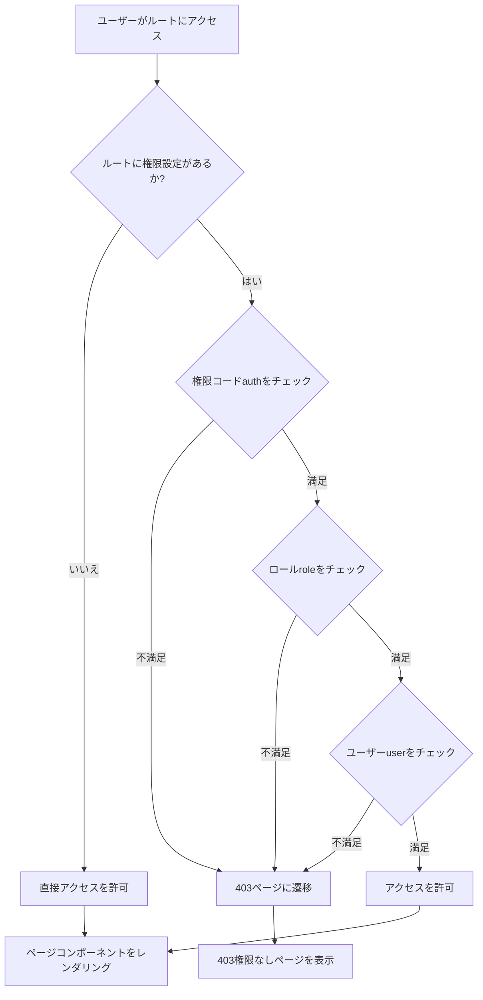
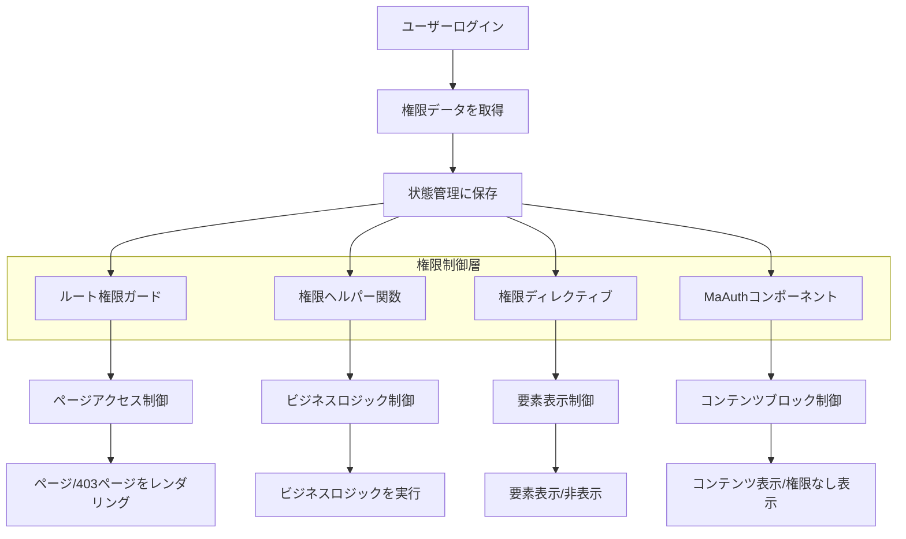

# MineAdmin 権限制御システム

## 概要

MineAdminは完全なフロントエンド権限制御システムを提供し、きめ細かい権限管理を実現します。権限制御は次の2つのレベルに分かれています。

:::tip 権限アーキテクチャの概要
- **ルートレベル権限**: バックエンドから返されるメニューデータに基づいてページアクセス権限を制御
- **コンテンツレベル権限**: ヘルパー関数、ディレクティブ、コンポーネントを使用してページコンテンツの表示と非表示を制御

権限システムはバックエンドHyperfフレームワークと深く統合され、フロントエンドとバックエンドの権限制御の一貫性を確保します。
:::

### 権限タイプ

MineAdminは3つのきめ細かい権限制御をサポートします。

| 権限タイプ | 判断基準 | 適用シナリオ | 実装方法 |
|---------|---------|---------|---------|
| **権限コード権限** | メニューの `name` フィールド | 機能モジュール権限制御 | 関数、ディレクティブ、コンポーネント |
| **ロール権限** | ロールの `code` フィールド | 職責ベースの権限制御 | 関数、ディレクティブ |
| **ユーザー権限** | ユーザーの `username` フィールド | 特定ユーザー権限制御 | 関数、ディレクティブ |

::: info 実装原理
権限システムは、ユーザーログイン後に取得した権限データに基づき、現在のユーザーが持つ権限コード、ロールコード、ユーザー識別子を比較して特定の機能へのアクセス権限を判断します。権限データはフロントエンドの状態管理に保存され、効率的な権限検証を実現します。
:::

## 権限ヘルパー関数

### 関数のインポートと基本的な使い方

MineAdminは3つのコア権限判断関数を提供し、`web/src/utils/permission/` ディレクトリにあります。

```javascript
// 権限コードチェック関数
import hasAuth from '@/utils/permission/hasAuth'
// ロールチェック関数
import hasRole from '@/utils/permission/hasRole'
// ユーザーチェック関数
import hasUser from '@/utils/permission/hasUser'
```

::: tip 関数の場所について
**ソースパス**:
- GitHub: `https://github.com/mineadmin/mineadmin/tree/master/web/src/utils/permission/`
- ローカル開発: `/web/src/utils/permission/`

これらの関数はグローバルに登録されており、コンポーネント内で直接呼び出すことができます。
:::

### ビジネスロジックでの使用

```vue
<script setup>
// 権限コード検証 - 単一権限または権限配列をサポート
if (hasAuth('user:list') || hasAuth(['user:list', 'user:create'])) {
  // ユーザー管理権限検証通過
  console.log('ユーザー管理権限を持っています')
}

// ロール検証 - 単一ロールまたはロール配列をサポート
if (hasRole('SuperAdmin') || hasRole(['admin', 'manager'])) {
  // 管理者ロール検証通過
  console.log('管理者権限を持っています')
}

// ユーザー検証 - 単一ユーザー名またはユーザー名配列をサポート
if (hasUser('admin') || hasUser(['admin', 'root'])) {
  // 特定ユーザー検証通過
  console.log('特定ユーザー検証通過')
}

// 複合権限判断例
const canManageUsers = hasAuth(['user:list', 'user:create']) && hasRole('admin')
if (canManageUsers) {
  // 権限コードとロールの両方を満たす
}
</script>
```

### テンプレートでの使用

```vue
<script setup>
// 権限判断関数をインポート
import hasAuth from '@/utils/permission/hasAuth'
import hasRole from '@/utils/permission/hasRole'
import hasUser from '@/utils/permission/hasUser'
</script>

<template>
  <div>
    <!-- 権限コード検証 -->
    <div v-if="hasAuth('user:list') || hasAuth(['user:list', 'user:create'])">
      <el-button type="primary">ユーザー管理</el-button>
    </div>

    <!-- ロール検証 -->
    <div v-if="hasRole('SuperAdmin') || hasRole(['admin', 'manager'])">
      <el-button type="danger">システム設定</el-button>
    </div>

    <!-- ユーザー検証 -->
    <div v-if="hasUser('admin') || hasUser(['root', 'administrator'])">
      <el-button type="warning">高度な機能</el-button>
    </div>

    <!-- 複合条件検証 -->
    <div v-if="hasAuth('role:manage') && hasRole('admin')">
      <el-button>ロール管理</el-button>
    </div>
  </div>
</template>
```

### 関数パラメータの説明

すべての権限関数は以下の2つのパラメータ形式をサポートします。

```javascript
// 文字列形式 - 単一権限チェック
hasAuth('user:list')
hasRole('admin')
hasUser('admin')

// 配列形式 - 複数権限チェック（ORロジック）
hasAuth(['user:list', 'user:create', 'user:edit'])
hasRole(['admin', 'manager', 'supervisor'])
hasUser(['admin', 'root', 'system'])
```

::: warning 注意事項
- 配列パラメータは **OR ロジック** を使用します。いずれかの条件を満たせば `true` を返します。
- **AND ロジック** が必要な場合は、複数の関数呼び出しを組み合わせてください： `hasAuth('a') && hasAuth('b')`
- 権限コードは `モジュール:操作` の命名規則（例：`user:list`、`role:create`）を推奨します。
:::

### ルート権限パラメータ

権限関数はオプションの第2パラメータ `checkRoute` をサポートし、ルート権限も同時にチェックするかどうかを指定します。

```javascript
// 第2パラメータのデフォルトは false で、機能権限のみをチェック
hasAuth('user:list', false)

// true に設定すると、ルート権限も同時にチェック
hasAuth('user:list', true)
```

## 権限ディレクティブ

MineAdminは3つの権限ディレクティブを提供し、テンプレート内の権限制御を簡素化します。ディレクティブは `web/src/directives/permission/` ディレクトリにあります。

::: tip ディレクティブソースコードの場所
**GitHub パス**:
- `https://github.com/mineadmin/mineadmin/tree/master/web/src/directives/permission/auth/`
- `https://github.com/mineadmin/mineadmin/tree/master/web/src/directives/permission/role/`
- `https://github.com/mineadmin/mineadmin/tree/master/web/src/directives/permission/user/`

**ローカルパス**: `/web/src/directives/permission/`
:::

### ディレクティブの使用

```vue
<template>
  <div>
    <!-- 権限コードディレクティブ - 文字列と配列をサポート -->
    <div v-auth="'user:list'">
      単一権限コード制御
    </div>
    <div v-auth="['user:list', 'user:create']">
      複数権限コード制御（いずれかを満たせばOK）
    </div>

    <!-- ロールディレクティブ -->
    <div v-role="'admin'">
      単一ロール制御
    </div>
    <div v-role="['admin', 'manager']">
      複数ロール制御（いずれかを満たせばOK）
    </div>

    <!-- ユーザーディレクティブ -->
    <div v-user="'admin'">
      単一ユーザー制御
    </div>
    <div v-user="['admin', 'root']">
      複数ユーザー制御（いずれかを満たせばOK）
    </div>

    <!-- 実際の業務シナリオ例 -->
    <el-button v-auth="'user:create'" type="primary">
      ユーザー追加
    </el-button>

    <el-button v-role="'SuperAdmin'" type="danger">
      データ削除
    </el-button>

    <div v-auth="['log:operation', 'log:login']" class="log-panel">
      ログ表示パネル
    </div>
  </div>
</template>
```

### ディレクティブ vs 関数比較

| 方式 | 利点 | 適用シナリオ | 例 |
|------|------|----------|------|
| **ディレクティブ方式** | 簡潔で直感的、要素の表示/非表示を自動制御 | シンプルな権限制御、静的権限チェック | `v-auth="'user:list'"` |
| **関数方式** | 柔軟性が高く、複雑な論理判断をサポート | ビジネスロジック内の権限判断、動的権限チェック | `v-if="hasAuth('a') && hasRole('b')"` |

::: warning ディレクティブ使用上の注意事項
- ディレクティブは **OR ロジック** を使用し、配列内のいずれかの条件を満たせば要素を表示
- ディレクティブはDOM要素の表示/非表示を直接制御し、権限がない場合は要素はレンダリングされません
- 複雑な権限ロジックの組み合わせは、ディレクティブではなく関数方式の使用を推奨
:::

## MaAuth 権限コンポーネント

### コンポーネント紹介

`MaAuth` コンポーネントはMineAdminが提供する権限制御コンポーネントで、広範囲のコンテンツ権限制御に適しています。関数やディレクティブと比較して、コンポーネント方式は複雑な権限表示ロジックに適しています。

::: info コンポーネントソースコードの場所
**GitHub パス**: `https://github.com/mineadmin/mineadmin/tree/master/web/src/components/ma-auth/index.vue`

**ローカルパス**: `/web/src/components/ma-auth/index.vue`

このコンポーネントはグローバルに登録されており、任意のVueコンポーネントで直接使用でき、手動インポートは不要です。
:::

### 基本的な使用

```vue
<template>
  <!-- 単一権限制御 -->
  <ma-auth :value="'user:list'">
    <div class="user-management">
      <h3>ユーザー管理パネル</h3>
      <p>ユーザーリスト表示権限を持っています</p>
    </div>
  </ma-auth>

  <!-- 複数権限制御（いずれかの権限を満たせば表示） -->
  <ma-auth :value="['user:list', 'user:create', 'user:edit']">
    <div class="user-operations">
      <el-button type="primary">ユーザー追加</el-button>
      <el-button type="success">ユーザー編集</el-button>
      <el-button type="danger">ユーザー削除</el-button>
    </div>
  </ma-auth>
</template>
```

### 権限がない場合の表示

コンポーネントは `#notAuth` スロットを提供し、権限がない場合の表示内容をカスタマイズできます。

```vue
<template>
  <ma-auth :value="['admin:system', 'admin:config']">
    <!-- 権限がある場合の表示内容 -->
    <div class="admin-panel">
      <h2>システム管理</h2>
      <el-form>
        <el-form-item label="システム設定">
          <el-input placeholder="設定項目" />
        </el-form-item>
      </el-form>
    </div>

    <!-- 権限がない場合の表示内容 -->
    <template #notAuth>
      <el-alert
        title="権限不足"
        description="システム管理権限がありません。管理者に連絡して関連権限を申請してください"
        type="warning"
        :closable="false"
        show-icon
      />
    </template>
  </ma-auth>
</template>
```

### 高度な使い方

#### ネストされた権限制御

```vue
<template>
  <ma-auth :value="'module:access'">
    <!-- モジュールレベルの権限 -->
    <div class="module-container">
      <h2>業務モジュール</h2>

      <!-- 機能レベルの権限 -->
      <ma-auth :value="'feature:read'">
        <div class="read-section">
          <p>読み取り専用コンテンツエリア</p>
        </div>
        <template #notAuth>
          <p class="text-gray">読み取り権限がありません</p>
        </template>
      </ma-auth>

      <!-- 操作レベルの権限 -->
      <ma-auth :value="['feature:create', 'feature:edit']">
        <div class="action-buttons">
          <el-button>作成</el-button>
          <el-button>編集</el-button>
        </div>
        <template #notAuth>
          <p class="text-muted">操作権限がありません</p>
        </template>
      </ma-auth>
    </div>

    <template #notAuth>
      <el-empty description="このモジュールにアクセスする権限がありません" />
    </template>
  </ma-auth>
</template>
```

#### 他のコンポーネントとの組み合わせ

```vue
<template>
  <!-- テーブル操作権限制御 -->
  <el-table :data="tableData">
    <el-table-column label="名前" prop="name" />
    <el-table-column label="操作">
      <template #default="{ row }">
        <ma-auth :value="'user:edit'">
          <el-button size="small" @click="editUser(row)">編集</el-button>
          <template #notAuth>
            <el-button size="small" disabled>権限なし</el-button>
          </template>
        </ma-auth>

        <ma-auth :value="'user:delete'">
          <el-button size="small" type="danger" @click="deleteUser(row)">
            削除
          </el-button>
        </ma-auth>
      </template>
    </el-table-column>
  </el-table>
</template>
```

### コンポーネントパラメータ

| パラメータ | タイプ | デフォルト値 | 説明 |
|------|------|--------|------|
| `value` | `string \| string[]` | `[]` | 検証する権限コード、文字列または配列をサポート |

### コンポーネントスロット

| スロット名 | 説明 | パラメータ |
|--------|------|------|
| `default` | 権限がある場合の表示内容 | - |
| `notAuth` | 権限がない場合の表示内容 | - |

### コンポーネント vs 他の方式比較

| 方式 | 適用シナリオ | 利点 | 欠点 |
|------|----------|------|------|
| **MaAuth コンポーネント** | 大規模コンテンツ権限制御、権限なし表示が必要な場合 | スロットカスタマイズ対応、コード構造が明確 | やや冗長 |
| **権限ディレクティブ** | シンプルな要素権限制御 | 簡潔で直感的 | 権限なし表示をサポートしない |
| **権限関数** | 複雑なビジネスロジック権限判断 | 柔軟性が最も高い | 表示ロジックを手動で処理する必要がある |

## ルート権限制御

### 静的ルート権限設定

MineAdminはルートレベルでの権限制御をサポートし、ルートの `meta` 属性に権限パラメータを設定することでアクセス制御を実現します。

::: tip ルート権限メカニズム
**制御範囲**: コンポーネントページを持つルートのみに影響し、ボタンなどのページ内要素は含まない

**チェックタイミング**: ルート遷移時に自動的に権限をチェック

**権限検証失敗時**: 403ページを表示

**ソースコードの場所**: `/web/src/router/` - ルート設定と権限ガードロジック
:::

### ルート権限設定構文

ルート設定ファイルで、`meta` オブジェクトを介して権限パラメータを設定します。

```javascript
// ルート設定例
const routes = [
  {
    path: '/user',
    name: 'User',
    component: () => import('@/views/user/index.vue'),
    meta: {
      // 権限コード制御 - ユーザー管理権限が必要
      auth: ['user:list', 'user:manage'],

      // ロール制御 - 管理者またはスーパー管理者ロールが必要
      role: ['admin', 'SuperAdmin'],

      // ユーザー制御 - 特定のユーザーのみアクセス可能
      user: ['admin', 'root']
    }
  },
  {
    path: '/system',
    name: 'System',
    component: () => import('@/views/system/index.vue'),
    meta: {
      // 権限コードのみ必要
      auth: ['system:config']
    }
  },
  {
    path: '/public',
    name: 'Public',
    component: () => import('@/views/public/index.vue'),
    meta: {
      // 権限パラメータを設定しないか、空の配列に設定することで権限制限なし
      auth: []
    }
  }
]
```

### 権限パラメータの説明

| パラメータ | タイプ | 説明 | 論理関係 |
|------|------|------|----------|
| `auth` | `string[]` | 権限コード配列、メニュー権限に基づく制御 | OR（いずれかの権限を満たせばOK） |
| `role` | `string[]` | ロールコード配列、ユーザーロールに基づく制御 | OR（いずれかのロールを満たせばOK） |
| `user` | `string[]` | ユーザー名配列、特定ユーザーに基づく制御 | OR（いずれかのユーザーを満たせばOK） |

::: warning 権限設定の注意事項
- すべての権限パラメータのタイプは `string[]`（文字列配列）である必要があります
- 同じルートに複数の権限タイプを同時に設定でき、関係は **AND ロジック** です
- 権限パラメータを設定しないか、空の配列 `[]` に設定すると権限制限なしを意味します
- 権限検証に失敗すると、自動的に403ページに遷移します
:::

### 実際の適用シナリオ

#### ユーザー管理モジュール

```javascript
// ユーザー管理関連ルート
const userRoutes = [
  {
    path: '/user',
    name: 'UserManagement',
    component: () => import('@/views/user/index.vue'),
    meta: {
      title: 'ユーザー管理',
      auth: ['user:list'] // ユーザー一覧権限が必要
    },
    children: [
      {
        path: 'create',
        name: 'UserCreate',
        component: () => import('@/views/user/create.vue'),
        meta: {
          title: 'ユーザー追加',
          auth: ['user:create'] // ユーザー作成権限が必要
        }
      },
      {
        path: 'edit/:id',
        name: 'UserEdit',
        component: () => import('@/views/user/edit.vue'),
        meta: {
          title: 'ユーザー編集',
          auth: ['user:edit'] // ユーザー編集権限が必要
        }
      }
    ]
  }
]
```

#### システム管理モジュール

```javascript
// システム管理 - 複数権限検証が必要
const systemRoutes = [
  {
    path: '/system',
    name: 'SystemManagement',
    component: () => import('@/views/system/index.vue'),
    meta: {
      title: 'システム管理',
      auth: ['system:config'], // システム設定権限が必要
      role: ['SuperAdmin']     // かつスーパー管理者ロールが必要
    }
  },
  {
    path: '/logs',
    name: 'SystemLogs',
    component: () => import('@/views/logs/index.vue'),
    meta: {
      title: 'システムログ',
      auth: ['log:operation', 'log:login'], // 操作ログまたはログインログ権限が必要
      role: ['admin', 'auditor']            // かつ管理者または監査者ロールが必要
    }
  }
]
```

#### 特殊権限制御

```javascript
// 開発デバッグページ - 特定ユーザーのみアクセス可能
const devRoutes = [
  {
    path: '/dev-tools',
    name: 'DevTools',
    component: () => import('@/views/dev/index.vue'),
    meta: {
      title: '開発ツール',
      user: ['admin', 'developer'], // 管理者と開発者ユーザーのみアクセス可能
      auth: ['dev:tools']          // かつ開発ツール権限が必要
    }
  }
]
```

### 権限検証フロー



### 権限ガードの実装

MineAdminのルート権限ガードロジックはルート設定内にあり、コアの実装ロジックは次のとおりです。

```javascript
// ルートガード例（簡略版）
router.beforeEach((to, from, next) => {
  const { auth, role, user } = to.meta || {}

  // 権限制限なし、そのまま通過
  if (!auth?.length && !role?.length && !user?.length) {
    return next()
  }

  // 権限コードをチェック
  if (auth?.length && !hasAuth(auth)) {
    return next({ name: '403' })
  }

  // ロールをチェック
  if (role?.length && !hasRole(role)) {
    return next({ name: '403' })
  }

  // ユーザーをチェック
  if (user?.length && !hasUser(user)) {
    return next({ name: '403' })
  }

  next()
})
```

## ベストプラクティス

### 権限粒度の推奨事項

1. **ページレベル権限**: ルート meta 設定を使用
2. **機能レベル権限**: MaAuth コンポーネントを使用
3. **要素レベル権限**: 権限ディレクティブを使用
4. **ロジックレベル権限**: 権限関数を使用

### 権命名規則

```javascript
// 推奨される権限コード命名規則 - モジュール:操作 形式
const permissionCodes = [
  'user:list',      // ユーザー一覧
  'user:create',    // ユーザー作成
  'user:edit',      // ユーザー編集
  'user:delete',    // ユーザー削除
  'role:manage',    // ロール管理
  'system:config',  // システム設定
  'log:operation',  // 操作ログ
  'log:login'       // ログインログ
]

// ロール命名の推奨事項
const roleCodes = [
  'SuperAdmin',     // スーパー管理者
  'admin',          // 管理者
  'manager',        // マネージャー
  'operator',       // オペレーター
  'viewer'          // ビューアー
]
```

### パフォーマンス最適化の推奨事項

1. **深いネストを避ける**: 権限コンポーネントの過度なネストはパフォーマンスに影響を与える可能性があります
2. **適切なキャッシュ**: 権限データは適切にキャッシュし、頻繁なリクエストを避けてください
3. **オンデマンドロード**: ルートの遅延ロードと組み合わせて、権限のあるページコンポーネントのみをロード
4. **権限事前チェック**: データリクエスト前に権限事前チェックを実行し、無効なリクエストを回避

### 一般的な問題と解決策

#### 1. 権限検証が機能しない

**問題**: 権限関数が `false` を返すが、実際には権限があるはず

**解決策**:
- ユーザーのログイン状態と権限データが正しくロードされているか確認
- 権限コード、ロールコード、ユーザー名のスペルが正しいか確認
- ブラウザのコンソールに関連エラーメッセージがないか確認

#### 2. 403 ページが頻繁に表示される

**問題**: ユーザーがページにアクセスするときに403エラーページが頻繁に表示される

**解決策**:
- ルート meta 設定が厳しすぎないか確認
- ユーザーのロールと権限の割り当てが適切か確認
- デフォルト権限の追加または権限要件の低減を検討

#### 3. 権限コンポーネントが機能しない

**問題**: MaAuth コンポーネントがコンテンツ表示を正しく制御しない

**解決策**:
```vue
<!-- 正しいプロパティ名を確認 -->
<ma-auth :value="['user:list']"> <!-- 正しい: :value を使用 -->
  コンテンツ
</ma-auth>

<!-- 誤った例 -->
<ma-auth :auth="['user:list']">   <!-- 誤り: プロパティ名が違う -->
  コンテンツ
</ma-auth>
```

## 権限システムアーキテクチャ図



### コア特性

- **多層権限制御**: ルートから要素までの包括的な権限管理
- **3つの権限タイプ**: 権限コード、ロール、ユーザーの3つの粒度の権限検証
- **複数の実装方法**: 関数、ディレクティブ、コンポーネントの3つの使用方法で異なるシナリオに対応
- **簡単に統合**: Vue 3 と Element Plus と深く統合され、使いやすい

### ソースコードの場所まとめ

| 機能 | GitHub パス | ローカルパス |
|------|-------------|----------|
| 権限関数 | `https://github.com/mineadmin/mineadmin/tree/master/web/src/utils/permission/` | `/web/src/utils/permission/` |
| 権限ディレクティブ | `https://github.com/mineadmin/mineadmin/tree/master/web/src/directives/permission/` | `/web/src/directives/permission/` |
| 権限コンポーネント | `https://github.com/mineadmin/mineadmin/tree/master/web/src/components/ma-auth/` | `/web/src/components/ma-auth/` |
| ルート設定 | `https://github.com/mineadmin/mineadmin/tree/master/web/src/router/` | `/web/src/router/` |

### 選択の推奨事項

さまざまなアプリケーションシナリオに応じて適切な権限制御方法を選択してください。

- **ページレベル制御** → ルート meta 設定
- **大規模コンテンツ制御** → MaAuth コンポーネント
- **シンプルな要素制御** → 権限ディレクティブ
- **複雑なビジネスロジック** → 権限関数

これらの権限制御ツールを適切に使用することで、安全で保守性の高いフロントエンド権限管理システムを構築できます。