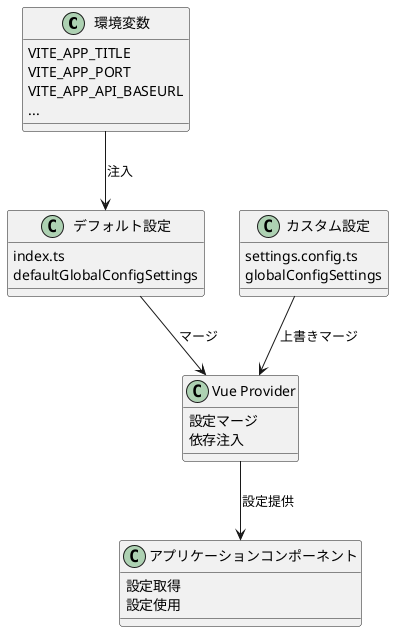
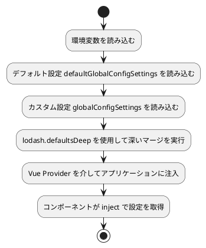

# システムパラメータ設定

MineAdmin は強力で柔軟なシステム設定機構を提供しており、多階層の設定マージ、環境変数統合、ランタイム時の動的変更をサポートしています。このドキュメントでは、システムパラメータの管理と設定方法について詳しく説明します。

## 設定システム概要

::: tip 設定ファイル
- **デフォルト設定ファイル**: `src/provider/settings/index.ts` - システムデフォルト設定
- **カスタム設定ファイル**: `src/provider/settings/settings.config.ts` - ユーザーカスタム設定
- **環境変数ファイル**: `.env.development` / `.env.production` - 環境関連設定

設定を変更する場合は、カスタマイズしたい設定項目を `settings.config.ts` ファイルにコピーして修正してください。システムが自動的に設定をマージします。
:::

## 設定システムアーキテクチャ



## 設定読み込みフロー



## コア設定の詳細

### アプリケーション基本設定 (app)

| 設定項目 | 型 | デフォルト値 | 説明 |
|--------|------|--------|------|
| `colorMode` | `'lightMode' \| 'darkMode' \| 'autoMode'` | `'autoMode'` | カラーモード、ライト/ダーク/自動モードをサポート |
| `useLocale` | `string` | `'zh_CN'` | システム言語、国際化をサポート |
| `whiteRoute` | `string[]` | `['login']` | ホワイトリストルート、認証不要でアクセス可能 |
| `layout` | `'classic' \| 'modern' \| 'minimal'` | `'classic'` | レイアウトモード |
| `pageAnimate` | `string` | `'ma-slide-down'` | ページ切り替えアニメーション効果 |
| `enableWatermark` | `boolean` | `false` | ウォーターマーク機能を有効にするか |
| `primaryColor` | `string` | `'#2563EB'` | テーマカラー |
| `asideDark` | `boolean` | `false` | サイドバーにダークテーマを使用するか |
| `showBreadcrumb` | `boolean` | `true` | パンくずリストを表示するか |
| `loadUserSetting` | `boolean` | `true` | ユーザー個人設定を読み込むか |
| `watermarkText` | `string` | `import.meta.env.VITE_APP_TITLE` | ウォーターマークテキスト内容 |

**設定例:**
```typescript
app: {
  colorMode: 'autoMode',              // 自動テーマ切り替え
  useLocale: 'zh_CN',                 // 簡体字中国語を使用
  whiteRoute: ['login', 'register'],  // ログインと登録ページは認証不要
  layout: 'classic',                  // クラシックレイアウト
  pageAnimate: 'ma-fade-in',         // フェードインアニメーション効果
  enableWatermark: true,             // ウォーターマークを有効化
  primaryColor: '#1890ff',           // カスタムテーマカラー
  asideDark: true,                   // サイドバーダークテーマ
  showBreadcrumb: true,              // パンくずリストを表示
  loadUserSetting: true,             // ユーザー設定を読み込み
  watermarkText: 'my system',        // カスタムウォーターマークテキスト
}
```

### ウェルカムページ設定 (welcomePage)

| 設定項目 | 型 | デフォルト値 | 説明 |
|--------|------|--------|------|
| `name` | `string` | `'welcome'` | ルート名 |
| `path` | `string` | `'/welcome'` | ルートパス |
| `title` | `string` | `'ウェルカムページ'` | ページタイトル |
| `icon` | `string` | `'icon-park-outline:jewelry'` | アイコン |

### メインサイドバー設定 (mainAside)

| 設定項目 | 型 | デフォルト値 | 説明 |
|--------|------|--------|------|
| `showIcon` | `boolean` | `true` | アイコンを表示するか |
| `showTitle` | `boolean` | `true` | タイトルを表示するか |
| `enableOpenFirstRoute` | `boolean` | `false` | 最初のルートを自動的に開くか |

### サブサイドバー設定 (subAside)

| 設定項目 | 型 | デフォルト値 | 説明 |
|--------|------|--------|------|
| `showIcon` | `boolean` | `true` | アイコンを表示するか |
| `showTitle` | `boolean` | `true` | タイトルを表示するか |
| `fixedAsideState` | `boolean` | `false` | サイドバーの状態を固定するか |
| `showCollapseButton` | `boolean` | `true` | 折り畳みボタンを表示するか |

### タブバー設定 (tabbar)

| 設定項目 | 型 | デフォルト値 | 説明 |
|--------|------|--------|------|
| `enable` | `boolean` | `true` | タブバーを有効にするか |
| `mode` | `'rectangle' \| 'round' \| 'card'` | `'rectangle'` | タブバースタイル |

### 著作権情報設定 (copyright)

| 設定項目 | 型 | デフォルト値 | 説明 |
|--------|------|--------|------|
| `enable` | `boolean` | `true` | 著作権情報を表示するか |
| `dates` | `string` | `useDayjs().format('YYYY')` | 著作権年 |
| `company` | `string` | `'MineAdmin Team'` | 会社名 |
| `website` | `string` | `'https://www.mineadmin.com'` | 公式サイトURL |
| `putOnRecord` | `string` | `'豫ICP备00000000号-1'` | 備案番号 |

## 環境変数設定

### 開発環境設定 (.env.development)

```bash
# ページタイトル
VITE_APP_TITLE = MineAdmin開発環境

# 開発サーバーポート
VITE_APP_PORT = 2888

# アプリケーションルートパス
VITE_APP_ROOT_BASE = /

# API インターフェースアドレス
VITE_APP_API_BASEURL = http://127.0.0.1:9501

# ルートモード：hash または history
VITE_APP_ROUTE_MODE = hash

# ローカルストレージプレフィックス
VITE_APP_STORAGE_PREFIX = mine_

# プロキシを有効にするか
VITE_OPEN_PROXY = true

# プロキシプレフィックス
VITE_PROXY_PREFIX = /dev

# vConsole（モバイルデバッグ）を有効にするか
VITE_OPEN_vCONSOLE = false

# 開発者ツールを有効にするか
VITE_OPEN_DEVTOOLS = true
```

### 本番環境設定 (.env.production)

```bash
# ページタイトル
VITE_APP_TITLE = MineAdmin

# 本番サーバーポート
VITE_APP_PORT = 80

# アプリケーションルートパス
VITE_APP_ROOT_BASE = /admin/

# API インターフェースアドレス
VITE_APP_API_BASEURL = https://api.yourdomain.com

# ルートモード
VITE_APP_ROUTE_MODE = history

# ローカルストレージプレフィックス
VITE_APP_STORAGE_PREFIX = mine_prod_

# プロキシを無効化
VITE_OPEN_PROXY = false

# sourcemap を生成するか
VITE_BUILD_SOURCEMAP = false

# パッケージ圧縮方式
VITE_BUILD_COMPRESS = gzip,brotli

# ビルド後にアーカイブを生成
VITE_BUILD_ARCHIVE = 
```

## カスタム設定例

`src/provider/settings/settings.config.ts` ファイルにカスタム設定を追加:

```typescript
import type { SystemSettings } from '#/global'

const globalConfigSettings: SystemSettings.all = {
  // アプリケーション設定
  app: {
    colorMode: 'lightMode',           // 強制的にライトモード
    useLocale: 'en_US',               // 英語を使用
    primaryColor: '#ff4757',          // カスタム赤色テーマ
    enableWatermark: true,            // ウォーターマークを有効化
    watermarkText: '内部システム',    // カスタムウォーターマークテキスト
    pageAnimate: 'ma-fade-in',        // フェードインアニメーション
  },
  
  // ウェルカムページ設定
  welcomePage: {
    name: 'dashboard',
    path: '/dashboard',
    title: 'ダッシュボード',
    icon: 'mdi:view-dashboard',
  },
  
  // サイドバー設定
  mainAside: {
    showIcon: true,
    showTitle: false,                 // メインメニュータイトルを非表示
    enableOpenFirstRoute: true,       // 最初のルートを自動的に開く
  },
  
  // タブバー設定
  tabbar: {
    enable: true,
    mode: 'card',                     // カードモード
  },
  
  // 著作権情報
  copyright: {
    enable: true,
    company: 'my company',
    website: 'https://mycompany.com',
    putOnRecord: '京ICP备12345678号',
  },
}

export default globalConfigSettings
```

## 高度な設定テクニック

### 条件付き設定

環境やデバイスタイプに応じて異なる設定:

```typescript
const globalConfigSettings: SystemSettings.all = {
  app: {
    // 環境変数に基づいてテーマを決定
    colorMode: import.meta.env.MODE === 'development' ? 'autoMode' : 'lightMode',
    
    // モバイル端末ではパンくずリストを非表示
    showBreadcrumb: !/Mobile|Android|iPhone/i.test(navigator.userAgent),
    
    // 本番環境ではウォーターマークを無効化
    enableWatermark: import.meta.env.MODE === 'development',
    
    // 動的に API アドレスを設定
    watermarkText: import.meta.env.VITE_APP_TITLE || 'システム',
  },
}
```

### モジュール化設定

大規模な設定を複数のモジュールに分割:

```typescript
// config/app.config.ts
export const appConfig = {
  colorMode: 'autoMode',
  useLocale: 'zh_CN',
  primaryColor: '#2563EB',
}

// config/layout.config.ts
export const layoutConfig = {
  mainAside: {
    showIcon: true,
    showTitle: true,
  },
  subAside: {
    fixedAsideState: false,
    showCollapseButton: true,
  },
}

// settings.config.ts
import { appConfig } from './config/app.config'
import { layoutConfig } from './config/layout.config'

const globalConfigSettings: SystemSettings.all = {
  app: appConfig,
  ...layoutConfig,
}
```

### ランタイム時の設定変更

アプリケーション実行中に動的に設定を変更:

```typescript
// コンポーネント内で使用
import { inject, reactive } from 'vue'
import type { SystemSettings } from '#/global'

export default defineComponent({
  setup() {
    const settings = inject('defaultSetting') as SystemSettings.all
    
    // 動的にテーマを切り替え
    const switchTheme = (mode: 'lightMode' | 'darkMode') => {
      settings.app.colorMode = mode
    }
    
    // 動的にテーマカラーを変更
    const changePrimaryColor = (color: string) => {
      settings.app.primaryColor = color
    }
    
    return {
      settings,
      switchTheme,
      changePrimaryColor,
    }
  },
})
```

## 設定のベストプラクティス

### 1. バージョン管理

```bash
# .gitignore ファイル
.env.local
.env.*.local
src/provider/settings/settings.config.local.ts
```

### 2. 型安全

TypeScript を活用して設定の型安全性を確保:

```typescript
import type { SystemSettings } from '#/global'

// 型アサーションを使用して設定の正確性を保証
const globalConfigSettings: SystemSettings.all = {
  app: {
    // TypeScript が型チェックと自動補完を提供
    colorMode: 'lightMode', // 定義済みの値のみ
    primaryColor: '#ffffff', // 文字列である必要あり
  },
} satisfies SystemSettings.all
```

### 3. 設定バリデーション

設定読み込み時にバリデーションを追加:

```typescript
import { z } from 'zod'

const configSchema = z.object({
  app: z.object({
    colorMode: z.enum(['lightMode', 'darkMode', 'autoMode']),
    primaryColor: z.string().regex(/^#[0-9A-Fa-f]{6}$/),
  }),
})

// 設定を検証
const validateConfig = (config: unknown) => {
  try {
    return configSchema.parse(config)
  } catch (error) {
    console.error('設定バリデーション失敗:', error)
    throw new Error('設定形式が正しくありません')
  }
}
```

## よくある質問とトラブルシューティング

### Q: 設定を変更しても反映されない？

**A:** 以下の点を確認してください:

1. **設定ファイルのパスが正しいか**
   ```bash
   # 正しい設定ファイルパス
   src/provider/settings/settings.config.ts
   ```

2. **設定の構文が正しいか**
   ```typescript
   // ❌ エラー: 構文エラー
   const config = {
     app: {
       colorMode: lightMode, // 引用符不足
     }
   }
   
   // ✅ 正しい: 正しい構文
   const config = {
     app: {
       colorMode: 'lightMode',
     }
   }
   ```

3. **開発サーバーを再起動したか**
   ```bash
   pnpm run dev
   ```

### Q: 環境変数が読み取れない？

**A:** 環境変数が `VITE_` で始まっていることを確認:

```bash
# ❌ エラー: VITE_ で始まっていない
APP_TITLE = MineAdmin

# ✅ 正しい: VITE_ で始まる
VITE_APP_TITLE = MineAdmin
```

### Q: 設定の問題をデバッグするには？

**A:** 以下の方法でデバッグ:

```typescript
// コンポーネントで現在の設定を出力
const settings = inject('defaultSetting')
console.log('現在の設定:', settings)

// 環境変数を確認
console.log('環境変数:', import.meta.env)

// 設定マージ結果を確認
import { defaultsDeep } from 'lodash-es'
console.log('マージ後の設定:', defaultsDeep(customConfig, defaultConfig))
```

### Q: 設定が本番環境で反映されない？

**A:** ビルド設定を確認:

1. **環境変数ファイルの確認**
   ```bash
   # 本番環境に対応する環境変数ファイルが必要
   .env.production
   ```

2. **ビルドコマンドの確認**
   ```bash
   # 正しいビルドコマンドを使用
   pnpm run build
   ```

3. **ビルド成果物の検証**
   ```bash
   # ビルド結果をプレビュー
   pnpm run preview
   ```

## 関連リファレンス

- [レイアウト設定](./layout.md) - レイアウトシステム設定の詳細

::: warning 注意事項
- 設定変更後は開発サーバーを再起動する必要があります
- 本番環境の設定変更は再ビルドとデプロイが必要です
- 機密情報は設定ファイルに直接記述せず、環境変数を使用することを推奨します
:::