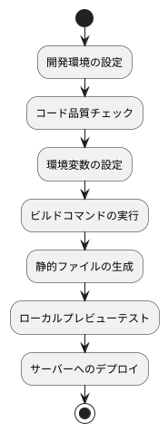

# ビルドとプレビュー

このドキュメントでは、MineAdmin フロントエンドプロジェクトのビルド、プレビュー、およびデプロイメントのプロセスについて詳しく説明します。パフォーマンスの最適化、環境設定、および一般的な問題の解決策が含まれています。

## ビルドプロセスの概要



## ビルド（パッケージング）

### 基本ビルド

プロジェクトの開発が完了したら、本番環境ビルドを実行してサーバーにデプロイします。

```bash
# ビルドコマンドの実行
pnpm run build
```

ビルドが成功すると、プロジェクトルートの `./web` ディレクトリに `dist` フォルダが生成され、パッケージ化されたすべての静的ファイルが含まれます。

### ビルド前の確認

ビルドの品質を確保するために、ビルド前にコード品質チェックを実行することをお勧めします。

```bash
# 完全なコード品質チェック
pnpm run lint

# または個別に実行
pnpm run lint:tsc      # TypeScript 型チェック
pnpm run lint:eslint   # ESLint コード規約チェック
pnpm run lint:stylelint # スタイルコードチェック
```

### 環境変数の設定

#### ベースパスの設定

::: warning 重要な設定
アクセスURLがドメインのルートでない場合は、`VITE_APP_ROOT_BASE` を正しく設定する必要があります。
:::

```bash
# ドメインルートへのデプロイ：https://www.example.com/
VITE_APP_ROOT_BASE = /

# サブパスへのデプロイ：https://www.example.com/app/
VITE_APP_ROOT_BASE = /app/

# マルチレベルサブパス：https://www.example.com/admin/system/
VITE_APP_ROOT_BASE = /admin/system/
```

#### 本番環境変数

`.env.production` ファイルで本番環境変数を設定します。

```bash
# API サービスアドレス
VITE_APP_API_BASEURL = http://hyperf:9501

# プロキシプレフィックス
VITE_PROXY_PREFIX = /prod

# Source Map を生成するかどうか（本番環境では無効にすることを推奨）
VITE_BUILD_SOURCEMAP = false

# 圧縮設定
VITE_BUILD_COMPRESS = gzip,brotli

# パッケージアーカイブ（オプション）
VITE_BUILD_ARCHIVE = 
```

## ローカルプレビュー

### ビルド結果のプレビュー

ビルドが完了したら、ローカルサーバーでプレビューしてプロジェクトが正常に動作することを確認します。

```bash
# プレビューサーバーの起動
pnpm run serve
```

プレビューサーバーは HTTP サービスを起動し、自動的にブラウザを開いてビルド後のプロジェクトにアクセスします。

### プレビュー設定の説明

プレビューサービスは `http-server` ツールを使用し、デフォルトの設定は以下の通りです。
- サービスディレクトリ：`./dist`
- ブラウザを自動的に開く：`-o` パラメータ
- アクセスアドレス：通常 `http://localhost:8080`

### E2E テスト

プレビュー段階でエンドツーエンドテストを実行できます。

```bash
# E2E テストの実行
pnpm run test:e2e
```

## ビルドの最適化

### 圧縮設定

MineAdmin はファイルサイズを削減するために複数の圧縮アルゴリズムをサポートしています。

```bash
# Gzip 圧縮のみ有効
VITE_BUILD_COMPRESS = gzip

# Brotli 圧縮のみ有効（圧縮率が高い）
VITE_BUILD_COMPRESS = brotli

# 両方の圧縮を有効にする（推奨）
VITE_BUILD_COMPRESS = gzip,brotli
```

::: info 圧縮アルゴリズムの比較
- **Gzip**: 互換性が高く、圧縮率は約 70-80%
- **Brotli**: 圧縮率は約 75-85% ですが、比較的新しいブラウザが必要です
- **推奨**: 両方のアルゴリズムを有効にし、サーバーがクライアントのサポート状況に応じて自動的に選択します
:::

### パフォーマンス最適化のアドバイス

#### 1. Source Map の制御

```bash
# 本番環境では無効にすることを推奨（ビルド速度の向上、ファイルサイズの削減）
VITE_BUILD_SOURCEMAP = false

# 開発段階では有効にできます（デバッグに便利）
VITE_BUILD_SOURCEMAP = true
```

#### 2. コード分割

Vite はデフォルトでコード分割を実行するため、追加の設定は不要です。ビルド後には以下が生成されます。
- `index.[hash].js` - メインエントリファイル
- `vendor.[hash].js` - サードパーティの依存関係
- `[name].[hash].js` - 非同期モジュール

#### 3. リソースの最適化

ビルドプロセスでは自動的に以下が実行されます。
- CSS の圧縮と結合
- 画像リソースの最適化
- フォントファイルの処理
- 静的リソースのハッシュ命名

## デプロイ設定

### Nginx 設定例

異なる圧縮設定に対して、Nginx には対応するモジュールのサポートが必要です。

```nginx
server {
    listen 80;
    server_name your-domain.com;
    root /path/to/dist;
    index index.html;

    # Gzip 圧縮を有効にする
    gzip on;
    gzip_vary on;
    gzip_min_length 1024;
    gzip_types text/plain text/css application/json application/javascript text/xml application/xml application/xml+rss text/javascript;

    # Brotli 圧縮を有効にする（nginx-module-brotli が必要）
    brotli on;
    brotli_comp_level 6;
    brotli_types text/plain text/css application/json application/javascript text/xml application/xml application/xml+rss text/javascript;

    # SPA ルーティングのサポート
    location / {
        try_files $uri $uri/ /index.html;
    }

    # 静的リソースのキャッシュ
    location ~* \.(js|css|png|jpg|jpeg|gif|ico|svg)$ {
        expires 1y;
        add_header Cache-Control "public, immutable";
    }
}
```

### CDN デプロイ

CDN を使用してデプロイする場合は、以下の設定が必要です。

```bash
# CDN ドメイン
VITE_APP_CDN_URL = https://cdn.example.com

# CDN リソースパスを有効にする
VITE_APP_USE_CDN = true
```

## 一般的な問題と解決策

### ビルド失敗

#### 1. TypeScript 型エラー

```bash
# エラーメッセージ例
error TS2307: Cannot find module 'xxx'

# 解決策
pnpm run lint:tsc  # 最初に型エラーを確認
# 型の問題を修正した後に再ビルド
```

#### 2. メモリ不足

```bash
# Node.js のメモリ制限を増やす
NODE_OPTIONS="--max-old-space-size=4096" pnpm run build
```

#### 3. 依存関係の問題

```bash
# 依存関係をクリーンにして再インストール
rm -rf node_modules
rm pnpm-lock.yaml
pnpm install
```

### プレビューの問題

#### 1. API リクエスト失敗

`.env.production` の API アドレス設定を確認します。

```bash
# API アドレスがアクセス可能であることを確認
VITE_APP_API_BASEURL = http://your-api-server:port
```

#### 2. ルーティングアクセスで 404

サーバーが SPA ルーティングをサポートするように設定されていること、またはルーティングモードの設定を確認します。

```bash
# Hash モード（互換性が高い）
VITE_APP_ROUTE_MODE = hash

# History モード（サーバーのサポートが必要）
VITE_APP_ROUTE_MODE = history
```

#### 3. 静的リソースの読み込み失敗

ベースパスの設定を確認します。

```bash
# デプロイパスと一致していることを確認
VITE_APP_ROOT_BASE = /your-app-path/
```

### パフォーマンスの問題

#### 1. ビルド時間が長い

```bash
# 並列ビルドを使用
VITE_BUILD_PARALLEL = true

# 特定のチェックをスキップ（必要な場合のみ使用）
VITE_SKIP_TYPE_CHECK = true
```

#### 2. パッケージサイズが大きい

パッケージサイズを分析します。

```bash
# 分析ツールのインストール
pnpm add -D vite-bundle-analyzer

# ビルド結果の分析
pnpm run build --analyze
```

## 自動デプロイ

### CI/CD 設定例

```yaml
# .github/workflows/deploy.yml
name: Deploy

on:
  push:
    branches: [main]

jobs:
  build-and-deploy:
    runs-on: ubuntu-latest
    
    steps:
    - uses: actions/checkout@v3
    
    - name: Setup Node.js
      uses: actions/setup-node@v3
      with:
        node-version: '18'
        
    - name: Install pnpm
      uses: pnpm/action-setup@v2
      with:
        version: 8
        
    - name: Install dependencies
      run: pnpm install
      
    - name: Lint code
      run: pnpm run lint
      
    - name: Build project
      run: pnpm run build
      
    - name: Deploy to server
      run: |
        # デプロイスクリプト
        rsync -avz ./dist/ user@server:/path/to/deployment/
```