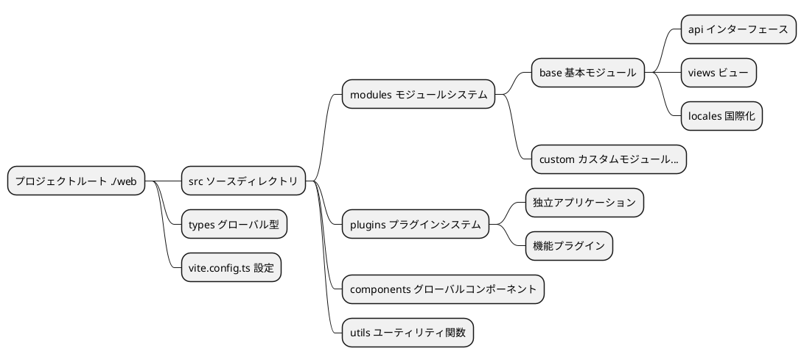
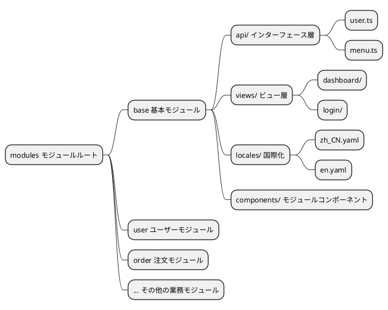
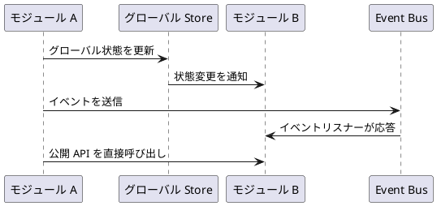
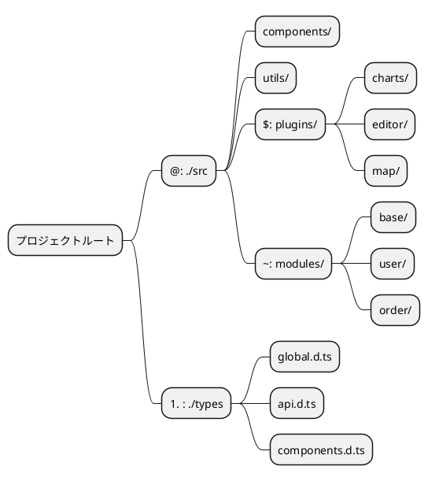
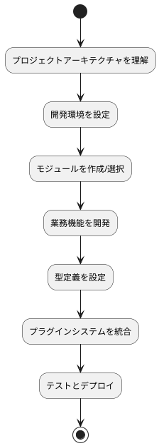

# 基本概念

プロジェクト全体をリファクタリングしました。ここでは、ドキュメントをより深く理解するための基本概念を紹介します。この部分を必ず先に読んでください。

::: tip
以下で説明する内容はすべて、ソースルートの `./web` にある構造に関するものです。
:::

## プロジェクト全体のアーキテクチャ

本プロジェクトは、Vue 3 + TypeScript + Vite に基づくモダンなフロントエンド開発アーキテクチャを採用し、モジュール化・プラグイン化された開発パターンを実現しています。



## グローバル型システム

新バージョンは `TypeScript` で記述されているため、グローバルな型定義は `./types` ディレクトリに格納されています。関連するデータ型構造はここで確認できます。

### 型ファイルの構成

```
./types/
├── api.d.ts          # API関連の型定義
├── components.d.ts   # コンポーネントの型定義
├── global.d.ts       # グローバル型定義
├── modules.d.ts      # モジュール型定義
└── utils.d.ts        # ユーティリティ関数の型定義
```

### 使用例

プロジェクト内ではエイリアス `#` を使用して型を簡単にインポートできます：

```typescript
// API 型のインポート
import type { ApiResponse, UserInfo } from '#/api'

// グローバル型のインポート
import type { MenuConfig, RouteConfig } from '#/global'

// コンポーネント内での使用
interface ComponentProps {
  userInfo: UserInfo
  menuConfig: MenuConfig[]
}
```

### 型定義のベストプラクティス

- **命名規則**：インターフェースや型には PascalCase を使用
- **ファイル構成**：機能モジュールごとに型ファイルを分割
- **型エクスポート**：`export type` を使用して型定義をエクスポート
- **ジェネリクス対応**：適切にジェネリクスを使用して型の再利用性を向上

## モジュール化アーキテクチャ

新バージョンではモジュール分割が行われ、ディレクトリは `./src/modules` です。各モジュールは、所属する業務の `api`、`types`、`locales`、および `ビューファイル` を管理し、業務の完全な分離と独立管理を実現します。

### モジュール構造設計



### 標準モジュールディレクトリ構成

```
./src/modules/[モジュール名]/
├── api/                 # API インターフェース定義
│   ├── user.ts         # ユーザー関連インターフェース
│   ├── menu.ts         # メニュー関連インターフェース
│   └── index.ts        # インターフェースの一括エクスポート
├── components/          # モジュール専用コンポーネント
│   ├── UserForm.vue    # ユーザーフォームコンポーネント
│   └── MenuTree.vue    # メニューツリーコンポーネント
├── locales/            # モジュールの国際化ファイル
│   ├── zh_CN.yaml      # 中国語言語パック
│   ├── en.yaml         # 英語言語パック
│   └── index.ts        # 言語パックのエクスポート
├── views/              # ビューページ
│   ├── user/           # ユーザー管理ページ
│   │   ├── index.vue   # ユーザー一覧ページ
│   │   └── detail.vue  # ユーザー詳細ページ
│   └── dashboard/      # ダッシュボードページ
│       └── index.vue
└── index.ts           # モジュールの一括エクスポート
```

### モジュール開発フロー

1. **モジュールディレクトリの作成**：`./src/modules/` 配下に新しいモジュールフォルダを作成
2. **モジュール構造の定義**：標準構造に従って、対応するディレクトリとファイルを作成
3. **ルートの設定**：モジュール内でルート設定を定義
4. **ビジネスロジックの開発**：API、コンポーネント、ビューを作成
5. **国際化の追加**：多言語サポートを設定
6. **モジュールのエクスポート**：index.ts を介してモジュールの内容を一括エクスポート

### モジュール間通信



### モジュール使用例

```typescript
// 他のモジュールで base モジュールの API を使用
import { userApi, menuApi } from '~/base/api'
import type { UserInfo } from '~/base/types'

// コンポーネントでモジュール機能を使用
export default defineComponent({
  async setup() {
    // ユーザー API を呼び出し
    const userList = await userApi.getUsers()
    
    // メニュー API を呼び出し
    const menuTree = await menuApi.getMenuTree()
    
    return {
      userList,
      menuTree
    }
  }
})
```

## エイリアスシステム

`vite.config.ts` ファイルでは、パスエイリアスシステムが定義されており、ファイルのインポートパスを簡略化し、開発効率とコードの保守性を向上させます。

### エイリアス設定

```typescript
// vite.config.ts
export default defineConfig({
  resolve: {
    alias: {
      '@': path.resolve(__dirname, 'src'),
      '#': path.resolve(__dirname, 'types'),
      '$': path.resolve(__dirname, 'src/plugins'),
      '~': path.resolve(__dirname, 'src/modules'),
    },
  },
})
```

### エイリアスマッピングテーブル

| エイリアス | ディレクトリパス | 用途説明 | 使用シーン |
|-----------|-----------------|----------|----------|
| `@` | `./src` | ソースルート | コンポーネント、ユーティリティ関数、スタイルなどのインポート |
| `#` | `./types` | グローバル型定義 | TypeScript 型定義のインポート |
| `$` | `./src/plugins` | プラグインディレクトリ | プラグイン内のファイルやコンポーネントのインポート |
| `~` | `./src/modules` | モジュールディレクトリ | モジュール内の API、コンポーネント、ビューのインポート |

### エイリアス使用例

#### 1. 基本パスエイリアス (@)

```typescript
// ❌ 相対パスの使用（非推奨）
import Utils from '../../../utils/common'
import Button from '../../../components/Button.vue'

// ✅ エイリアスの使用（推奨）
import Utils from '@/utils/common'
import Button from '@/components/Button.vue'
```

#### 2. 型定義エイリアス (#)

```typescript
// グローバル型のインポート
import type { 
  ApiResponse, 
  UserInfo, 
  MenuConfig 
} from '#/global'

// API 型のインポート
import type { LoginParams } from '#/api'

// インターフェースでの使用
interface ComponentProps {
  userInfo: UserInfo
  menuList: MenuConfig[]
}
```

#### 3. プラグインエイリアス ($)

```typescript
// チャートプラグインのインポート
import ChartPlugin from '$/charts'
import { useChart } from '$/charts/hooks'

// エディタープラグインのインポート
import EditorPlugin from '$/editor'
import EditorComponent from '$/editor/components/RichEditor.vue'
```

#### 4. モジュールエイリアス (~)

```typescript
// base モジュールの API のインポート
import { userApi, menuApi } from '~/base/api'

// ユーザーモジュールのコンポーネントのインポート
import UserForm from '~/user/components/UserForm.vue'
import UserList from '~/user/views/UserList.vue'

// モジュールの型のインポート
import type { UserModuleState } from '~/user/types'
```

### エイリアスシステムアーキテクチャ図



### エイリアス設定のベストプラクティス

#### 1. IDE サポート設定

より良い IDE のインテリセンスとパスジャンプサポートを得るには、`tsconfig.json` を設定する必要があります：

```json
{
  "compilerOptions": {
    "baseUrl": ".",
    "paths": {
      "@/*": ["src/*"],
      "#/*": ["types/*"],
      "$/*": ["src/plugins/*"],
      "~/*": ["src/modules/*"]
    }
  }
}
```

#### 2. 使用規範

- **一貫性**：チーム内でエイリアスを統一して使用し、相対パスの混用を避ける
- **可読性**：エイリアスは意味が明確で、理解しやすいものにする
- **階層制御**：深すぎるパス階層を避け、適切にエイリアスを使用してパスを簡略化する
- **型安全性**：TypeScript と連携してパス参照の型安全性を確保する

#### 3. よくある使用パターン

```typescript
// コンポーネント内での総合的な使用例
<script setup lang="ts">
// グローバル型
import type { UserInfo, ApiResponse } from '#/global'

// グローバルユーティリティ
import { formatDate, validateForm } from '@/utils/common'

// モジュール API
import { userApi } from '~/base/api'

// プラグイン機能
import { useChart } from '$/charts/hooks'

// グローバルコンポーネント
import MaButton from '@/components/MaButton.vue'

// モジュールコンポーネント
import UserForm from '~/user/components/UserForm.vue'
</script>
```

### エイリアスシステムの利点

1. **パスの簡略化**：複雑な相対パス参照を回避
2. **保守性の向上**：ファイル移動時に大量の参照パスを修正する必要がない
3. **可読性の向上**：エイリアスによってファイルの所属モジュールを素早く識別
4. **統一された規範**：チーム開発で一貫した参照スタイルを維持
5. **IDE フレンドリー**：TypeScript や IDE と連携して、より良い開発体験を提供

## まとめ

以上の基本概念の紹介により、プロジェクトのコアアーキテクチャ設計を理解できます：

### アーキテクチャの特徴

- **モジュール化設計**：業務機能をモジュールごとに分割し、高凝集・低結合を実現
- **プラグイン化アーキテクチャ**：機能のホットプラグインと拡張をサポート
- **型安全性**：TypeScript に基づく完全な型サポート
- **パスの最適化**：エイリアスシステムによるファイル参照の簡略化

### 開発フロー



### 次のステップ

これらの基本概念を習得したら、以下の順序で深く学習することをお勧めします：

1. **[はじめに](/v3/front/base/start)** - 環境構築とプロジェクト起動
2. **[設定説明](/v3/front/base/configure)** - 詳細な設定オプション
3. **[ルートメニュー](/v3/front/base/route-menu)** - ルートとメニューの設定
4. **[モジュール開発](/v3/front/advanced/module)** - モジュール開発の詳細
5. **[プラグイン開発](/v3/front/high/plugins)** - プラグインシステムの詳細

体系的な学習と実践を通じて、このアーキテクチャ上で効率的にフロントエンド開発を行えるようになります。