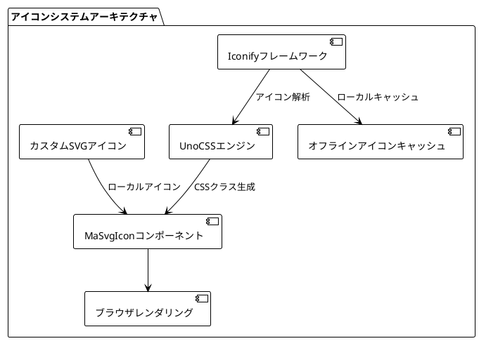
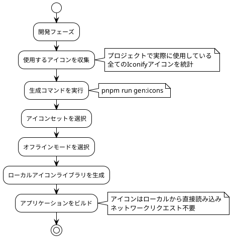

# アイコンシステム

MineAdminは、最新のアイコンソリューションを採用しており、IconifyアイコンフレームワークとUnoCSSに基づいた強力なアイコンサポートを提供します。システムは、オンラインアイコンライブラリ、オフラインモード、カスタムアイコンなど、複数の方法をサポートしています。

## アイコンアーキテクチャ概要



## アイコンソリューション比較

| ソリューション | メリット | 適用シーン | パフォーマンス | メンテナンスコスト |
|---------|------|---------|------|---------|
| **Iconifyオンライン** | アイコン豊富(200k+)、必要な時に読み込み | 高速開発、プロトタイプ設計 | ⭐⭐⭐ | 低 |
| **Iconifyオフライン** | ネットワーク依存なし、読み込み速度速い | 本番環境、社内ネットワーク | ⭐⭐⭐⭐⭐ | 中 |
| **カスタムSVG** | 完全制御可能、ブランドカスタマイズ | エンタープライズアプリ、ブランド統一 | ⭐⭐⭐⭐ | 高 |

## Iconifyアイコンの使用

::: tip Iconifyのメリット
`Iconify`は現在最も包括的なアイコンフレームワークであり、以下を含みます：
- **150以上のアイコンコレクション**：FontAwesome、Material Design、Ant Design、Tabler Iconsなど
- **200,000以上のアイコン**：様々な業界の設計ニーズをカバー
- **統一API**：1つの構文で全てのアイコンセットに対応
- **オンデマンドローディング**：使用するアイコンのみを読み込み、パッケージサイズを削減
:::

### 基本的なアイコンの使用

<DemoPreview dir="demos/icon-basic" />

### アイコンの検索と選択

アイコンの検索には [Icônes](https://icones.js.org/) の使用をお勧めします。これはIconifyベースの専門的なアイコン検索ツールです：


**検索のコツ：**
1. **カテゴリ別にブラウズ**：Material Design、FontAwesomeなどの有名なアイコンセットを選択
2. **キーワード検索**：日本語・英語での検索に対応（「ユーザー」、「user」など）
3. **タグによるフィルタリング**：solid、outline、filledなどのタグで絞り込み
4. **サイズプレビュー**：異なるサイズでのアイコン効果をリアルタイムにプレビュー

::: info アイコン命名規則
コピーしたアイコンのフォーマット：`i-{コレクション名}:{アイコン名}`
- 例：`i-material-symbols:person`
- 例：`i-heroicons:user-solid`
:::

### MaSvgIconコンポーネントの使用

`MaSvgIcon`はシステムに内蔵されたアイコンコンポーネントで、統一されたアイコンレンダリングインターフェースを提供します：

```vue
<template>
  <!-- 基本的な使用 -->
  <ma-svg-icon name="i-material-symbols:person" />
  
  <!-- サイズ設定 -->
  <ma-svg-icon name="i-heroicons:home" size="24" />
  
  <!-- 色設定 -->
  <ma-svg-icon name="i-tabler:heart" color="red" />
  
  <!-- 組み合わせ使用 -->
  <ma-svg-icon 
    name="i-lucide:settings" 
    size="20" 
    color="#409eff" 
    class="mr-2" 
  />
</template>
```

**コンポーネント属性説明：**

| 属性 | 型 | デフォルト値 | 説明 |
|------|------|--------|------|
| `name` | string | - | アイコン名（必須） |
| `size` | string\|number | '16' | アイコンサイズ（px） |
| `color` | string | 'currentColor' | アイコン色 |
| `class` | string | - | カスタムCSSクラス |

### CSSクラスの直接使用

シンプルなシーンでは、CSSクラス名を直接使用できます：

```html
<!-- 基本的な使用 -->
<i class="i-material-symbols:person"></i>
<span class="i-heroicons:home"></span>

<!-- UnoCSSユーティリティクラスとの組み合わせ -->
<i class="i-tabler:heart text-red-500 text-2xl"></i>
<span class="i-lucide:settings w-6 h-6 text-blue-500"></span>
```

::: warning 使用制限
CSSクラス方式には以下の制限があります：
- **非同期読み込み不可**：アイコン名はビルド時に決定する必要があります
- **動的連結不可**：`class="i-${iconName}"` のような記述は無効です
- **静的な使用推奨**：レイアウトが固定されたシーンに適しています
:::

### ルートメニューでの使用

<DemoPreview dir="demos/icon-menu" />

ルート設定でアイコンを使用し、複数のアイコンソースをサポートします：

```typescript
// ルート設定例
export const routes = [
  {
    name: 'dashboard',
    path: '/dashboard',
    meta: {
      title: 'ダッシュボード',
      icon: 'i-material-symbols:dashboard',  // Iconifyアイコン
    }
  },
  {
    name: 'users',
    path: '/users',
    meta: {
      title: 'ユーザー管理',
      icon: 'i-heroicons:users',  // 別のアイコンセット
    }
  },
  {
    name: 'settings',
    path: '/settings', 
    meta: {
      title: 'システム設定',
      icon: 'custom-gear',  // カスタムSVGアイコン
    }
  }
]
```

### オフラインモード設定

本番環境や社内ネットワークでは、パフォーマンスと安定性を向上させるためにオフラインモードの使用をお勧めします：



**オフラインモード設定手順：**

1. **アイコン使用状況の収集**
   ```bash
   # プロジェクトで使用されているアイコンをスキャン
   grep -r "i-[a-zA-Z-]*:" src/ --include="*.vue" --include="*.ts"
   ```

2. **オフラインアイコンライブラリの生成**
   ```bash
   # アイコン生成コマンドを実行
   pnpm run gen:icons
   ```

3. **指示に従い設定を選択**
   - 必要なアイコンセットを選択（例：Material Symbols、Heroicons）
   - 使用モードとして「オフラインモード」を選択
   - 生成設定を確認

::: tip パフォーマンス最適化のアドバイス
- **必要なものだけを選択**：プロジェクトで実際に使用するアイコンセットのみを選択
- **定期的な更新**：新しいアイコンを追加したら再生成を忘れずに
- **バージョン管理**：生成されたアイコンファイルをバージョン管理に含める
:::

## カスタムSVGアイコン

企業固有のアイコンニーズには、カスタムSVGアイコンを使用できます：

### アイコンファイル管理

```
src/assets/icons/
├── brand/              # ブランド関連アイコン
│   ├── logo.svg
│   └── logo-mini.svg
├── business/           # 業務専用アイコン
│   ├── order.svg
│   └── product.svg
└── common/             # 汎用アイコン
    ├── export.svg
    └── import.svg
```

### カスタムアイコンの使用

```vue
<template>
  <!-- 相対パスを使用（assets/iconsからの相対） -->
  <ma-svg-icon name="brand/logo" />
  <ma-svg-icon name="business/order" />
  <ma-svg-icon name="common/export" />
  
  <!-- ファイル名を直接使用（iconsのルートディレクトリに配置） -->
  <ma-svg-icon name="custom-icon" />
</template>
```

### SVGアイコン仕様

アイコンがシステムで正しく表示されるために、以下の仕様に従ってください：

```xml
<!-- 推奨されるSVGフォーマット -->
<svg 
  xmlns="http://www.w3.org/2000/svg" 
  viewBox="0 0 24 24" 
  fill="currentColor"
  width="24" 
  height="24"
>
  <path d="..."/>
</svg>
```

**仕様のポイント：**
- **統一サイズ**：24x24のviewBoxを推奨
- **可変色**：動的な色変更をサポートするために`currentColor`を使用
- **パスの簡略化**：不要な属性やコメントを削除
- **意味のある命名**：ファイル名はアイコンの意味を明確に表現

## コンポーネントでのアイコンの応用

### テーブル操作ボタン

```vue
<script setup lang="tsx">
import { MaProTableSchema } from '@mineadmin/pro-table'

const schema: MaProTableSchema = {
  tableColumns: [
    {
      type: 'operation',
      operationConfigure: {
        actions: [
          {
            name: 'edit',
            text: '編集',
            icon: 'i-heroicons:pencil-square',  // 編集アイコン
            onClick: (data) => editUser(data.row)
          },
          {
            name: 'delete', 
            text: '削除',
            icon: 'i-heroicons:trash',  // 削除アイコン
            onClick: (data) => deleteUser(data.row)
          }
        ]
      }
    }
  ]
}
</script>
```

### フォームコンポーネントのアイコン

```vue
<template>
  <ma-form :items="formItems" />
</template>

<script setup>
const formItems = [
  {
    label: 'ユーザー情報',
    prop: 'user',
    render: 'input',
    icon: 'i-heroicons:user',  // フィールドアイコン
    placeholder: 'ユーザー名を入力'
  }
]
</script>
```

### ステータスインジケーター

<DemoPreview dir="demos/icon-status" />

```vue
<template>
  <div class="status-list">
    <!-- オンライン状態 -->
    <div class="flex items-center">
      <ma-svg-icon name="i-heroicons:signal" color="green" />
      <span class="ml-2">オンライン</span>
    </div>
    
    <!-- オフライン状態 -->  
    <div class="flex items-center">
      <ma-svg-icon name="i-heroicons:signal-slash" color="gray" />
      <span class="ml-2">オフライン</span>
    </div>
  </div>
</template>
```

## 実践ガイド

### アイコン選択の原則

1. **一貫性の原則**
   ```vue
   <!-- 推奨：統一して1つのアイコンセットを使用 -->
   <ma-svg-icon name="i-heroicons:user" />
   <ma-svg-icon name="i-heroicons:cog-6-tooth" />
   <ma-svg-icon name="i-heroicons:home" />
   
   <!-- 避ける：複数のスタイルのアイコンセットを混在 -->
   <ma-svg-icon name="i-heroicons:user" />          <!-- outline スタイル -->
   <ma-svg-icon name="i-material-symbols:settings" />  <!-- filled スタイル -->  
   <ma-svg-icon name="i-ant-design:home-filled" />     <!-- 異なるデザイン言語 -->
   ```

2. **意味の原則**
   ```vue
   <!-- 推奨：アイコンの意味と機能が一致 -->
   <el-button @click="save">
     <ma-svg-icon name="i-heroicons:bookmark" /> 保存
   </el-button>
   
   <!-- 避ける：アイコンの意味が不明確 -->
   <el-button @click="save">
     <ma-svg-icon name="i-heroicons:star" /> 保存  
   </el-button>
   ```

### パフォーマンス最適化戦略

```typescript
// アイコンのプリロード設定
const criticalIcons = [
  'i-heroicons:home',
  'i-heroicons:user', 
  'i-heroicons:cog-6-tooth',
  'i-heroicons:bell'
]

// アプリケーション起動時に重要なアイコンをプリロード
criticalIcons.forEach(icon => {
  // アイコンの読み込みをトリガー
  document.createElement('i').className = icon
})
```

### アクセシビリティ対応

```vue
<template>
  <!-- 適切なariaラベルを追加 -->
  <button aria-label="設定">
    <ma-svg-icon name="i-heroicons:cog-6-tooth" />
  </button>
  
  <!-- 装飾的なアイコンにはaria-hiddenを使用 -->
  <h2>
    <ma-svg-icon name="i-heroicons:star" aria-hidden="true" />
    重要なお知らせ
  </h2>
</template>
```

## よくある問題とトラブルシューティング

### アイコンが表示されない

**問題の症状：**
- アイコンの位置が空白で表示される
- コンソールに404エラーが表示される

**トラブルシューティング手順：**
1. **アイコン名を確認**
   ```vue
   <!-- アイコン名が正しいか確認 -->
   <ma-svg-icon name="i-heroicons:user-solid" />
   <!--           ↑ コレクション名とアイコン名を確認 -->
   ```

2. **ネットワーク接続を確認**
   ```javascript
   // ブラウザのコンソールで確認
   fetch('https://api.iconify.design/heroicons.json')
     .then(r => r.json())
     .then(data => console.log('アイコンセットデータ:', data))
   ```

3. **オフライン設定を確認**
   ```bash
   # オフラインアイコンに必要なアイコンが含まれているか確認
   ls dist/assets/icons/  # 生成されたアイコンファイルを確認
   ```

### アイコンの読み込みが遅い

**最適化案：**
```typescript
// 1. アイコンのプリロードを有効にする
const iconPreloader = {
  preload: ['i-heroicons:user', 'i-heroicons:home'],
  
  init() {
    this.preload.forEach(icon => {
      const link = document.createElement('link')
      link.rel = 'preload'
      link.href = `https://api.iconify.design/${icon.replace('i-', '').replace(':', '/')}.svg`
      link.as = 'image'
      document.head.appendChild(link)
    })
  }
}

// 2. オフラインモードを使用
// pnpm run gen:icons を実行してローカルアイコンライブラリを生成
```

### アイコンのスタイル問題

```vue
<template>
  <!-- 問題：アイコンのサイズが揃っていない -->
  <ma-svg-icon name="i-heroicons:user" class="text-sm" />
  <ma-svg-icon name="i-heroicons:home" class="text-lg" />
  
  <!-- 解決：サイズを統一して設定 -->
  <ma-svg-icon name="i-heroicons:user" size="20" />
  <ma-svg-icon name="i-heroicons:home" size="20" />
  
  <!-- またはCSSクラスで統一制御 -->
  <ma-svg-icon name="i-heroicons:user" class="icon-standard" />
  <ma-svg-icon name="i-heroicons:home" class="icon-standard" />
</template>

<style>
.icon-standard {
  width: 20px;
  height: 20px;
}
</style>
```

## ベストプラクティスまとめ

### 開発段階
- ✅ [Icônes](https://icones.js.org/) を使用してアイコンを検索・プレビュー
- ✅ 一貫性のあるアイコンコレクションを選択（HeroiconsまたはMaterial Symbols推奨）
- ✅ アイコンに意味のある名前とコメントを追加
- ✅ プロジェクトのアイコン使用仕様ドキュメントを作成

### 本番デプロイ
- ✅ オフラインアイコンライブラリを生成して読み込みパフォーマンスを向上
- ✅ アイコンのプリロードを有効にして初回表示を最適化
- ✅ CDNを設定してアイコンリソースの読み込みを高速化
- ✅ アイコンの読み込みパフォーマンスとエラー率を監視

### メンテナンス段階
- ✅ 使用していないアイコン参照を定期的に削除
- ✅ アイコンセットのバージョン更新を追跡
- ✅ アイコン変更のコードレビュー仕組みを確立
- ✅ カスタムアイコンのデザイン仕様を維持