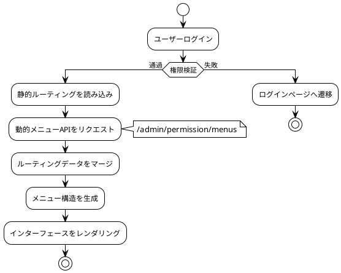
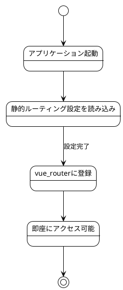
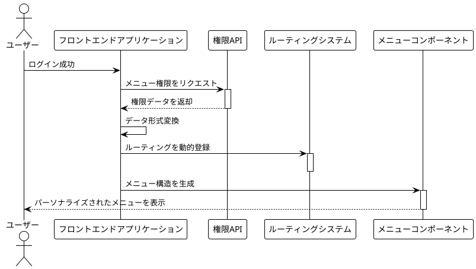

# ルーティングとメニュー

MineAdmin は `vue-router` に基づいた完全なルーティングシステムを提供し、**静的ルーティング**と**動的ルーティング**の2つのモードをサポートし、エンタープライズレベルの権限管理に強力なサポートを提供します。

## システムアーキテクチャ概要



## ルーティングタイプ選択ガイド

### 📊 選択決定マトリックス

| シナリオ | 静的ルーティング | 動的ルーティング | 推奨理由 |
|---------|----------------|----------------|---------|
| 公開ページ(ログイン、404) | ✅ | ❌ | 権限検証不要、高速読み込み |
| 基本管理ページ | ❌ | ✅ | 権限制御が必要 |
| マルチテナントシステム | ❌ | ✅ | テナントごとに異なるメニュー構造 |
| 開発デバッグページ | ✅ | ❌ | 開発環境のみ使用 |
| 高頻度アクセスページ | ✅ | ❌ | ネットワークリクエスト削減、パフォーマンス向上 |

## ルーティング、メニュー詳細説明

### 🔹 静的ルーティング

静的ルーティングはフロントエンドで事前定義され、アプリケーション起動時にすぐに使用可能で、権限制御が不要なページに適しています。

**特徴:**
- フロントエンドで事前定義、起動時に使用可能
- ネットワークリクエスト不要、高速読み込み
- 公開ページや基本機能に最適

**設定場所:** `src/router/static-routes` ディレクトリ

**動作フロー:**


::: tip 💡 将来計画
システムは**ファイルルーティング**モード（ファイル＝ルーティング）の導入を検討していますが、現在のMineAdminシナリオでは使用頻度は高くありません。
将来的にコミュニティのニーズに応じてこの機能が追加される可能性があります。
:::

### 🔹 動的ルーティング

動的ルーティングはユーザーの権限に基づいて動的に生成され、きめ細かな権限制御を提供します。

**生成フロー:**
1. ユーザーログイン検証通過
2. `/admin/permission/menus` インターフェースをリクエスト
3. サーバーがユーザーの権限メニューデータを返却
4. フロントエンドがルーティング設定に変換
5. vue-routerに動的登録
6. 対応するメニュー構造を生成



### 🔹 メニューシステム

メニューはルーティングの視覚的表現であり、ルーティング設定をユーザーインターフェース要素に変換します。

**メニューとルーティングの関係:**
- 1つのルーティングが複数のメニュー項目に対応する可能性がある
- メニューは多階層のネスト構造をサポート
- アイコン、バッジ、国際化などの豊富な表示をサポート

## ルーティング設定詳細

### 基本データ型

システムは `#/types/global.d.ts` で完全なルーティング型を定義しています：

::: details 📋 ルーティングデータ型定義
```typescript
declare namespace MineRoute {
  interface routeRecord {
    name?: string                    // ルーティング名、一意である必要あり
    path?: string                   // ルーティングパス
    redirect?: string               // リダイレクトアドレス
    expand?: boolean               // サブメニューを展開するかどうか
    component?: () => Promise<any>  // 非同期コンポーネント
    components?: () => Promise<any> // 名前付きビューコンポーネント
    meta?: RouteMeta              // ルーティングメタデータ
    children?: routeRecord[]       // サブルーティング設定
  }
  
  interface RouteMeta {
    // 基本情報
    title?: string | (() => string)     // ページタイトル
    i18n?: string | (() => string)      // 国際化キー名
    icon?: string                       // アイコン（iconify対応）
    badge?: () => string | number       // バッジコンテンツ
    
    // 表示制御
    hidden?: boolean                    // メニューを隠すかどうか
    subForceShow?: boolean             // サブメニューを強制表示
    affix?: boolean                    // タブを固定するかどうか
    
    // 機能設定
    cache?: boolean                    // ページをキャッシュするかどうか
    copyright?: boolean                // 著作権情報を表示するかどうか
    breadcrumbEnable?: boolean         // パンくずリストを表示するかどうか
    
    // ルーティングタイプ
    type?: 'M' | 'B' | 'I' | 'L' | string  // M:メニュー B:ボタン I:iframe L:外部リンク
    link?: string                          // 外部リンク/iframeアドレス
    
    // 権限制御
    auth?: string[]                    // 権限コード配列
    role?: string[]                   // ロール配列  
    user?: string[]                   // ユーザーID配列
    
    // システム内部
    activeName?: string               // アクティブなメニュー名
    breadcrumb?: routeRecord[]        // パンくずリストパス（自動生成）
  }
}
```
:::

### 完全な設定例

```typescript
// 標準メニューページ設定
const menuRoute: MineRoute.routeRecord = {
  name: 'system',
  path: '/system',
  redirect: '/system/user',
  meta: {
    title: 'システム管理',
    i18n: 'menu.system',
    icon: 'icon-park-outline:setting-two',
    type: 'M'
  },
  children: [
    {
      name: 'system-user',
      path: '/system/user',
      component: () => import('~/modules/system/views/user/index.vue'),
      meta: {
        title: 'ユーザー管理',
        i18n: 'menu.system.user',
        icon: 'icon-park-outline:user',
        cache: true,
        auth: ['system:user:list']
      }
    }
  ]
}
```

## META 設定詳細

### 🏷️ 基本表示設定

#### title - ページタイトル
```typescript
meta: {
  title: 'ユーザー管理',           // 直接タイトル指定
  // または
  title: () => `ユーザー管理(${count})` // 動的タイトル
}
```
**適用シーン:** メニュー表示、タブタイトル、ブラウザタイトル

#### icon - アイコン設定  
```typescript
meta: {
  icon: 'icon-park-outline:user',      // Iconifyアイコン
  icon: 'mdi:user',                   // Material Designアイコン
  icon: '/custom-icon.svg'            // カスタムSVGアイコン
}
```
**対応アイコンライブラリ:** Iconify、Material Design Icons、カスタムSVG

#### badge - バッジ設定
```typescript
meta: {
  badge: () => store.unreadCount,     // 動的バッジ
  badge: () => 'NEW'                  // 固定バッジ
}
```

### 🎯 ルーティングタイプ設定

#### type - ルーティングタイプ
```typescript
type RouteType = 'M' | 'B' | 'I' | 'L'

// M: メニュータイプ（デフォルト）
meta: { type: 'M' }  // メニューに表示、サブルーティング可

// B: ボタンタイプ  
meta: { type: 'B' }  // メニュー非表示、サブルーティングなし、権限制御

// I: iframeタイプ
meta: { 
  type: 'I', 
  link: 'https://admin.example.com'
}

// L: 外部リンクタイプ
meta: { 
  type: 'L', 
  link: 'https://docs.example.com'
}
```

### 🔐 権限制御設定

#### 多階層権限制御
```typescript
meta: {
  // 権限コード制御（推奨）
  auth: ['system:user:list', 'system:user:create'],
  
  // ロール制御
  role: ['admin', 'manager'],
  
  // ユーザー制御
  user: ['1001', '1002']
}
```

**権限検証優先順位:** `user > role > auth`

### 🚀 パフォーマンス設定

#### cache - ページキャッシュ
```typescript
// コンポーネント内で設定
defineOptions({ 
  name: 'SystemUser'  // ルーティング名と一致させる必要あり
})

// ルーティングで有効化
meta: {
  cache: true
}
```

#### 遅延読み込み設定
```typescript
// 基本遅延読み込み
component: () => import('~/views/user/index.vue')

// グループ遅延読み込み（webpackマジックコメント）
component: () => import(
  /* webpackChunkName: "system" */ 
  '~/modules/system/views/user/index.vue'
)
```

## 実践応用例

### 📝 例1: 標準CRUDモジュール

```typescript
// ユーザー管理完全設定
export const userManagementRoutes: MineRoute.routeRecord = {
  name: 'user-management',
  path: '/users',
  redirect: '/users/list',
  meta: {
    title: 'ユーザー管理',
    i18n: 'menu.users',
    icon: 'icon-park-outline:user',
    type: 'M'
  },
  children: [
    // 一覧ページ
    {
      name: 'user-list',
      path: '/users/list',
      component: () => import('~/modules/user/views/list.vue'),
      meta: {
        title: 'ユーザー一覧',
        cache: true,
        auth: ['user:list']
      }
    },
    // 詳細ページ（メニュー非表示）
    {
      name: 'user-detail',
      path: '/users/:id',
      component: () => import('~/modules/user/views/detail.vue'),
      meta: {
        title: 'ユーザー詳細',
        hidden: true,
        cache: true,
        activeName: 'user-list',  // 親メニューをアクティブ化
        auth: ['user:view']
      }
    },
    // 権限制御ボタン
    {
      name: 'user-delete',
      path: '/users/delete',
      meta: {
        type: 'B',  // ボタンタイプ、メニュー非表示
        auth: ['user:delete']
      }
    }
  ]
}
```

### 🌐 例2: 外部連携

```typescript
// iframeと外部リンク設定
export const externalRoutes: MineRoute.routeRecord = {
  name: 'external',
  path: '/external',
  meta: {
    title: '外部システム',
    icon: 'icon-park-outline:link'
  },
  children: [
    // iframe埋め込み
    {
      name: 'external-monitor',
      path: '/external/monitor',
      meta: {
        title: '監視センター',
        type: 'I',
        link: 'https://monitor.company.com',
        auth: ['system:monitor']
      }
    },
    // 外部リンク遷移  
    {
      name: 'external-docs',
      path: '/external/docs',
      meta: {
        title: 'APIドキュメント',
        type: 'L', 
        link: 'https://api-docs.company.com'
      }
    }
  ]
}
```

### 🏢 例3: 複雑なワークフロー

```typescript
// 多階層ワークフロー設定
export const workflowRoutes: MineRoute.routeRecord = {
  name: 'workflow',
  path: '/workflow',
  meta: {
    title: 'ワークフロー',
    icon: 'icon-park-outline:flow-chart',
    badge: () => store.pendingTasks
  },
  children: [
    {
      name: 'workflow-pending',
      path: '/workflow/pending',
      component: () => import('~/workflow/pending.vue'),
      meta: {
        title: '未処理タスク',
        affix: true,  // タブ固定
        cache: true
      }
    },
    {
      name: 'workflow-approval',
      path: '/workflow/approval',
      redirect: '/workflow/approval/my',
      meta: {
        title: '承認管理',
        role: ['manager', 'admin']
      },
      children: [
        {
          name: 'my-approval',
          path: '/workflow/approval/my',
          component: () => import('~/workflow/my-approval.vue'),
          meta: {
            title: '自分の承認',
            cache: true
          }
        }
      ]
    }
  ]
}
```

## ベストプラクティス

### 📝 命名規則

**✅ 推奨する方法:**
```typescript
// ルーティング名はkebab-caseを使用
name: 'system-user-list'

// パスは小文字+ハイフン
path: '/system/user-management'

// 国際化キー名は階層化
i18n: 'menu.system.user.list'
```

**❌ 避けるべき方法:**
```typescript
// キャメルケースの命名を避ける
name: 'SystemUserList'

// 特殊文字を避ける
path: '/system/user_management'

// 過度な階層を避ける
i18n: 'menu.system.management.user.list.page'
```

### 🏗️ ルーティング構造設計

**階層制御の原則:**
- メニュー階層は3階層まで
- 各階層の子項目数は8個まで
- 関連機能モジュールはグループ化

**権限粒度設計:**
```typescript
// 機能レベルの権限（推奨）
auth: ['user:list', 'user:create', 'user:edit']

// 過度に細かい粒度を避ける
auth: ['user:list:name', 'user:list:email']  // ❌

// 過度に粗い粒度を避ける  
auth: ['user:all']  // ❌
```

### ⚡ パフォーマンス最適化戦略

#### ルーティング遅延読み込み最適化
```typescript
// モジュールごとにグループ化して読み込み
const UserRoutes = () => import(
  /* webpackChunkName: "user-module" */
  '~/modules/user/routes'
)

// 重要なルーティングをプリロード
const Dashboard = () => import(
  /* webpackChunkName: "dashboard" */
  /* webpackPreload: true */
  '~/views/dashboard.vue'
)
```

#### メニューレンダリング最適化
```typescript
// 大量のメニュー項目がある場合、仮想スクロールを使用
meta: {
  virtualScroll: true  // 仮想スクロール有効化
}

// 重要でないメニューは遅延読み込み
meta: {
  lazyLoad: true
}
```

## 問題トラブルシューティングガイド

### 🐛 よくある問題と解決策

#### 1. ルーティングにアクセスできない

**症状:** URLを入力すると404または空白ページが表示される

**確認手順:**
```typescript
// 1. ルーティングが正しく登録されているか確認
console.log('登録済みルーティング:', router.getRoutes())

// 2. ルーティング設定を検証
const route = {
  name: 'user-list',  // ✅ nameが一意であることを確認
  path: '/users',     // ✅ パスが正しいことを確認
  component: () => import('~/views/users.vue')  // ✅ コンポーネントパスが存在することを確認
}

// 3. 権限設定を確認
const hasPermission = await checkAuth(['user:list'])
```

#### 2. メニューが表示されない

**考えられる原因と解決策:**
```typescript
// 原因1: hiddenがtrueに設定されている
meta: { hidden: false }  // 非表示になっていないことを確認

// 原因2: 権限検証に失敗
meta: { auth: ['correct:permission'] }  // 権限コードを確認

// 原因3: ルーティングタイプが間違っている
meta: { type: 'M' }  // メニュータイプであることを確認
```

#### 3. ページキャッシュが機能しない

**解決策:**
```vue
<!-- コンポーネント内でnameを定義する必要がある -->
<script setup>
defineOptions({ 
  name: 'UserList'  // ルーティング名と一致させる必要がある
})
</script>
```

```typescript
// ルーティング設定
meta: {
  cache: true,
  // コンポーネント名とルーティング名が一致していることを確認
  name: 'UserList'  
}
```

### 🔍 デバッグツール

#### ルーティングデバッグヘルパー
```typescript
// ルーティングデバッグ関数
export const debugRoute = () => {
  const router = useRouter()
  const currentRoute = useRoute()
  
  console.group('ルーティングデバッグ情報')
  console.log('現在のルーティング:', currentRoute.name)
  console.log('ルーティングパラメータ:', currentRoute.params)
  console.log('クエリパラメータ:', currentRoute.query)
  console.log('ルーティングメタデータ:', currentRoute.meta)
  console.log('全ルーティング:', router.getRoutes())
  console.groupEnd()
}

// 権限デバッグ
export const debugPermission = async (route: RouteRecord) => {
  const { auth, role, user } = route.meta
  
  console.group('権限デバッグ')
  console.log('必要な権限:', auth)
  console.log('必要なロール:', role)
  console.log('必要なユーザー:', user)
  
  if (auth) {
    console.log('権限検証結果:', await checkAuth(auth))
  }
  console.groupEnd()
}
```

#### メニュー検証ツール
```typescript
// メニュー構造検証
export const validateMenuStructure = (routes: MineRoute.routeRecord[]) => {
  const issues = []
  
  const checkRoute = (route: MineRoute.routeRecord, depth = 0) => {
    // 階層の深さをチェック
    if (depth > 3) {
      issues.push(`ルーティング ${route.name} の階層が深すぎます (${depth})`)
    }
    
    // 必須フィールドをチェック
    if (!route.name) {
      issues.push(`ルーティングにnameフィールドがありません: ${route.path}`)
    }
    
    // サブルーティングを再帰的にチェック
    route.children?.forEach(child => 
      checkRoute(child, depth + 1)
    )
  }
  
  routes.forEach(route => checkRoute(route))
  return issues
}
```