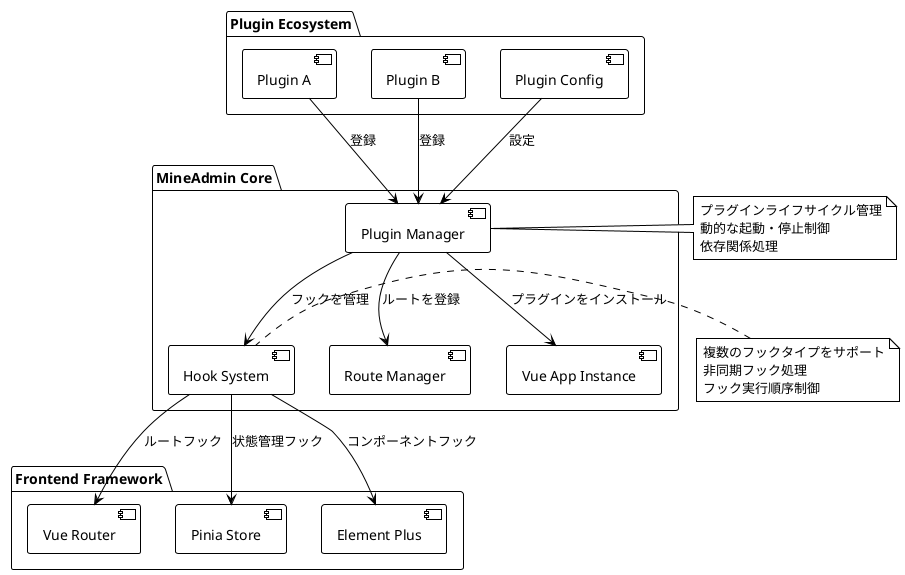
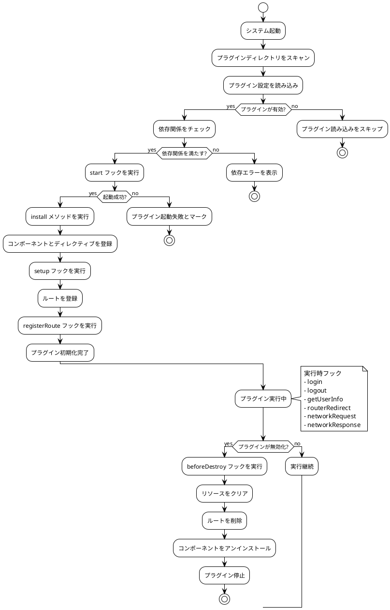

# プラグインシステム

::: tip プラグインシステムの説明
`3.0` フロントエンドはコアレベルでプラグインシステムをサポートしています。`2.0` は設計当初プラグイン機能を考慮しておらず、
システムのインターフェースや動作・機能を変更する際にソースコードを修正する必要があり、その後のアップグレードができなくなり、公式コードとの差が大きくなっていました。
その後アプリストア機能が追加されましたが、プラグインを強制的にサポートすることはできても、プラグインもソースコードを修正する必要があり、初期化が必要な箇所ではプラグインが拡張実装できず、`main.js` を修正するしかありませんでした。

**現在は上記の問題はすべて解消されています。** フロントエンドプラグインシステムは強力なサポートを提供し、インターフェースの置き換え、機能の追加、サードパーティコンポーネントや自社開発コンポーネントの導入をシステムにシームレスに統合できます。
さらに、複数の `hooks（フック）` も提供しており、フロントエンドの動作に影響を与え変更することも可能です
:::

## プラグインシステムアーキテクチャ概要

プラグインシステムはモダンなフロントエンドアーキテクチャに基づいて設計され、完全なライフサイクル管理と拡張機能を提供します：



### コア特性

- **ゼロ侵入設計**: プラグイン開発にコアコードの変更は不要
- **動的読み込み**: プラグインの動的な有効化・無効化をサポート
- **ライフサイクル管理**: 完全なプラグインライフサイクルフック
- **タイプセーフ**: 完全な TypeScript 型定義
- **パフォーマンス最適化**: 遅延読み込みとオンデマンド読み込みをサポート
- **エラー分離**: プラグインのエラーがメインアプリケーションの動作に影響しない

## プラグインデータ型の紹介

::: info 型定義ファイル
型定義は `types/global.d.ts` 内にあります
:::

:::details クリックして完全な型定義を見る
```ts
declare namespace Plugin {
  /**
   * プラグイン基本情報
   */
  interface Info {
    /** プラグイン名、形式：作成者名前空間/プラグイン名 */
    name: string
    /** プラグインバージョン、セマンティックバージョニングに従う */
    version: string
    /** プラグイン作成者 */
    author: string
    /** プラグインの説明 */
    description: string
    /** プラグイン起動順序、数値が大きいほど先に起動、デフォルトは 0 */
    order?: number
    /** プラグイン依存リスト */
    dependencies?: string[]
    /** プラグインキーワード、検索用 */
    keywords?: string[]
    /** プラグインホームページアドレス */
    homepage?: string
    /** プラグインライセンス */
    license?: string
    /** 最低システムバージョン要件 */
    minSystemVersion?: string
  }

  /**
   * プラグイン設定
   */
  interface Config {
    /** プラグイン基本情報 */
    info: Info
    /** プラグインを有効にするか */
    enable: boolean
    /** プラグイン開発モード、デバッグ用 */
    devMode?: boolean
    /** プラグインカスタム設定項目 */
    settings?: Record<string, any>
  }

  /**
   * プラグインビュールート定義
   */
  interface Views extends Route.RouteRecordRaw {
    /** ルートメタ情報拡張 */
    meta?: {
      /** ページタイトル */
      title?: string
      /** 国際化キー値 */
      i18n?: string
      /** ページアイコン */
      icon?: string
      /** 権限検証が必要か */
      requireAuth?: boolean
      /** 必要な権限リスト */
      permissions?: string[]
      /** ページをキャッシュするか */
      keepAlive?: boolean
      /** ページを非表示にするか */
      hidden?: boolean
      /** メニューの並び順 */
      order?: number
    }
  }

  /**
   * フック関数型定義
   */
  interface HookHandlers {
    /** プラグイン起動フック、初期化検証に使用可能 */
    start?: (config: Config) => Promise<boolean | void> | boolean | void
    /** システム初期化完了フック、Vue コンテキストにアクセス可能 */
    setup?: () => Promise<void> | void
    /** ルート登録フック、ルート設定を変更可能 */
    registerRoute?: (router: Router, routesRaw: Route.RouteRecordRaw[] | Views[] | MineRoute.routeRecord[]) => Promise<void> | void
    /** ユーザーログインフック */
    login?: (formInfo: LoginFormData) => Promise<void> | void
    /** ユーザーログアウトフック */
    logout?: () => Promise<void> | void
    /** ユーザー情報取得フック */
    getUserInfo?: (userInfo: UserInfo) => Promise<void> | void
    /** ルート遷移フック（外部リンクは無効） */
    routerRedirect?: (context: { from: RouteLocationNormalized, to: RouteLocationNormalized }, router: Router) => Promise<void> | void
    /** ネットワークリクエストインターセプトフック */
    networkRequest?: <T = any>(request: AxiosRequestConfig) => Promise<AxiosRequestConfig> | AxiosRequestConfig
    /** ネットワークレスポンスインターセプトフック */
    networkResponse?: <T = any>(response: AxiosResponse<T>) => Promise<AxiosResponse<T>> | AxiosResponse<T>
    /** エラーハンドリングフック */
    error?: (error: Error, context?: string) => Promise<void> | void
    /** ページ読み込み完了フック */
    mounted?: () => Promise<void> | void
    /** ページ破棄フック */
    beforeDestroy?: () => Promise<void> | void
  }

  /**
   * プラグインメイン設定インターフェース
   */
  interface PluginConfig {
    /** プラグインインストール関数、コンポーネントやディレクティブなどを登録 */
    install: (app: App<Element>) => Promise<void> | void
    /** プラグイン設定情報 */
    config: Config
    /** プラグインルート定義 */
    views?: Views[]
    /** プラグインフック関数 */
    hooks?: HookHandlers
    /** プラグインカスタム属性 */
    [key: string]: any
  }

  /**
   * プラグインストレージ状態
   */
  interface PluginStore {
    /** インストール済みプラグインリスト */
    plugins: Map<string, PluginConfig>
    /** プラグイン有効状態 */
    enabledPlugins: Set<string>
    /** プラグイン読み込み状態 */
    loadingPlugins: Set<string>
    /** プラグインエラー情報 */
    pluginErrors: Map<string, Error>
  }

  /**
   * プラグインマネージャーインターフェース
   */
  interface PluginManager {
    /** プラグインを登録 */
    register(name: string, plugin: PluginConfig): Promise<boolean>
    /** プラグインをアンインストール */
    unregister(name: string): Promise<boolean>
    /** プラグインを有効化 */
    enable(name: string): Promise<boolean>
    /** プラグインを無効化 */
    disable(name: string): Promise<boolean>
    /** プラグイン情報を取得 */
    getPlugin(name: string): PluginConfig | null
    /** 全プラグインを取得 */
    getAllPlugins(): Map<string, PluginConfig>
    /** プラグイン依存関係をチェック */
    checkDependencies(name: string): Promise<boolean>
  }
}

/**
 * ログインフォームデータ型
 */
interface LoginFormData {
  username: string
  password: string
  captcha?: string
  remember?: boolean
}

/**
 * ユーザー情報型
 */
interface UserInfo {
  id: number
  username: string
  nickname: string
  email: string
  avatar: string
  roles: string[]
  permissions: string[]
  [key: string]: any
}
```
:::

## プラグインの作成

### ディレクトリ構造と命名規則

すべてのプラグインは `src/plugins` ディレクトリに配置され、プラグインにはこのディレクトリを指すエイリアス `$` があります。プラグインの構造はバックエンドと同じで、
`開発者名前空間/プラグイン名` でプラグインディレクトリを構成します。スラッシュの左側は**作者名前空間**で、[MineAdmin公式サイト](https://www.mineadmin.com) で設定可能です。
スラッシュの右側は**プラグイン名**で、この作者名前空間内で一意である必要があります。

#### 標準プラグインディレクトリ構成

```bash
src/plugins/
├── mine-admin/          # 公式プラグインネームスペース
│   ├── app-store/       # アプリストアプラグイン
│   ├── basic-ui/        # ベースUIライブラリプラグイン
│   └── demo/            # 公式デモプラグイン
├── author-name/         # サードパーティ開発者名前空間
│   └── plugin-name/     # 具体的なプラグインディレクトリ
│       ├── index.ts     # プラグインエントリファイル（必須）
│       ├── config.ts    # プラグイン設定ファイル（オプション）
│       ├── package.json # プラグインパッケージ情報（推奨）
│       ├── README.md    # プラグイン説明ドキュメント（推奨）
│       ├── views/       # ページコンポーネントディレクトリ
│       │   ├── index.vue
│       │   └── components/
│       ├── components/  # 再利用可能なコンポーネント
│       ├── composables/ # コンポーザブル関数
│       ├── utils/       # ユーティリティ関数
│       ├── assets/      # 静的リソース
│       ├── locales/     # 国際化ファイル
│       │   ├── zh.json
│       │   ├── en.json
│       │   └── ja.json
│       ├── types/       # TypeScript 型定義
│       └── tests/       # テストファイル
```

#### 命名規則の提案

- **プラグイン名**: 小文字とハイフンを使用、例: `file-manager`、`data-export`
- **作者名前空間**: 小文字とハイフンを使用、特殊文字は避ける
- **ファイル名**: kebab-case 規則に従う
- **コンポーネント名**: PascalCase を使用、例: `FileUploader.vue`

::: tip ベストプラクティス
- ローカルで開発したプラグインもシステムで認識できますが、MineAdmin アプリマーケットにはアップロードできません
- 依存関係とバージョンを管理するために、プラグインに `package.json` を追加することを推奨します
- TypeScript を使用して開発すると、より良い型ヒントとエラーチェックが得られます
- Vue 3 コンポジションAPIのベストプラクティスに従ってください
:::

::: warning 注意事項
- 同じ作者名前空間内でプラグイン名は一意でなければなりません
- システムの予約語をプラグイン名として使用しないでください
- プラグインディレクトリを作成したら、名前を簡単に変更しないことを推奨します
:::

### プラグインライフサイクル



## プラグイン開発ガイド

### ベーシックプラグイン例

完全なファイル管理プラグインを通じて、プラグイン開発の全プロセスを理解しましょう：

#### 1. プラグインエントリファイル `index.ts` の作成

```ts
// src/plugins/zhang-san/file-manager/index.ts
import type { App } from 'vue'
import type { Router, RouteRecordRaw } from 'vue-router'
import type { Plugin } from '#/global'
import { ElMessage, ElNotification } from 'element-plus'

// プラグインコンポーネントのインポート
import FileManagerComponent from './components/FileManager.vue'
import FileUploader from './components/FileUploader.vue'

// ユーティリティ関数のインポート
import { formatFileSize, validateFileType } from './utils/fileUtils'

// プラグイン設定
const pluginConfig: Plugin.PluginConfig = {
  // プラグインインストールメソッド - ここでグローバルコンポーネント、ディレクティブ、プラグインなどを登録
  async install(app: App) {
    try {
      // グローバルコンポーネントの登録
      app.component('FileManager', FileManagerComponent)
      app.component('FileUploader', FileUploader)
      
      // グローバルディレクティブの登録
      app.directive('file-drop', {
        mounted(el, binding) {
          el.addEventListener('dragover', (e: DragEvent) => {
            e.preventDefault()
            e.stopPropagation()
          })
          
          el.addEventListener('drop', async (e: DragEvent) => {
            e.preventDefault()
            e.stopPropagation()
            const files = Array.from(e.dataTransfer?.files || [])
            await binding.value(files)
          })
        }
      })
      
      // グローバルプロパティの追加
      app.config.globalProperties.$fileUtils = {
        formatSize: formatFileSize,
        validateType: validateFileType
      }
      
      console.log('ファイル管理プラグインのインストールに成功しました')
    } catch (error) {
      console.error('ファイル管理プラグインのインストールに失敗しました:', error)
      throw error
    }
  },

  // プラグイン基本設定
  config: {
    enable: import.meta.env.NODE_ENV !== 'production', // 本番環境では無効
    devMode: import.meta.env.DEV,
    info: {
      name: 'zhang-san/file-manager',
      version: '2.1.0',
      author: '张三',
      description: 'エンタープライズ級ファイル管理プラグイン。アップロード、ダウンロード、プレビュー、権限制御などの機能をサポート',
      keywords: ['ファイル管理', 'ファイルアップロード', '権限制御'],
      homepage: 'https://github.com/zhang-san/file-manager',
      license: 'MIT',
      minSystemVersion: '3.0.0',
      dependencies: ['mine-admin/basic-ui'],
      order: 10 // 高い優先順位
    },
    settings: {
      maxFileSize: 50 * 1024 * 1024, // 50MB
      allowedTypes: ['image/*', 'application/pdf', '.docx', '.xlsx'],
      uploadChunkSize: 1024 * 1024, // 1MB
      enablePreview: true,
      enableVersionControl: false
    }
  },

  // プラグインフック関数
  hooks: {
    // プラグイン起動検証
    async start(config) {
      console.log('ファイル管理プラグインを起動中...', config.info.name)
      
      // 必要な権限を確認
      const hasPermission = await checkFilePermissions()
      if (!hasPermission) {
        ElMessage.error('ファイル管理プラグインにはファイル操作権限が必要です')
        return false // プラグインの起動を阻止
      }
      
      // プラグイン設定の初期化
      await initializeSettings(config.settings)
      return true
    },

    // システム初期化完了後に実行
    async setup() {
      // ファイルストレージの初期化
      await initFileStorage()
      
      // ファイルタイプマッピングの登録
      registerFileTypes()
      
      // システムイベントの監視
      window.addEventListener('beforeunload', handleBeforeUnload)
    },

    // ルート登録フック
    async registerRoute(router: Router, routesRaw) {
      // ファイル管理関連ルートを動的に追加
      const adminRoutes = routesRaw.find(route => route.path === '/admin')
      if (adminRoutes && adminRoutes.children) {
        adminRoutes.children.push({
          path: 'files',
          name: 'FileManagement',
          component: () => import('./views/FileManagement.vue'),
          meta: {
            title: 'ファイル管理',
            icon: 'FolderOpened',
            requireAuth: true,
            permissions: ['file:read'],
            keepAlive: true
          }
        })
      }
      
      console.log('ファイル管理ルートの登録が完了しました')
    },

    // ユーザーログインフック
    async login(formInfo) {
      console.log('ユーザーログイン、ファイル権限を初期化')
      await refreshFilePermissions(formInfo.username)
    },

    // ユーザーログアウトフック
    async logout() {
      console.log('ユーザーログアウト、ファイルキャッシュをクリア')
      await clearFileCache()
    },

    // ユーザー情報取得フック
    async getUserInfo(userInfo) {
      // ユーザーロールに基づいてファイル権限を設定
      await setFilePermissions(userInfo.roles, userInfo.permissions)
    },

    // ネットワークリクエストインターセプト
    async networkRequest(config) {
      // ファイルアップロードリクエストに特別な処理を追加
      if (config.url?.includes('/upload')) {
        config.timeout = 300000 // 5分タイムアウト
        config.headers = {
          ...config.headers,
          'X-File-Plugin': 'zhang-san/file-manager'
        }
      }
      return config
    },

    // ネットワークレスポンスインターセプト
    async networkResponse(response) {
      // ファイルダウンロードレスポンスを処理
      if (response.headers['content-type']?.includes('application/octet-stream')) {
        const contentDisposition = response.headers['content-disposition']
        if (contentDisposition) {
          const filename = extractFilename(contentDisposition)
          response.metadata = { filename }
        }
      }
      return response
    },

    // エラーハンドリング
    async error(error, context) {
      if (context === 'file-upload') {
        ElNotification.error({
          title: 'ファイルアップロード失敗',
          message: error.message,
          duration: 5000
        })
      }
    },

    // プラグイン破棄前のクリーンアップ
    async beforeDestroy() {
      console.log('ファイル管理プラグインを破棄します。リソースをクリーンアップ中...')
      
      // 進行中のアップロードタスクをキャンセル
      await cancelAllUploads()
      
      // イベントリスナーをクリア
      window.removeEventListener('beforeunload', handleBeforeUnload)
      
      // 一時ファイルをクリーンアップ
      await cleanupTempFiles()
    }
  },

  // プラグインルート定義
  views: [
    {
      name: 'zhangsan:filemanager:index',
      path: '/plugins/file-manager',
      component: () => import('./views/FileManagerIndex.vue'),
      meta: {
        title: 'ファイルマネージャー',
        i18n: 'plugin.fileManager.title',
        icon: 'FolderOpened',
        requireAuth: true,
        permissions: ['file:read'],
        keepAlive: true,
        hidden: false
      }
    },
    {
      name: 'zhangsan:filemanager:upload',
      path: '/plugins/file-manager/upload',
      component: () => import('./views/FileUpload.vue'),
      meta: {
        title: 'ファイルアップロード',
        i18n: 'plugin.fileManager.upload',
        icon: 'Upload',
        requireAuth: true,
        permissions: ['file:create'],
        keepAlive: false
      }
    }
  ]
}

// 補助関数
async function checkFilePermissions(): Promise<boolean> {
  try {
    // ファイルAPIが利用可能か確認
    return 'File' in window && 'FileReader' in window && 'FileList' in window
  } catch {
    return false
  }
}

async function initializeSettings(settings: Record<string, any>) {
  // プラグイン設定を初期化
  const userSettings = await getUserPluginSettings('zhang-san/file-manager')
  Object.assign(settings, userSettings)
}

async function initFileStorage() {
  // ファイルストレージ設定を初期化
  console.log('ファイルストレージシステムを初期化')
}

function registerFileTypes() {
  // サポートするファイルタイプを登録
  console.log('ファイルタイプマッピングを登録')
}

function handleBeforeUnload(event: BeforeUnloadEvent) {
  // 未完了のアップロードタスクがないか確認
  if (hasOngoingUploads()) {
    event.preventDefault()
    event.returnValue = 'ファイルをアップロード中です。本当にページを離れますか？'
  }
}

// プラグイン設定をエクスポート
export default pluginConfig

// 他のプラグインで使用する型定義をエクスポート
export type { FileManagerConfig } from './types/index'
```

#### 2. プラグイン設定ファイル `config.ts`

```ts
// src/plugins/zhang-san/file-manager/config.ts
export interface FileManagerUserConfig {
  // アップロード設定
  upload: {
    maxFileSize: number
    allowedTypes: string[]
    chunkSize: number
    concurrent: number
  }
  
  // プレビュー設定
  preview: {
    enabled: boolean
    supportedTypes: string[]
    maxPreviewSize: number
  }
  
  // ストレージ設定
  storage: {
    provider: 'local' | 'oss' | 's3' | 'cos'
    bucket?: string
    region?: string
    accessKey?: string
    secretKey?: string
  }
  
  // セキュリティ設定
  security: {
    enableVirusScan: boolean
    allowExecutableFiles: boolean
    quarantineEnabled: boolean
  }
}

export const defaultConfig: FileManagerUserConfig = {
  upload: {
    maxFileSize: 50 * 1024 * 1024, // 50MB
    allowedTypes: [
      'image/jpeg', 'image/png', 'image/gif', 'image/webp',
      'application/pdf',
      'application/vnd.openxmlformats-officedocument.wordprocessingml.document',
      'application/vnd.openxmlformats-officedocument.spreadsheetml.sheet',
      'text/plain'
    ],
    chunkSize: 1024 * 1024, // 1MB
    concurrent: 3
  },
  
  preview: {
    enabled: true,
    supportedTypes: ['image/*', 'application/pdf', 'text/plain'],
    maxPreviewSize: 10 * 1024 * 1024 // 10MB
  },
  
  storage: {
    provider: 'local'
  },
  
  security: {
    enableVirusScan: false,
    allowExecutableFiles: false,
    quarantineEnabled: true
  }
}
```

::: info 開発完了
上記はエラー処理、権限検証、リソースクリーンアップなどのベストプラクティスを含む、完全なエンタープライズ級プラグイン開発例を示しています。
:::

### Vue コンポーネント統合例

#### プラグインコンポーネントの作成

```vue
<!-- src/plugins/zhang-san/file-manager/components/FileManager.vue -->
<template>
  <div class="file-manager">
    <el-card class="manager-header">
      <el-row :gutter="16" justify="space-between">
        <el-col :span="12">
          <el-breadcrumb separator="/">
            <el-breadcrumb-item 
              v-for="(item, index) in breadcrumbs" 
              :key="index"
              @click="navigateToPath(item.path)"
              class="cursor-pointer"
            >
              {{ item.name }}
            </el-breadcrumb-item>
          </el-breadcrumb>
        </el-col>
        <el-col :span="12" class="text-right">
          <el-space>
            <el-button 
              type="primary" 
              :icon="Upload" 
              @click="showUploadDialog = true"
            >
              ファイルをアップロード
            </el-button>
            <el-button 
              :icon="FolderAdd" 
              @click="createFolder"
            >
              新規フォルダ
            </el-button>
          </el-space>
        </el-col>
      </el-row>
    </el-card>

    <el-card class="manager-content">
      <el-table
        v-loading="loading"
        :data="fileList"
        style="width: 100%"
        @selection-change="handleSelectionChange"
        @row-dblclick="handleRowDoubleClick"
      >
        <el-table-column type="selection" width="55" />
        
        <el-table-column prop="name" label="名前" min-width="200">
          <template #default="{ row }">
            <el-space>
              <el-icon :size="18">
                <component :is="getFileIcon(row)" />
              </el-icon>
              <span>{{ row.name }}</span>
            </el-space>
          </template>
        </el-table-column>
        
        <el-table-column prop="size" label="サイズ" width="120">
          <template #default="{ row }">
            {{ formatFileSize(row.size) }}
          </template>
        </el-table-column>
        
        <el-table-column prop="type" label="種類" width="120" />
        
        <el-table-column prop="modifiedAt" label="更新日時" width="180">
          <template #default="{ row }">
            {{ formatDate(row.modifiedAt) }}
          </template>
        </el-table-column>
        
        <el-table-column label="操作" width="200">
          <template #default="{ row }">
            <el-space>
              <el-button 
                size="small" 
                type="primary" 
                text 
                @click="previewFile(row)"
                :disabled="!canPreview(row)"
              >
                プレビュー
              </el-button>
              <el-button 
                size="small" 
                type="success" 
                text 
                @click="downloadFile(row)"
              >
                ダウンロード
              </el-button>
              <el-button 
                size="small" 
                type="danger" 
                text 
                @click="deleteFile(row)"
              >
                削除
              </el-button>
            </el-space>
          </template>
        </el-table-column>
      </el-table>
    </el-card>

    <!-- アップロードダイアログ -->
    <FileUploadDialog 
      v-model="showUploadDialog"
      :current-path="currentPath"
      @upload-success="refreshFileList"
    />
    
    <!-- ファイルプレビューダイアログ -->
    <FilePreviewDialog
      v-model="showPreviewDialog"
      :file="previewFile"
    />
  </div>
</template>

<script setup lang="ts">
import { ref, computed, onMounted } from 'vue'
import { ElMessage, ElMessageBox } from 'element-plus'
import { Upload, FolderAdd, Document, Picture, VideoPlay, Folder } from '@element-plus/icons-vue'
import { useFileManagerStore } from '../composables/useFileManager'
import FileUploadDialog from './FileUploadDialog.vue'
import FilePreviewDialog from './FilePreviewDialog.vue'
import type { FileItem } from '../types/index'

// リアクティブデータ
const fileManagerStore = useFileManagerStore()
const loading = ref(false)
const showUploadDialog = ref(false)
const showPreviewDialog = ref(false)
const selectedFiles = ref<FileItem[]>([])
const previewFile = ref<FileItem | null>(null)

// 計算プロパティ
const fileList = computed(() => fileManagerStore.currentFiles)
const currentPath = computed(() => fileManagerStore.currentPath)
const breadcrumbs = computed(() => fileManagerStore.breadcrumbs)

// メソッド
const refreshFileList = async () => {
  loading.value = true
  try {
    await fileManagerStore.loadFiles(currentPath.value)
  } catch (error) {
    ElMessage.error('ファイルリストの読み込みに失敗しました')
  } finally {
    loading.value = false
  }
}

const handleSelectionChange = (selection: FileItem[]) => {
  selectedFiles.value = selection
}

const handleRowDoubleClick = (row: FileItem) => {
  if (row.type === 'folder') {
    fileManagerStore.navigateToFolder(row.path)
  } else {
    previewFile(row)
  }
}

const getFileIcon = (file: FileItem) => {
  if (file.type === 'folder') return Folder
  if (file.mimeType?.startsWith('image/')) return Picture
  if (file.mimeType?.startsWith('video/')) return VideoPlay
  return Document
}

const formatFileSize = (bytes: number): string => {
  if (bytes === 0) return '0 B'
  const k = 1024
  const sizes = ['B', 'KB', 'MB', 'GB']
  const i = Math.floor(Math.log(bytes) / Math.log(k))
  return parseFloat((bytes / Math.pow(k, i)).toFixed(2)) + ' ' + sizes[i]
}

const formatDate = (dateString: string): string => {
  return new Date(dateString).toLocaleString('ja-JP')
}

const canPreview = (file: FileItem): boolean => {
  const previewTypes = ['image/', 'text/', 'application/pdf']
  return previewTypes.some(type => file.mimeType?.startsWith(type))
}

const previewFile = (file: FileItem) => {
  if (canPreview(file)) {
    previewFile.value = file
    showPreviewDialog.value = true
  } else {
    ElMessage.warning('このファイル形式はプレビューをサポートしていません')
  }
}

const downloadFile = async (file: FileItem) => {
  try {
    await fileManagerStore.downloadFile(file)
    ElMessage.success('ファイルのダウンロードを開始しました')
  } catch (error) {
    ElMessage.error('ファイルのダウンロードに失敗しました')
  }
}

const deleteFile = async (file: FileItem) => {
  try {
    await ElMessageBox.confirm(
      `ファイル "${file.name}" を削除してもよろしいですか？`,
      '削除確認',
      { type: 'warning' }
    )
    
    await fileManagerStore.deleteFile(file)
    ElMessage.success('ファイルを削除しました')
    await refreshFileList()
  } catch (error) {
    if (error !== 'cancel') {
      ElMessage.error('ファイルの削除に失敗しました')
    }
  }
}

const createFolder = async () => {
  try {
    const { value: folderName } = await ElMessageBox.prompt(
      'フォルダ名を入力してください',
      '新規フォルダ',
      { inputPattern: /^[^\\/:*?"<>|]+$/, inputErrorMessage: 'フォルダ名に特殊文字は使用できません' }
    )
    
    await fileManagerStore.createFolder(currentPath.value, folderName)
    ElMessage.success('フォルダを作成しました')
    await refreshFileList()
  } catch (error) {
    if (error !== 'cancel') {
      ElMessage.error('フォルダの作成に失敗しました')
    }
  }
}

const navigateToPath = (path: string) => {
  fileManagerStore.navigateToFolder(path)
}

// ライフサイクル
onMounted(() => {
  refreshFileList()
})
</script>

<style scoped lang="scss">
.file-manager {
  height: 100%;
  display: flex;
  flex-direction: column;
  
  .manager-header {
    margin-bottom: 16px;
    flex-shrink: 0;
  }
  
  .manager-content {
    flex: 1;
    overflow: hidden;
    
    :deep(.el-card__body) {
      height: 100%;
      padding: 0;
    }
    
    :deep(.el-table) {
      height: 100%;
    }
  }
  
  .cursor-pointer {
    cursor: pointer;
    
    &:hover {
      color: var(--el-color-primary);
   