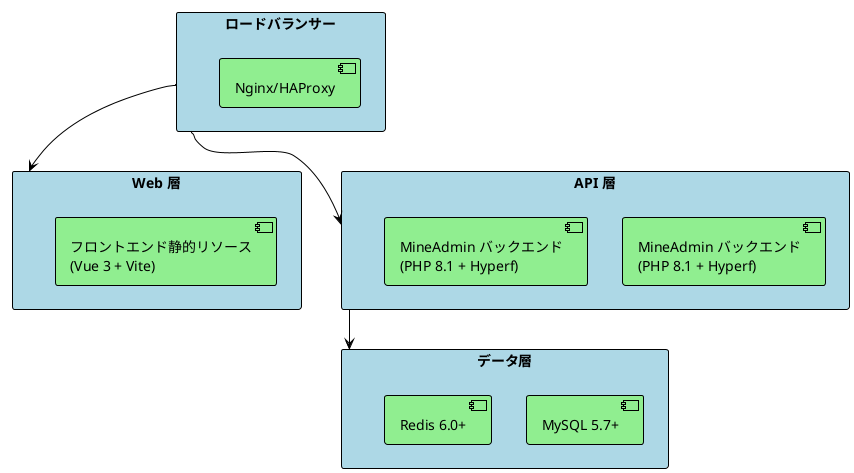

# デプロイ

本記事では、MineAdmin のフロントエンド・バックエンドアプリケーションを様々な環境（開発、テスト、本番環境）にデプロイする方法について説明します。

## デプロイアーキテクチャ概要

MineAdmin はフロントエンド・バックエンド分離アーキテクチャを採用し、以下の技術スタックに基づいています。
- **バックエンド**: PHP 8.1+ + Hyperf フレームワーク + Swoole 拡張機能
- **フロントエンド**: Vue 3 + TypeScript + Vite
- **データベース**: MySQL 5.7+ / PostgreSQL (オプション)
- **キャッシュ**: Redis 6.0+
- **コンテナ化**: Docker + Docker Compose

