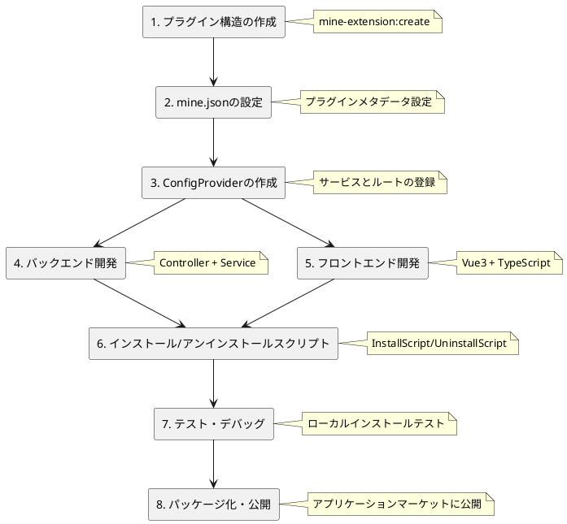

# プラグイン開発ガイド

本ガイドは、実際のMineAdmin公式プラグインコードに基づき、プラグインの完全な開発フローを詳細に説明します。

## 開発フロー概要



## プラグイン構造規約

`app-store` および `code-generator` プラグインの実際のコードに基づき、MineAdmin プラグインには2つの代表的な構造があります。

### シンプルなプラグイン構造（純粋なバックエンドまたは単純な機能に適しています）

```
plugin/mine-admin/plugin-name/
├── mine.json                      # プラグイン設定ファイル
├── install.lock                   # インストールマーク（自動生成）
└── src/
    ├── ConfigProvider.php         # 設定プロバイダー
    ├── Controller/                # コントローラー
    │   └── IndexController.php
    └── Service/                   # サービス層
        └── Service.php
```

### 完全なプラグイン構造（複雑なビジネスに適しています）

```
plugin/mine-admin/plugin-name/
├── mine.json                      # プラグイン設定ファイル
├── install.lock                   # インストールマーク（自動生成）
├── README.md                      # プラグイン説明
├── src/                          # バックエンドコード
│   ├── ConfigProvider.php        # 設定プロバイダー
│   ├── InstallScript.php         # インストールスクリプト
│   ├── UninstallScript.php       # アンインストールスクリプト
│   ├── Http/
│   │   ├── Controller/           # コントローラー
│   │   ├── Request/              # リクエストバリデーション
│   │   └── Vo/                   # 値オブジェクト
│   ├── Model/                    # データモデル
│   ├── Repository/               # リポジトリ層
│   └── Service/                  # サービス層
├── web/                          # フロントエンドコード
│   ├── index.ts                  # プラグインエントリ
│   ├── api/                      # APIインターフェース
│   ├── views/                    # Vueコンポーネント
│   └── locales/                  # 言語パック
├── Database/                     # データベース
│   ├── Migrations/               # マイグレーションファイル
│   └── Seeder/                   # シードデータ
├── languages/                    # バックエンド言語パック
│   └── zh_CN/
└── publish/                      # 公開リソース
    └── template/                 # テンプレートファイル
```

## バックエンド開発

### 1. ConfigProvider 設定プロバイダー

app-store プラグインの実際の実装に基づきます。

```php
<?php
declare(strict_types=1);

namespace Plugin\MineAdmin\AppStore;

class ConfigProvider
{
    public function __invoke(): array
    {
        return [
            // アノテーションスキャン設定 - 必須
            'annotations' => [
                'scan' => [
                    'paths' => [
                        __DIR__,
                    ],
                ],
            ],
            // 依存性注入（オプション）
            'dependencies' => [
                // Interface::class => Implementation::class
            ],
            // コマンドライン（オプション）
            'commands' => [
                // Command::class
            ],
            // ミドルウェア（オプション）
            'middlewares' => [
                'http' => [
                    // Middleware::class
                ],
            ],
            // イベントリスナー（オプション）
            'listeners' => [
                // Listener::class
            ],
        ];
    }
}
```

### 2. コントローラー開発

app-store の IndexController 実装を参考にします。

```php
<?php
declare(strict_types=1);

namespace Plugin\MineAdmin\AppStore\Controller;

use Hyperf\Di\Annotation\Inject;
use Hyperf\HttpServer\Annotation\Controller;
use Hyperf\HttpServer\Annotation\GetMapping;
use Hyperf\HttpServer\Annotation\PostMapping;
use Mine\Annotation\Auth;
use Mine\Annotation\Permission;
use Mine\Annotation\RemoteState;
use Plugin\MineAdmin\AppStore\Service\Service;
use Psr\Http\Message\ResponseInterface;

#[Controller(prefix: "admin/plugin/store")]
#[Auth]
class IndexController extends AbstractController
{
    #[Inject]
    protected Service $service;

    /**
     * リモートプラグイン一覧
     */
    #[GetMapping("index")]
    #[Permission("plugin:store:index")]
    public function index(): ResponseInterface
    {
        return $this->success(
            $this->service->getAppList($this->request->all())
        );
    }

    /**
     * プラグインのダウンロード
     */
    #[PostMapping("download")]
    #[Permission("plugin:store:download")]
    public function download(): ResponseInterface
    {
        $params = $this->request->all();
        $this->service->download($params);
        return $this->success();
    }

    /**
     * プラグインのインストール
     */
    #[PostMapping("install")]
    #[Permission("plugin:store:install")]
    public function install(): ResponseInterface
    {
        $params = $this->request->all();
        $this->service->install($params);
        return $this->success();
    }

    /**
     * プラグインのアンインストール
     */
    #[PostMapping("unInstall")]
    #[Permission("plugin:store:uninstall")]
    public function unInstall(): ResponseInterface
    {
        $params = $this->request->all();
        $this->service->unInstall($params);
        return $this->success();
    }

    /**
     * ローカルプラグインインストール一覧
     */
    #[GetMapping("getInstallList")]
    #[RemoteState]
    public function getInstallList(): ResponseInterface
    {
        return $this->success(
            $this->service->getLocalAppInstallList()
        );
    }

    /**
     * ローカルアップロードインストール
     */
    #[PostMapping("uploadInstall")]
    #[Permission("plugin:store:uploadInstall")]
    public function uploadInstall(): ResponseInterface
    {
        return $this->success(
            $this->service->uploadLocalApp($this->request->all())
        );
    }
}
```

**重要なアノテーションの説明**：
- `#[Controller]`: コントローラーのルートプレフィックスを定義します
- `#[Auth]`: ログイン認証が必要です
- `#[Permission]`: 権限認証
- `#[GetMapping]`/`#[PostMapping]`: ルートメソッドを定義します
- `#[Inject]`: 依存性注入
- `#[RemoteState]`: リモート状態管理

### 3. サービス層開発

app-store の Service 実装パターンに基づきます。

```php
<?php
declare(strict_types=1);

namespace Plugin\MineAdmin\AppStore\Service;

use App\Service\MineAppStoreService;
use Hyperf\Di\Annotation\Inject;
use Mine\AppStore\Plugin;
use Mine\Exception\MineException;

class Service
{
    #[Inject]
    protected MineAppStoreService $service;

    /**
     * アプリケーション一覧の取得
     */
    public function getAppList(array $params): array
    {
        return $this->service->getAppList($params);
    }

    /**
     * アプリケーションのダウンロード
     */
    public function download(array $params): void
    {
        $app = $this->service->getAppInfo($params['identifier']);
        
        if (empty($app['download_url'])) {
            throw new MineException('このアプリケーションはダウンロードできません', 500);
        }
        
        if (Plugin::hasLocalInstalled($params['identifier'])) {
            throw new MineException('アプリケーションは既にローカルに存在します。再ダウンロードするには、先にローカルアプリケーションを削除してください', 500);
        }
        
        $this->service->download($params);
    }

    /**
     * アプリケーションのインストール
     */
    public function install(array $params): void
    {
        $pluginName = $params['name'];
        
        if (!Plugin::hasLocal($pluginName)) {
            throw new MineException('プラグインが存在しません', 500);
        }
        
        if (Plugin::hasLocalInstalled($pluginName)) {
            throw new MineException('プラグインは既にインストールされています', 500);
        }
        
        Plugin::forceRefreshJsonPath($pluginName);
        Plugin::install($pluginName);
    }

    /**
     * アプリケーションのアンインストール
     */
    public function unInstall(array $params): void
    {
        $pluginName = $params['name'];
        
        if (!Plugin::hasLocalInstalled($pluginName)) {
            throw new MineException('プラグインはインストールされていません', 500);
        }
        
        Plugin::uninstall($pluginName);
    }

    /**
     * ローカルにインストールされたプラグイン一覧の取得
     */
    public function getLocalAppInstallList(): array
    {
        $list = [];
        $plugins = Plugin::getLocalPlugins();
        
        foreach ($plugins as $name => $info) {
            $app = ['identifier' => $name];
            $app['name'] = $info['name'] ?? '不明';
            $app['status'] = $info['status'] ?? false;
            $app['version'] = $info['version'] ?? '0.0.0';
            $app['description'] = $info['description'] ?? '説明なし';
            $app['created_at'] = $info['created_at'] ?? '';
            $list[] = $app;
        }
        
        return $list;
    }

    /**
     * ローカルアップロードインストール
     */
    public function uploadLocalApp(array $params): void
    {
        if (empty($params['path'])) {
            throw new MineException('プラグインパッケージをアップロードしてください', 500);
        }
        
        // プラグインパッケージを解凍して検証
        $zipFile = new \ZipArchive();
        $result = $zipFile->open($params['path']);
        
        if ($result !== true) {
            throw new MineException('プラグインパッケージの解凍に失敗しました', 500);
        }
        
        // プラグイン情報を取得してインストール
        $mineJson = $zipFile->getFromName('mine.json');
        if (!$mineJson) {
            throw new MineException('プラグインパッケージの形式が間違っています。mine.jsonがありません', 500);
        }
        
        $config = json_decode($mineJson, true);
        $pluginName = $config['name'] ?? null;
        
        if (!$pluginName) {
            throw new MineException('プラグインパッケージの設定が間違っています', 500);
        }
        
        // プラグインディレクトリに解凍
        $targetPath = Plugin::getPluginPath($pluginName);
        $zipFile->extractTo($targetPath);
        $zipFile->close();
        
        // キャッシュをリフレッシュしてインストール
        Plugin::forceRefreshJsonPath($pluginName);
        Plugin::install($pluginName);
    }
}
```

### 4. モデル層（データベースが必要な場合）

code-generator プラグインのモデル実装を参考にします。

```php
<?php
declare(strict_types=1);

namespace Plugin\MineAdmin\CodeGenerator\Model;

use Mine\MineModel;

class SettingGenerateColumns extends MineModel
{
    protected ?string $table = 'setting_generate_columns';
    
    protected array $fillable = [
        'id', 'table_id', 'column_name', 'column_comment',
        'column_type', 'default_value', 'is_nullable',
        'is_pk', 'is_list', 'is_query', 'is_required',
        'is_sort', 'is_edit', 'is_readonly', 'query_type',
        'view_type', 'dict_type', 'extra', 'sort',
        'created_by', 'updated_by', 'created_at', 'updated_at'
    ];
    
    protected array $casts = [
        'is_pk' => 'boolean',
        'is_list' => 'boolean', 
        'is_query' => 'boolean',
        'is_required' => 'boolean',
        'is_sort' => 'boolean',
        'is_edit' => 'boolean',
        'is_readonly' => 'boolean',
    ];
}
```

## フロントエンド開発

### 1. プラグインエントリファイル (index.ts)

app-store のフロントエンド実装に基づきます。

```typescript
import type { App } from 'vue'
import type { Plugin } from '#/global'

const pluginConfig: Plugin.PluginConfig = {
  install(app: App) {
    // Vueプラグインインストールフック
    console.log('app-store plugin install')
  },
  config: {
    enable: true,
    info: {
      name: 'app-store',
      version: '1.0.0',
      author: 'MineAdmin Team',
      description: 'MineAdminアプリケーションマーケット可視化プラグイン'
    }
  },
  views: [
    {
      name: 'plugin:store',
      path: '/plugin/store',
      meta: {
        title: 'app_store.app_store',
        i18n: true,
        icon: 'material-symbols:app-shortcut',
        type: 'M',
        hidden: false,
        componentPath: '/plugin/mine-admin/app-store/views/index.vue',
        componentName: 'plugin:mine-admin:app-store:index',
      },
      component: () => import('./views/index.vue'),
    }
  ],
}

export default pluginConfig
```

### 2. API インターフェースのカプセル化

```typescript
// api/app-store.ts
import { request } from '@/utils/request'

// リモートプラグイン一覧の取得
export const getAppList = (params: any) => {
  return request.get('/admin/plugin/store/index', { params })
}

// プラグインのダウンロード
export const downloadApp = (data: any) => {
  return request.post('/admin/plugin/store/download', data)
}

// プラグインのインストール
export const installApp = (data: any) => {
  return request.post('/admin/plugin/store/install', data)
}

// プラグインのアンインストール
export const uninstallApp = (data: any) => {
  return request.post('/admin/plugin/store/unInstall', data)
}

// ローカルにインストールされたプラグインの取得
export const getInstalledList = () => {
  return request.get('/admin/plugin/store/getInstallList')
}

// ローカルプラグインのアップロードインストール
export const uploadInstall = (data: any) => {
  return request.post('/admin/plugin/store/uploadInstall', data)
}
```

### 3. Vue コンポーネント開発

```vue
<!-- views/index.vue -->
<template>
  <div class="app-store-container">
    <el-tabs v-model="activeTab">
      <el-tab-pane label="アプリケーションマーケット" name="market">
        <AppMarket />
      </el-tab-pane>
      <el-tab-pane label="インストール済み" name="installed">
        <InstalledApps />
      </el-tab-pane>
      <el-tab-pane label="ローカルアップロード" name="upload">
        <LocalUpload />
      </el-tab-pane>
    </el-tabs>
  </div>
</template>

<script setup lang="ts">
import { ref } from 'vue'
import AppMarket from './components/AppMarket.vue'
import InstalledApps from './components/InstalledApps.vue'
import LocalUpload from './components/LocalUpload.vue'

const activeTab = ref('market')
</script>
```

### 4. 国際化対応

```typescript
// locales/zh_CN.ts
export default {
  app_store: {
    app_store: 'アプリケーションマーケット',
    app_list: 'アプリケーション一覧',
    installed: 'インストール済み',
    install: 'インストール',
    uninstall: 'アンインストール',
    download: 'ダウンロード',
    upload: 'アップロード',
    local_upload: 'ローカルアップロード',
    upload_tips: 'プラグインパッケージファイル（.zip形式）を選択してください',
  }
}
```

## インストールとアンインストールスクリプト

### InstallScript.php

code-generator プラグインの実際の実装に基づきます。

```php
<?php
declare(strict_types=1);

namespace Plugin\MineAdmin\CodeGenerator;

use Hyperf\Command\Concerns\InteractsWithIO;
use Hyperf\Context\ApplicationContext;
use Hyperf\Contract\ApplicationInterface;
use Mine\Helper\Filesystem;
use Symfony\Component\Console\Input\ArrayInput;
use Symfony\Component\Console\Output\ConsoleOutput;
use Symfony\Component\Console\Output\NullOutput;

class InstallScript
{
    use InteractsWithIO;

    public function __invoke()
    {
        // 出力の設定
        $this->output = new ConsoleOutput();
        
        try {
            $this->info('========================================');
            $this->info('MineAdmin コード生成器プラグイン');
            $this->info('========================================');
            $this->info('プラグインのインストールを開始します...');
            
            // 1. テンプレートファイルのコピー
            $this->copyTemplates();
            
            // 2. 言語パックのコピー
            $this->copyLanguages();
            
            // 3. 依存リソースの公開
            $this->publishVendor();
            
            // 4. データベースマイグレーションの実行
            $this->runMigrations();
            
            $this->info('プラグインのインストールが成功しました！');
            $this->info('========================================');
            
        } catch (\Throwable $e) {
            $this->error('プラグインのインストールに失敗しました：' . $e->getMessage());
            throw $e;
        }
    }
    
    /**
     * テンプレートファイルのコピー
     */
    protected function copyTemplates(): void
    {
        $source = dirname(__DIR__) . '/publish/template';
        $target = BASE_PATH . '/runtime/generate/template';
        
        if (!is_dir($target)) {
            mkdir($target, 0755, true);
        }
        
        Filesystem::copy($source, $target, false);
        $this->info('テンプレートファイルのコピーが成功しました');
    }
    
    /**
     * 言語パックのコピー
     */
    protected function copyLanguages(): void
    {
        $source = dirname(__DIR__) . '/languages';
        $target = BASE_PATH . '/storage/languages';
        
        Filesystem::copy($source, $target, false);
        $this->info('言語パックのコピーが成功しました');
    }
    
    /**
     * 依存パッケージリソースの公開
     */
    protected function publishVendor(): void
    {
        $app = ApplicationContext::getContainer()->get(ApplicationInterface::class);
        $app->setAutoExit(false);
        
        $input = new ArrayInput([
            'command' => 'vendor:publish',
            'package' => 'hyperf/translation',
        ]);
        
        $app->run($input, new NullOutput());
        $this->info('依存リソースの公開が成功しました');
    }
    
    /**
     * データベースマイグレーションの実行
     */
    protected function runMigrations(): void
    {
        $migrationPath = dirname(__DIR__) . '/Database/Migrations';
        
        if (!is_dir($migrationPath)) {
            return;
        }
        
        $app = ApplicationContext::getContainer()->get(ApplicationInterface::class);
        $app->setAutoExit(false);
        
        $input = new ArrayInput([
            'command' => 'migrate',
            '--path' => $migrationPath,
            '--force' => true,
        ]);
        
        $app->run($input, new NullOutput());
        $this->info('データベースマイグレーションの実行が成功しました');
    }
}
```

### UninstallScript.php

```php
<?php
declare(strict_types=1);

namespace Plugin\MineAdmin\CodeGenerator;

use Hyperf\Command\Concerns\InteractsWithIO;
use Symfony\Component\Console\Output\ConsoleOutput;

class UninstallScript
{
    use InteractsWithIO;

    public function __invoke()
    {
        $this->output = new ConsoleOutput();
        
        $this->info('========================================');
        $this->info('コード生成器プラグインをアンインストールします');
        $this->info('========================================');
        
        try {
            // テンプレートファイルのクリーンアップ
            $this->cleanTemplates();
            
            // 言語パックのクリーンアップ
            $this->cleanLanguages();
            
            // データベースのクリーンアップ（オプション、要件に応じて決定）
            if ($this->confirm('データベーステーブルをクリーンアップしますか？')) {
                $this->cleanDatabase();
            }
            
            $this->info('プラグインのアンインストールが成功しました！');
            
        } catch (\Throwable $e) {
            $this->error('プラグインのアンインストールに失敗しました：' . $e->getMessage());
            throw $e;
        }
    }
    
    protected function cleanTemplates(): void
    {
        $templatePath = BASE_PATH . '/runtime/generate/template';
        if (is_dir($templatePath)) {
            // ディレクトリを再帰的に削除
            $this->removeDirectory($templatePath);
            $this->info('テンプレートファイルのクリーンアップが成功しました');
        }
    }
    
    protected function cleanLanguages(): void
    {
        // 言語パックファイルのクリーンアップ
        $langFile = BASE_PATH . '/storage/languages/zh_CN/code-generator.php';
        if (file_exists($langFile)) {
            unlink($langFile);
            $this->info('言語パックのクリーンアップが成功しました');
        }
    }
    
    protected function cleanDatabase(): void
    {
        // データベースのクリーンアップを実行
        // 注意：ここは慎重に処理し、ユーザーデータの誤削除を避けてください
        $this->info('データベーステーブルのクリーンアップが成功しました');
    }
    
    private function removeDirectory(string $dir): void
    {
        if (!is_dir($dir)) {
            return;
        }
        
        $files = array_diff(scandir($dir), ['.', '..']);
        foreach ($files as $file) {
            $path = $dir . '/' . $file;
            is_dir($path) ? $this->removeDirectory($path) : unlink($path);
        }
        rmdir($dir);
    }
}
```

## データベースマイグレーション

code-generator のマイグレーションファイルに基づきます。

```php
<?php
use Hyperf\Database\Schema\Schema;
use Hyperf\Database\Schema\Blueprint;
use Hyperf\Database\Migrations\Migration;

return new class extends Migration
{
    /**
     * マイグレーションを実行します。
     */
    public function up(): void
    {
        Schema::create('setting_generate_tables', function (Blueprint $table) {
            $table->engine = 'InnoDB';
            $table->comment('生成業務テーブル');
            $table->bigIncrements('id')->comment('主キー');
            $table->string('table_name', 200)->comment('テーブル名');
            $table->string('table_comment', 500)->comment('テーブルコメント');
            $table->string('module_name', 100)->comment('モジュール名');
            $table->string('namespace', 255)->comment('名前空間');
            $table->string('menu_name', 100)->comment('メニュー名');
            $table->bigInteger('belong_menu_id')->nullable()->comment('所属メニュー');
            $table->string('package_name', 100)->nullable()->comment('パッケージ名');
            $table->addColumn('string', 'type', ['length' => 100])->comment('生成タイプ');
            $table->addColumn('string', 'generate_mode', ['length' => 30])->default('1')->comment('生成方式');
            $table->addColumn('string', 'generate_menus', ['length' => 255])->nullable()->comment('生成メニュー一覧');
            $table->addColumn('string', 'build_menu', ['length' => 10])->default('1')->comment('メニュー構築');
            $table->addColumn('string', 'component_type', ['length' => 30])->default('1')->comment('コンポーネントタイプ');
            $table->json('options')->nullable()->comment('その他の設定');
            $table->bigInteger('created_by')->comment('作成者');
            $table->bigInteger('updated_by')->comment('更新者');
            $table->datetimes();
            $table->unique('table_name');
            $table->index('table_name');
        });
    }

    /**
     * マイグレーションを元に戻します。
     */
    public function down(): void
    {
        Schema::dropIfExists('setting_generate_tables');
    }
};
```

## テストとデバッグ

### 1. ローカルインストールテスト

```bash
# プラグインの作成
php bin/hyperf.php mine-extension:create mine-admin/my-plugin

# プラグインのインストール
php bin/hyperf.php mine-extension:install mine-admin/my-plugin

# インストール済みプラグインの確認
php bin/hyperf.php mine-extension:local-list

# プラグインのアンインストール
php bin/hyperf.php mine-extension:uninstall mine-admin/my-plugin
```

### 2. デバッグテクニック

```php
// サービス層にログを追加
use Hyperf\Context\ApplicationContext;
use Psr\Log\LoggerInterface;

$logger = ApplicationContext::getContainer()->get(LoggerInterface::class);
$logger->info('デバッグ情報', ['data' => $data]);

// dd() 関数を使用したデバッグ
dd($variable);

// 例外を投げてデバッグ
throw new \Exception('デバッグ情報: ' . json_encode($data));
```

### 3. フロントエンドデバッグ

```typescript
// ブラウザコンソールで確認
console.log('デバッグ情報', data)

// Vue DevTools を使用してコンポーネントの状態をデバッグ

// ネットワークリクエストの確認
// ブラウザの Network パネルを使用して API リクエストとレスポンスを確認
```

## 開発のベストプラクティス ⭐

### 1. コード規約

- **命名規則**：
  - プラグイン名：`vendor/plugin-name` 形式
  - 名前空間：`Plugin\Vendor\PluginName`
  - クラス名：PascalCase
  - メソッド名：camelCase

- **PSR 規約**：
  - PSR-4 自動読み込み規約に従う
  - PSR-12 コーディング規約に従う

### 2. ディレクトリ構成の原則

- バックエンドコードは `src/` ディレクトリに統一
- フロントエンドコードは `web/` ディレクトリに統一
- データベース関連は `Database/` ディレクトリ
- 静的リソースは `publish/` ディレクトリ
- 言語パックは `languages/` および `web/locales/` ディレクトリ

### 3. 設定管理 (重要)

- **ConfigProvider の publish 機能に依存しないでください**
- **すべてのファイルコピーと設定公開は InstallScript で処理してください**
- **データベースマイグレーションは InstallScript で実行してください**
- **環境検出は InstallScript で行ってください**

### 4. セキュリティ考慮事項

```php
// パラメータバリデーション
use Hyperf\Validation\Request\FormRequest;

class StoreRequest extends FormRequest
{
    public function rules(): array
    {
        return [
            'name' => 'required|string|max:100',
            'email' => 'required|email',
        ];
    }
}

// 権限制御
#[Permission("plugin:module:action")]
public function action() {}

// SQLインジェクション対策 - パラメータバインディングを使用
$model->where('name', '=', $name)->get();

// XSS対策 - フロントエンドで処理
{{ data | escape }}
```

### 5. パフォーマンス最適化

```php
// 依存性注入を使用して結合度を低減
#[Inject]
protected Service $service;

// キャッシュの使用
use Hyperf\Cache\Annotation\Cacheable;

#[Cacheable(prefix: "plugin", ttl: 3600)]
public function getData() {}

// ルートの遅延読み込み
component: () => import('./views/index.vue')

// データベースクエリの最適化
$query->select(['id', 'name'])->with('relation')->limit(20);
```

### 6. エラー処理

```php
use Mine\Exception\MineException;

// 業務例外
if (!$condition) {
    throw new MineException('エラーメッセージ', 500);
}

// try-catch 処理
try {
    // 業務ロジック
} catch (\Throwable $e) {
    $this->logger->error('操作に失敗しました', [
        'error' => $e->getMessage(),
        'trace' => $e->getTraceAsString()
    ]);
    throw new MineException('操作に失敗しました: ' . $e->getMessage());
}
```

## よくある問題の解決

### Q: プラグインインストール後にアクセスできない？
A:
1. ConfigProvider の annotations 設定が正しいか確認する
2. コントローラーの #[Controller] アノテーションのルートプレフィックスを確認する
3. 権限アノテーション #[Permission] がシステムで設定されているか確認する

### Q: 設定ファイルが公開されない？
A: プラグインの ConfigProvider の publish 機能は信頼性が低いため、InstallScript で手動で設定公開を処理してください。

### Q: データベースマイグレーションに失敗する？
A:
1. データベース接続設定を確認する
2. マイグレーションファイルのパスが正しいか確認する
3. マイグレーションコマンドのエラー出力を確認する

### Q: フロントエンドコンポーネントが表示されない？
A:
1. web/index.ts のルート設定を確認する
2. コンポーネントのパスが正しいか確認する
3. ブラウザコンソールのエラー情報を確認する

### Q: 依存パッケージの競合？
A:
1. mine.json で composer 依存関係のバージョン制約を正しく設定する
2. `composer update` を使用して依存関係を更新する
3. メインプロジェクトとの依存関係の互換性を確認する

## 関連ドキュメント

- [プラグイン構造の詳細](./structure.md)
- [ライフサイクル管理](./lifecycle.md)
- [API リファレンスドキュメント](./api.md)
- [サンプルコード](./examples.md)
- [mine.json 設定](./mineJson.md)
- [ConfigProvider の説明](./configProvider.md)