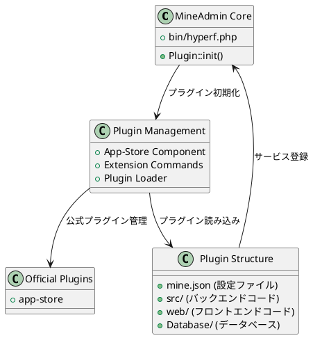

# MineAdmin プラグインシステム

MineAdmin プラグインシステムは強力な拡張機能を提供し、開発者が再利用可能な機能モジュールを作成し、システムのモジュール化と拡張性を実現することを可能にします。

## プラグインシステムアーキテクチャ

MineAdmin のプラグインシステムは Hyperf フレームワークの ConfigProvider メカニズムに基づいており、完全なプラグインライフサイクル管理と自動デプロイ機能を提供します。



## コアコンポーネント

### 1. プラグインローダー
- **ファイル**: `bin/hyperf.php` ([GitHub](https://github.com/mineadmin/mineadmin/blob/master/bin/hyperf.php))
- **原理**: `Plugin::init()` メソッドにより、アプリケーション起動時にインストール済みの全プラグインを自動読み込み
- **実装**: `plugin/` ディレクトリ内のすべてのプラグインをスキャンし、その ConfigProvider を登録

### 2. App-Store コンポーネント
- **リポジトリ**: [mineadmin/appstore](https://github.com/mineadmin/appstore)
- **機能**: プラグインのダウンロード、インストール、アンインストール、更新などの管理機能を提供
- **設定**: `ConfigProvider` を通じてサービスと設定を登録

### 3. プラグイン設定システム
- **コアファイル**: `mine.json`
- **原理**: プラグインのメタデータ、依存関係、インストールスクリプトなどを定義
- **読み込み**: プラグインインストール時に解析され、システムに登録

## 公式プラグイン

MineAdmin はデフォルトで以下の公式プラグインを提供します：

| プラグイン名 | 機能説明 | リポジトリ |
|------------|----------|-----------|
| app-store | アプリケーションマーケット管理プラグイン。プラグインのダウンロード、インストール、アンインストール、更新などの管理機能を提供 | [GitHub](https://github.com/mineadmin/appstore) |

> 注：コードジェネレーター、スケジュールタスク管理などの他のプラグインはアプリケーションマーケットから取得するか、自ら開発できます。

## プラグインタイプ

MineAdmin は3種類のプラグインをサポートします：

### Mixed（複合型プラグイン）
フロントエンドとバックエンドの完全な機能を含み、完全なビジネスモジュールを提供します。

### Backend（バックエンドプラグイン）
バックエンドロジックのみを含み、主にAPIサービスとビジネスロジックを提供します。

### Frontend（フロントエンドプラグイン）
フロントエンドインターフェースのみを含み、主にユーザーインターフェースコンポーネントを提供します。

## クイックスタート

### 環境準備

MineAdmin プラグイン開発には以下が必要です：

1. **技術スタックへの習熟**：MineAdmin と Hyperf フレームワーク
2. **AccessToken の取得**：
   - [MineAdmin 公式サイト](https://www.mineadmin.com/login)にログイン
   - 個人センター → [設定ページ](https://www.mineadmin.com/member/setting)に移動
   - AccessToken を取得

3. **環境変数の設定**：
```ini
# .env ファイル
MINE_ACCESS_TOKEN=あなたのAccessToken
```

::: warning 注意
AccessToken は大切に保管し、漏洩を避けてください！
:::

### 開発者認証

- **ローカル開発**：認証不要。自由に開発・配布可能
- **アプリケーションマーケット公開**：開発者認証が必要。MineAdmin チームに連絡して権限を取得

## 関連ドキュメント

- [クイックスタートガイド](./guide.md) - 最初のプラグインを作成
- [開発ガイド](./develop.md) - 詳細な開発手順
- [プラグイン構造](./structure.md) - ディレクトリ構造の規約
- [ライフサイクル管理](./lifecycle.md) - インストール・アンインストール手順
- [API リファレンス](./api.md) - インターフェースドキュメント
- [サンプルコード](./examples.md) - 実際の事例