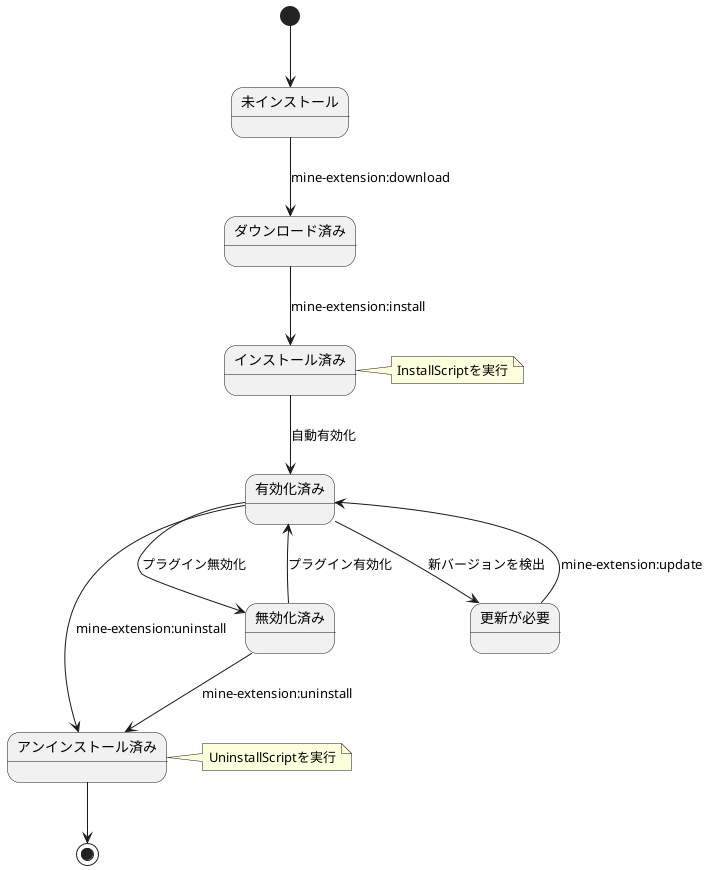
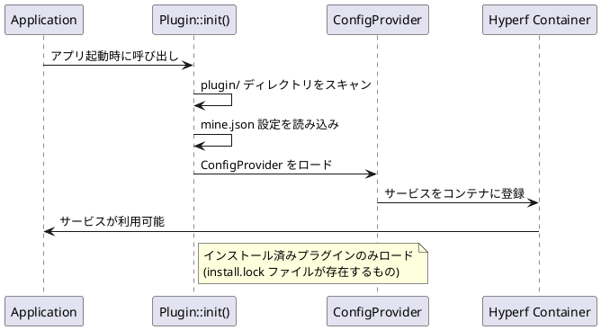
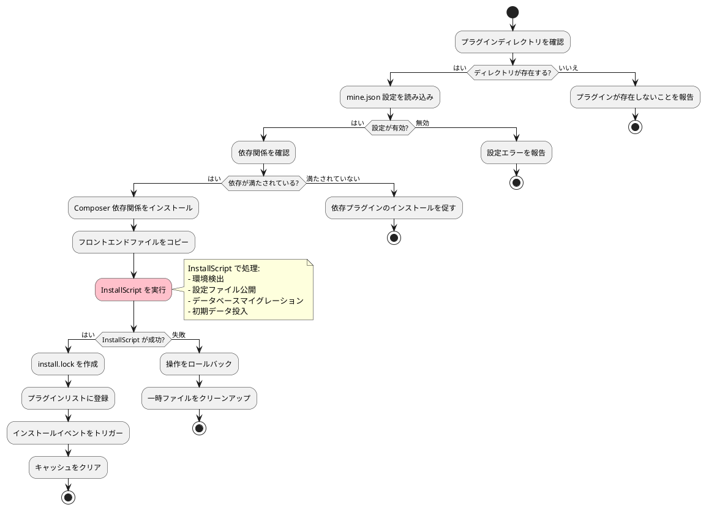
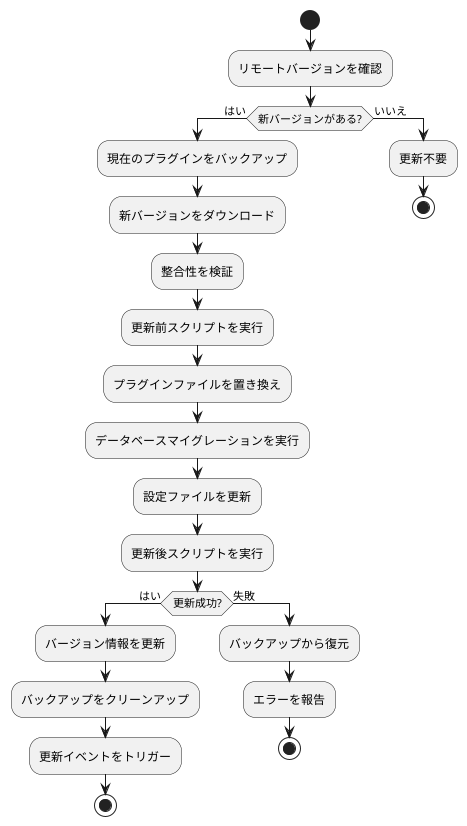
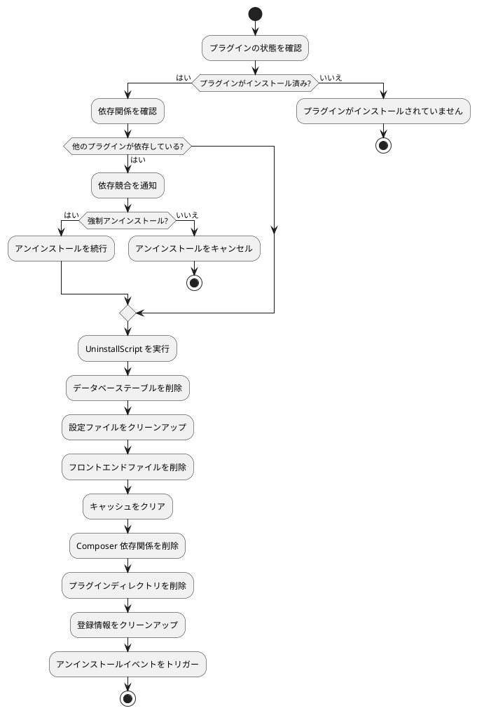

# プラグインライフサイクル管理

MineAdminプラグインのライフサイクル管理について、インストール、有効化、無効化、更新、アンインストールの完全なフローを詳細に説明します。

## ライフサイクル概要

MineAdminプラグインのライフサイクルには、以下の段階があります。



## プラグインの発見とロード

### 1. プラグイン発見メカニズム

**コア実装**: `Plugin::init()` メソッドが `bin/hyperf.php` ([GitHub](https://github.com/mineadmin/mineadmin/blob/master/bin/hyperf.php)) で呼び出されます。



### 2. ロードプロセスの詳細

1. **プラグインディレクトリのスキャン**: `plugin/` ディレクトリ以下のすべてのサブディレクトリを走査
2. **インストール状態の確認**: `install.lock` ファイルの存在を検証
3. **設定の読み込み**: `mine.json` 設定ファイルを解析
4. **ConfigProvider のロード**: プラグインサービスを Hyperf コンテナに登録
5. **ルートの登録**: コントローラールートを自動登録
6. **ミドルウェアのロード**: プラグインミドルウェアを登録
7. **イベントリスナーの登録**: イベントリスナーをロード

## ダウンロード段階

### コマンド使用

```bash
# 指定プラグインのダウンロード
php bin/hyperf.php mine-extension:download --name plugin-name

# ダウンロード可能なプラグイン一覧を表示
php bin/hyperf.php mine-extension:list
```

### ダウンロードプロセス

1. **AccessToken の検証**: `MINE_ACCESS_TOKEN` 環境変数をチェック
2. **リモートリポジトリへのリクエスト**: MineAdmin 公式リポジトリからプラグイン情報を取得
3. **プラグインパッケージのダウンロード**: 圧縮パッケージをローカルの一時ディレクトリにダウンロード
4. **ファイルの解凍**: `plugin/vendor/plugin-name/` ディレクトリに解凍
5. **整合性の検証**: `mine.json` ファイルが存在し、形式が正しいことを確認

### 実装原理

**コアサービス**: App-Store コンポーネント ([GitHub](https://github.com/mineadmin/appstore)) がダウンロード機能を提供

```php
// 疑似コード例
class DownloadService 
{
    public function download(string $pluginName): bool
    {
        // 1. アクセストークンの検証
        $this->validateAccessToken();
        
        // 2. プラグイン情報の取得
        $pluginInfo = $this->getPluginInfo($pluginName);
        
        // 3. プラグインパッケージのダウンロード
        $packagePath = $this->downloadPackage($pluginInfo['download_url']);
        
        // 4. ターゲットディレクトリに解凍
        $this->extractPackage($packagePath, $this->getPluginPath($pluginName));
        
        return true;
    }
}
```

## インストール段階

### コマンド使用

```bash
# プラグインのインストール
php bin/hyperf.php mine-extension:install vendor/plugin-name --yes

# 強制再インストール
php bin/hyperf.php mine-extension:install vendor/plugin-name --force
```

### インストールフローの詳細

> ⚠️ **重要なお知らせ**: 設定ファイルの公開、環境検出、データベースマイグレーションは `InstallScript` で処理する必要があります。ConfigProvider の publish 機能に依存しないでください。



### 1. 事前チェック

```php
// インストール前のチェックロジック
class InstallChecker
{
    public function check(string $pluginPath): array
    {
        $errors = [];
        
        // プラグインディレクトリの確認
        if (!is_dir($pluginPath)) {
            $errors[] = 'プラグインディレクトリが存在しません';
        }
        
        // mine.json の確認
        $configPath = $pluginPath . '/mine.json';
        if (!file_exists($configPath)) {
            $errors[] = 'mine.json 設定ファイルが存在しません';
        }
        
        // 依存関係の確認
        $config = json_decode(file_get_contents($configPath), true);
        foreach ($config['require'] ?? [] as $dependency => $version) {
            if (!$this->isDependencyMet($dependency, $version)) {
                $errors[] = "依存関係 {$dependency} バージョン {$version} が満たされていません";
            }
        }
        
        return $errors;
    }
}
```

### 2. Composer 依存関係のインストール

インストールプロセスでは、プラグインの Composer 依存関係を処理します。

```json
// mine.json の composer 設定
{
  "composer": {
    "require": {
      "hyperf/async-queue": "^3.0",
      "symfony/console": "^6.0"
    },
    "psr-4": {
      "Plugin\\Vendor\\PluginName\\": "src"
    }
  }
}
```

システムは自動的に以下を実行します。
```bash
composer require hyperf/async-queue:^3.0 symfony/console:^6.0
```

### 3. InstallScript 処理 ⭐

> **ベストプラクティス**: データベースマイグレーション、設定公開、環境検出は `InstallScript` で処理する必要があります。

```php
// InstallScript で全てのインストールロジックを処理
class InstallScript
{
    public function handle(): bool
    {
        // 1. 環境検出
        if (!$this->checkEnvironment()) {
            echo "環境が要件を満たしていません\n";
            return false;
        }
        
        // 2. 設定ファイルの公開（ConfigProvider の publish は使用しない）
        $this->publishConfig();
        
        // 3. データベースマイグレーションの実行
        if (!$this->runMigrations()) {
            echo "データベースマイグレーションに失敗しました\n";
            return false;
        }
        
        // 4. データの初期化
        $this->seedData();
        
        return true;
    }
    
    private function publishConfig(): void
    {
        $source = __DIR__ . '/../publish/config/plugin.php';
        $target = BASE_PATH . '/config/autoload/plugin.php';
        
        if (!file_exists($target)) {
            copy($source, $target);
            echo "設定ファイルが公開されました\n";
        }
    }
    
    private function runMigrations(): bool
    {
        $migrationPath = __DIR__ . '/../Database/Migrations';
        
        if (is_dir($migrationPath)) {
            // Hyperf のマイグレーションコマンドを使用
            $container = \Hyperf\Context\ApplicationContext::getContainer();
            $application = $container->get(\Hyperf\Contract\ApplicationInterface::class);
            
            $input = new \Symfony\Component\Console\Input\ArrayInput([
                'command' => 'migrate',
                '--path' => $migrationPath,
            ]);
            
            $output = new \Symfony\Component\Console\Output\BufferedOutput();
            $exitCode = $application->run($input, $output);
            
            return $exitCode === 0;
        }
        
        return true;
    }
}
```

### 4. フロントエンドファイルのコピー

`web/` ディレクトリ以下のファイルをフロントエンドプロジェクトにコピーします。

```
plugin/vendor/plugin-name/web/    →    フロントエンドプロジェクト該当ディレクトリ
├── views/example.vue             →    src/views/plugin/vendor/plugin-name/example.vue
├── components/ExampleComp.vue    →    src/components/plugin/vendor/plugin-name/ExampleComp.vue
└── api/example.js                →    src/api/plugin/vendor/plugin-name/example.js
```

### 5. 設定ファイルの公開 ⚠️

> **注意**: プラグインシステムでは ConfigProvider の `publish` 機能は信頼できないため、InstallScript で手動処理する必要があります。

```php
// 非推奨：ConfigProvider の publish は動作しない可能性がある
'publish' => [
    // この方法はプラグインでは実行されない可能性がある
]

// 推奨：InstallScript で手動公開
protected function publishConfig(): void
{
    $configs = [
        [
            'source' => __DIR__ . '/../publish/config/plugin.php',
            'target' => BASE_PATH . '/config/autoload/plugin.php',
        ],
        [
            'source' => __DIR__ . '/../publish/config/routes.php',
            'target' => BASE_PATH . '/config/routes/plugin.php',
        ],
    ];
    
    foreach ($configs as $config) {
        if (!file_exists($config['target'])) {
            copy($config['source'], $config['target']);
            echo "設定ファイルが公開されました: {$config['target']}\n";
        }
    }
}
```

### 6. インストールロックファイルの作成

インストール成功後、`install.lock` ファイルを作成してインストール状態をマークします。

```
plugin/vendor/plugin-name/install.lock
```

ファイル内容にはインストール情報が含まれます。
```json
{
  "installed_at": "2024-01-01 12:00:00",
  "version": "1.0.0",
  "installer": "admin",
  "checksum": "abc123..."
}
```

## 有効化/無効化管理

### プラグイン状態制御

MineAdmin はプラグインをアンインストールせずに一時的に無効化することをサポートしています。

```bash
# プラグインの無効化
php bin/hyperf.php mine-extension:disable vendor/plugin-name

# プラグインの有効化  
php bin/hyperf.php mine-extension:enable vendor/plugin-name

# プラグイン状態の確認
php bin/hyperf.php mine-extension:status vendor/plugin-name
```

### 状態管理メカニズム

状態情報は `install.lock` ファイルに保存されます。

```json
{
  "installed_at": "2024-01-01 12:00:00",
  "version": "1.0.0",
  "status": "enabled",  // enabled | disabled
  "disabled_at": null,
  "disabled_reason": null
}
```

## 更新段階

### 更新確認

```bash
# プラグインの更新を確認
php bin/hyperf.php mine-extension:check-updates

# 指定プラグインの更新
php bin/hyperf.php mine-extension:update vendor/plugin-name

# 全プラグインの更新
php bin/hyperf.php mine-extension:update-all
```

### 更新フロー



### バージョン互換性処理

更新時にはバージョン互換性がチェックされます。

```php
class UpdateManager
{
    public function checkCompatibility(string $currentVersion, string $newVersion): bool
    {
        // メジャーバージョンの互換性を確認
        $current = $this->parseVersion($currentVersion);
        $new = $this->parseVersion($newVersion);
        
        // メジャーバージョンが異なる場合、破壊的な変更がある可能性がある
        if ($current['major'] !== $new['major']) {
            return $this->checkBreakingChanges($currentVersion, $newVersion);
        }
        
        return true;
    }
}
```

## アンインストール段階

### コマンド使用

```bash
# プラグインのアンインストール
php bin/hyperf.php mine-extension:uninstall vendor/plugin-name --yes

# 強制アンインストール（エラーを無視）
php bin/hyperf.php mine-extension:uninstall vendor/plugin-name --force
```

### アンインストールフロー



### アンインストールスクリプトの実行

```php
// UninstallScript の例
class UninstallScript
{
    public function handle(): bool
    {
        try {
            // 1. データベースのクリーンアップ
            $this->cleanDatabase();
            
            // 2. 設定ファイルのクリーンアップ
            $this->cleanConfigFiles();
            
            // 3. キャッシュデータのクリーンアップ
            $this->cleanCache();
            
            // 4. ログファイルのクリーンアップ
            $this->cleanLogs();
            
            // 5. カスタムクリーンアップロジックの実行
            $this->customCleanup();
            
            return true;
        } catch (\Exception $e) {
            logger()->error('プラグインアンインストール失敗: ' . $e->getMessage());
            return false;
        }
    }
    
    private function cleanDatabase(): void
    {
        // プラグイン関連テーブルの削除
        DB::statement('DROP TABLE IF EXISTS plugin_example');
        
        // 設定データのクリーンアップ
        DB::table('system_config')->where('key', 'like', 'plugin.example.%')->delete();
    }
}
```

## エラー処理とロールバック

### インストールエラーのロールバック

インストール処理中にエラーが発生した場合、システムは自動的にロールバックします。

```php
class InstallRollback
{
    public function rollback(string $pluginPath, array $operations): void
    {
        foreach (array_reverse($operations) as $operation) {
            try {
                switch ($operation['type']) {
                    case 'database':
                        $this->rollbackDatabase($operation['data']);
                        break;
                    case 'files':
                        $this->rollbackFiles($operation['data']);
                        break;
                    case 'config':
                        $this->rollbackConfig($operation['data']);
                        break;
                }
            } catch (\Exception $e) {
                logger()->error('ロールバック操作失敗: ' . $e->getMessage());
            }
        }
    }
}
```

### 依存競合処理

プラグイン間に依存競合が存在する場合の処理方法です。

```php
class DependencyResolver
{
    public function resolveConflicts(array $conflicts): array
    {
        $solutions = [];
        
        foreach ($conflicts as $conflict) {
            $solution = match($conflict['type']) {
                'version_conflict' => $this->resolveVersionConflict($conflict),
                'circular_dependency' => $this->resolveCircularDependency($conflict),
                'missing_dependency' => $this->resolveMissingDependency($conflict),
                default => null
            };
            
            if ($solution) {
                $solutions[] = $solution;
            }
        }
        
        return $solutions;
    }
}
```

## イベントシステム

プラグインライフサイクルの各段階で、対応するイベントがトリガーされます。

### イベント一覧

```php
// プラグインライフサイクルイベント
class PluginEvents
{
    const BEFORE_INSTALL = 'plugin.before_install';
    const AFTER_INSTALL = 'plugin.after_install';
    const BEFORE_UNINSTALL = 'plugin.before_uninstall';
    const AFTER_UNINSTALL = 'plugin.after_uninstall';
    const BEFORE_UPDATE = 'plugin.before_update';
    const AFTER_UPDATE = 'plugin.after_update';
    const ENABLED = 'plugin.enabled';
    const DISABLED = 'plugin.disabled';
}
```

### イベントリスナーの例

```php
use Hyperf\Event\Annotation\Listener;
use Hyperf\Event\Contract\ListenerInterface;

#[Listener]
class PluginInstallListener implements ListenerInterface
{
    public function listen(): array
    {
        return [
            PluginEvents::AFTER_INSTALL,
        ];
    }

    public function process(object $event): void
    {
        // プラグインインストール後の処理ロジック
        logger()->info('プラグインのインストールが完了しました', [
            'plugin' => $event->getPluginName(),
            'version' => $event->getVersion()
        ]);
        
        // キャッシュのクリア
        $this->clearCache($event->getPluginName());
        
        // 通知の送信
        $this->sendNotification($event);
    }
}
```

## 状態確認

### プラグイン状態の表示

```bash
# ローカルの全プラグイン状態を表示
php bin/hyperf.php mine-extension:local-list

# リモートで利用可能なプラグインを表示
php bin/hyperf.php mine-extension:list

# 特定プラグインの詳細を表示
php bin/hyperf.php mine-extension:info vendor/plugin-name
```

### 状態情報の構造

```json
{
  "name": "vendor/plugin-name",
  "version": "1.0.0",
  "status": "enabled",
  "installed_at": "2024-01-01 12:00:00",
  "last_updated": "2024-01-15 10:30:00",
  "dependencies": [
    "vendor/dependency-plugin"
  ],
  "dependents": [
    "vendor/dependent-plugin"
  ],
  "file_integrity": "valid",
  "database_status": "migrated"
}
```

## ベストプラクティス

### 1. インストールスクリプトの設計

- 冪等性の実現：複数回実行しても結果が同じになること
- 詳細なエラー情報の提供
- トランザクションロールバックのサポート
- 操作ログの記録

### 2. アンインストールスクリプトの設計  

- プラグインデータの完全なクリーンアップ
- ユーザー重要データのバックアップオプションの保持
- 依存関係の処理
- グレースフルデグラデーション

### 3. バージョン管理

- セマンティックバージョニング仕様に従う
- アップグレードパスの説明を提供
- 破壊的な変更を明記
- 更新ログの管理

## 関連ドキュメント

- [プラグイン開発ガイド](./develop.md) - 開発フロー
- [プラグイン構造説明](./structure.md) - ディレクトリ構造
- [API リファレンス](./api.md) - インターフェースドキュメント
- [サンプルコード](./examples.md) - 実践例