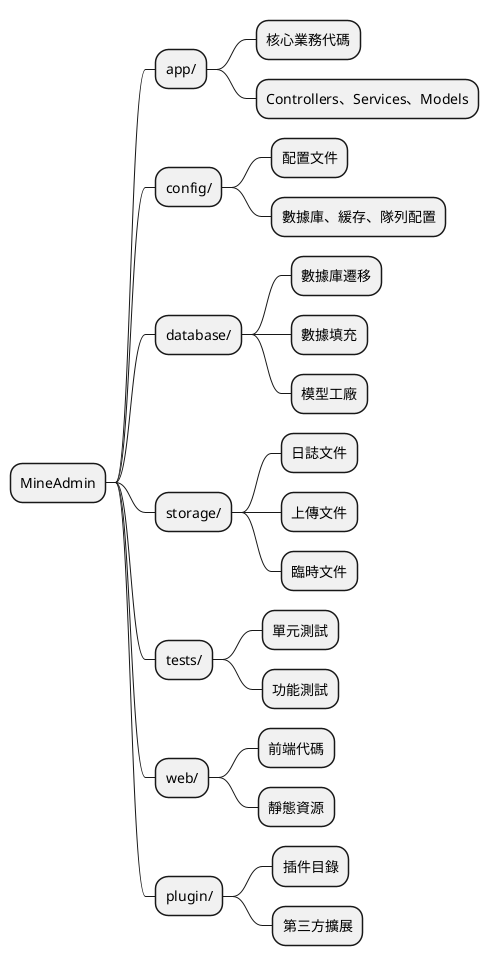
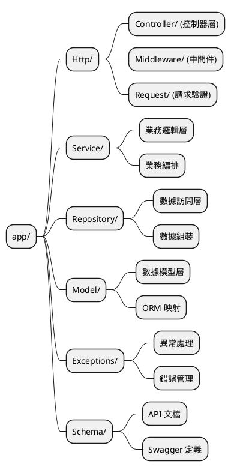
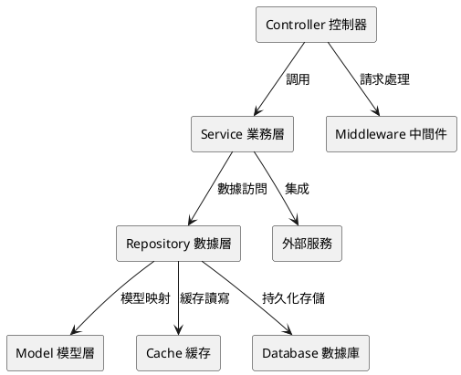

# 項目目錄結構

MineAdmin 採用現代化的分層架構設計，提供清晰的代碼組織結構和最佳實踐。本文檔將詳細介紹項目的目錄結構、設計理念以及開發規範。

## 概述

MineAdmin 的項目結構參考了 [Laravel](https://laravel.com/) 框架的設計理念，同時結合了現代化的分層架構模式。如果你熟悉 Laravel 開發，那麼理解 MineAdmin 的結構將會非常容易。

### 架構理念

MineAdmin 採用以下核心設計原則：

- **分層架構**：Controller → Service → Repository → Model 的清晰分層
- **職責分離**：每個目錄都有明確的職責邊界
- **可擴展性**：支持插件化開發和模塊化擴展
- **標準化**：遵循 PSR 規範和最佳實踐

## 項目根目錄結構



### 目錄詳細説明

#### `/app` - 應用核心目錄

應用程序的核心業務邏輯所在地，包含控制器、服務層、數據層等核心組件。

**主要特點：**
- 包含 99% 的業務代碼
- 遵循 MVC 分層架構
- 支持模塊化開發

#### `/config` - 配置目錄

存放所有應用程序配置文件，提供靈活的環境配置管理。

**典型配置文件：**
- `database.php` - 數據庫配置
- `cache.php` - 緩存配置  
- `queue.php` - 隊列配置

#### `/database` - 數據庫目錄

管理數據庫相關的所有文件，包括結構變更和測試數據。

**目錄結構：**
```
database/
├── migrations/     # 數據庫遷移文件
├── seeders/        # 數據填充文件
```

#### `/storage` - 存儲目錄

存放應用程序運行時產生的文件和數據。

**目錄用途：**
- `uploads/` - 用户上傳文件
- `swagger/` - API 文檔文件

#### `/tests` - 測試目錄

包含自動化測試套件，確保代碼質量和功能正確性。

**測試類型：**
- **單元測試** - 測試單個類或方法
- **功能測試** - 測試完整的業務流程
- **API 測試** - 測試 API 接口

#### `/web` - 前端目錄

存放前端應用代碼和靜態資源文件。

#### `/plugin` - 插件目錄

存放從插件市場下載的插件包，支持系統功能擴展。

## App 目錄深度解析

`app` 目錄是整個應用的核心，採用嚴格的分層架構設計。



### Http 目錄 - 請求處理層

負責處理所有 HTTP 請求的入口層，包含控制器、中間件和請求驗證。

#### 目錄結構
```
Http/
├── Admin/              # 後台管理模塊
│   ├── Controller/     # 後台控制器
│   ├── Middleware/     # 後台中間件
│   ├── Request/        # 後台請求驗證類
│   ├── Subscriber/     # 事件訂閲者
│   └── Vo/            # 值對象類
├── Api/                # API 接口模塊
│   ├── Controller/     # API 控制器
│   │   └── V1/        # API 版本控制
│   ├── Middleware/     # API 中間件
│   └── Request/        # API 請求驗證類
│       └── V1/        # API 版本請求類
├── Common/             # 通用模塊
│   ├── Controller/     # 通用控制器
│   ├── Event/         # 事件類
│   ├── Middleware/     # 通用中間件
│   ├── Request/        # 通用請求類
│   ├── Result.php      # 響應結果類
│   ├── ResultCode.php  # 結果狀態碼
│   └── Swagger/        # API 文檔配置
└── CurrentUser.php     # 當前用户上下文
```

#### 模塊化架構説明

**Admin 模塊** - 後台管理功能
- 包含權限管理、用户管理、菜單管理等後台功能
- 採用完整的 MVC 結構，包含事件訂閲者和值對象

**Api 模塊** - 對外 API 接口  
- 支持版本控制（V1, V2 等）
- 獨立的認證中間件和請求驗證
- RESTful API 設計規範

**Common 模塊** - 通用組件
- 提供跨模塊共享的基礎功能
- 統一的響應格式和狀態碼管理
- API 文檔自動生成配置

### Service 目錄 - 業務邏輯層

Service 層是核心業務邏輯的實現場所，負責業務規則的編排和執行。

#### 設計原則

1. **單一職責** - 每個 Service 類只處理一個業務域
2. **依賴注入** - 通過構造函數注入依賴
3. **事務管理** - 確保業務操作的原子性
4. **異常處理** - 統一的異常處理機制

#### Service 層職責

**核心功能：**
- 業務邏輯編排和執行
- 事務管理和數據一致性
- 調用 Repository 層進行數據操作
- 業務規則驗證和處理

### Repository 目錄 - 數據訪問層

Repository 模式提供了數據訪問的抽象層，封裝了數據查詢和操作邏輯。

#### 設計特點

- **數據源抽象** - 可以輕鬆切換數據源（MySQL、Redis、ES等）
- **查詢複用** - 公共查詢邏輯的複用
- **緩存集成** - 透明的緩存層集成
- **性能優化** - 查詢優化和批量操作

#### Repository 層特點

**主要職責：**
- 數據訪問抽象層  
- 複雜查詢邏輯封裝
- 緩存策略實現
- 數據源切換和優化

### Model 目錄 - 數據模型層

Model 層基於 Hyperf 的 Eloquent ORM，提供數據庫表的對象關係映射。

#### 模型特性

- **關聯關係** - 定義表之間的關聯
- **訪問器/修改器** - 數據格式化
- **事件監聽** - 模型生命週期事件
- **軟刪除** - 邏輯刪除支持

#### Model 層特性

**核心功能：**
- 數據表映射和關係定義
- 屬性訪問器和修改器
- 模型事件和觀察者
- 數據類型轉換和驗證

### Exceptions 目錄 - 異常處理

統一的異常處理機制，提供友好的錯誤信息和日誌記錄。


### Schema 目錄 - API 文檔

包含 Swagger/OpenAPI 文檔定義，用於 API 文檔生成。

::: danger 重要提醒
Schema 類嚴格禁止參與業務邏輯調度，僅用於 API 文檔生成。
:::


## 開發最佳實踐

### 代碼組織規範

1. **命名規範**
   - 類名使用 `PascalCase`
   - 方法名使用 `camelCase`  
   - 常量使用 `UPPER_SNAKE_CASE`

2. **文件組織**
   - 一個文件一個類
   - 文件名與類名保持一致
   - 合理使用命名空間

3. **依賴注入**
   - 優先使用構造函數注入
   - 避免使用靜態調用
   - 面向接口編程

### 架構模式建議



### 錯誤處理策略

1. **異常分類**
   - 業務異常 - 可預期的錯誤
   - 系統異常 - 不可預期的錯誤
   - 驗證異常 - 數據格式錯誤

2. **日誌記錄**
   - 關鍵操作記錄
   - 異常信息記錄
   - 性能監控記錄

## 相關資源

### 參考文檔

- [Laravel 官方文檔](https://laravel.com/docs/11.x)
- [Laravel 中文文檔](https://learnku.com/docs/laravel/10.x)
- [Hyperf 協程框架](https://hyperf.wiki/3.1/#/en/)

::: warning ORM 差異説明
MineAdmin 使用的是由 [Hyperf](https://github.com/hyperf/hyperf) 維護的協程版 Eloquent ORM，在用法上與 Laravel 官方版本存在一定差異。在開發時請注意協程環境下的特殊用法。
:::

