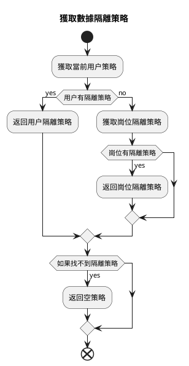

# 數據權限配置與使用示例

本文將講解在數據權限配置中各種策略的配置與使用方式

## 數據隔離方式

數據隔離目前僅支持行級隔離，但是支持多種隔離策略。

主要分為以創建人、所屬部門為依據的隔離方式。

* `部門`隔離以用户當前所屬部門為依據，查詢數據時會自動添加部門過濾條件。
* `創建人`隔離以數據創建人作為依據，查詢數據時會自動添加創建人過濾條件。

## 優先級

目前支持`對指定用户設置隔離策略`，`為用户指定崗位，對崗位設置隔離策略`兩種方式
如果用户同時設置了隔離策略和崗位隔離策略，則會優先使用對指定用户設置的隔離策略。



邏輯代碼為

```php
// app/Model/Permission/User.php:167~186

public function getPolicy(): ?Policy
{
    /**
     * @var null|Policy $policy
     */
    $policy = $this->policy()->first();
    if (! empty($policy)) {
        return $policy;
    }

    $this->load('position');
    $positionList = $this->position;
    foreach ($positionList as $position) {
        $current = $position->policy()->first();
        if (! empty($current)) {
            return $current;
        }
    }
    return null;
}

```

## 示例

以現在的表 `user` 為隔離表，假設有以下數據：

### 示例數據

部門表

---

| id | name | parent_id |
|----|------|-----------|
| 1  | 部門1  | 0         |
| 2  | 部門2  | 1         |
| 3  | 部門3  | 0         |

部門 1 是頂級部門，沒有父部門。
部門 2 屬於部門 1 的子部門。
部門 3 是頂級部門，沒有父部門。

---

崗位表

| id | name | dept_id |
|----|------|---------|
| 1  | 崗位1  | 1       |
| 2  | 崗位2  | 2       |
| 3  | 崗位3  | 3       |

部門 1 有崗位 1，部門 2 有崗位 2，部門 3 有崗位 3。

---

用户表

| id | name  | dept_id | created_by | post_id |
|----|-------|---------|------------|---------|
| 1  | 超級管理員 | 0       | 0          | 0       |
| 2  | a1    | 1       | 1          | 1       |
| 3  | a2    | 2       | 1          | 1       |
| 4  | a3    | 1       | 2          | 2       |
| 5  | a4    | 2       | 2          | 0       |
| 6  | a5    | 0       | 4          | 0       |

用户表中，`dept_id` 為 0 的用户標識沒有部門，`created_by` 為 0 的用户標識沒有創建人。
超管員可以看到所有數據。

a1、a3 屬於部門1，a2、a4 屬於部門2。

a1、a2 的創建人是超級管理員，a3、a4 的創建人是 a1。

a1、a2 的崗位是崗位1，a3 的崗位是崗位2，a4 沒有崗位。

以下舉一些例子，講明在不同策略中數據的查詢結果。

### PolicyType::SELF `僅查詢自己`

假設當前用户 id 為 2 的 a1 用户，設置了僅查詢自己策略。

1. 隔離方式為僅根據創建人隔離。 則會拼接查詢條件為 `創建人為當前用户 id`，也就是查詢到用户 a3、a4。

```sql
SELECT * FROM user WHERE created_by in (4,5);
```

2. 隔離方式為僅根據部門隔離，則會拼接查詢條件為 `部門為當前用户所在部門`，也就是查詢到用户 a1、a3。

```sql
SELECT * FROM user WHERE dept_id in(1);
```

3. 隔離方式為根據創建人和部門隔離，則會拼接查詢條件為 `創建人為當前用户 id` 並且 `部門為當前用户所在部門`，也就是查詢到用户 a3。

```sql
SELECT * FROM user WHERE created_by in(2) AND dept_id in(1);
```
4. 隔離方式為根據部門 or 創建人過濾，則會拼接查詢條件為 `創建人為當前用户 id` 或者 `部門為當前用户所在部門`，也就是查詢到用户 a1、a3、a4。

```sql
SELECT * FROM user WHERE dept_id in(1) OR created_by in(2);
```

### PolicyType::DEPT_SELF `僅查詢本部門`

假設當前用户 id 為 2 的 a1 用户，設置了僅查詢本部門策略。

1. 隔離方式為僅根據創建人隔離。則會拼接查詢條件為 `創建人為當前用户同屬部門下的所有用户 id`，也就是查詢到用户 a3、a4、a5。

```sql

SELECT * FROM user WHERE created_by in (2,4,5);

```

2. 隔離方式為僅根據部門隔離。則會拼接查詢條件為 `部門為當前用户所在部門`，也就是查詢到用户 a1、a3。

```sql

SELECT * FROM user WHERE dept_id in(1);
```

3. 隔離方式為根據創建人和部門隔離。則會拼接查詢條件為 `創建人為當前用户同屬部門下的所有用户 id` 並且 `部門為當前用户所在部門`，也就是查詢到用户 a3。

```sql
SELECT * FROM user WHERE created_by in(2,4,5) AND dept_id in(1);
```

4. 隔離方式為根據部門 or 創建人過濾。則會拼接查詢條件為 `創建人為當前用户同屬部門下的所有用户 id` 或者 `部門為當前用户所在部門`，也就是查詢到用户 a1、a3、a4、a5。

```sql
SELECT * FROM user WHERE created_by in(2,4,5) OR dept_id in(1);
```

### PolicyType::DEPT_TREE `查詢本部門及子部門`

假設當前用户 id 為 2 的 a1 用户，設置了查詢本部門及子部門策略。

1. 隔離方式為僅根據創建人隔離。則會拼接查詢條件為 `創建人為當前用户同屬部門以及下級部門的所有用户 id`，也就是查詢到用户 a3、a4、a5。

```sql
SELECT * FROM user WHERE created_by in (2,4,5);
```

2. 隔離方式為僅根據部門隔離。則會拼接查詢條件為 `部門為當前用户所在部門及下級部門`，也就是查詢到用户 a1、a2、a3、a4。

```sql

SELECT * FROM user WHERE dept_id in(1,2);
```

3. 隔離方式為根據創建人和部門隔離。則會拼接查詢條件為 `創建人為當前用户同屬部門以及下級部門的所有用户 id` 並且 `部門為當前用户所在部門及下級部門`，也就是查詢到用户 a3、a4。

```sql
SELECT * FROM user WHERE created_by in(2,4,5) AND dept_id in(1,2);
```

4. 隔離方式為根據部門 or 創建人過濾。則會拼接查詢條件為 `創建人為當前用户同屬部門以及下級部門的所有用户 id` 或者 `部門為當前用户所在部門及下級部門`，也就是查詢到用户 a1、a2、a3、a4、a5。

```sql
SELECT * FROM user WHERE created_by in(2,4,5) OR dept_id in(1,2);
```

### PolicyType::ALL `查詢所有`
假設當前用户 id 為 2 的 a1 用户，設置了查詢所有策略。則會取消所有限制

### PolicyType::CUSTOM_DEPT `自定義部門`

假設當前用户 id 為 2 的 a1 用户，設置了只能查看部門 2 和 3 的數據。

1. 隔離方式為僅根據創建人隔離。則會拼接查詢條件為 `創建人所屬部門為 2 和 3 的所有用户 id`，也就是查詢到用户 a2、a4、a5。

```sql
SELECT * FROM user WHERE created_by in (2,4,5);
```

2. 隔離方式為僅根據部門隔離。則會拼接查詢條件為 `部門為 2 和 3`，也就是查詢到用户 a2、a4。

```sql
SELECT * FROM user WHERE dept_id in(2,3);
```

3. 隔離方式為根據創建人和部門隔離。則會拼接查詢條件為 `創建人所屬部門為 2 和 3 的所有用户 id` 並且 `部門為 2 和 3`，也就是查詢到用户 a2、a4。

```sql
SELECT * FROM user WHERE created_by in(2,4,5) AND dept_id in(2,3);
```

4. 隔離方式為根據部門 or 創建人過濾。則會拼接查詢條件為 `創建人所屬部門為 2 和 3 的所有用户 id` 或者 `部門為 2 和 3`，也就是查詢到用户 a2、a4、a5。

```sql
SELECT * FROM user WHERE created_by in(2,4,5) OR dept_id in(2,3);
```

### PolicyType::CUSTOM_FUNC `自定義函數`

假設當前用户 id 為 2 的 a1 用户，設置了自定義函 `testction` 的策略

在 `config/autoload/department/custom.php` 中定義了自定義函數 `testction`：

```php
<?php

declare(strict_types=1);
/**
 * This file is part of MineAdmin.
 *
 * @link     https://www.mineadmin.com
 * @document https://doc.mineadmin.com
 * @contact  root@imoi.cn
 * @license  https://github.com/mineadmin/MineAdmin/blob/master/LICENSE
 */

use App\Library\DataPermission\Context;
use App\Library\DataPermission\ScopeType;
use App\Model\DataPermission\Policy;
use App\Model\Permission\User;
use Hyperf\Database\Query\Builder;

return [
    'testction' =>  function (Builder $builder, ScopeType $scopeType, Policy $policy, User $user) {
        // 只針對 id 為 2 的用户生效
        if ($user->id !== 2) {
            return;
        }
        // 獲取當前上下文中的創建人字段名稱
        $createdByColumn = Context::getCreatedByColumn();
        // 獲取當前上下文中的部門字段名稱
        $deptColumn = Context::getDeptColumn();
        switch ($scopeType){
            // 隔離類型為根據創建人
            case ScopeType::CREATED_BY:
                // 創建人字段為當前用户
                $builder->where($createdByColumn, $user->id);
                break;
            case ScopeType::DEPT:
                // 部門字段為當前用户部門
                $builder->whereIn($deptColumn, $user->department()->get()->pluck('id'));
                break;
            case ScopeType::DEPT_CREATED_BY:
                // 部門字段為當前用户部門
                $builder->whereIn($deptColumn, $user->department()->get()->pluck('id'));
                // 創建人為當前用户
                $builder->where($createdByColumn, $user->id);
                break;
            case ScopeType::DEPT_OR_CREATED_BY:
                // 部門字段為當前用户部門
                $builder->whereIn($deptColumn, $user->department()->get()->pluck('id'));
                // 創建人為當前用户
                $builder->orWhere($createdByColumn, $user->id);
                break;
        }
    }
];

```

則會在隔離生效時將當前上下文中的用户、隔離方式、權限策略傳入自定義函數 `testction` 中進行處理。
以便開發者自定義複雜的隔離邏輯。