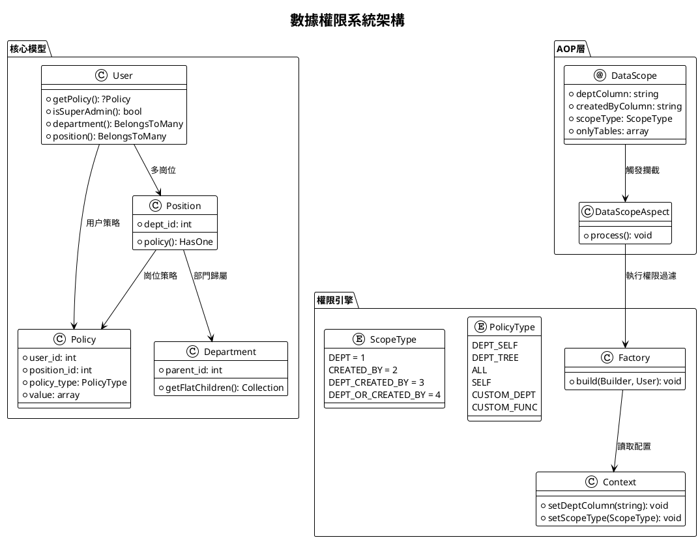
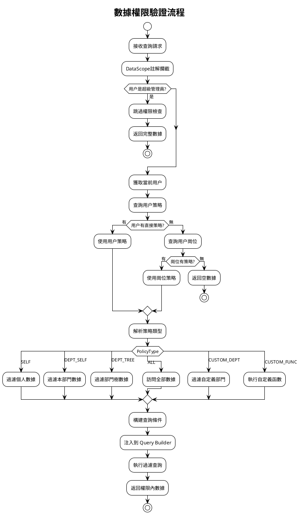
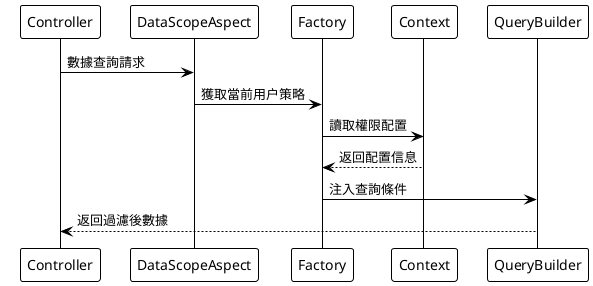

# 核心概念

本功能指在系統中實現數據的分層管理和權限控制，主要包括部門管理、崗位管理、數據權限等模塊。

相對比 `master` 分支來説新增了部門管理和崗位管理的功能模塊、實現了多種數據隔離方式，增強了系統的組織架構和角色定義能力。

## 系統架構圖



## 權限驗證流程



## 核心組件

### 部門管理

#### 功能定位

組織架構的基礎單元，實現樹形層級管理。

#### 核心特性

- 支持無限級父子部門結構
- 部門關聯崗位和用户
- 支持設置部門負責人

#### 數據模型

```php
// /mineadmin/app/Model/Permission/Department.php
class Department {
    int $id;
    string $name; 
    int $parent_id;
    HasMany $children; // 子部門
    BelongsToMany $users; // 部門用户
    BelongsToMany $leaders; // 部門領導
    
    // 遞歸獲取所有子部門
    public function getFlatChildren(): Collection
    {
        $flat = collect();
        $this->load('children');
        $traverse = static function ($departments) use (&$traverse, $flat) {
            foreach ($departments as $department) {
                $flat->push($department);
                if ($department->children->isNotEmpty()) {
                    $traverse($department->children);
                }
            }
        };
        $traverse($this->children);
        return $flat->prepend($this);
    }
}
```

---

### 崗位管理

#### 功能定位

部門內的職能角色定義

#### 核心特性

- 必須歸屬於具體部門
- 可設置數據權限策略
- 支持用户多崗位分配

#### 數據模型

```php
// /mineadmin/app/Model/Permission/Position.php
class Position {
    int $id;
    string $name;
    int $dept_id;
    
    public function policy(): HasOne
    {
        return $this->hasOne(Policy::class, 'position_id', 'id');
    }
}
```

## 數據權限體系

### 策略類型

```php
// /mineadmin/app/Model/Enums/DataPermission/PolicyType.php
enum PolicyType: string
{
    case DeptSelf = 'DEPT_SELF';     // 本部門
    case DeptTree = 'DEPT_TREE';     // 本部門及下級部門
    case All = 'ALL';                // 全部數據
    case Self = 'SELF';              // 僅本人
    case CustomDept = 'CUSTOM_DEPT'; // 自定義部門
    case CustomFunc = 'CUSTOM_FUNC'; // 自定義函數
}
```

| 權限標識碼 | 類型 | 作用域 | 備註 |
|-------|----|-----|----|
| DEPT_SELF | 部門 | 當前部門 | 僅限當前部門數據 |
| DEPT_TREE | 部門 | 當前部門及子部門 | 包括當前部門和所有子部門數據 |
| ALL | 全局 | 全部數據 | 包括所有部門和用户數據 |
| SELF | 個人 | 個人數據 | 僅限當前用户數據 |
| CUSTOM_DEPT | 自定義 | 自定義部門 | 允許選擇特定部門 |
| CUSTOM_FUNC | 自定義 | 自定義函數 | 允許自定義處理邏輯 |

### 隔離方式

```php
// /mineadmin/app/Library/DataPermission/ScopeType.php
enum ScopeType: int
{
    case DEPT = 1;                    // 只根據部門過濾
    case CREATED_BY = 2;              // 只根據創建人過濾
    case DEPT_CREATED_BY = 3;         // 根據部門 and 創建人過濾
    case DEPT_OR_CREATED_BY = 4;      // 根據部門 or 創建人過濾
}
```

### 實現機制

數據權限通過與`崗位` or `用户` 關聯的`數據權限策略`實現。每個崗位或用户可以有一個或多個數據權限策略，系統根據這些策略來過濾和控制數據訪問。

#### 策略模型

```php
// /mineadmin/app/Model/DataPermission/Policy.php
class Policy {
    int $user_id; // 用户ID
    int $position_id; // 崗位ID 
    PolicyType $policy_type;
    bool $is_default;
    array $value; // 策略值
}
```

#### 策略解析優先級

```php
// /mineadmin/app/Model/Permission/User.php:160-179
public function getPolicy(): ?Policy
{
    // 1. 優先檢查用户專屬策略
    $policy = $this->policy()->first();
    if (! empty($policy)) {
        return $policy;
    }

    // 2. 如果用户沒有直接策略，則查找崗位策略
    $this->load('position');
    $positionList = $this->position;
    foreach ($positionList as $position) {
        $current = $position->policy()->first();
        if (! empty($current)) {
            return $current;
        }
    }
    return null;
}
```

#### 執行流程



## 核心API

### DataScope 註解

```php
// /mineadmin/app/Library/DataPermission/Attribute/DataScope.php
#[\Attribute(\Attribute::TARGET_CLASS | \Attribute::TARGET_METHOD)]
class DataScope extends AbstractAnnotation
{
    public function __construct(
        private readonly string $deptColumn = 'dept_id',
        private readonly string $createdByColumn = 'created_by',
        private readonly ScopeType $scopeType = ScopeType::DEPT_CREATED_BY,
        private readonly ?array $onlyTables = null
    ) {}
}
```

### Context 上下文管理

```php
// /mineadmin/app/Library/DataPermission/Context.php
final class Context
{
    public static function setDeptColumn(string $column = 'dept_id'): void;
    public static function setCreatedByColumn(string $column = 'created_by'): void;
    public static function setScopeType(ScopeType $scopeType): void;
    public static function setOnlyTables(?array $tables): void;
    
    public static function getDeptColumn(): string;
    public static function getCreatedByColumn(): string;
    public static function getScopeType(): ScopeType;
    public static function getOnlyTables(): array;
}
```

### Factory 權限工廠

```php
// /mineadmin/app/Library/DataPermission/Factory.php
class Factory
{
    public static function make(): self;
    
    public function build(Builder $builder, User $user): void
    {
        if ($user->isSuperAdmin()) {
            return; // 超級管理員跳過權限檢查
        }
        
        if (($policy = $user->getPolicy()) === null) {
            return; // 無策略則跳過
        }
        
        // 根據 ScopeType 處理不同的數據權限邏輯
        $scopeType = Context::getScopeType();
        // ... 權限處理邏輯
    }
}
```

## 安全特性

### 超級管理員繞過

超級管理員會自動跳過所有數據權限檢查：

```php
// /mineadmin/app/Library/DataPermission/Factory.php:37-39
if ($user->isSuperAdmin()) {
    return; // 超級管理員跳過所有數據權限檢查
}
```

### 自定義函數支持

系統支持通過配置文件定義自定義權限函數：

```php
// /mineadmin/config/autoload/department/custom.php
return [
    'testction' => function (Builder $builder, ScopeType $scopeType, Policy $policy, User $user) {
        // 自定義權限邏輯
        if ($user->id !== 2) {
            return;
        }
        
        $createdByColumn = Context::getCreatedByColumn();
        $deptColumn = Context::getDeptColumn();
        
        switch ($scopeType) {
            case ScopeType::CREATED_BY:
                $builder->where($createdByColumn, $user->id);
                break;
            case ScopeType::DEPT:
                $builder->whereIn($deptColumn, $user->department()->get()->pluck('id'));
                break;
            // ... 其他邏輯
        }
    }
];
```