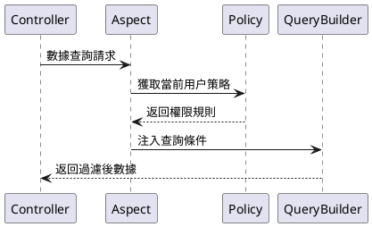

# 核心概念

本功能指在系統中實現數據的分層管理和權限控制，主要包括部門管理、崗位管理、數據權限等模塊。

相對比 `master` 分支來説新增了部門管理和崗位管理的功能模塊、實現了多種數據隔離方式，增強了系統的組織架構和角色定義能力。

## 新增功能

### 部門管理

#### 功能定位

組織架構的基礎單元，實現樹形層級管理。

#### 核心特性

- 支持無限級父子部門結構
- 部門關聯崗位和用户
- 支持設置部門負責人

#### 數據模型

```php
 class Department {
    int $id;
    string $name; 
    int $parent_id;
    HasMany $positions; // 關聯崗位
    BelongsToMany $department_users; // 部門用户
    BelongsToMany $leader; // 部門領導
  }
```

---

### 崗位管理

#### 功能定位

部門內的職能角色定義

#### 核心特性

- 必須歸屬於具體部門
- 可設置數據權限策略
- 支持用户多崗位分配

#### 數據模型

```php
class Position {
    int $id;
    string $name;
    int $dept_id;
    HasOne $policy; // 數據權限策略
  }
```

## 數據權限體系

### 策略類型

| 權限標識碼 | 類型 | 作用域 | 備註 |
|-------|----|-----|----|
| DEPT_SELF | 部門 | 當前部門 | 僅限當前部門數據 |
| DEPT_TREE | 部門 | 當前部門及子部門 | 包括當前部門和所有子部門數據 |
| ALL | 全局 | 全部數據 | 包括所有部門和用户數據 |
| SELF | 個人 | 個人數據 | 僅限當前用户數據 |
| CUSTOM_DEPT | 自定義 | 自定義部門 | 允許選擇特定部門 |
| CUSTOM_FUNC | 自定義 | 自定義函數 | 允許自定義處理邏輯 |

### 實現機制

數據權限通過與`崗位` or `用户` 關聯的`數據權限策略`實現。每個崗位或用户可以有一個或多個數據權限策略，系統根據這些策略來過濾和控制數據訪問。

#### 策略模型

```php
class Policy {
    int $user_id; // 用户ID
    int $position_id; // 崗位ID 
    PolicyType $policy_type;
    bool $is_default;
    array $value; // 策略值
  }
```

#### 執行流程


