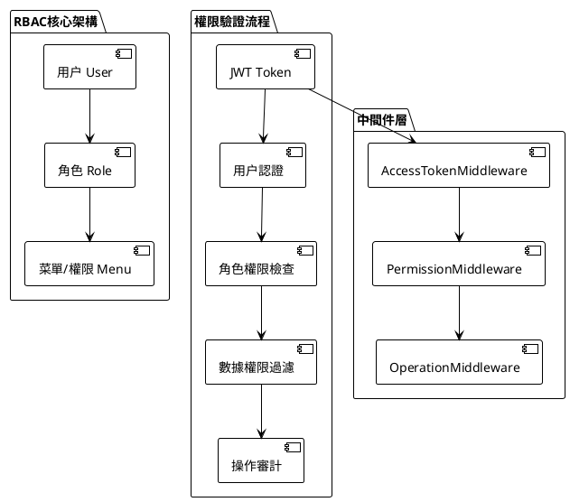
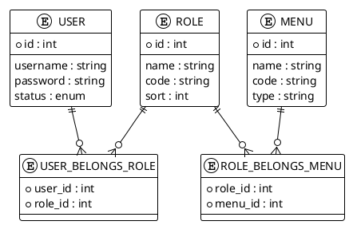

# 用户授權（RBAC）

## 系統概述

MineAdmin採用基於角色的訪問控制（RBAC）系統，結合JWT認證、多層權限驗證和數據級權限控制，為企業級應用提供全面的安全保障。

### 核心架構



## 認證系統

### JWT認證機制

使用雙Token策略保障安全性：

```php
// 登錄認證流程
public function login(string $username, string $password): array
{
    $user = $this->repository->findByUnameType($username, Type::SYSTEM);
    
    // 密碼驗證
    if (!$user->verifyPassword($password)) {
        throw new BusinessException(ResultCode::UNPROCESSABLE_ENTITY, trans('auth.password_error'));
    }
    
    // 用户狀態檢查
    if ($user->status->isDisable()) {
        throw new BusinessException(ResultCode::DISABLED);
    }
    
    // 生成Token
    $jwt = $this->getJwt();
    return [
        'access_token' => $jwt->builderAccessToken((string) $user->id)->toString(),
        'refresh_token' => $jwt->builderRefreshToken((string) $user->id)->toString(),
        'expire_at' => (int) $jwt->getConfig('ttl', 0),
    ];
}
```

### 密碼安全

系統使用PHP內置的安全哈希函數：

```php
// 密碼設置
public function setPasswordAttribute($value): void
{
    $this->attributes['password'] = password_hash((string) $value, \PASSWORD_DEFAULT);
}

// 密碼驗證
public function verifyPassword(string $password): bool
{
    return password_verify($password, $this->password);
}
```

## 權限系統

### 三層權限模型



### 權限檢查實現

```php
// User模型中的權限檢查方法
public function hasPermission(string $permission): bool
{
    return $this->roles()->whereRelation('menus', 'name', $permission)->exists();
}

public function getPermissions(): Collection
{
    return $this->roles()->with('menus')->orderBy('sort')->get()->pluck('menus')->flatten();
}

public function isSuperAdmin(): bool
{
    return $this->roles()->where('code', 'SuperAdmin')->exists();
}
```

### 權限註解使用

在控制器方法上使用`@Permission`註解進行權限控制：

```php
use Mine\Annotation\Permission;

class UserController
{
    #[Permission(code: 'permission:user:index')]
    public function pageList(): Result
    {
        // 用户列表查詢
    }
    
    #[Permission(code: ['permission:user:save', 'permission:user:update'], operation: Permission::OPERATION_OR)]
    public function save(): Result
    {
        // 用户保存或更新
    }
    
    #[Permission(code: ['permission:user:delete', 'permission:role:admin'], operation: Permission::OPERATION_AND)]
    public function delete(): Result
    {
        // 需要同時具備刪除權限和管理員角色
    }
}
```

## 中間件體系

### 三層中間件保護

```php
#[Middleware(middleware: AccessTokenMiddleware::class, priority: 100)]
#[Middleware(middleware: PermissionMiddleware::class, priority: 99)]
#[Middleware(middleware: OperationMiddleware::class, priority: 98)]
class AdminController
{
    // 控制器邏輯
}
```

#### 1. AccessTokenMiddleware

驗證訪問令牌的有效性：

```php
public function process(ServerRequestInterface $request, RequestHandlerInterface $handler): ResponseInterface
{
    $token = $this->getTokenFromRequest($request);
    
    try {
        $jwt = $this->getJwt();
        $token = $jwt->parseToken($token);
        
        // 檢查黑名單
        if ($jwt->isBlacklisted($token)) {
            throw new TokenValidException('Token已被列入黑名單');
        }
        
        // 設置當前用户
        $this->setCurrentUser($token);
        
    } catch (\Throwable $e) {
        throw new BusinessException(ResultCode::UNAUTHORIZED, $e->getMessage());
    }
    
    return $handler->handle($request);
}
```

#### 2. PermissionMiddleware

執行權限驗證邏輯：

```php
private function handlePermission(Permission $permission): void
{
    $operation = $permission->getOperation();
    $codes = $permission->getCode();
    
    foreach ($codes as $code) {
        $hasPermission = $this->currentUser->user()->hasPermission($code);
        
        if ($operation === Permission::OPERATION_AND && !$hasPermission) {
            throw new BusinessException(code: ResultCode::FORBIDDEN);
        }
        
        if ($operation === Permission::OPERATION_OR && $hasPermission) {
            return;
        }
    }
    
    if ($operation === Permission::OPERATION_OR) {
        throw new BusinessException(code: ResultCode::FORBIDDEN);
    }
}
```

#### 3. OperationMiddleware

記錄操作日誌：

```php
public function process(ServerRequestInterface $request, RequestHandlerInterface $handler): ResponseInterface
{
    $response = $handler->handle($request);
    
    // 記錄操作日誌
    $this->dispatcher->dispatch(new RequestOperationEvent(
        $this->user->id(),
        $operator->summary,
        $request->getUri()->getPath(),
        $request->getClientIps(),
        $request->getMethod(),
    ));
    
    return $response;
}
```

## API參考

### CurrentUser服務

```php
use Mine\Support\CurrentUser;

class ExampleController
{
    public function __construct(private readonly CurrentUser $currentUser) {}
    
    public function getUserInfo(): array
    {
        $user = $this->currentUser->user();
        
        return [
            'id' => $user->id,
            'username' => $user->username,
            'roles' => $user->roles,
            'permissions' => $user->getPermissions(),
            'is_super_admin' => $user->isSuperAdmin(),
        ];
    }
    
    public function checkPermission(string $permission): bool
    {
        return $this->currentUser->user()->hasPermission($permission);
    }
}
```

### 權限驗證方法

```php
// AND操作：需要同時具備所有權限
#[Permission(code: ['user:read', 'user:write'], operation: Permission::OPERATION_AND)]

// OR操作：具備任一權限即可
#[Permission(code: ['user:read', 'admin:all'], operation: Permission::OPERATION_OR)]

// 單一權限檢查
#[Permission(code: 'user:delete')]

// 程序化權限檢查
if ($this->currentUser->user()->hasPermission('user:create')) {
    // 允許創建用户
}
```


## 故障排除

### 常見問題

#### 權限檢查失敗

**問題**: 用户無法訪問有權限的資源

**調試步驟**:
```php
// 1. 檢查用户角色
$user = User::find($userId);
dd($user->roles);

// 2. 檢查角色權限
foreach ($user->roles as $role) {
    dd($role->menus);
}

// 3. 檢查權限碼
$hasPermission = $user->hasPermission('permission:user:index');
dd($hasPermission);

// 4. 檢查SuperAdmin狀態
dd($user->isSuperAdmin());
```