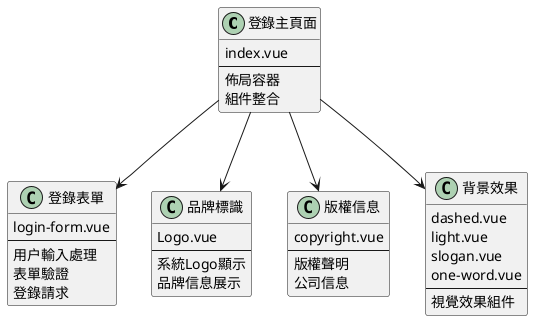
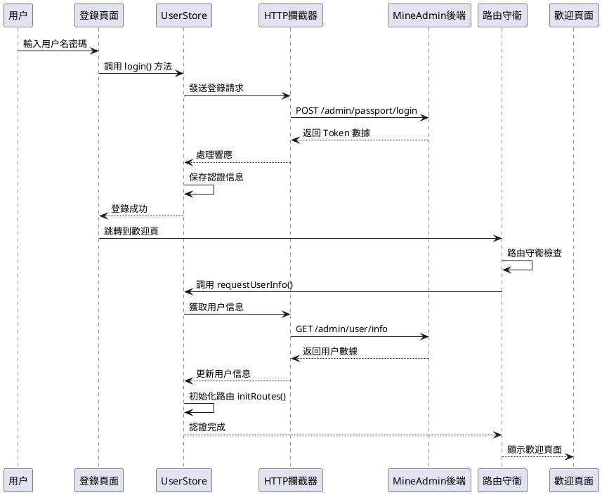
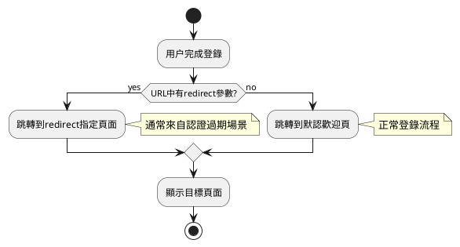

# 登錄與歡迎頁

:::tip 概述
本章節詳細介紹 MineAdmin 3.0 的登錄頁面架構、登錄流程處理、Token 管理機制，以及登錄成功後的歡迎頁配置。內容包括組件結構分析、數據流轉過程、路由守衞機制和自定義配置方法。

**重要説明**：本文檔中所有代碼示例均來自 MineAdmin 開源項目的實際代碼，源代碼位於 [GitHub 倉庫](https://github.com/mineadmin/mineadmin)。
:::

## 登錄頁面架構

### 頁面組件結構

登錄頁面主文件位於 `src/modules/base/views/login/index.vue`，採用組件化設計，將登錄功能拆分為多個獨立的子組件，提高代碼可維護性和複用性。

**源代碼位置**：
- **GitHub 地址**：[mineadmin/web/src/modules/base/views/login/index.vue](https://github.com/mineadmin/mineadmin/blob/master/web/src/modules/base/views/login/index.vue)
- **本地路徑**：`src/modules/base/views/login/index.vue`



### 響應式佈局設計

登錄頁面採用響應式設計，適配桌面端和移動端：

```vue
<template>
  <div class="h-full min-w-[380px] w-full flex items-center justify-center overflow-hidden border-1 bg-blue-950 lg:justify-between lg:bg-white">
    <!-- 桌面端左側裝飾區域 -->
    <div class="relative hidden h-full w-10/12 md:hidden lg:flex">
      <div class="gradient-rainbow" />
      <Dashed />
      <Light />
      <Slogan />
      <OneWord />
    </div>
    
    <!-- 登錄表單區域 -->
    <div class="login-form-container">
      <Logo />
      <LoginForm />
      <CopyRight />
    </div>
    
    <!-- 移動端背景效果 -->
    <div class="min-[380px] relative left-0 top-0 z-4 h-full max-w-[1024px] w-full flex lg:hidden">
      <Dashed />
      <Light />
    </div>
  </div>
</template>
```

### 組件庫説明

::: warning 組件庫注意事項
登錄頁面的表單組件並非使用 `Element Plus` 組件庫，而是基於 MineAdmin 自身的基礎組件庫構建。這些組件專為系統設計，具有以下特點：

- **輕量化設計**：只包含必要的登錄功能，減少依賴
- **統一樣式風格**：與整個系統的設計語言保持一致
- **定製化程度高**：可根據業務需求靈活調整

**自定義建議**：
- 不建議直接修改源碼，以免影響後續版本升級
- 推薦通過[插件系統](/front/high/plugins.md)替換登錄組件
- 可通過路由配置覆蓋默認的 `login` 路由組件
:::

## 登錄流程與數據處理

### 登錄流程概覽

登錄流程採用現代化的前後端分離架構，基於 JWT Token 進行身份認證，支持 Token 自動刷新和權限驗證。



### 核心數據流轉

::: info 開發提示
如果只需要修改登錄頁面 UI 而不涉及登錄邏輯，可以跳過本節的詳細流程説明，直接查看[歡迎頁配置](#默認歡迎頁配置)部分。
:::

#### 1. 用户登錄認證

**文件位置**：`src/store/modules/useUserStore.ts`

`login()` 方法負責處理用户認證過程：

```typescript
// 登錄方法核心邏輯
async login(loginParams: LoginParams) {
  try {
    // 發送登錄請求
    const response = await http.post('/admin/passport/login', loginParams)
    
    // 保存認證信息到本地存儲
    const { access_token, refresh_token, expire_at } = response.data
    
    // 存儲到 Pinia Store
    this.token = access_token
    this.refreshToken = refresh_token
    this.expireAt = expire_at
    
    // 存儲到瀏覽器緩存
    cache.set('token', access_token)
    cache.set('refresh_token', refresh_token)
    cache.set('expire', useDayjs().unix() + expire_at, { exp: expire_at })
    
    return Promise.resolve(response)
  } catch (error) {
    return Promise.reject(error)
  }
}
```

#### 2. 路由守衞攔截

登錄成功後頁面跳轉會觸發路由守衞，自動執行用户信息獲取：

```typescript
// 路由守衞邏輯（簡化版）
router.beforeEach(async (to, from, next) => {
  const userStore = useUserStore()
  
  if (to.path !== '/login' && !userStore.isLogin) {
    // 未登錄，跳轉到登錄頁
    next('/login')
  } else if (userStore.isLogin && !userStore.userInfo) {
    // 已登錄但未獲取用户信息
    try {
      await userStore.requestUserInfo()
      next()
    } catch (error) {
      // 獲取用户信息失敗，清除登錄狀態
      await userStore.logout()
      next('/login')
    }
  } else {
    next()
  }
})
```

#### 3. 用户信息獲取

**文件位置**：`src/store/modules/useUserStore.ts`

`requestUserInfo()` 方法獲取用户基礎數據和權限信息：

```typescript
async requestUserInfo() {
  try {
    // 並行請求用户數據、菜單權限、角色信息
    const [userInfo, menuList, roleList] = await Promise.all([
      http.get('/admin/user/info'),          // 用户基礎信息
      http.get('/admin/menu/index'),         // 菜單權限數據
      http.get('/admin/role/index')          // 角色權限數據
    ])
    
    // 更新 Store 狀態
    this.userInfo = userInfo.data
    this.menuList = menuList.data
    this.roleList = roleList.data
    
    // 初始化路由系統
    const routeStore = useRouteStore()
    await routeStore.initRoutes()
    
    return Promise.resolve(userInfo)
  } catch (error) {
    return Promise.reject(error)
  }
}
```

#### 4. 動態路由初始化

**文件位置**：`src/store/modules/useRouteStore.ts`

`initRoutes()` 方法根據用户權限動態生成路由：

```typescript
async initRoutes() {
  const userStore = useUserStore()
  const { menuList } = userStore
  
  // 根據菜單數據生成路由配置
  const routes = this.generateRoutes(menuList)
  
  // 動態添加路由
  routes.forEach(route => {
    router.addRoute(route)
  })
  
  // 更新路由狀態
  this.isRoutesInitialized = true
}
```

### Token 管理機制

系統採用雙 Token 機制確保安全性和用户體驗：

- **Access Token**：短期有效（默認 1 小時），用於 API 請求認證
- **Refresh Token**：長期有效（默認 2 小時），用於刷新 Access Token

詳細的 Token 刷新機制請參考 [請求與攔截器](/front/advanced/request.md#token-刷新機制) 文檔。

## 歡迎頁配置與路由管理

### 登錄後跳轉邏輯

MineAdmin 支持多種登錄後跳轉策略，確保用户體驗的連續性：



#### 跳轉規則説明

1. **帶重定向參數的登錄**
   ```
   /#/login?redirect=/admin/user/index
   ```
   登錄成功後會自動跳轉到 `redirect` 參數指定的頁面。這種情況通常發生在：
   - 用户訪問需要權限的頁面但未登錄時
   - Token 過期後自動跳轉到登錄頁時

2. **默認登錄跳轉**
   ```
   /#/login
   ```
   沒有 `redirect` 參數時，登錄成功後跳轉到系統配置的默認歡迎頁面。

### 歡迎頁配置詳解

#### 默認配置結構

**配置文件位置**：`src/provider/settings/index.ts`

MineAdmin 實際的默認歡迎頁配置：

```typescript
// MineAdmin 默認歡迎頁配置
welcomePage: {
  name: 'welcome',                    // 路由名稱
  path: '/welcome',                   // 路由路徑
  title: '歡迎頁',                 // 頁面標題
  icon: 'icon-park-outline:jewelry',  // 菜單圖標
},
```

注意：MineAdmin 中歡迎頁的組件路徑是通過路由系統自動解析的，位於 `src/modules/base/views/welcome/index.vue`。

#### 配置項詳細説明

| 配置項 | 類型 | 必填 | 默認值 | 説明 |
|--------|------|------|---------|------|
| `name` | `string` | ✅ | `'welcome'` | 路由名稱，必須全局唯一 |
| `path` | `string` | ✅ | `'/welcome'` | 訪問路徑，支持動態路由 |
| `title` | `string` | ✅ | `'歡迎頁'` | 頁面標題，顯示在瀏覽器標籤和麪包屑中 |
| `icon` | `string` | ❌ | `'icon-park-outline:jewelry'` | 圖標標識，用於菜單顯示 |
| `component` | `Function` | ❌ | 動態導入組件 | 頁面組件，支持異步加載 |

### 自定義歡迎頁配置

::: tip 最佳實踐
為了保證系統升級時配置不被覆蓋，強烈建議在 `settings.config.ts` 中進行自定義配置，而不是直接修改 `index.ts` 文件。
:::

#### 配置方式

**步驟 1**：編輯 `src/provider/settings/settings.config.ts`

注意：該文件已存在於 MineAdmin 項目中，無需創建。

```typescript
import type { SystemSettings } from '#/global'

const globalConfigSettings: SystemSettings.all = {
  // 自定義歡迎頁配置
  welcomePage: {
    name: 'dashboard',                        // 修改為儀表板
    path: '/dashboard',                       // 路徑改為儀表板路徑
    title: '數據概覽',                        // 自定義標題
    icon: 'mdi:view-dashboard-outline',       // 使用儀表板圖標
  },
  
  // 其他系統配置...
  app: {
    // 應用相關配置
  }
}

export default globalConfigSettings
```

**步驟 2**：系統自動合併配置

系統啓動時會自動將 `settings.config.ts` 中的配置與默認配置進行深度合併：

```typescript
// MineAdmin 實際的配置合併邏輯
import { defaultsDeep } from 'lodash-es'
import globalConfigSettings from '@/provider/settings/settings.config.ts'

// 默認配置與用户配置合併
const systemSetting = defaultsDeep(globalConfigSettings, defaultGlobalConfigSettings)
```

### 高級配置示例

#### 1. 條件化歡迎頁

根據用户角色或權限設置不同的歡迎頁：

```typescript
const globalConfigSettings: SystemSettings.all = {
  welcomePage: {
    name: 'adaptive-welcome',
    path: '/adaptive-welcome',
    title: '個性化歡迎頁',
    icon: 'mdi:account-star',
    // 使用自定義組件處理條件邏輯
    component: () => import('@/views/custom/AdaptiveWelcome.vue')
  }
}
```

#### 2. 多語言支持

結合國際化配置設置多語言歡迎頁：

```typescript
const globalConfigSettings: SystemSettings.all = {
  welcomePage: {
    name: 'welcome',
    path: '/welcome',
    // 使用國際化鍵值
    title: 'menu.welcome', 
    icon: 'icon-park-outline:jewelry',
  }
}
```

#### 3. 外部鏈接跳轉

配置登錄後跳轉到外部系統：

```typescript
const globalConfigSettings: SystemSettings.all = {
  welcomePage: {
    name: 'external-system',
    path: 'https://external-dashboard.com',  // 外部鏈接
    title: '外部系統',
    icon: 'mdi:open-in-new',
    // 設置為外部鏈接類型
    meta: {
      isExternal: true,
      target: '_blank'
    }
  }
}
```

### 歡迎頁組件開發

#### 基礎組件結構

```vue
<!-- src/views/custom/CustomWelcome.vue -->
<template>
  <div class="welcome-container">
    <div class="welcome-header">
      <h1>{{ $t('welcome.title') }}</h1>
      <p>{{ $t('welcome.subtitle') }}</p>
    </div>
    
    <div class="welcome-content">
      <!-- 用户信息卡片 -->
      <UserInfoCard :user="userInfo" />
      
      <!-- 快捷操作 -->
      <QuickActions :actions="quickActions" />
      
      <!-- 數據統計 -->
      <DataStatistics :stats="systemStats" />
    </div>
  </div>
</template>

<script setup lang="ts">
import { ref, onMounted } from 'vue'
import { useUserStore } from '@/store/modules/useUserStore'
import UserInfoCard from '@/components/UserInfoCard.vue'
import QuickActions from '@/components/QuickActions.vue'
import DataStatistics from '@/components/DataStatistics.vue'

const userStore = useUserStore()
const userInfo = ref(userStore.userInfo)
const systemStats = ref({})
const quickActions = ref([
  { name: '用户管理', icon: 'mdi:account-group', path: '/admin/user' },
  { name: '角色權限', icon: 'mdi:shield-account', path: '/admin/role' },
  { name: '系統設置', icon: 'mdi:cog', path: '/admin/system' },
])

// MineAdmin 歡迎頁不需要動態加載數據
// 所有數據都是靜態的，直接在組件中定義

// MineAdmin 中歡迎頁使用的是靜態數據，不需要 API 調用
// 如果需要動態數據，可以添加相應的 API 調用
// 例如：useHttp().get('/admin/user/info') 等實際存在的 API
</script>

<style scoped>
.welcome-container {
  padding: 24px;
  max-width: 1200px;
  margin: 0 auto;
}

.welcome-header {
  text-align: center;
  margin-bottom: 32px;
}

.welcome-content {
  display: grid;
  grid-template-columns: repeat(auto-fit, minmax(300px, 1fr));
  gap: 24px;
}
</style>
```

## 安全考慮與最佳實踐

### 認證安全

1. **Token 安全存儲**
   - Access Token 存儲在內存中，避免 XSS 攻擊
   - Refresh Token 使用 HttpOnly Cookie 存儲
   - 敏感信息不存儲在 localStorage 中

2. **路由權限驗證**
   ```typescript
   // 路由守衞中的權限檢查
   router.beforeEach(async (to, from, next) => {
     const userStore = useUserStore()
     
     // 檢查路由是否需要認證
     if (to.meta.requiresAuth && !userStore.isLogin) {
       next(`/login?redirect=${to.fullPath}`)
       return
     }
     
     // 檢查用户權限
     if (to.meta.permissions && !userStore.hasPermissions(to.meta.permissions)) {
       next('/403') // 權限不足頁面
       return
     }
     
     next()
   })
   ```

### 性能優化

1. **組件懶加載**
   
   MineAdmin 使用模塊化路由加載，組件會自動懶加載：
   ```typescript
   // MineAdmin 中的動態組件加載
   const moduleViews = import.meta.glob('../../modules/**/views/**/**.{vue,jsx,tsx}')
   const pluginViews = import.meta.glob('../../plugins/*/**/views/**/**.{vue,jsx,tsx}')
   
   // 自動解析組件路徑
   if (moduleViews[`../../modules/${item.component}${suffix}`]) {
     component = moduleViews[`../../modules/${item.component}${suffix}`]
   }
   ```

2. **數據預加載**
   
   MineAdmin 在路由守衞中處理用户信息加載：
   ```typescript
   // MineAdmin 的數據預加載機制
   router.beforeEach(async (to, from, next) => {
     if (userStore.isLogin) {
       if (userStore.getUserInfo() === null) {
         // 預加載用户信息、菜單和權限數據
         await userStore.requestUserInfo()
         next({ path: to.fullPath, query: to.query })
       }
       else {
         next()
       }
     }
   })
   ```

## 常見問題與解決方案

### Q: 登錄成功後頁面沒有跳轉？

**MineAdmin 中可能的原因和解決方案**：

1. **路由配置問題**
   ```typescript
   // 檢查歡迎頁路由是否正確註冊
   const routes = [
     {
       name: 'welcome',
       path: '/welcome',
       component: () => import('@/views/Welcome.vue'),
       meta: { requiresAuth: true }
     }
   ]
   ```

2. **權限驗證失敗**
   ```typescript
   // 確保用户有訪問歡迎頁的權限
   if (!userStore.hasPermission('welcome:access')) {
     // 處理權限不足情況
   }
   ```

### Q: 自定義歡迎頁配置不生效？

**解決方案**：

1. **確認配置文件路徑**
   ```bash
   src/provider/settings/settings.config.ts  # 正確路徑
   ```

2. **檢查配置語法**
   ```typescript
   // ❌ 錯誤：配置對象結構不正確
   const config = {
     welcomePage: '/dashboard'
   }
   
   // ✅ 正確：完整的配置對象
   const config = {
     welcomePage: {
       name: 'dashboard',
       path: '/dashboard',
       title: '儀表板'
     }
   }
   ```

3. **重啓開發服務器**
   ```bash
   pnpm run dev
   ```

### Q: 如何實現登錄後的個性化跳轉？

**解決方案**：

```typescript
// 在 UserStore 中實現個性化跳轉邏輯
async login(params: LoginParams) {
  const response = await http.post('/admin/passport/login', params)
  
  // 根據用户角色確定跳轉頁面
  const userRole = response.data.user.role
  const redirectMap = {
    'admin': '/dashboard',
    'user': '/profile',
    'guest': '/welcome'
  }
  
  const targetPath = redirectMap[userRole] || '/welcome'
  
  // 執行跳轉
  await router.push(targetPath)
}
```

## 相關文檔鏈接

- [系統配置詳解](/front/advanced/system-config.md) - 系統全局配置説明
- [請求與攔截器](/front/advanced/request.md) - HTTP 請求和 Token 管理
- [路由與菜單](/front/base/route-menu.md) - 路由系統配置
- [插件系統](/front/high/plugins.md) - 插件開發與配置
- [後端認證機制](/backend/security/passport.md) - 後端 JWT 認證實現

