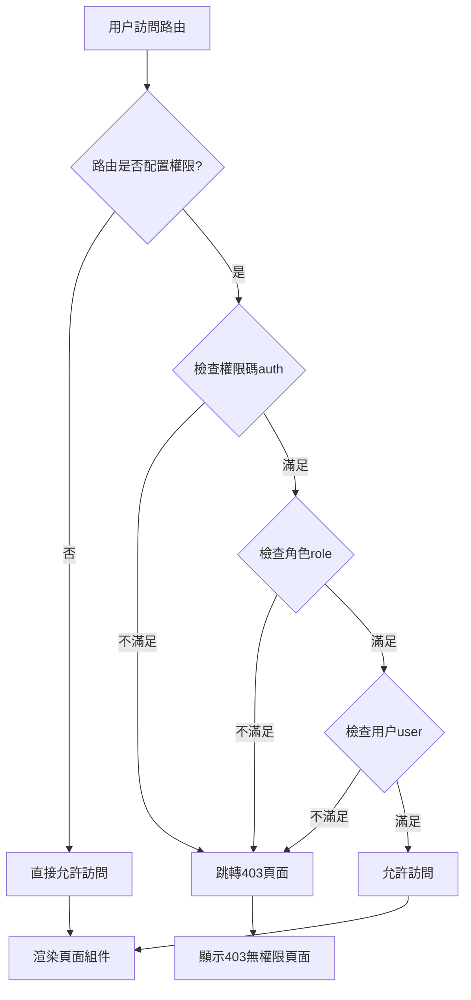
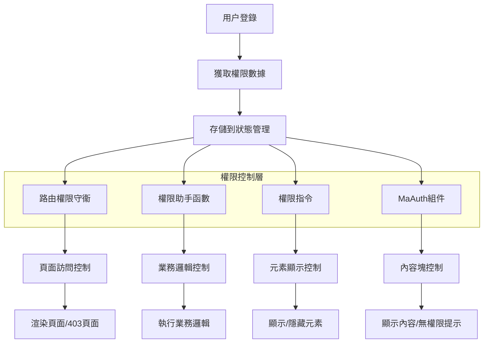

# MineAdmin 權限控制系統

## 概述

MineAdmin 提供了一套完整的前端權限控制系統，實現了細粒度的權限管理。權限控制分為兩個層面：

:::tip 權限架構概覽
- **路由級權限**：基於後端返回的菜單數據控制頁面訪問權限
- **內容級權限**：通過助手函數、指令和組件控制頁面內容的顯示和隱藏

權限系統與後端 Hyperf 框架深度集成，確保前後端權限控制的一致性。
:::

### 權限類型

MineAdmin 支持三種細粒度的權限控制：

| 權限類型 | 判斷依據 | 應用場景 | 實現方式 |
|---------|---------|---------|---------|
| **權限碼權限** | 菜單的 `name` 字段 | 功能模塊權限控制 | 函數、指令、組件 |
| **角色權限** | 角色的 `code` 字段 | 基於職責的權限控制 | 函數、指令 |
| **用户權限** | 用户的 `username` 字段 | 特定用户權限控制 | 函數、指令 |

::: info 實現原理
權限系統基於用户登錄後獲取的權限數據，通過對比當前用户擁有的權限碼、角色碼和用户標識來判斷是否有權限訪問特定功能。權限數據存儲在前端狀態管理中，實現高效的權限驗證。
:::

## 權限助手函數

### 函數引入和基本用法

MineAdmin 提供三個核心權限判斷函數，位於 `web/src/utils/permission/` 目錄下：

```javascript
// 權限碼檢查函數
import hasAuth from '@/utils/permission/hasAuth'
// 角色檢查函數  
import hasRole from '@/utils/permission/hasRole'
// 用户檢查函數
import hasUser from '@/utils/permission/hasUser'
```

::: tip 函數位置説明
**源碼路徑**：
- GitHub: `https://github.com/mineadmin/mineadmin/tree/master/web/src/utils/permission/`
- 本地開發: `/web/src/utils/permission/`

這些函數已在全局註冊，支持在組件中直接調用。
:::

### 業務邏輯中使用

```vue
<script setup>
// 權限碼驗證 - 支持單個權限或權限數組
if (hasAuth('user:list') || hasAuth(['user:list', 'user:create'])) {
  // 用户管理權限驗證通過
  console.log('具有用户管理權限')
}

// 角色驗證 - 支持單個角色或角色數組
if (hasRole('SuperAdmin') || hasRole(['admin', 'manager'])) {
  // 管理員角色驗證通過
  console.log('具有管理員權限')
}

// 用户驗證 - 支持單個用户名或用户名數組
if (hasUser('admin') || hasUser(['admin', 'root'])) {
  // 特定用户驗證通過
  console.log('特定用户驗證通過')
}

// 複合權限判斷示例
const canManageUsers = hasAuth(['user:list', 'user:create']) && hasRole('admin')
if (canManageUsers) {
  // 同時滿足權限碼和角色要求
}
</script>
```

### 模板中使用

```vue
<script setup>
// 導入權限判斷函數
import hasAuth from '@/utils/permission/hasAuth'
import hasRole from '@/utils/permission/hasRole'
import hasUser from '@/utils/permission/hasUser'
</script>

<template>
  <div>
    <!-- 權限碼驗證 -->
    <div v-if="hasAuth('user:list') || hasAuth(['user:list', 'user:create'])">
      <el-button type="primary">用户管理</el-button>
    </div>
    
    <!-- 角色驗證 -->
    <div v-if="hasRole('SuperAdmin') || hasRole(['admin', 'manager'])">
      <el-button type="danger">系統設置</el-button>
    </div>

    <!-- 用户驗證 -->
    <div v-if="hasUser('admin') || hasUser(['root', 'administrator'])">
      <el-button type="warning">高級功能</el-button>
    </div>

    <!-- 複合條件驗證 -->
    <div v-if="hasAuth('role:manage') && hasRole('admin')">
      <el-button>角色管理</el-button>
    </div>
  </div>
</template>
```

### 函數參數説明

所有權限函數都支持以下兩種參數格式：

```javascript
// 字符串格式 - 單一權限檢查
hasAuth('user:list')
hasRole('admin')  
hasUser('admin')

// 數組格式 - 多權限檢查（OR邏輯）
hasAuth(['user:list', 'user:create', 'user:edit'])
hasRole(['admin', 'manager', 'supervisor'])
hasUser(['admin', 'root', 'system'])
```

::: warning 注意事項
- 數組參數採用 **OR 邏輯**，即只要滿足其中任一條件即返回 `true`
- 如需 **AND 邏輯**，請使用多個函數調用組合：`hasAuth('a') && hasAuth('b')`
- 權限碼建議採用 `模塊:操作` 的命名規範，如 `user:list`、`role:create`
:::

### 路由權限參數

權限函數支持第二個可選參數 `checkRoute`，用於是否同時檢查路由權限：

```javascript
// 第二個參數默認為 false，僅檢查功能權限
hasAuth('user:list', false)  

// 設置為 true 時，同時檢查路由權限
hasAuth('user:list', true)
```

## 權限指令

MineAdmin 提供了三個權限指令，簡化了模板中的權限控制。指令位於 `web/src/directives/permission/` 目錄下：

::: tip 指令源碼位置
**GitHub路徑**：
- `https://github.com/mineadmin/mineadmin/tree/master/web/src/directives/permission/auth/`
- `https://github.com/mineadmin/mineadmin/tree/master/web/src/directives/permission/role/`
- `https://github.com/mineadmin/mineadmin/tree/master/web/src/directives/permission/user/`

**本地路徑**：`/web/src/directives/permission/`
:::

### 指令使用方式

```vue
<template>
  <div>
    <!-- 權限碼指令 - 支持字符串和數組 -->
    <div v-auth="'user:list'">
      單一權限碼控制
    </div>
    <div v-auth="['user:list', 'user:create']">
      多權限碼控制（滿足任一即可）
    </div>
    
    <!-- 角色指令 -->
    <div v-role="'admin'">
      單一角色控制
    </div>
    <div v-role="['admin', 'manager']">
      多角色控制（滿足任一即可）
    </div>

    <!-- 用户指令 -->
    <div v-user="'admin'">
      單一用户控制
    </div>
    <div v-user="['admin', 'root']">
      多用户控制（滿足任一即可）
    </div>

    <!-- 實際業務場景示例 -->
    <el-button v-auth="'user:create'" type="primary">
      新增用户
    </el-button>
    
    <el-button v-role="'SuperAdmin'" type="danger">
      刪除數據
    </el-button>
    
    <div v-auth="['log:operation', 'log:login']" class="log-panel">
      日誌查看面板
    </div>
  </div>
</template>
```

### 指令 vs 函數對比

| 方式 | 優勢 | 適用場景 | 示例 |
|------|------|----------|------|
| **指令方式** | 簡潔直觀，自動控制元素顯示/隱藏 | 簡單的權限控制，靜態權限檢查 | `v-auth="'user:list'"` |
| **函數方式** | 靈活性高，支持複雜邏輯判斷 | 業務邏輯中的權限判斷，動態權限檢查 | `v-if="hasAuth('a') && hasRole('b')"` |

::: warning 指令使用注意事項
- 指令採用 **OR 邏輯**，數組中任一條件滿足即顯示元素
- 指令直接控制 DOM 元素的顯示/隱藏，無權限時元素不會渲染
- 複雜的權限邏輯組合建議使用函數方式而非指令
:::

## MaAuth 權限組件

### 組件介紹

`MaAuth` 組件是 MineAdmin 提供的權限控制組件，適用於大範圍內容的權限控制。相比函數和指令，組件方式更適合複雜的權限展示邏輯。

::: info 組件源碼位置
**GitHub 路徑**：`https://github.com/mineadmin/mineadmin/tree/master/web/src/components/ma-auth/index.vue`

**本地路徑**：`/web/src/components/ma-auth/index.vue`

該組件已全局註冊，在任何 Vue 組件中都可直接使用，無需手動導入。
:::

### 基本使用

```vue
<template>
  <!-- 單一權限控制 -->
  <ma-auth :value="'user:list'">
    <div class="user-management">
      <h3>用户管理面板</h3>
      <p>您擁有用户列表查看權限</p>
    </div>
  </ma-auth>

  <!-- 多權限控制（滿足任一權限即顯示） -->
  <ma-auth :value="['user:list', 'user:create', 'user:edit']">
    <div class="user-operations">
      <el-button type="primary">新增用户</el-button>
      <el-button type="success">編輯用户</el-button>
      <el-button type="danger">刪除用户</el-button>
    </div>
  </ma-auth>
</template>
```

### 無權限時的提示

組件提供了 `#notAuth` 插槽，用於自定義無權限時的顯示內容：

```vue
<template>
  <ma-auth :value="['admin:system', 'admin:config']">
    <!-- 有權限時顯示的內容 -->
    <div class="admin-panel">
      <h2>系統管理</h2>
      <el-form>
        <el-form-item label="系統配置">
          <el-input placeholder="配置項" />
        </el-form-item>
      </el-form>
    </div>
    
    <!-- 無權限時顯示的內容 -->
    <template #notAuth>
      <el-alert
        title="權限不足"
        description="您沒有系統管理權限，請聯繫管理員申請相關權限"
        type="warning"
        :closable="false"
        show-icon
      />
    </template>
  </ma-auth>
</template>
```

### 高級用法

#### 嵌套權限控制

```vue
<template>
  <ma-auth :value="'module:access'">
    <!-- 模塊級權限 -->
    <div class="module-container">
      <h2>業務模塊</h2>
      
      <!-- 功能級權限 -->
      <ma-auth :value="'feature:read'">
        <div class="read-section">
          <p>只讀內容區域</p>
        </div>
        <template #notAuth>
          <p class="text-gray">您沒有讀取權限</p>
        </template>
      </ma-auth>

      <!-- 操作級權限 -->
      <ma-auth :value="['feature:create', 'feature:edit']">
        <div class="action-buttons">
          <el-button>創建</el-button>
          <el-button>編輯</el-button>
        </div>
        <template #notAuth>
          <p class="text-muted">您沒有操作權限</p>
        </template>
      </ma-auth>
    </div>
    
    <template #notAuth>
      <el-empty description="您沒有訪問此模塊的權限" />
    </template>
  </ma-auth>
</template>
```

#### 與其他組件結合

```vue
<template>
  <!-- 表格操作權限控制 -->
  <el-table :data="tableData">
    <el-table-column label="姓名" prop="name" />
    <el-table-column label="操作">
      <template #default="{ row }">
        <ma-auth :value="'user:edit'">
          <el-button size="small" @click="editUser(row)">編輯</el-button>
          <template #notAuth>
            <el-button size="small" disabled>無權限</el-button>
          </template>
        </ma-auth>
        
        <ma-auth :value="'user:delete'">
          <el-button size="small" type="danger" @click="deleteUser(row)">
            刪除
          </el-button>
        </ma-auth>
      </template>
    </el-table-column>
  </el-table>
</template>
```

### 組件參數

| 參數 | 類型 | 默認值 | 説明 |
|------|------|--------|------|
| `value` | `string \| string[]` | `[]` | 需要驗證的權限碼，支持字符串或數組 |

### 組件插槽

| 插槽名 | 説明 | 參數 |
|--------|------|------|
| `default` | 有權限時顯示的內容 | - |
| `notAuth` | 無權限時顯示的內容 | - |

### 組件 vs 其他方式對比

| 方式 | 適用場景 | 優勢 | 劣勢 |
|------|----------|------|------|
| **MaAuth 組件** | 大塊內容權限控制、需要無權限提示 | 支持插槽自定義、代碼結構清晰 | 稍顯冗餘 |
| **權限指令** | 簡單元素權限控制 | 簡潔直觀 | 不支持無權限提示 |
| **權限函數** | 複雜業務邏輯權限判斷 | 靈活性最高 | 需要手動處理顯示邏輯 |

## 路由權限控制

### 靜態路由權限配置

MineAdmin 支持在路由級別進行權限控制，通過在路由的 `meta` 屬性中配置權限參數來實現訪問控制。

::: tip 路由權限機制
**控制範圍**：僅對帶組件頁面的路由生效，不包含按鈕等頁面內元素

**檢查時機**：路由跳轉時自動檢查權限

**權限驗證失敗**：顯示 403 頁面

**源碼位置**：`/web/src/router/` - 路由配置和權限守衞邏輯
:::

### 路由權限配置語法

在路由配置文件中，通過 `meta` 對象配置權限參數：

```javascript
// 示例路由配置
const routes = [
  {
    path: '/user',
    name: 'User',
    component: () => import('@/views/user/index.vue'),
    meta: {
      // 權限碼控制 - 需要用户管理權限
      auth: ['user:list', 'user:manage'],
      
      // 角色控制 - 需要管理員或超級管理員角色
      role: ['admin', 'SuperAdmin'],
      
      // 用户控制 - 特定用户可訪問
      user: ['admin', 'root']
    }
  },
  {
    path: '/system',
    name: 'System',
    component: () => import('@/views/system/index.vue'),
    meta: {
      // 只需要權限碼
      auth: ['system:config']
    }
  },
  {
    path: '/public',
    name: 'Public',
    component: () => import('@/views/public/index.vue'),
    meta: {
      // 不配置權限參數或設置為空數組，表示無權限限制
      auth: []
    }
  }
]
```

### 權限參數説明

| 參數 | 類型 | 説明 | 邏輯關係 |
|------|------|------|----------|
| `auth` | `string[]` | 權限碼數組，基於菜單權限控制 | OR（滿足任一權限即可） |
| `role` | `string[]` | 角色碼數組，基於用户角色控制 | OR（滿足任一角色即可） |
| `user` | `string[]` | 用户名數組，基於特定用户控制 | OR（滿足任一用户即可） |

::: warning 權限配置注意事項
- 所有權限參數類型必須為 `string[]`（字符串數組）
- 同一路由可同時配置多種權限類型，關係為 **AND 邏輯**
- 不配置權限參數或設置為空數組 `[]` 表示無權限限制
- 權限驗證失敗會自動跳轉到 403 頁面
:::

### 實際應用場景

#### 用户管理模塊

```javascript
// 用户管理相關路由
const userRoutes = [
  {
    path: '/user',
    name: 'UserManagement',
    component: () => import('@/views/user/index.vue'),
    meta: {
      title: '用户管理',
      auth: ['user:list'] // 需要用户列表權限
    },
    children: [
      {
        path: 'create',
        name: 'UserCreate',
        component: () => import('@/views/user/create.vue'),
        meta: {
          title: '新增用户',
          auth: ['user:create'] // 需要用户創建權限
        }
      },
      {
        path: 'edit/:id',
        name: 'UserEdit',
        component: () => import('@/views/user/edit.vue'),
        meta: {
          title: '編輯用户',
          auth: ['user:edit'] // 需要用户編輯權限
        }
      }
    ]
  }
]
```

#### 系統管理模塊

```javascript
// 系統管理 - 需要多重權限驗證
const systemRoutes = [
  {
    path: '/system',
    name: 'SystemManagement',
    component: () => import('@/views/system/index.vue'),
    meta: {
      title: '系統管理',
      auth: ['system:config'], // 需要系統配置權限
      role: ['SuperAdmin']     // 且需要超級管理員角色
    }
  },
  {
    path: '/logs',
    name: 'SystemLogs',
    component: () => import('@/views/logs/index.vue'),
    meta: {
      title: '系統日誌',
      auth: ['log:operation', 'log:login'], // 需要操作日誌或登錄日誌權限
      role: ['admin', 'auditor']            // 且需要管理員或審計員角色
    }
  }
]
```

#### 特殊權限控制

```javascript
// 開發調試頁面 - 僅特定用户可訪問
const devRoutes = [
  {
    path: '/dev-tools',
    name: 'DevTools',
    component: () => import('@/views/dev/index.vue'),
    meta: {
      title: '開發工具',
      user: ['admin', 'developer'], // 僅管理員和開發者用户可訪問
      auth: ['dev:tools']          // 且需要開發工具權限
    }
  }
]
```

### 權限驗證流程



### 權限守衞實現

MineAdmin 的路由權限守衞邏輯位於路由配置中，核心實現邏輯：

```javascript
// 路由守衞示例（簡化版本）
router.beforeEach((to, from, next) => {
  const { auth, role, user } = to.meta || {}
  
  // 無權限限制，直接通過
  if (!auth?.length && !role?.length && !user?.length) {
    return next()
  }
  
  // 檢查權限碼
  if (auth?.length && !hasAuth(auth)) {
    return next({ name: '403' })
  }
  
  // 檢查角色
  if (role?.length && !hasRole(role)) {
    return next({ name: '403' })
  }
  
  // 檢查用户
  if (user?.length && !hasUser(user)) {
    return next({ name: '403' })
  }
  
  next()
})
```

## 最佳實踐

### 權限粒度建議

1. **頁面級權限**：使用路由 meta 配置
2. **功能級權限**：使用 MaAuth 組件
3. **元素級權限**：使用權限指令
4. **邏輯級權限**：使用權限函數

### 權限命名規範

```javascript
// 推薦的權限碼命名規範 - 模塊:操作 格式
const permissionCodes = [
  'user:list',      // 用户列表
  'user:create',    // 用户創建
  'user:edit',      // 用户編輯  
  'user:delete',    // 用户刪除
  'role:manage',    // 角色管理
  'system:config',  // 系統配置
  'log:operation',  // 操作日誌
  'log:login'       // 登錄日誌
]

// 角色命名建議
const roleCodes = [
  'SuperAdmin',     // 超級管理員
  'admin',          // 管理員
  'manager',        // 經理
  'operator',       // 操作員
  'viewer'          // 觀察者
]
```

### 性能優化建議

1. **避免深層嵌套**：過多的權限組件嵌套會影響性能
2. **合理緩存**：權限數據應適當緩存，避免頻繁請求
3. **按需加載**：結合路由懶加載，僅加載有權限的頁面組件
4. **權限預檢**：在數據請求前進行權限預檢，避免無效請求

### 常見問題和解決方案

#### 1. 權限驗證失效

**問題**：權限函數返回 `false`，但實際應該有權限

**解決方案**：
- 檢查用户登錄狀態和權限數據是否正確加載
- 確認權限碼、角色碼、用户名拼寫正確
- 查看瀏覽器控制枱是否有相關錯誤信息

#### 2. 403 頁面頻繁出現

**問題**：用户訪問頁面時經常看到 403 錯誤頁面

**解決方案**：
- 檢查路由 meta 配置是否過於嚴格
- 確認用户角色和權限分配是否合理
- 考慮添加默認權限或降低權限要求

#### 3. 權限組件不生效

**問題**：MaAuth 組件沒有正確控制內容顯示

**解決方案**：
```vue
<!-- 確保正確的屬性名 -->
<ma-auth :value="['user:list']"> <!-- 正確：使用 :value -->
  內容
</ma-auth>

<!-- 錯誤示例 -->
<ma-auth :auth="['user:list']">   <!-- 錯誤：屬性名不對 -->
  內容
</ma-auth>
```

## 權限系統架構圖



### 核心特性

- **多層次權限控制**：從路由到元素的全方位權限管控
- **三種權限類型**：權限碼、角色、用户三種粒度的權限驗證
- **多種實現方式**：函數、指令、組件三種使用方式滿足不同場景
- **易於集成**：與 Vue 3 和 Element Plus 深度集成，使用簡便

### 源碼位置總結

| 功能 | GitHub 路徑 | 本地路徑 |
|------|-------------|----------|
| 權限函數 | `https://github.com/mineadmin/mineadmin/tree/master/web/src/utils/permission/` | `/web/src/utils/permission/` |
| 權限指令 | `https://github.com/mineadmin/mineadmin/tree/master/web/src/directives/permission/` | `/web/src/directives/permission/` |
| 權限組件 | `https://github.com/mineadmin/mineadmin/tree/master/web/src/components/ma-auth/` | `/web/src/components/ma-auth/` |
| 路由配置 | `https://github.com/mineadmin/mineadmin/tree/master/web/src/router/` | `/web/src/router/` |

### 選擇建議

根據不同的應用場景選擇合適的權限控制方式：

- **頁面級控制** → 路由 meta 配置
- **大塊內容控制** → MaAuth 組件  
- **簡單元素控制** → 權限指令
- **複雜業務邏輯** → 權限函數

通過合理使用這些權限控制工具，可以構建出安全、易維護的前端權限管理系統。

