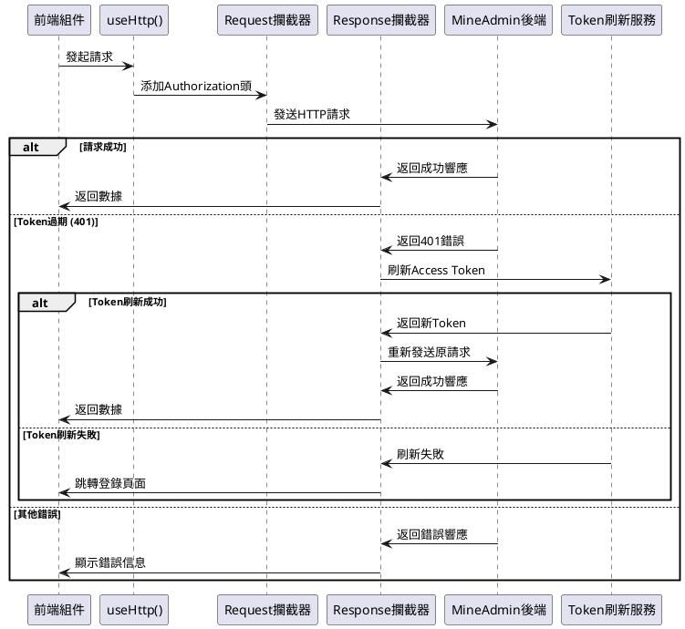
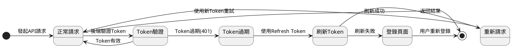

# 請求與攔截器

MineAdmin 基於 [axios](https://github.com/axios/axios) 作為請求庫，提供了完整的請求攔截器和響應處理機制，支持自動 Token 刷新、錯誤處理、加載狀態管理等功能。

## 概述

### 雙重請求架構

系統提供兩種請求處理方式，滿足不同的使用場景：

1. **內部請求** - 專門用於 MineAdmin 後端 API 的請求封裝
   - 自動處理 JWT Token 認證
   - 內置錯誤處理和用户提示
   - 支持 Token 自動刷新機制
   - 集成加載狀態管理

2. **外部請求** - 用於第三方 API 或其他後端服務的通用請求
   - 支持自定義 baseURL 和請求配置
   - 可獨立配置攔截器和錯誤處理
   - 靈活的參數傳遞方式

### 請求處理流程



## 內部請求 (useHttp)

### 基本用法

在項目的任意位置都可以直接使用 `useHttp()` 函數，無需手動導入：

```ts
// 獲取請求實例
const http = useHttp()

// GET 請求 - 獲取用户列表
const getUserList = async (params?: any) => {
  return await http.get('/admin/user/index', params)
}

// POST 請求 - 創建新用户
const createUser = async (userData: any) => {
  return await http.post('/admin/user/save', userData)
}

// PUT 請求 - 更新用户信息
const updateUser = async (id: number, userData: any) => {
  return await http.put(`/admin/user/update/${id}`, userData)
}

// DELETE 請求 - 刪除用户
const deleteUser = async (id: number) => {
  return await http.delete(`/admin/user/destroy/${id}`)
}
```

### 高級配置

支持傳入額外的 axios 配置參數：

```ts
const http = useHttp()

// 設置請求超時時間
const result = await http.get('/admin/user/index', {}, {
  timeout: 10000, // 10秒超時
  headers: {
    'X-Custom-Header': 'CustomValue'
  }
})

// 上傳文件請求
const uploadFile = async (file: File) => {
  const formData = new FormData()
  formData.append('file', file)
  
  return await http.post('/admin/upload/image', formData, {
    headers: {
      'Content-Type': 'multipart/form-data'
    },
    timeout: 60000 // 上傳超時設為60秒
  })
}

// 下載文件
const downloadFile = async (fileId: string) => {
  return await http.get(`/admin/file/download/${fileId}`, {}, {
    responseType: 'blob' // 二進制數據
  })
}
```

### 實際使用示例

在組件中的完整使用示例：

```vue
<script setup lang="ts">
import { ref, onMounted } from 'vue'
import { ElMessage } from 'element-plus'

const http = useHttp()
const users = ref([])
const loading = ref(false)

// 獲取用户列表
const fetchUsers = async () => {
  try {
    loading.value = true
    const response = await http.get('/admin/user/index', {
      page: 1,
      size: 20
    })
    
    users.value = response.data.items
    ElMessage.success('用户列表加載成功')
  } catch (error) {
    ElMessage.error('加載用户列表失敗')
    console.error('獲取用户列表錯誤:', error)
  } finally {
    loading.value = false
  }
}

// 刪除用户
const handleDeleteUser = async (userId: number) => {
  try {
    await http.delete(`/admin/user/destroy/${userId}`)
    ElMessage.success('用户刪除成功')
    fetchUsers() // 重新加載列表
  } catch (error) {
    ElMessage.error('刪除用户失敗')
  }
}

onMounted(() => {
  fetchUsers()
})
</script>
```

## Token 刷新機制

### 自動刷新原理

MineAdmin 實現了基於雙 Token 的無感刷新機制：

1. **Access Token** - 用於業務 API 認證，過期時間較短（默認1小時）
2. **Refresh Token** - 用於刷新 Access Token，過期時間較長（默認2小時）



### 併發請求處理

當有多個併發請求時，系統會智能處理 Token 刷新：

```ts
// 併發場景示例
const [users, roles, permissions] = await Promise.all([
  http.get('/admin/user/index'),
  http.get('/admin/role/index'), 
  http.get('/admin/permission/index')
])

// 如果 Token 過期，只會刷新一次，其他請求會等待
// 刷新完成後，所有請求會使用新 Token 重新發送
```

具體刷新機制詳情可參考 [用户認證文檔](/zh-hk/backend/security/passport.md)。

## 外部請求

### 基本用法

用於請求第三方 API 或非 MineAdmin 後端服務：

```ts
import request from '@/utils/http'

const { createHttp } = request

// 創建第三方API請求實例
const thirdPartyHttp = createHttp('https://api.example.com', {
  headers: {
    'User-Agent': 'MineAdmin/1.0',
    'X-API-Key': 'your-api-key'
  },
  timeout: 15000
})

// 使用第三方API
const getExternalData = async () => {
  try {
    const response = await thirdPartyHttp.get('/users')
    return response.data
  } catch (error) {
    console.error('第三方API請求失敗:', error)
    throw error
  }
}
```

### 多個外部服務

可以為不同的外部服務創建多個請求實例：

```ts
// 地圖服務API
const mapHttp = createHttp('https://api.map.com', {
  headers: { 'Authorization': 'Bearer map-token' }
})

// 支付服務API  
const paymentHttp = createHttp('https://api.payment.com', {
  headers: { 'Authorization': 'Bearer payment-token' }
})

// 短信服務API
const smsHttp = createHttp('https://api.sms.com', {
  headers: { 'X-API-Key': 'sms-api-key' }
})

// 使用示例
const sendSms = async (phone: string, message: string) => {
  return await smsHttp.post('/send', { phone, message })
}
```

## 攔截器詳解

### 響應攔截器源碼分析

MineAdmin 的響應攔截器位於 `src/utils/http.ts` 文件中，主要處理以下場景：

1. **成功響應處理**
2. **Token 過期自動刷新**  
3. **錯誤狀態碼處理**
4. **文件下載響應處理**
#### 核心攔截器邏輯

```ts:line-numbers
http.interceptors.response.use(
  async (response: AxiosResponse): Promise<any> => {
    isLoading.value = false
    const userStore = useUserStore()
    await usePluginStore().callHooks('networkResponse', response)
    const config = response.config
    
    // 處理文件下載響應
    if ((response.request.responseType === 'blob'
        || response.request.responseType === 'arraybuffer')
      && !/^application\/json/.test(response.headers['content-type'])
      && response.status === ResultCode.SUCCESS
    ) {
      return Promise.resolve(response.data)
    }

    // 處理成功響應
    if (response?.data?.code === ResultCode.SUCCESS) {
      return Promise.resolve(response.data)
    }
    else {
      // 根據不同錯誤碼進行處理
      switch (response?.data?.code) {
        case ResultCode.UNAUTHORIZED: {
          // Token 過期處理邏輯
          const logout = useDebounceFn(
            async () => {
              Message.error('登錄狀態已過期，需要重新登錄', { zIndex: 9999 })
              await useUserStore().logout()
            },
            3000,
            { maxWait: 5000 },
          )
          
          // 檢查是否需要刷新 Token
          if (userStore.isLogin && !isRefreshToken.value) {
            isRefreshToken.value = true
            if (!cache.get('refresh_token')) {
              await logout()
              break
            }

            try {
              // 使用 Refresh Token 刷新 Access Token
              const refreshTokenResponse = await createHttp(null, {
                headers: {
                  Authorization: `Bearer ${cache.get('refresh_token')}`,
                },
              }).post('/admin/passport/refresh')

              if (refreshTokenResponse.data.code !== 200) {
                await logout()
                break
              }
              else {
                // 更新 Token 並重新發送請求
                const { data } = refreshTokenResponse.data
                userStore.token = data.access_token
                cache.set('token', data.access_token)
                cache.set('expire', useDayjs().unix() + data.expire_at, { exp: data.expire_at })
                cache.set('refresh_token', data.refresh_token)

                config.headers!.Authorization = `Bearer ${userStore.token}`
                requestList.value.map((cb: any) => cb())
                requestList.value = []
                return http(config) // 重新發送原請求
              }
            }
            catch (e: any) {
              requestList.value.map((cb: any) => cb())
              await logout()
              break
            }
            finally {
              requestList.value = []
              isRefreshToken.value = false
            }
          }
          else {
            // 如果正在刷新 Token，將請求加入隊列等待
            return new Promise((resolve) => {
              requestList.value.push(() => {
                config.headers!.Authorization = `Bearer ${cache.get('token')}`
                resolve(http(config))
              })
            })
          }
        }
        case ResultCode.NOT_FOUND:
          Message.error('服務器資源不存在', { zIndex: 9999 })
          break
        case ResultCode.FORBIDDEN:
          Message.error('沒有權限訪問此接口', { zIndex: 9999 })
          break
        case ResultCode.METHOD_NOT_ALLOWED:
          Message.error('請求方法不被允許', { zIndex: 9999 })
          break
        case ResultCode.FAIL:
          Message.error('服務器內部錯誤', { zIndex: 9999 })
          break
        default:
          Message.error(response?.data?.message ?? '未知錯誤', { zIndex: 9999 })
          break
      }

      return Promise.reject(response.data ? response.data : null)
    }
  },
  // 網絡錯誤處理
  async (error: any) => {
    isLoading.value = false
    const serverError = useDebounceFn(async () => {
      if (error && error.response && error.response.status === 500) {
        Message.error(error.message ?? '服務器內部錯誤', { zIndex: 9999 })
      }
    }, 3000, { maxWait: 5000 })
    await serverError()
    return Promise.reject(error)
  },
)
```

### 狀態碼處理機制

系統對不同的 HTTP 狀態碼和業務錯誤碼進行了統一處理：

| 狀態碼 | 説明 | 處理方式 |
|--------|------|----------|
| `200` (SUCCESS) | 請求成功 | 直接返回數據 |
| `401` (UNAUTHORIZED) | Token 過期或無效 | 自動刷新 Token 或跳轉登錄 |
| `403` (FORBIDDEN) | 權限不足 | 顯示權限錯誤提示 |
| `404` (NOT_FOUND) | 資源不存在 | 顯示資源不存在提示 |
| `405` (METHOD_NOT_ALLOWED) | 請求方法不允許 | 顯示方法錯誤提示 |
| `500` (INTERNAL_ERROR) | 服務器內部錯誤 | 顯示服務器錯誤提示 |

### 自定義攔截器

如果需要為外部請求自定義攔截器，可以這樣做：

```ts
import request from '@/utils/http'

const { createHttp } = request

// 創建帶自定義攔截器的請求實例
const customHttp = createHttp('https://api.custom.com')

// 添加請求攔截器
customHttp.interceptors.request.use(
  (config) => {
    // 在發送請求之前做一些處理
    config.headers['X-Timestamp'] = Date.now()
    console.log('發送請求:', config)
    return config
  },
  (error) => {
    console.error('請求錯誤:', error)
    return Promise.reject(error)
  }
)

// 添加響應攔截器
customHttp.interceptors.response.use(
  (response) => {
    // 處理響應數據
    console.log('收到響應:', response)
    if (response.data.status === 'error') {
      throw new Error(response.data.message)
    }
    return response
  },
  (error) => {
    // 處理響應錯誤
    console.error('響應錯誤:', error)
    return Promise.reject(error)
  }
)
```

## 最佳實踐

### 1. 錯誤處理

建議在組件中統一處理錯誤：

```ts
// composables/useApi.ts
export const useApi = () => {
  const http = useHttp()
  
  const handleError = (error: any, defaultMessage = '操作失敗') => {
    const message = error?.message || error?.data?.message || defaultMessage
    ElMessage.error(message)
    console.error('API錯誤:', error)
  }
  
  const safeRequest = async <T>(requestFn: () => Promise<T>, errorMessage?: string): Promise<T | null> => {
    try {
      return await requestFn()
    } catch (error) {
      handleError(error, errorMessage)
      return null
    }
  }
  
  return { http, handleError, safeRequest }
}
```

### 2. 類型定義

為 API 響應定義明確的類型：

```ts
// types/api.ts
export interface ApiResponse<T = any> {
  code: number
  message: string
  data: T
}

export interface PaginatedResponse<T> {
  items: T[]
  total: number
  page: number
  size: number
}

export interface User {
  id: number
  username: string
  email: string
  status: number
}

// 使用示例
const getUserList = async (): Promise<ApiResponse<PaginatedResponse<User>>> => {
  return await http.get('/admin/user/index')
}
```

### 3. 請求封裝

將常用的 API 請求封裝成可複用的服務：

```ts
// services/userService.ts
export class UserService {
  private http = useHttp()
  
  async getList(params: any) {
    return await this.http.get('/admin/user/index', params)
  }
  
  async create(user: Partial<User>) {
    return await this.http.post('/admin/user/save', user)
  }
  
  async update(id: number, user: Partial<User>) {
    return await this.http.put(`/admin/user/update/${id}`, user)
  }
  
  async delete(id: number) {
    return await this.http.delete(`/admin/user/destroy/${id}`)
  }
  
  async batchDelete(ids: number[]) {
    return await this.http.post('/admin/user/destroy', { ids })
  }
}

// 創建服務實例
export const userService = new UserService()
```

### 4. 加載狀態管理

合理使用加載狀態提升用户體驗：

```vue
<script setup lang="ts">
import { ref } from 'vue'

const loading = ref(false)
const data = ref([])

const fetchData = async () => {
  loading.value = true
  try {
    const response = await http.get('/admin/data')
    data.value = response.data
  } catch (error) {
    console.error('數據加載失敗:', error)
  } finally {
    loading.value = false
  }
}
</script>

<template>
  <div v-loading="loading">
    <!-- 數據展示內容 -->
  </div>
</template>
```

## 常見問題

### Q: Token 刷新期間的併發請求如何處理？

A: 系統會將所有需要 Token 的請求暫存在隊列中，等待 Token 刷新完成後統一使用新 Token 重新發送。

### Q: 如何處理文件上傳進度？

A: 可以使用 axios 的 `onUploadProgress` 配置：

```ts
const uploadWithProgress = async (file: File, onProgress?: (progress: number) => void) => {
  const formData = new FormData()
  formData.append('file', file)
  
  return await http.post('/admin/upload', formData, {
    onUploadProgress: (progressEvent) => {
      if (progressEvent.total && onProgress) {
        const progress = Math.round((progressEvent.loaded / progressEvent.total) * 100)
        onProgress(progress)
      }
    }
  })
}
```

### Q: 如何取消正在進行的請求？

A: 使用 axios 的取消令牌：

```ts
import { ref, onUnmounted } from 'vue'

const controller = ref<AbortController>()

const fetchData = async () => {
  // 取消之前的請求
  controller.value?.abort()
  
  // 創建新的控制器
  controller.value = new AbortController()
  
  try {
    const response = await http.get('/admin/data', {}, {
      signal: controller.value.signal
    })
    return response
  } catch (error) {
    if (error.name === 'AbortError') {
      console.log('請求已取消')
    } else {
      throw error
    }
  }
}

// 組件卸載時取消請求
onUnmounted(() => {
  controller.value?.abort()
})
```
