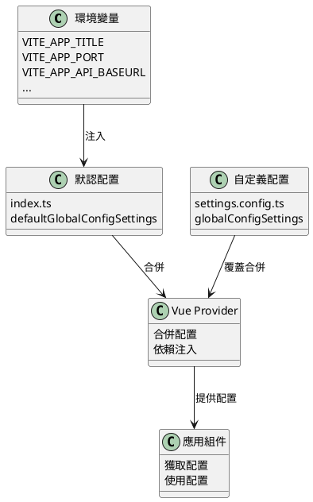
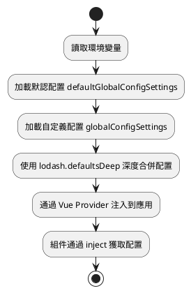

# 系統參數配置

MineAdmin 提供了強大而靈活的系統配置機制，支持多層級配置合併、環境變量集成和運行時動態修改。本文檔將詳細介紹如何配置和管理系統參數。

## 配置系統概覽

::: tip 配置文件
- **默認配置文件**：`src/provider/settings/index.ts` - 系統默認配置
- **自定義配置文件**：`src/provider/settings/settings.config.ts` - 用户自定義配置
- **環境變量文件**：`.env.development` / `.env.production` - 環境相關配置

修改配置時，請將需要自定義的配置項拷貝到 `settings.config.ts` 文件中進行修改，系統會自動合併配置。
:::

## 配置系統架構



## 配置加載流程



## 核心配置詳解

### 應用基礎配置 (app)

| 配置項 | 類型 | 默認值 | 描述 |
|--------|------|--------|------|
| `colorMode` | `'lightMode' \| 'darkMode' \| 'autoMode'` | `'autoMode'` | 顏色模式，支持明亮、暗黑和自動模式 |
| `useLocale` | `string` | `'zh_CN'` | 系統語言，支持國際化 |
| `whiteRoute` | `string[]` | `['login']` | 白名單路由，無需認證即可訪問 |
| `layout` | `'classic' \| 'modern' \| 'minimal'` | `'classic'` | 佈局模式 |
| `pageAnimate` | `string` | `'ma-slide-down'` | 頁面切換動畫效果 |
| `enableWatermark` | `boolean` | `false` | 是否啓用水印功能 |
| `primaryColor` | `string` | `'#2563EB'` | 主題色 |
| `asideDark` | `boolean` | `false` | 側邊欄是否使用暗色主題 |
| `showBreadcrumb` | `boolean` | `true` | 是否顯示麪包屑導航 |
| `loadUserSetting` | `boolean` | `true` | 是否加載用户個人設置 |
| `watermarkText` | `string` | `import.meta.env.VITE_APP_TITLE` | 水印文字內容 |

**配置示例：**
```typescript
app: {
  colorMode: 'autoMode',              // 自動切換主題
  useLocale: 'zh_CN',                 // 使用簡體中文
  whiteRoute: ['login', 'register'],  // 登錄和註冊頁面免認證
  layout: 'classic',                  // 經典佈局
  pageAnimate: 'ma-fade-in',         // 淡入動畫效果
  enableWatermark: true,             // 開啓水印
  primaryColor: '#1890ff',           // 自定義主題色
  asideDark: true,                   // 側邊欄暗色主題
  showBreadcrumb: true,              // 顯示麪包屑
  loadUserSetting: true,             // 加載用户設置
  watermarkText: '我的系統',          // 自定義水印文字
}
```

### 歡迎頁配置 (welcomePage)

| 配置項 | 類型 | 默認值 | 描述 |
|--------|------|--------|------|
| `name` | `string` | `'welcome'` | 路由名稱 |
| `path` | `string` | `'/welcome'` | 路由路徑 |
| `title` | `string` | `'歡迎頁'` | 頁面標題 |
| `icon` | `string` | `'icon-park-outline:jewelry'` | 圖標 |

### 主側邊欄配置 (mainAside)

| 配置項 | 類型 | 默認值 | 描述 |
|--------|------|--------|------|
| `showIcon` | `boolean` | `true` | 是否顯示圖標 |
| `showTitle` | `boolean` | `true` | 是否顯示標題 |
| `enableOpenFirstRoute` | `boolean` | `false` | 是否自動打開第一個路由 |

### 子側邊欄配置 (subAside)

| 配置項 | 類型 | 默認值 | 描述 |
|--------|------|--------|------|
| `showIcon` | `boolean` | `true` | 是否顯示圖標 |
| `showTitle` | `boolean` | `true` | 是否顯示標題 |
| `fixedAsideState` | `boolean` | `false` | 是否固定側邊欄狀態 |
| `showCollapseButton` | `boolean` | `true` | 是否顯示摺疊按鈕 |

### 標籤欄配置 (tabbar)

| 配置項 | 類型 | 默認值 | 描述 |
|--------|------|--------|------|
| `enable` | `boolean` | `true` | 是否啓用標籤欄 |
| `mode` | `'rectangle' \| 'round' \| 'card'` | `'rectangle'` | 標籤欄樣式 |

### 版權信息配置 (copyright)

| 配置項 | 類型 | 默認值 | 描述 |
|--------|------|--------|------|
| `enable` | `boolean` | `true` | 是否顯示版權信息 |
| `dates` | `string` | `useDayjs().format('YYYY')` | 版權年份 |
| `company` | `string` | `'MineAdmin Team'` | 公司名稱 |
| `website` | `string` | `'https://www.mineadmin.com'` | 官網地址 |
| `putOnRecord` | `string` | `'豫ICP備00000000號-1'` | 備案號 |

## 環境變量配置

### 開發環境配置 (.env.development)

```bash
# 頁面標題
VITE_APP_TITLE = MineAdmin開發環境

# 開發服務器端口
VITE_APP_PORT = 2888

# 應用根路徑
VITE_APP_ROOT_BASE = /

# API 接口地址
VITE_APP_API_BASEURL = http://127.0.0.1:9501

# 路由模式：hash 或 history
VITE_APP_ROUTE_MODE = hash

# 本地存儲前綴
VITE_APP_STORAGE_PREFIX = mine_

# 是否開啓代理
VITE_OPEN_PROXY = true

# 代理前綴
VITE_PROXY_PREFIX = /dev

# 是否開啓 vConsole（移動端調試）
VITE_OPEN_vCONSOLE = false

# 是否開啓開發者工具
VITE_OPEN_DEVTOOLS = true
```

### 生產環境配置 (.env.production)

```bash
# 頁面標題
VITE_APP_TITLE = MineAdmin

# 生產服務器端口
VITE_APP_PORT = 80

# 應用根路徑
VITE_APP_ROOT_BASE = /admin/

# API 接口地址
VITE_APP_API_BASEURL = https://api.yourdomain.com

# 路由模式
VITE_APP_ROUTE_MODE = history

# 本地存儲前綴
VITE_APP_STORAGE_PREFIX = mine_prod_

# 關閉代理
VITE_OPEN_PROXY = false

# 是否生成 sourcemap
VITE_BUILD_SOURCEMAP = false

# 打包壓縮方式
VITE_BUILD_COMPRESS = gzip,brotli

# 打包後生成存檔
VITE_BUILD_ARCHIVE = 
```

## 自定義配置示例

在 `src/provider/settings/settings.config.ts` 文件中添加自定義配置：

```typescript
import type { SystemSettings } from '#/global'

const globalConfigSettings: SystemSettings.all = {
  // 應用配置
  app: {
    colorMode: 'lightMode',           // 強制明亮模式
    useLocale: 'en_US',               // 使用英語
    primaryColor: '#ff4757',          // 自定義紅色主題
    enableWatermark: true,            // 啓用水印
    watermarkText: '內部系統',        // 自定義水印文字
    pageAnimate: 'ma-fade-in',        // 淡入動畫
  },
  
  // 歡迎頁配置
  welcomePage: {
    name: 'dashboard',
    path: '/dashboard',
    title: '控制枱',
    icon: 'mdi:view-dashboard',
  },
  
  // 側邊欄配置
  mainAside: {
    showIcon: true,
    showTitle: false,                 // 隱藏主菜單標題
    enableOpenFirstRoute: true,       // 自動打開第一個路由
  },
  
  // 標籤欄配置
  tabbar: {
    enable: true,
    mode: 'card',                     // 卡片模式
  },
  
  // 版權信息
  copyright: {
    enable: true,
    company: '我的公司',
    website: 'https://mycompany.com',
    putOnRecord: '京ICP備12345678號',
  },
}

export default globalConfigSettings
```

## 高級配置技巧

### 條件配置

根據不同環境或設備類型設置不同配置：

```typescript
const globalConfigSettings: SystemSettings.all = {
  app: {
    // 根據環境變量決定主題
    colorMode: import.meta.env.MODE === 'development' ? 'autoMode' : 'lightMode',
    
    // 移動端隱藏麪包屑
    showBreadcrumb: !/Mobile|Android|iPhone/i.test(navigator.userAgent),
    
    // 生產環境關閉水印
    enableWatermark: import.meta.env.MODE === 'development',
    
    // 動態設置 API 地址
    watermarkText: import.meta.env.VITE_APP_TITLE || '系統',
  },
}
```

### 模塊化配置

將大型配置拆分為多個模塊：

```typescript
// config/app.config.ts
export const appConfig = {
  colorMode: 'autoMode',
  useLocale: 'zh_CN',
  primaryColor: '#2563EB',
}

// config/layout.config.ts
export const layoutConfig = {
  mainAside: {
    showIcon: true,
    showTitle: true,
  },
  subAside: {
    fixedAsideState: false,
    showCollapseButton: true,
  },
}

// settings.config.ts
import { appConfig } from './config/app.config'
import { layoutConfig } from './config/layout.config'

const globalConfigSettings: SystemSettings.all = {
  app: appConfig,
  ...layoutConfig,
}
```

### 運行時配置修改

在應用運行時動態修改配置：

```typescript
// 在組件中使用
import { inject, reactive } from 'vue'
import type { SystemSettings } from '#/global'

export default defineComponent({
  setup() {
    const settings = inject('defaultSetting') as SystemSettings.all
    
    // 動態切換主題
    const switchTheme = (mode: 'lightMode' | 'darkMode') => {
      settings.app.colorMode = mode
    }
    
    // 動態修改主題色
    const changePrimaryColor = (color: string) => {
      settings.app.primaryColor = color
    }
    
    return {
      settings,
      switchTheme,
      changePrimaryColor,
    }
  },
})
```

## 配置最佳實踐

### 1. 版本控制管理

```bash
# .gitignore 文件
.env.local
.env.*.local
src/provider/settings/settings.config.local.ts
```

### 2. 類型安全

利用 TypeScript 確保配置類型安全：

```typescript
import type { SystemSettings } from '#/global'

// 使用類型斷言確保配置正確
const globalConfigSettings: SystemSettings.all = {
  app: {
    // TypeScript 會提供類型檢查和自動補全
    colorMode: 'lightMode', // 只能是預定義的值
    primaryColor: '#ffffff', // 必須是字符串
  },
} satisfies SystemSettings.all
```

### 3. 配置驗證

在配置加載時添加驗證：

```typescript
import { z } from 'zod'

const configSchema = z.object({
  app: z.object({
    colorMode: z.enum(['lightMode', 'darkMode', 'autoMode']),
    primaryColor: z.string().regex(/^#[0-9A-Fa-f]{6}$/),
  }),
})

// 驗證配置
const validateConfig = (config: unknown) => {
  try {
    return configSchema.parse(config)
  } catch (error) {
    console.error('配置驗證失敗:', error)
    throw new Error('配置格式不正確')
  }
}
```

## 常見問題與排錯

### Q: 配置修改後不生效？

**A:** 檢查以下幾點：

1. **配置文件路徑是否正確**
   ```bash
   # 正確的配置文件路徑
   src/provider/settings/settings.config.ts
   ```

2. **配置語法是否正確**
   ```typescript
   // ❌ 錯誤：語法錯誤
   const config = {
     app: {
       colorMode: lightMode, // 缺少引號
     }
   }
   
   // ✅ 正確：正確語法
   const config = {
     app: {
       colorMode: 'lightMode',
     }
   }
   ```

3. **是否重新啓動了開發服務器**
   ```bash
   pnpm run dev
   ```

### Q: 環境變量無法讀取？

**A:** 確保環境變量以 `VITE_` 開頭：

```bash
# ❌ 錯誤：不以 VITE_ 開頭
APP_TITLE = MineAdmin

# ✅ 正確：以 VITE_ 開頭
VITE_APP_TITLE = MineAdmin
```

### Q: 如何調試配置問題？

**A:** 使用以下方法調試：

```typescript
// 在組件中打印當前配置
const settings = inject('defaultSetting')
console.log('當前配置:', settings)

// 檢查環境變量
console.log('環境變量:', import.meta.env)

// 檢查配置合併結果
import { defaultsDeep } from 'lodash-es'
console.log('合併後配置:', defaultsDeep(customConfig, defaultConfig))
```

### Q: 配置在生產環境中不生效？

**A:** 檢查構建配置：

1. **確認環境變量文件**
   ```bash
   # 生產環境應該有對應的環境變量文件
   .env.production
   ```

2. **檢查構建命令**
   ```bash
   # 確保使用正確的構建命令
   pnpm run build
   ```

3. **驗證構建產物**
   ```bash
   # 預覽構建結果
   pnpm run preview
   ```

## 相關參考

- [佈局配置](./layout.md) - 佈局系統配置詳解

::: warning 注意事項
- 修改配置後需要重啓開發服務器才能生效
- 生產環境的配置修改需要重新構建和部署
- 敏感信息不要直接寫在配置文件中，建議使用環境變量
:::