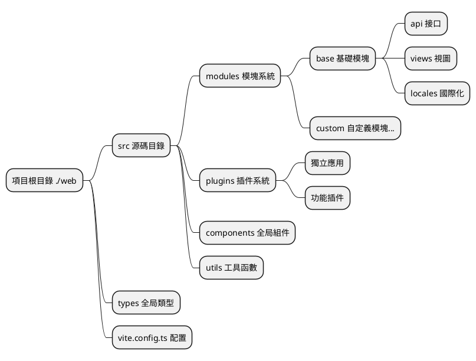
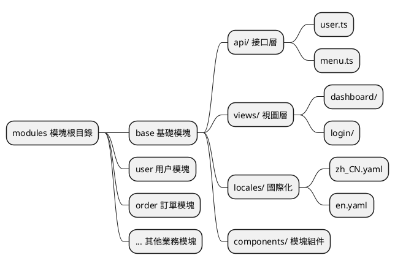
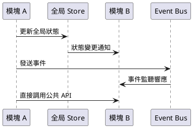
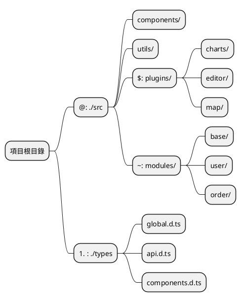
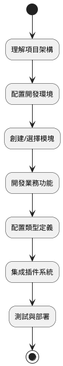

# 基礎概念

整個項目進行了重構，現在我們將會介紹一些基礎概念，以便於你更好的理解整個文檔，請務必仔細先閲讀這一部分。

::: tip
以下所講全部針對源碼根目錄下的 `./web` 裏的結構
:::

## 項目整體架構

本項目採用現代化的前端開發架構，基於 Vue 3 + TypeScript + Vite 構建，實現了模塊化、插件化的開發模式。



## 全局類型系統

由於新版採用 `TypeScript` 所寫，全局的類型定義都在 `./types` 目錄下存放着，可在裏面找到相關的數據類型結構。

### 類型文件組織結構

```
./types/
├── api.d.ts          # API 相關類型定義
├── components.d.ts   # 組件類型定義
├── global.d.ts       # 全局類型定義
├── modules.d.ts      # 模塊類型定義
└── utils.d.ts        # 工具函數類型定義
```

### 使用示例

在項目中可以通過別名 `#` 快速引入類型：

```typescript
// 引入 API 類型
import type { ApiResponse, UserInfo } from '#/api'

// 引入全局類型
import type { MenuConfig, RouteConfig } from '#/global'

// 在組件中使用
interface ComponentProps {
  userInfo: UserInfo
  menuConfig: MenuConfig[]
}
```

### 類型定義最佳實踐

- **命名規範**：使用 PascalCase 命名接口和類型
- **文件組織**：按功能模塊劃分類型文件
- **類型導出**：使用 `export type` 導出類型定義
- **泛型支持**：合理使用泛型提高類型複用性

## 模塊化架構

新版本進行模塊化劃分，目錄為 `./src/modules`。每個模塊管理着所屬業務的 `api`、`types`、`locales` 以及 `視圖文件`，實現業務的完全隔離和獨立管理。

### 模塊結構設計



### 標準模塊目錄結構

```
./src/modules/[模塊名]/
├── api/                 # API 接口定義
│   ├── user.ts         # 用户相關接口
│   ├── menu.ts         # 菜單相關接口
│   └── index.ts        # 接口統一導出
├── components/          # 模塊專用組件
│   ├── UserForm.vue    # 用户表單組件
│   └── MenuTree.vue    # 菜單樹組件
├── locales/            # 模塊國際化文件
│   ├── zh_CN.yaml      # 中文語言包
│   ├── en.yaml         # 英文語言包
│   └── index.ts        # 語言包導出
├── views/              # 視圖頁面
│   ├── user/           # 用户管理頁面
│   │   ├── index.vue   # 用户列表頁
│   │   └── detail.vue  # 用户詳情頁
│   └── dashboard/      # 儀表板頁面
│       └── index.vue
└── index.ts           # 模塊統一導出
```

### 模塊開發流程

1. **創建模塊目錄**：在 `./src/modules/` 下創建新的模塊文件夾
2. **定義模塊結構**：按照標準結構創建相應目錄和文件
3. **配置路由**：在模塊中定義路由配置
4. **開發業務邏輯**：編寫 API、組件和視圖
5. **添加國際化**：配置多語言支持
6. **模塊導出**：通過 index.ts 統一導出模塊內容

### 模塊間通信



### 模塊使用示例

```typescript
// 在其他模塊中使用 base 模塊的 API
import { userApi, menuApi } from '~/base/api'
import type { UserInfo } from '~/base/types'

// 在組件中使用模塊功能
export default defineComponent({
  async setup() {
    // 調用用户 API
    const userList = await userApi.getUsers()
    
    // 調用菜單 API
    const menuTree = await menuApi.getMenuTree()
    
    return {
      userList,
      menuTree
    }
  }
})
```

## 別名系統

在 `vite.config.ts` 文件中定義了路徑別名系統，簡化文件引入路徑，提高開發效率和代碼可維護性。

### 別名配置

```typescript
// vite.config.ts
export default defineConfig({
  resolve: {
    alias: {
      '@': path.resolve(__dirname, 'src'),
      '#': path.resolve(__dirname, 'types'),
      '$': path.resolve(__dirname, 'src/plugins'),
      '~': path.resolve(__dirname, 'src/modules'),
    },
  },
})
```

### 別名映射表

| 別名 | 目錄路徑 | 用途描述 | 使用場景 |
|------|----------|----------|----------|
| `@` | `./src` | 源碼根目錄 | 引入組件、工具函數、樣式等 |
| `#` | `./types` | 全局類型定義 | 引入 TypeScript 類型定義 |
| `$` | `./src/plugins` | 插件目錄 | 引入插件內的文件和組件 |
| `~` | `./src/modules` | 模塊目錄 | 引入模塊內的 API、組件、視圖 |

### 別名使用示例

#### 1. 基礎路徑別名 (@)

```typescript
// ❌ 使用相對路徑（不推薦）
import Utils from '../../../utils/common'
import Button from '../../../components/Button.vue'

// ✅ 使用別名（推薦）
import Utils from '@/utils/common'
import Button from '@/components/Button.vue'
```

#### 2. 類型定義別名 (#)

```typescript
// 引入全局類型
import type { 
  ApiResponse, 
  UserInfo, 
  MenuConfig 
} from '#/global'

// 引入 API 類型
import type { LoginParams } from '#/api'

// 在接口中使用
interface ComponentProps {
  userInfo: UserInfo
  menuList: MenuConfig[]
}
```

#### 3. 插件別名 ($)

```typescript
// 引入圖表插件
import ChartPlugin from '$/charts'
import { useChart } from '$/charts/hooks'

// 引入編輯器插件
import EditorPlugin from '$/editor'
import EditorComponent from '$/editor/components/RichEditor.vue'
```

#### 4. 模塊別名 (~)

```typescript
// 引入 base 模塊的 API
import { userApi, menuApi } from '~/base/api'

// 引入用户模塊的組件
import UserForm from '~/user/components/UserForm.vue'
import UserList from '~/user/views/UserList.vue'

// 引入模塊的類型
import type { UserModuleState } from '~/user/types'
```

### 別名系統架構圖



### 別名配置最佳實踐

#### 1. IDE 支持配置

為了獲得更好的 IDE 智能提示和路徑跳轉支持，需要配置 `tsconfig.json`：

```json
{
  "compilerOptions": {
    "baseUrl": ".",
    "paths": {
      "@/*": ["src/*"],
      "#/*": ["types/*"],
      "$/*": ["src/plugins/*"],
      "~/*": ["src/modules/*"]
    }
  }
}
```

#### 2. 使用規範

- **一致性**：團隊內部統一使用別名，避免混用相對路徑
- **可讀性**：別名應該語義明確，易於理解
- **層級控制**：避免過深的路徑層級，合理使用別名簡化路徑
- **類型安全**：配合 TypeScript 確保路徑引用的類型安全

#### 3. 常見使用模式

```typescript
// 組件內綜合使用示例
<script setup lang="ts">
// 全局類型
import type { UserInfo, ApiResponse } from '#/global'

// 全局工具
import { formatDate, validateForm } from '@/utils/common'

// 模塊 API
import { userApi } from '~/base/api'

// 插件功能
import { useChart } from '$/charts/hooks'

// 全局組件
import MaButton from '@/components/MaButton.vue'

// 模塊組件
import UserForm from '~/user/components/UserForm.vue'
</script>
```

### 別名系統優勢

1. **簡化路徑**：避免複雜的相對路徑引用
2. **提高可維護性**：文件移動時無需修改大量引用路徑
3. **增強可讀性**：通過別名快速識別文件所屬模塊
4. **統一規範**：團隊開發中保持一致的引用風格
5. **IDE 友好**：配合 TypeScript 和 IDE 提供更好的開發體驗

## 總結

通過以上基礎概念的介紹，我們瞭解了項目的核心架構設計：

### 架構特點

- **模塊化設計**：業務功能按模塊劃分，實現高內聚低耦合
- **插件化架構**：支持功能的熱插拔和擴展
- **類型安全**：基於 TypeScript 提供完整的類型支持
- **路徑優化**：通過別名系統簡化文件引用

### 開發流程



### 下一步

在掌握了這些基礎概念後，建議按以下順序深入學習：

1. **[開始使用](/zh-hk/front/base/start)** - 環境搭建和項目啓動
2. **[配置説明](/zh-hk/front/base/configure)** - 詳細配置選項
3. **[路由菜單](/zh-hk/front/base/route-menu)** - 路由和菜單配置
4. **[模塊開發](/zh-hk/front/advanced/module)** - 深入模塊化開發
5. **[插件開發](/zh-hk/front/high/plugins)** - 插件系統詳解

通過系統性的學習和實踐，你將能夠高效地在此架構基礎上進行前端開發工作。