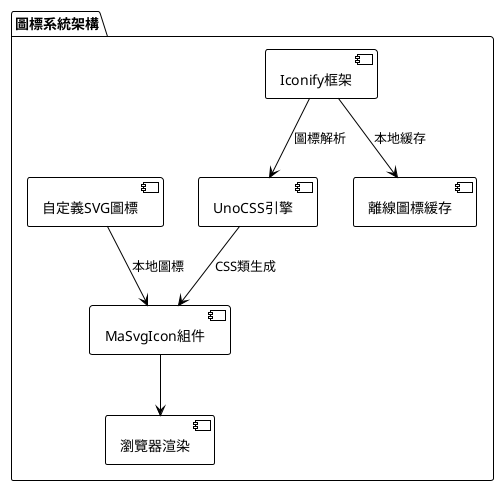
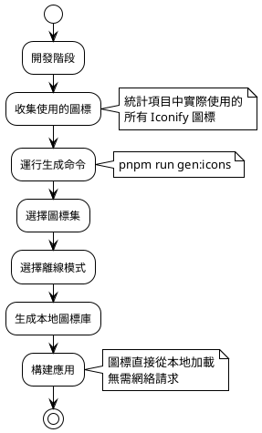

# 圖標系統

MineAdmin 採用現代化的圖標解決方案，基於 Iconify 圖標框架和 UnoCSS 提供強大的圖標支持。系統支持在線圖標庫、離線模式和自定義圖標等多種方案。

## 圖標架構概覽



## 圖標解決方案對比

| 解決方案 | 優勢 | 適用場景 | 性能 | 維護成本 |
|---------|------|---------|------|---------|
| **Iconify在線** | 圖標豐富(200k+)、即用即加載 | 快速開發、原型設計 | ⭐⭐⭐ | 低 |
| **Iconify離線** | 無網絡依賴、加載速度快 | 生產環境、內網部署 | ⭐⭐⭐⭐⭐ | 中 |
| **自定義SVG** | 完全可控、品牌定製 | 企業級應用、品牌統一 | ⭐⭐⭐⭐ | 高 |

## Iconify 圖標使用

::: tip Iconify 優勢
`Iconify` 是目前最全面的圖標框架，包含：
- **150+ 圖標集合**：FontAwesome、Material Design、Ant Design、Tabler Icons等
- **200,000+ 圖標**：涵蓋各行各業的設計需求  
- **統一API**：一套語法適配所有圖標集
- **按需加載**：只加載使用的圖標，減少包體積
:::

### 基礎圖標使用

<DemoPreview dir="demos/icon-basic" />

### 圖標搜索和選擇

推薦使用 [Icônes](https://icones.js.org/) 搜索圖標，這是基於 Iconify 的專業圖標搜索工具：


**搜索技巧：**
1. **按分類瀏覽**：選擇 Material Design、FontAwesome 等知名圖標集
2. **關鍵詞搜索**：支持中英文搜索，如 "用户"、"user"、"profile" 
3. **標籤篩選**：通過 solid、outline、filled 等標籤精確篩選
4. **尺寸預覽**：實時預覽不同尺寸下的圖標效果

::: info 圖標命名規範
複製得到的圖標格式為：`i-{集合名}:{圖標名}`
- 例如：`i-material-symbols:person`
- 例如：`i-heroicons:user-solid`
:::

### MaSvgIcon 組件使用

`MaSvgIcon` 是系統內置的圖標組件，提供統一的圖標渲染接口：

```vue
<template>
  <!-- 基礎使用 -->
  <ma-svg-icon name="i-material-symbols:person" />
  
  <!-- 設置尺寸 -->
  <ma-svg-icon name="i-heroicons:home" size="24" />
  
  <!-- 設置顏色 -->
  <ma-svg-icon name="i-tabler:heart" color="red" />
  
  <!-- 組合使用 -->
  <ma-svg-icon 
    name="i-lucide:settings" 
    size="20" 
    color="#409eff" 
    class="mr-2" 
  />
</template>
```

**組件屬性説明：**

| 屬性 | 類型 | 默認值 | 説明 |
|------|------|--------|------|
| `name` | string | - | 圖標名稱（必填） |
| `size` | string\|number | '16' | 圖標尺寸（px） |
| `color` | string | 'currentColor' | 圖標顏色 |
| `class` | string | - | 自定義CSS類 |

### CSS 類直接使用

對於簡單場景，可以直接使用 CSS 類名：

```html
<!-- 基礎使用 -->
<i class="i-material-symbols:person"></i>
<span class="i-heroicons:home"></span>

<!-- 結合 UnoCSS 工具類 -->
<i class="i-tabler:heart text-red-500 text-2xl"></i>
<span class="i-lucide:settings w-6 h-6 text-blue-500"></span>
```

::: warning 使用限制
CSS 類方式有以下限制：
- **不支持異步加載**：圖標名稱必須在構建時確定
- **不支持動態拼接**：`class="i-${iconName}"` 這種寫法無效
- **推薦靜態使用**：適用於佈局固定的場景
:::

### 在路由菜單中使用

<DemoPreview dir="demos/icon-menu" />

在路由配置中使用圖標，支持多種圖標來源：

```typescript
// 路由配置示例
export const routes = [
  {
    name: 'dashboard',
    path: '/dashboard',
    meta: {
      title: '儀表盤',
      icon: 'i-material-symbols:dashboard',  // Iconify圖標
    }
  },
  {
    name: 'users',
    path: '/users',
    meta: {
      title: '用户管理',
      icon: 'i-heroicons:users',  // 另一個圖標集
    }
  },
  {
    name: 'settings',
    path: '/settings', 
    meta: {
      title: '系統設置',
      icon: 'custom-gear',  // 自定義SVG圖標
    }
  }
]
```

### 離線模式配置

對於生產環境或內網部署，建議使用離線模式以提升性能和穩定性：



**離線模式設置步驟：**

1. **收集圖標使用情況**
   ```bash
   # 掃描項目中使用的圖標
   grep -r "i-[a-zA-Z-]*:" src/ --include="*.vue" --include="*.ts"
   ```

2. **生成離線圖標庫**
   ```bash
   # 運行圖標生成命令
   pnpm run gen:icons
   ```

3. **按提示選擇配置**
   - 選擇需要的圖標集（如 Material Symbols、Heroicons）
   - 選擇使用模式為 "離線模式"  
   - 確認生成配置

::: tip 性能優化建議
- **按需選擇**：只選擇項目實際使用的圖標集
- **定期更新**：當添加新圖標時記得重新生成
- **版本控制**：將生成的圖標文件納入版本管理
:::

## 自定義 SVG 圖標

對於企業特定的圖標需求，可以使用自定義 SVG 圖標：

### 圖標文件管理

```
src/assets/icons/
├── brand/              # 品牌相關圖標
│   ├── logo.svg
│   └── logo-mini.svg
├── business/           # 業務專用圖標  
│   ├── order.svg
│   └── product.svg
└── common/             # 通用圖標
    ├── export.svg
    └── import.svg
```

### 使用自定義圖標

```vue
<template>
  <!-- 使用相對路徑（相對於 assets/icons） -->
  <ma-svg-icon name="brand/logo" />
  <ma-svg-icon name="business/order" />
  <ma-svg-icon name="common/export" />
  
  <!-- 直接使用文件名（需放在 icons 根目錄） -->
  <ma-svg-icon name="custom-icon" />
</template>
```

### SVG 圖標規範

為確保圖標在系統中正常顯示，請遵循以下規範：

```xml
<!-- 推薦的SVG格式 -->
<svg 
  xmlns="http://www.w3.org/2000/svg" 
  viewBox="0 0 24 24" 
  fill="currentColor"
  width="24" 
  height="24"
>
  <path d="..."/>
</svg>
```

**規範要點：**
- **統一尺寸**：建議使用 24x24 的 viewBox
- **可變顏色**：使用 `currentColor` 支持動態顏色
- **簡化路徑**：移除不必要的屬性和註釋
- **語義化命名**：文件名要清晰表達圖標含義

## 圖標在組件中的應用

### 表格操作按鈕

```vue
<script setup lang="tsx">
import { MaProTableSchema } from '@mineadmin/pro-table'

const schema: MaProTableSchema = {
  tableColumns: [
    {
      type: 'operation',
      operationConfigure: {
        actions: [
          {
            name: 'edit',
            text: '編輯',
            icon: 'i-heroicons:pencil-square',  // 編輯圖標
            onClick: (data) => editUser(data.row)
          },
          {
            name: 'delete', 
            text: '刪除',
            icon: 'i-heroicons:trash',  // 刪除圖標
            onClick: (data) => deleteUser(data.row)
          }
        ]
      }
    }
  ]
}
</script>
```

### 表單組件圖標

```vue
<template>
  <ma-form :items="formItems" />
</template>

<script setup>
const formItems = [
  {
    label: '用户信息',
    prop: 'user',
    render: 'input',
    icon: 'i-heroicons:user',  // 字段圖標
    placeholder: '請輸入用户名'
  }
]
</script>
```

### 狀態指示器

<DemoPreview dir="demos/icon-status" />

```vue
<template>
  <div class="status-list">
    <!-- 在線狀態 -->
    <div class="flex items-center">
      <ma-svg-icon name="i-heroicons:signal" color="green" />
      <span class="ml-2">在線</span>
    </div>
    
    <!-- 離線狀態 -->  
    <div class="flex items-center">
      <ma-svg-icon name="i-heroicons:signal-slash" color="gray" />
      <span class="ml-2">離線</span>
    </div>
  </div>
</template>
```

## 實踐指南

### 圖標選擇原則

1. **一致性原則**
   ```vue
   <!-- 推薦：統一使用一個圖標集 -->
   <ma-svg-icon name="i-heroicons:user" />
   <ma-svg-icon name="i-heroicons:cog-6-tooth" />
   <ma-svg-icon name="i-heroicons:home" />
   
   <!-- 避免：混用多個風格的圖標集 -->
   <ma-svg-icon name="i-heroicons:user" />          <!-- outline 風格 -->
   <ma-svg-icon name="i-material-symbols:settings" />  <!-- filled 風格 -->  
   <ma-svg-icon name="i-ant-design:home-filled" />     <!-- 不同設計語言 -->
   ```

2. **語義化原則**
   ```vue
   <!-- 推薦：圖標語義與功能匹配 -->
   <el-button @click="save">
     <ma-svg-icon name="i-heroicons:bookmark" /> 保存
   </el-button>
   
   <!-- 避免：圖標語義不明確 -->
   <el-button @click="save">
     <ma-svg-icon name="i-heroicons:star" /> 保存  
   </el-button>
   ```

### 性能優化策略

```typescript
// 圖標預加載配置
const criticalIcons = [
  'i-heroicons:home',
  'i-heroicons:user', 
  'i-heroicons:cog-6-tooth',
  'i-heroicons:bell'
]

// 在應用啓動時預加載關鍵圖標
criticalIcons.forEach(icon => {
  // 觸發圖標加載
  document.createElement('i').className = icon
})
```

### 無障礙訪問支持

```vue
<template>
  <!-- 添加適當的 aria 標籤 -->
  <button aria-label="設置">
    <ma-svg-icon name="i-heroicons:cog-6-tooth" />
  </button>
  
  <!-- 裝飾性圖標使用 aria-hidden -->
  <h2>
    <ma-svg-icon name="i-heroicons:star" aria-hidden="true" />
    重要通知
  </h2>
</template>
```

## 常見問題排查

### 圖標不顯示

**問題現象：**
- 圖標位置顯示空白
- 控制枱出現 404 錯誤

**排查步驟：**
1. **檢查圖標名稱**
   ```vue
   <!-- 檢查圖標名是否正確 -->
   <ma-svg-icon name="i-heroicons:user-solid" />
   <!--           ↑ 確認集合名和圖標名 -->
   ```

2. **驗證網絡連接**
   ```javascript
   // 在瀏覽器控制枱檢查
   fetch('https://api.iconify.design/heroicons.json')
     .then(r => r.json())
     .then(data => console.log('圖標集數據:', data))
   ```

3. **檢查離線配置**
   ```bash
   # 確認離線圖標是否包含所需圖標
   ls dist/assets/icons/  # 檢查生成的圖標文件
   ```

### 圖標加載緩慢

**優化方案：**
```typescript
// 1. 啓用圖標預加載
const iconPreloader = {
  preload: ['i-heroicons:user', 'i-heroicons:home'],
  
  init() {
    this.preload.forEach(icon => {
      const link = document.createElement('link')
      link.rel = 'preload'
      link.href = `https://api.iconify.design/${icon.replace('i-', '').replace(':', '/')}.svg`
      link.as = 'image'
      document.head.appendChild(link)
    })
  }
}

// 2. 使用離線模式
// 運行 pnpm run gen:icons 生成本地圖標庫
```

### 圖標樣式問題

```vue
<template>
  <!-- 問題：圖標尺寸不一致 -->
  <ma-svg-icon name="i-heroicons:user" class="text-sm" />
  <ma-svg-icon name="i-heroicons:home" class="text-lg" />
  
  <!-- 解決：統一設置尺寸 -->
  <ma-svg-icon name="i-heroicons:user" size="20" />
  <ma-svg-icon name="i-heroicons:home" size="20" />
  
  <!-- 或使用 CSS 類統一控制 -->
  <ma-svg-icon name="i-heroicons:user" class="icon-standard" />
  <ma-svg-icon name="i-heroicons:home" class="icon-standard" />
</template>

<style>
.icon-standard {
  width: 20px;
  height: 20px;
}
</style>
```

## 最佳實踐總結

### 開發階段
- ✅ 使用 [Icônes](https://icones.js.org/) 搜索和預覽圖標
- ✅ 選擇一致的圖標集合（推薦 Heroicons 或 Material Symbols）
- ✅ 為圖標添加語義化的名稱和註釋
- ✅ 建立項目圖標使用規範文檔

### 生產部署  
- ✅ 生成離線圖標庫提升加載性能
- ✅ 啓用圖標預加載優化首屏體驗
- ✅ 配置 CDN 加速圖標資源加載
- ✅ 監控圖標加載性能和錯誤率

### 維護階段
- ✅ 定期清理未使用的圖標引用
- ✅ 跟蹤圖標集版本更新
- ✅ 建立圖標變更的代碼審查機制
- ✅ 維護自定義圖標的設計規範