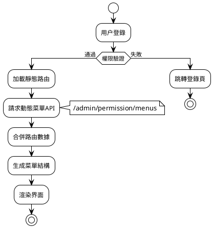
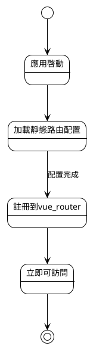
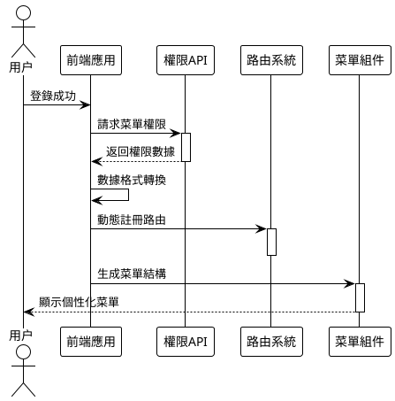

# 路由和菜單

MineAdmin 基於 `vue-router` 提供了一套完整的路由系統，支持**靜態路由**和**動態路由**兩種模式，為企業級權限管理提供強大支撐。

## 系統架構概覽



## 路由類型選擇指南

### 📊 選擇決策矩陣

| 場景 | 靜態路由 | 動態路由 | 推薦理由 |
|------|---------|----------|---------|
| 公共頁面(登錄、404) | ✅ | ❌ | 無需權限驗證，快速加載 |
| 基礎管理頁面 | ❌ | ✅ | 需要權限控制 |
| 多租户系統 | ❌ | ✅ | 不同租户菜單結構不同 |
| 開發調試頁面 | ✅ | ❌ | 僅開發環境使用 |
| 高頻訪問頁面 | ✅ | ❌ | 減少網絡請求，提升性能 |

## 路由、菜單詳細説明

### 🔹 靜態路由

靜態路由在前端預先定義，應用啓動時立即可用，適用於無需權限控制的頁面。

**特點:**
- 前端預定義，啓動時可用
- 無需網絡請求，加載快速
- 適合公共頁面和基礎功能

**配置位置:** `src/router/static-routes` 目錄

**工作流程:**


::: tip 💡 未來規劃
系統考慮引入**文件路由**模式（文件即路由），但目前在 MineAdmin 場景中使用頻率不高。
未來可能會根據社區需求添加此功能。
:::

### 🔹 動態路由

動態路由基於用户權限動態生成，提供精細化的權限控制。

**生成流程:**
1. 用户登錄驗證通過
2. 請求 `/admin/permission/menus` 接口
3. 服務器返回用户權限菜單數據
4. 前端轉換為路由配置
5. 動態註冊到 vue-router
6. 生成對應菜單結構



### 🔹 菜單系統

菜單是路由的可視化表現，將路由配置轉換為用户界面元素。

**菜單與路由關係:**
- 一個路由可能對應一個或多個菜單項
- 菜單支持多層級嵌套結構
- 支持圖標、徽章、國際化等豐富展示

## 路由配置詳解

### 基礎數據類型

系統在 `#/types/global.d.ts` 中定義了完整的路由類型：

::: details 📋 路由數據類型定義
```typescript
declare namespace MineRoute {
  interface routeRecord {
    name?: string                    // 路由名稱，必須唯一
    path?: string                   // 路由路徑
    redirect?: string               // 重定向地址
    expand?: boolean               // 是否展開子菜單
    component?: () => Promise<any>  // 異步組件
    components?: () => Promise<any> // 命名視圖組件
    meta?: RouteMeta              // 路由元數據
    children?: routeRecord[]       // 子路由配置
  }
  
  interface RouteMeta {
    // 基礎信息
    title?: string | (() => string)     // 頁面標題
    i18n?: string | (() => string)      // 國際化鍵名
    icon?: string                       // 圖標（支持iconify）
    badge?: () => string | number       // 徽章內容
    
    // 顯示控制
    hidden?: boolean                    // 是否隱藏菜單
    subForceShow?: boolean             // 強制顯示子菜單
    affix?: boolean                    // 是否固定標籤頁
    
    // 功能配置
    cache?: boolean                    // 是否緩存頁面
    copyright?: boolean                // 是否顯示版權信息
    breadcrumbEnable?: boolean         // 是否顯示麪包屑
    
    // 路由類型
    type?: 'M' | 'B' | 'I' | 'L' | string  // M:菜單 B:按鈕 I:iframe L:外鏈
    link?: string                          // 外鏈/iframe地址
    
    // 權限控制
    auth?: string[]                    // 權限碼數組
    role?: string[]                   // 角色數組  
    user?: string[]                   // 用户ID數組
    
    // 系統內部
    activeName?: string               // 激活菜單名稱
    breadcrumb?: routeRecord[]        // 麪包屑路徑（自動生成）
  }
}
```
:::

### 完整配置示例

```typescript
// 標準菜單頁面配置
const menuRoute: MineRoute.routeRecord = {
  name: 'system',
  path: '/system',
  redirect: '/system/user',
  meta: {
    title: '系統管理',
    i18n: 'menu.system',
    icon: 'icon-park-outline:setting-two',
    type: 'M'
  },
  children: [
    {
      name: 'system-user',
      path: '/system/user',
      component: () => import('~/modules/system/views/user/index.vue'),
      meta: {
        title: '用户管理',
        i18n: 'menu.system.user',
        icon: 'icon-park-outline:user',
        cache: true,
        auth: ['system:user:list']
      }
    }
  ]
}
```

## META 配置詳解

### 🏷️ 基礎顯示配置

#### title - 頁面標題
```typescript
meta: {
  title: '用户管理',           // 直接指定標題
  // 或
  title: () => `用户管理(${count})` // 動態標題
}
```
**應用場景:** 菜單顯示、標籤頁標題、瀏覽器標題

#### icon - 圖標配置  
```typescript
meta: {
  icon: 'icon-park-outline:user',      // Iconify圖標
  icon: 'mdi:user',                   // Material Design圖標
  icon: '/custom-icon.svg'            // 自定義SVG圖標
}
```
**支持圖標庫:** Iconify、Material Design Icons、自定義SVG

#### badge - 徽章配置
```typescript
meta: {
  badge: () => store.unreadCount,     // 動態徽章
  badge: () => 'NEW'                  // 固定徽章
}
```

### 🎯 路由類型配置

#### type - 路由類型
```typescript
type RouteType = 'M' | 'B' | 'I' | 'L'

// M: 菜單類型（默認）
meta: { type: 'M' }  // 顯示在菜單中，可有子路由

// B: 按鈕類型  
meta: { type: 'B' }  // 不顯示菜單，無子路由，權限控制

// I: iframe類型
meta: { 
  type: 'I', 
  link: 'https://admin.example.com'
}

// L: 外鏈類型
meta: { 
  type: 'L', 
  link: 'https://docs.example.com'
}
```

### 🔐 權限控制配置

#### 多層級權限控制
```typescript
meta: {
  // 權限碼控制（推薦）
  auth: ['system:user:list', 'system:user:create'],
  
  // 角色控制
  role: ['admin', 'manager'],
  
  // 用户控制
  user: ['1001', '1002']
}
```

**權限驗證優先級:** `user > role > auth`

### 🚀 性能配置

#### cache - 頁面緩存
```typescript
// 組件中配置
defineOptions({ 
  name: 'SystemUser'  // 必須與路由name一致
})

// 路由中啓用
meta: {
  cache: true
}
```

#### 懶加載配置
```typescript
// 基礎懶加載
component: () => import('~/views/user/index.vue')

// 分組懶加載（webpack魔法註釋）
component: () => import(
  /* webpackChunkName: "system" */ 
  '~/modules/system/views/user/index.vue'
)
```

## 實際應用案例

### 📝 案例1: 標準CRUD模塊

```typescript
// 用户管理完整配置
export const userManagementRoutes: MineRoute.routeRecord = {
  name: 'user-management',
  path: '/users',
  redirect: '/users/list',
  meta: {
    title: '用户管理',
    i18n: 'menu.users',
    icon: 'icon-park-outline:user',
    type: 'M'
  },
  children: [
    // 列表頁面
    {
      name: 'user-list',
      path: '/users/list',
      component: () => import('~/modules/user/views/list.vue'),
      meta: {
        title: '用户列表',
        cache: true,
        auth: ['user:list']
      }
    },
    // 詳情頁面（隱藏菜單）
    {
      name: 'user-detail',
      path: '/users/:id',
      component: () => import('~/modules/user/views/detail.vue'),
      meta: {
        title: '用户詳情',
        hidden: true,
        cache: true,
        activeName: 'user-list',  // 激活父菜單
        auth: ['user:view']
      }
    },
    // 權限控制按鈕
    {
      name: 'user-delete',
      path: '/users/delete',
      meta: {
        type: 'B',  // 按鈕類型，不顯示菜單
        auth: ['user:delete']
      }
    }
  ]
}
```

### 🌐 案例2: 外部集成

```typescript
// iframe和外鏈配置
export const externalRoutes: MineRoute.routeRecord = {
  name: 'external',
  path: '/external',
  meta: {
    title: '外部系統',
    icon: 'icon-park-outline:link'
  },
  children: [
    // iframe嵌入
    {
      name: 'external-monitor',
      path: '/external/monitor',
      meta: {
        title: '監控中心',
        type: 'I',
        link: 'https://monitor.company.com',
        auth: ['system:monitor']
      }
    },
    // 外鏈跳轉  
    {
      name: 'external-docs',
      path: '/external/docs',
      meta: {
        title: '接口文檔',
        type: 'L', 
        link: 'https://api-docs.company.com'
      }
    }
  ]
}
```

### 🏢 案例3: 複雜工作流

```typescript
// 多層級工作流配置
export const workflowRoutes: MineRoute.routeRecord = {
  name: 'workflow',
  path: '/workflow',
  meta: {
    title: '工作流程',
    icon: 'icon-park-outline:flow-chart',
    badge: () => store.pendingTasks
  },
  children: [
    {
      name: 'workflow-pending',
      path: '/workflow/pending',
      component: () => import('~/workflow/pending.vue'),
      meta: {
        title: '待辦事項',
        affix: true,  // 固定標籤頁
        cache: true
      }
    },
    {
      name: 'workflow-approval',
      path: '/workflow/approval',
      redirect: '/workflow/approval/my',
      meta: {
        title: '審批管理',
        role: ['manager', 'admin']
      },
      children: [
        {
          name: 'my-approval',
          path: '/workflow/approval/my',
          component: () => import('~/workflow/my-approval.vue'),
          meta: {
            title: '我的審批',
            cache: true
          }
        }
      ]
    }
  ]
}
```

## 最佳實踐

### 📝 命名規範

**✅ 推薦做法:**
```typescript
// 路由名稱使用kebab-case
name: 'system-user-list'

// 路徑使用小寫+連字符
path: '/system/user-management'

// 國際化鍵名分層級
i18n: 'menu.system.user.list'
```

**❌ 避免的做法:**
```typescript
// 避免駝峯命名
name: 'SystemUserList'

// 避免特殊字符
path: '/system/user_management'

// 避免過深層級
i18n: 'menu.system.management.user.list.page'
```

### 🏗️ 路由結構設計

**層級控制原則:**
- 菜單層級不超過3層
- 每個層級子項數量不超過8個
- 相關功能模塊歸類組織

**權限粒度設計:**
```typescript
// 功能級權限（推薦）
auth: ['user:list', 'user:create', 'user:edit']

// 避免過細粒度
auth: ['user:list:name', 'user:list:email']  // ❌

// 避免過粗粒度  
auth: ['user:all']  // ❌
```

### ⚡ 性能優化策略

#### 路由懶加載優化
```typescript
// 按模塊分組加載
const UserRoutes = () => import(
  /* webpackChunkName: "user-module" */
  '~/modules/user/routes'
)

// 預加載關鍵路由
const Dashboard = () => import(
  /* webpackChunkName: "dashboard" */
  /* webpackPreload: true */
  '~/views/dashboard.vue'
)
```

#### 菜單渲染優化
```typescript
// 大量菜單項時使用虛擬滾動
meta: {
  virtualScroll: true  // 啓用虛擬滾動
}

// 延遲加載非關鍵菜單
meta: {
  lazyLoad: true
}
```

## 問題排查指南

### 🐛 常見問題及解決方案

#### 1. 路由無法訪問

**症狀:** 輸入URL後顯示404或空白頁

**排查步驟:**
```typescript
// 1. 檢查路由是否正確註冊
console.log('已註冊路由:', router.getRoutes())

// 2. 驗證路由配置
const route = {
  name: 'user-list',  // ✅ 確保name唯一
  path: '/users',     // ✅ 確保路徑正確
  component: () => import('~/views/users.vue')  // ✅ 組件路徑存在
}

// 3. 檢查權限配置
const hasPermission = await checkAuth(['user:list'])
```

#### 2. 菜單不顯示

**可能原因及解決:**
```typescript
// 原因1: hidden設置為true
meta: { hidden: false }  // 確保未隱藏

// 原因2: 權限驗證失敗
meta: { auth: ['correct:permission'] }  // 檢查權限碼

// 原因3: 路由類型錯誤
meta: { type: 'M' }  // 確保是菜單類型
```

#### 3. 頁面緩存失效

**解決方案:**
```vue
<!-- 組件中必須定義name -->
<script setup>
defineOptions({ 
  name: 'UserList'  // 必須與路由name匹配
})
</script>
```

```typescript
// 路由配置
meta: {
  cache: true,
  // 確保組件name與路由name一致
  name: 'UserList'  
}
```

### 🔍 調試工具

#### 路由調試助手
```typescript
// 路由調試函數
export const debugRoute = () => {
  const router = useRouter()
  const currentRoute = useRoute()
  
  console.group('路由調試信息')
  console.log('當前路由:', currentRoute.name)
  console.log('路由參數:', currentRoute.params)
  console.log('查詢參數:', currentRoute.query)
  console.log('路由元數據:', currentRoute.meta)
  console.log('所有路由:', router.getRoutes())
  console.groupEnd()
}

// 權限調試
export const debugPermission = async (route: RouteRecord) => {
  const { auth, role, user } = route.meta
  
  console.group('權限調試')
  console.log('所需權限:', auth)
  console.log('所需角色:', role)
  console.log('所需用户:', user)
  
  if (auth) {
    console.log('權限驗證結果:', await checkAuth(auth))
  }
  console.groupEnd()
}
```

#### 菜單驗證工具
```typescript
// 菜單結構驗證
export const validateMenuStructure = (routes: MineRoute.routeRecord[]) => {
  const issues = []
  
  const checkRoute = (route: MineRoute.routeRecord, depth = 0) => {
    // 檢查層級深度
    if (depth > 3) {
      issues.push(`路由 ${route.name} 層級過深 (${depth})`)
    }
    
    // 檢查必要字段
    if (!route.name) {
      issues.push(`路由缺少name字段: ${route.path}`)
    }
    
    // 遞歸檢查子路由
    route.children?.forEach(child => 
      checkRoute(child, depth + 1)
    )
  }
  
  routes.forEach(route => checkRoute(route))
  return issues
}
```