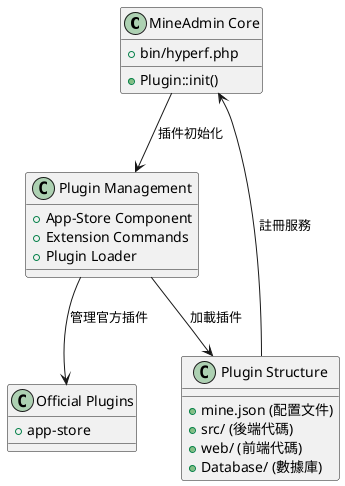

# MineAdmin 插件系統

MineAdmin 插件系統提供了強大的擴展能力，允許開發者創建可複用的功能模塊，實現系統的模塊化和可擴展性。

## 插件系統架構

MineAdmin 的插件系統基於 Hyperf 框架的 ConfigProvider 機制，提供了完整的插件生命週期管理和自動化部署能力。



## 核心組件

### 1. 插件加載器
- **文件**: `bin/hyperf.php` ([GitHub](https://github.com/mineadmin/mineadmin/blob/master/bin/hyperf.php))
- **原理**: 通過 `Plugin::init()` 方法在應用啓動時自動加載所有已安裝的插件
- **實現**: 掃描 `plugin/` 目錄下的所有插件並註冊其 ConfigProvider

### 2. App-Store 組件
- **倉庫**: [mineadmin/appstore](https://github.com/mineadmin/appstore)
- **功能**: 提供插件的下載、安裝、卸載、更新等管理功能
- **配置**: 通過 `ConfigProvider` 註冊服務和配置

### 3. 插件配置系統
- **核心文件**: `mine.json` 
- **原理**: 定義插件的元數據、依賴關係、安裝腳本等信息
- **加載**: 在插件安裝時解析並註冊到系統中

## 官方插件

MineAdmin 默認提供以下官方插件：

| 插件名稱 | 功能描述 | 倉庫地址 |
|---------|----------|----------|
| app-store | 應用市場管理插件，提供插件的下載、安裝、卸載、更新等管理功能 | [GitHub](https://github.com/mineadmin/appstore) |

> 注：其他插件如代碼生成器、定時任務管理等可通過應用市場獲取或自行開發

## 插件類型

MineAdmin 支持三種類型的插件：

### Mixed (混合型插件)
包含前端和後端完整功能的插件，提供完整的業務模塊。

### Backend (後端插件) 
僅包含後端邏輯的插件，主要提供 API 服務和業務邏輯。

### Frontend (前端插件)
僅包含前端界面的插件，主要提供用户界面組件。

## 快速開始

### 環境準備

開發 MineAdmin 插件需要：

1. **熟悉技術棧**：MineAdmin 和 Hyperf 框架
2. **獲取 AccessToken**：
   - 登錄 [MineAdmin 官網](https://www.mineadmin.com/login)
   - 進入個人中心 → [設置頁面](https://www.mineadmin.com/member/setting)
   - 獲取 AccessToken

3. **配置環境變量**：
```ini
# .env 文件
MINE_ACCESS_TOKEN=你的AccessToken
```

::: warning 注意
請妥善保管 AccessToken，避免泄露！
:::

### 開發者認證

- **本地開發**：無需認證，可自由開發和分發
- **應用市場發佈**：需要開發者認證，聯繫 MineAdmin 團隊開通權限

## 相關文檔

- [快速入門指南](./guide.md) - 創建第一個插件
- [開發指南](./develop.md) - 詳細開發流程
- [插件結構](./structure.md) - 目錄結構規範
- [生命週期管理](./lifecycle.md) - 安裝卸載流程
- [API 參考](./api.md) - 接口文檔
- [示例代碼](./examples.md) - 實際案例