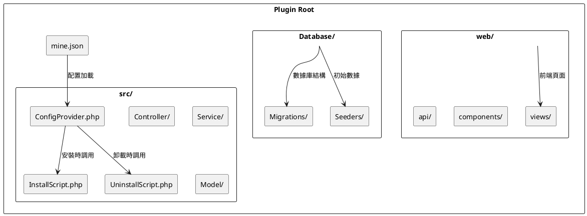

# 插件目錄結構

詳細介紹 MineAdmin 插件的標準目錄結構、文件規範和組織方式。

## 標準目錄結構

一個完整的 MineAdmin 插件目錄結構如下：

```
plugin/vendor/plugin-name/           # 插件根目錄
├── mine.json                        # 插件核心配置文件 ⭐
├── README.md                        # 插件説明文檔
├── LICENSE                          # 許可證文件
├── composer.json                    # Composer 依賴配置 (可選)
├── src/                            # 後端源碼目錄 ⭐
│   ├── ConfigProvider.php          # 配置提供者 ⭐
│   ├── InstallScript.php           # 安裝腳本 ⭐
│   ├── UninstallScript.php         # 卸載腳本 ⭐
│   ├── Controller/                 # 控制器目錄
│   │   ├── AdminController.php     # 管理員控制器
│   │   └── ApiController.php       # API 控制器
│   ├── Service/                    # 服務層目錄
│   │   └── ExampleService.php      # 業務服務類
│   ├── Repository/                 # 倉庫層目錄
│   │   └── ExampleRepository.php   # 數據倉庫類
│   ├── Model/                      # 模型目錄
│   │   └── Example.php             # 數據模型
│   ├── Request/                    # 請求驗證目錄
│   │   ├── CreateRequest.php       # 創建請求驗證
│   │   └── UpdateRequest.php       # 更新請求驗證
│   ├── Resource/                   # 資源轉換目錄
│   │   └── ExampleResource.php     # 資源轉換類
│   ├── Middleware/                 # 中間件目錄
│   │   └── ExampleMiddleware.php   # 自定義中間件
│   ├── Command/                    # 命令行目錄
│   │   └── ExampleCommand.php      # 自定義命令
│   ├── Listener/                   # 事件監聽器目錄
│   │   └── ExampleListener.php     # 事件監聽器
│   └── Exception/                  # 異常處理目錄
│       └── ExampleException.php    # 自定義異常
├── web/                            # 前端源碼目錄 ⭐
│   ├── views/                      # 頁面組件目錄
│   │   ├── index.vue               # 主頁面
│   │   ├── list.vue                # 列表頁面
│   │   └── form.vue                # 表單頁面
│   ├── components/                 # 公共組件目錄
│   │   └── ExampleComponent.vue    # 通用組件
│   ├── api/                        # API 接口目錄
│   │   └── example.js              # 接口定義
│   ├── router/                     # 路由配置目錄
│   │   └── index.js                # 路由配置
│   ├── store/                      # 狀態管理目錄
│   │   └── example.js              # 狀態管理
│   └── assets/                     # 靜態資源目錄
│       ├── images/                 # 圖片資源
│       └── styles/                 # 樣式文件
├── Database/                       # 數據庫相關目錄 ⭐
│   ├── Migrations/                 # 數據庫遷移文件
│   │   └── 2024_01_01_000000_create_example_table.php
│   └── Seeders/                    # 數據填充文件
│       └── ExampleSeeder.php       # 數據填充類
├── config/                         # 配置文件目錄
│   └── example.php                 # 插件配置文件
├── publish/                        # 發佈文件目錄
│   ├── config/                     # 配置文件模板
│   │   └── example.php             # 配置文件模板
│   └── assets/                     # 靜態資源模板
├── tests/                          # 測試文件目錄
│   ├── Unit/                       # 單元測試
│   ├── Feature/                    # 功能測試
│   └── TestCase.php                # 測試基類
├── docs/                           # 文檔目錄
│   ├── installation.md             # 安裝文檔
│   ├── usage.md                    # 使用文檔
│   └── api.md                      # API 文檔
└── .gitignore                      # Git 忽略文件
```

## 核心文件詳解

### 1. mine.json (插件配置文件)

**文件路徑**: `mine.json` ([配置詳解](./mineJson.md))

插件的核心配置文件，定義插件的基本信息、依賴關係和加載配置：

```json
{
  "name": "vendor/plugin-name",
  "description": "插件描述",
  "version": "1.0.0",
  "type": "mixed",
  "author": [
    {
      "name": "Author Name",
      "email": "author@example.com",
      "role": "developer"
    }
  ],
  "keywords": ["mineadmin", "plugin"],
  "homepage": "https://github.com/vendor/plugin-name",
  "license": "MIT",
  "require": {
    "php": ">=8.1",
    "hyperf/framework": "^3.0"
  },
  "package": {
    "dependencies": {
      "vue": "^3.0",
      "element-plus": "^2.0"
    }
  },
  "composer": {
    "require": {
      "hyperf/async-queue": "^3.0"
    },
    "psr-4": {
      "Plugin\\Vendor\\PluginName\\": "src"
    },
    "config": "Plugin\\Vendor\\PluginName\\ConfigProvider"
  }
}
```

### 2. ConfigProvider.php (配置提供者)

**文件路徑**: `src/ConfigProvider.php`
**實現原理**: 基於 Hyperf ConfigProvider 機制 ([GitHub](https://github.com/hyperf/hyperf/blob/master/src/config-provider/src/ConfigProvider.php))

> ⚠️ **注意**: ConfigProvider 中的 `publish` 功能在插件系統中存在問題，建議在 InstallScript 中處理配置文件發佈。

```php
<?php

namespace Plugin\Vendor\PluginName;

class ConfigProvider
{
    public function __invoke(): array
    {
        return [
            'dependencies' => [],
            'annotations' => [
                'scan' => [
                    'paths' => [__DIR__],
                ],
            ],
            'commands' => [],
            'listeners' => [],
            // publish 功能在插件中不推薦使用
            // 請在 InstallScript 中處理配置文件發佈
        ];
    }
}
```

### 3. InstallScript.php (安裝腳本) ⭐

**文件路徑**: `src/InstallScript.php`
**調用時機**: 執行 `mine-extension:install` 命令時
**重要性**: 推薦在此處理配置發佈、環境檢測和數據庫遷移

```php
<?php

namespace Plugin\Vendor\PluginName;

use Hyperf\Contract\ApplicationInterface;
use Hyperf\Database\Commands\Migrations\MigrateCommand;

class InstallScript
{
    public function handle(): bool
    {
        // 1. 檢測環境依賴
        if (!$this->checkEnvironment()) {
            echo "環境檢測失敗\n";
            return false;
        }
        
        // 2. 發佈配置文件
        $this->publishConfig();
        
        // 3. 執行數據庫遷移
        $this->runMigrations();
        
        // 4. 初始化數據
        $this->seedData();
        
        echo "插件安裝成功\n";
        return true;
    }
    
    protected function checkEnvironment(): bool
    {
        // 檢查 PHP 版本
        if (version_compare(PHP_VERSION, '8.1.0', '<')) {
            echo "PHP 版本需要 >= 8.1\n";
            return false;
        }
        
        // 檢查必要的擴展
        $requiredExtensions = ['redis', 'pdo', 'json'];
        foreach ($requiredExtensions as $ext) {
            if (!extension_loaded($ext)) {
                echo "缺少 PHP 擴展: {$ext}\n";
                return false;
            }
        }
        
        return true;
    }
    
    protected function publishConfig(): void
    {
        $source = __DIR__ . '/../publish/config/plugin.php';
        $target = BASE_PATH . '/config/autoload/plugin.php';
        
        if (!file_exists($target)) {
            copy($source, $target);
            echo "配置文件已發佈: {$target}\n";
        }
    }
    
    protected function runMigrations(): void
    {
        $migrationPath = __DIR__ . '/../Database/Migrations';
        
        if (is_dir($migrationPath)) {
            // 執行遷移命令
            $container = \Hyperf\Context\ApplicationContext::getContainer();
            $application = $container->get(ApplicationInterface::class);
            $application->setAutoExit(false);
            
            $input = new \Symfony\Component\Console\Input\ArrayInput([
                'command' => 'migrate',
                '--path' => $migrationPath,
            ]);
            
            $output = new \Symfony\Component\Console\Output\BufferedOutput();
            $application->run($input, $output);
            
            echo "數據庫遷移完成\n";
        }
    }
    
    protected function seedData(): void
    {
        // 初始化默認數據
        // 例如創建默認配置、菜單等
    }
}
```

### 4. UninstallScript.php (卸載腳本) ⭐

**文件路徑**: `src/UninstallScript.php`
**調用時機**: 執行 `mine-extension:uninstall` 命令時
**重要性**: 清理配置文件、數據表和相關資源

```php
<?php

namespace Plugin\Vendor\PluginName;

use Hyperf\DbConnection\Db;

class UninstallScript
{
    public function handle(): bool
    {
        // 1. 備份重要數據（可選）
        $this->backupData();
        
        // 2. 刪除數據庫表
        $this->dropTables();
        
        // 3. 清理配置文件
        $this->removeConfig();
        
        // 4. 清理緩存
        $this->clearCache();
        
        echo "插件卸載完成\n";
        return true;
    }
    
    protected function backupData(): void
    {
        // 備份重要數據到指定目錄
        $backupPath = BASE_PATH . '/runtime/backup/plugin_' . date('YmdHis') . '.sql';
        // 實現備份邏輯
    }
    
    protected function dropTables(): void
    {
        // 刪除插件創建的數據表
        $tables = ['plugin_example_table', 'plugin_settings'];
        
        foreach ($tables as $table) {
            if (Db::schema()->hasTable($table)) {
                Db::schema()->drop($table);
                echo "已刪除數據表: {$table}\n";
            }
        }
    }
    
    protected function removeConfig(): void
    {
        $configFile = BASE_PATH . '/config/autoload/plugin.php';
        
        if (file_exists($configFile)) {
            unlink($configFile);
            echo "配置文件已刪除: {$configFile}\n";
        }
    }
    
    protected function clearCache(): void
    {
        // 清理插件相關緩存
        $redis = \Hyperf\Context\ApplicationContext::getContainer()
            ->get(\Hyperf\Redis\Redis::class);
        
        $redis->del('plugin:cache:*');
        echo "緩存已清理\n";
    }
}
```

## 目錄結構圖解



## 不同類型插件的結構差異

### Mixed (混合型插件)
包含完整的 `src/` 和 `web/` 目錄，提供前後端完整功能。

### Backend (後端插件)
只包含 `src/` 目錄，專注於提供 API 服務和業務邏輯：

```
plugin/vendor/backend-plugin/
├── mine.json
├── src/
│   ├── ConfigProvider.php
│   ├── Controller/
│   ├── Service/
│   └── Model/
└── Database/
```

### Frontend (前端插件)
只包含 `web/` 目錄，專注於前端界面和交互：

```
plugin/vendor/frontend-plugin/
├── mine.json
├── web/
│   ├── views/
│   ├── components/
│   └── assets/
└── src/
    └── ConfigProvider.php  # 最小配置
```

## 命名規範

### 1. 目錄命名
- 使用小寫字母和連字符：`user-management`
- 避免使用下劃線和空格

### 2. 文件命名
- PHP 類文件使用 PascalCase：`UserController.php`
- Vue 組件使用 PascalCase：`UserList.vue`
- 配置文件使用小寫：`user.php`

### 3. 命名空間規範
遵循 PSR-4 自動加載標準：

```php
// 插件路徑: plugin/mineadmin/user-manager/
// 命名空間: Plugin\MineAdmin\UserManager\
namespace Plugin\MineAdmin\UserManager\Controller;
```

## 文件權限和安全

### 1. 文件權限設置
```bash
# 設置合適的文件權限
find plugin/ -type f -name "*.php" -exec chmod 644 {} \;
find plugin/ -type d -exec chmod 755 {} \;
```

### 2. 安全注意事項
- 敏感配置使用環境變量
- 避免在代碼中硬編碼密鑰
- 驗證和過濾用户輸入
- 使用 HTTPS 傳輸敏感數據

## 最佳實踐

### 1. 文件組織
- 按功能模塊組織代碼
- 保持目錄結構清晰
- 使用有意義的文件名

### 2. 代碼規範
- 遵循 PSR-12 編碼標準
- 添加適當的註釋
- 使用類型聲明

### 3. 版本控制
- 使用 `.gitignore` 排除不必要的文件
- 創建清晰的提交信息
- 使用語義化版本號

## 示例項目結構

查看官方插件的實際結構：

**App-Store 插件**:  MineAdmin 官方應用市場插件，展示了標準的混合型插件結構

## 常見問題

### Q: 插件目錄應該放在哪裏？
A: 插件應該放在項目根目錄的 `plugin/` 目錄下，按 `vendor/plugin-name` 格式組織。

### Q: 如何處理插件之間的依賴？
A: 在 `mine.json` 的 `require` 字段中聲明依賴的其他插件。

### Q: 前端文件安裝後放在哪裏？
A: `web/` 目錄下的文件會在安裝時複製到前端項目的對應位置。

### Q: 數據庫遷移文件如何執行？
A: 在 `InstallScript.php` 中調用遷移執行邏輯，或使用 Hyperf 的遷移命令。