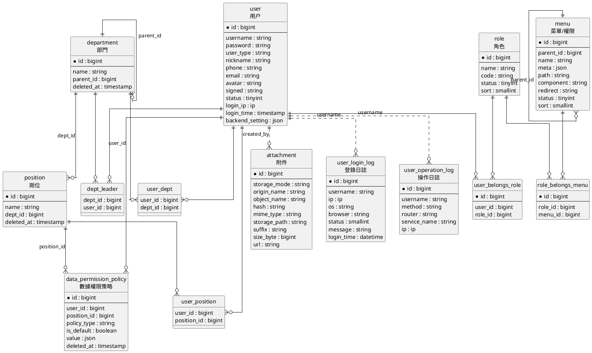

# 數據模型契約

數據模型契約定義 MineAdmin 後端實現之間共享的核心實體、字段語義和關聯關係。不同框架可以使用不同 ORM 或數據訪問方式，但對外暴露給前台模板、權限系統、接口元數據和審計日誌的模型含義需要保持一致。

本文依據 MineAdmin 當前遷移文件和模型關係整理，重點覆蓋管理後台穩定依賴的實體。

## 核心實體

| 實體 | 表 | 作用 |
|------|----|------|
| 用户 | `user` | 後台賬號主體，保存登錄憑據、用户類型、暱稱、聯繫方式、頭像、狀態、最後登錄 IP/時間、後台個人設置和審計創建/更新人。 |
| 角色 | `role` | 權限分組主體，保存角色名稱、唯一角色代碼、狀態和排序；用户通過角色獲得菜單、按鈕和接口權限。 |
| 菜單/權限 | `menu` | 前台路由、菜單樹和權限標識的統一載體；`parent_id` 組織菜單層級，`path`、`component`、`redirect` 和 `meta` 支撐前台渲染，`name` 參與權限判斷。 |
| 部門 | `department` | 組織樹節點，通過 `parent_id` 表達上下級部門；用於用户歸屬、部門負責人和數據權限範圍計算。 |
| 崗位 | `position` | 部門下的崗位節點，通過 `dept_id` 歸屬部門；用户可以關聯多個崗位，崗位也可以承載數據權限策略。 |
| 數據權限策略 | `data_permission_policy` | 數據範圍控制規則，按當前遷移通過 `user_id` 或 `position_id` 綁定到用户或崗位，使用 `policy_type` 和 `value` 描述部門、自定義範圍或函數規則。 |
| 附件 | `attachment` | 上傳文件索引，記錄存儲模式、原始文件名、對象名、哈希、MIME、存儲路徑、後綴、大小、訪問 URL 和審計創建/更新人；前台文件選擇、預覽和下載能力依賴該實體。 |
| 登錄日誌 | `user_login_log` | 登錄審計記錄，保存用户名、登錄 IP、操作系統、瀏覽器、登錄狀態、提示消息和登錄時間，用於安全審計和登錄軌跡查詢。 |
| 操作日誌 | `user_operation_log` | 操作審計記錄，保存用户名、請求方法、路由、業務名稱、請求 IP 和時間信息，用於追蹤後台功能調用和問題排查。 |

## 關聯表

| 關聯表 | 關係 | 説明 |
|--------|------|------|
| `user_belongs_role` | 用户 N:N 角色 | 一個用户可以擁有多個角色，一個角色可以分配給多個用户。 |
| `role_belongs_menu` | 角色 N:N 菜單 | 一個角色可以擁有多個菜單/權限，一個菜單/權限也可以授權給多個角色。 |
| `user_dept` | 用户 N:N 部門 | 一個用户可以歸屬多個部門，用於組織展示和數據權限上下文。 |
| `user_position` | 用户 N:N 崗位 | 一個用户可以擁有多個崗位，崗位策略可作為用户策略的後備來源。 |
| `dept_leader` | 部門 N:N 負責人用户 | 一個部門可以配置多個負責人，一個用户也可以負責多個部門。 |

## 關係約定

- 用户與角色通過 `user_belongs_role` 多對多關聯；用户權限由角色關聯的菜單/權限集合彙總而來。
- 角色與菜單通過 `role_belongs_menu` 多對多關聯；菜單樹由 `menu.parent_id` 自關聯構成。
- 用户與部門通過 `user_dept` 多對多關聯；部門樹由 `department.parent_id` 自關聯構成。
- 崗位通過 `position.dept_id` 歸屬部門，用户與崗位通過 `user_position` 多對多關聯。
- 部門負責人通過 `dept_leader` 關聯用户和部門，不等同於普通部門歸屬。
- 數據權限策略按當前遷移使用 `data_permission_policy.user_id` 或 `position_id` 綁定；用户讀取策略時優先使用用户策略，沒有用户策略時再檢查用户崗位上的策略。
- 附件、登錄日誌、操作日誌是支撐型實體，不改變權限主鏈路，但前台和後台接口應保持字段語義穩定。
- 登錄日誌和操作日誌按 `username` 建索引，不包含 `user_id` 字段；它們與用户實體是審計追蹤關係，不是數據庫外鍵關係。
- 圖中實線表示模型關係或關聯表關係，點線表示審計字段形成的邏輯追蹤關係。

## ER 圖

