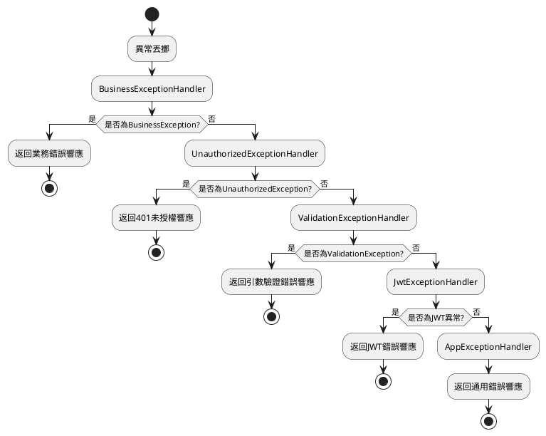

# 錯誤處理

## 目錄

- [預設異常處理機制](#預設異常處理機制)
- [異常處理流程](#異常處理流程)
- [核心異常處理器](#核心異常處理器)
- [業務異常處理](#業務異常處理)
- [自定義異常處理器](#自定義異常處理器)
- [除錯模式特性](#除錯模式特性)
- [最佳實踐](#最佳實踐)
- [常見問題](#常見問題)

## 預設異常處理機制

::: tip 前置知識
要理解 MineAdmin 的異常處理，首先需要你對 [Hyperf](https://hyperf.io) 的錯誤處理有一定的瞭解。
本文不講述基礎性的說明，請先了解 Hyperf 異常處理的基本概念。
:::

MineAdmin 基於 Hyperf 框架實現了完善的異常處理機制。在 `config/autoload/exceptions.php` 中配置了多個異常處理器，採用責任鏈模式按順序處理不同型別的異常。

## 異常處理流程



## 核心異常處理器

### 異常處理器配置

::: code-group

```php [exceptions.php]
<?php

declare(strict_types=1);
/**
 * This file is part of MineAdmin.
 *
 * @link     https://www.mineadmin.com
 * @document https://doc.mineadmin.com
 * @contact  root@imoi.cn
 * @license  https://github.com/mineadmin/MineAdmin/blob/master/LICENSE
 */
use App\Exception\Handler\AppExceptionHandler;
use App\Exception\Handler\BusinessExceptionHandler;
use App\Exception\Handler\JwtExceptionHandler;
use App\Exception\Handler\UnauthorizedExceptionHandler;
use App\Exception\Handler\ValidationExceptionHandler;
use Hyperf\ExceptionHandler\Listener\ErrorExceptionHandler;
use Hyperf\HttpServer\Exception\Handler\HttpExceptionHandler;

return [
    'handler' => [
        'http' => [
            // 處理業務異常 - 優先順序最高
            BusinessExceptionHandler::class,
            // 處理未授權異常
            UnauthorizedExceptionHandler::class,
            // 處理驗證器異常
            ValidationExceptionHandler::class,
            // 處理JWT異常
            JwtExceptionHandler::class,
            // 處理應用異常 - 最後兜底處理
            AppExceptionHandler::class,
        ],
    ],
];
```

:::

::: warning 注意事項
- 異常處理器的順序很重要，越靠前的處理器優先順序越高
- `AppExceptionHandler` 作為兜底處理器，應該始終放在最後
- 不要隨意修改處理器的順序，除非你完全理解其影響
:::

### 基礎異常處理器類

所有的異常處理器都繼承自 `AbstractHandler`，提供了統一的處理邏輯：

::: code-group

```php [AbstractHandler.php]
<?php

declare(strict_types=1);
/**
 * This file is part of MineAdmin.
 *
 * @link     https://www.mineadmin.com
 * @document https://doc.mineadmin.com
 * @contact  root@imoi.cn
 * @license  https://github.com/mineadmin/MineAdmin/blob/master/LICENSE
 */

namespace App\Exception\Handler;

use App\Http\Common\Result;
use Hyperf\Codec\Json;
use Hyperf\Context\Context;
use Hyperf\Contract\ConfigInterface;
use Hyperf\Contract\StdoutLoggerInterface;
use Hyperf\ExceptionHandler\ExceptionHandler;
use Hyperf\ExceptionHandler\Formatter\FormatterInterface;
use Hyperf\HttpMessage\Stream\SwooleStream;
use Hyperf\Logger\LoggerFactory;
use Mine\Support\Logger\UuidRequestIdProcessor;
use Mine\Support\Traits\Debugging;
use Psr\Container\ContainerInterface;
use Swow\Psr7\Message\ResponsePlusInterface;

abstract class AbstractHandler extends ExceptionHandler
{
    use Debugging;

    public function __construct(
        private readonly ConfigInterface $config,
        private readonly ContainerInterface $container,
        private readonly LoggerFactory $loggerFactory
    ) {}

    /**
     * 子類必須實現此方法，定義如何處理異常並返回結果
     */
    abstract public function handleResponse(\Throwable $throwable): Result;

    /**
     * 處理異常的主入口方法
     */
    public function handle(\Throwable $throwable, ResponsePlusInterface $response)
    {
        // 上報異常日誌
        $this->report($throwable);
        
        return value(function (ResponsePlusInterface $responsePlus) use ($throwable) {
            // 如果是 debug 模式，自動處理跨域並記錄詳細錯誤資訊
            if ($this->isDebug()) {
                $responsePlus
                    ->setHeader('Access-Control-Allow-Origin', '*')
                    ->setHeader('Access-Control-Allow-Credentials', 'true')
                    ->setHeader('Access-Control-Allow-Methods', 'GET, POST, PATCH, PUT, DELETE, OPTIONS')
                    ->setHeader('Access-Control-Allow-Headers', 'DNT,Keep-Alive,User-Agent,Cache-Control,Content-Type,Authorization');
                
                // 記錄詳細的異常資訊到上下文
                Context::set(self::class . '.throwable', [
                    'message' => $throwable->getMessage(),
                    'file' => $throwable->getFile(),
                    'line' => $throwable->getLine(),
                    'trace' => $throwable->getTrace(),
                ]);
            }
            return $responsePlus;
        }, $this->handlerRequestId(
            $this->handlerResult(
                $response,
                $this->handleResponse($throwable)
            )
        ));
    }

    /**
     * 上報異常日誌，包括控制檯輸出和檔案記錄
     */
    public function report(\Throwable $throwable)
    {
        // 如果是debug模式，在控制檯列印格式化的錯誤資訊
        if ($this->isDebug()) {
            $this->container->get(StdoutLoggerInterface::class)->error(
                $this->container->get(FormatterInterface::class)->format($throwable)
            );
        }
        
        // 記錄異常到錯誤日誌檔案
        $this->loggerFactory
            ->get('error')
            ->error($throwable->getMessage(), ['exception' => $throwable]);
    }

    /**
     * 將結果包裝到響應體中
     */
    protected function handlerResult(ResponsePlusInterface $responsePlus, Result $result): ResponsePlusInterface
    {
        $responsePlus->setHeader('Content-Type', 'application/json; charset=utf-8');

        // 除錯模式下返回詳細的異常資訊
        if ($this->isDebug()) {
            $result = $result->toArray();
            $result['throwable'] = Context::get(self::class . '.throwable');
            return $responsePlus
                ->setBody(new SwooleStream(Json::encode($result)));
        }

        return $responsePlus
            ->setBody(new SwooleStream(Json::encode($result)));
    }

    /**
     * 為響應新增請求ID頭部，便於問題追蹤
     */
    private function handlerRequestId(ResponsePlusInterface $responsePlus): ResponsePlusInterface
    {
        return $responsePlus->setHeader('Request-Id', UuidRequestIdProcessor::getUuid());
    }
}
```

```php [AppExceptionHandler.php]
<?php

declare(strict_types=1);

namespace App\Exception\Handler;

use App\Http\Common\Result;
use App\Http\Common\ResultCode;

/**
 * 應用程式最終的異常處理器
 * 作為兜底處理器，捕獲所有未被其他處理器處理的異常
 */
final class AppExceptionHandler extends AbstractHandler
{
    /**
     * 處理異常並返回統一的錯誤響應
     */
    public function handleResponse(\Throwable $throwable): Result
    {
        // 阻止異常繼續傳播
        $this->stopPropagation();
        
        return new Result(
            ResultCode::FAIL,
            $throwable->getMessage() ?: '系統異常，請稍後重試'
        );
    }
    
    /**
     * 該處理器處理所有型別的異常
     */
    public function isValid(\Throwable $throwable): bool
    {
        return true;
    }
}
```

:::

## Result 和 ResultCode 核心類

### Result 統一響應類

`Result` 類是 MineAdmin 中所有介面響應的標準格式，實現了 `Arrayable` 介面並支援 OpenAPI 文件註解：

::: code-group

```php [Result.php]
<?php

declare(strict_types=1);

namespace App\Http\Common;

use Hyperf\Contract\Arrayable;
use Hyperf\Swagger\Annotation as OA;

/**
 * @template T
 */
#[OA\Schema(title: 'Api Response', description: 'Api Response')]
class Result implements Arrayable
{
    /**
     * @param T $data
     */
    public function __construct(
        #[OA\Property(ref: 'ResultCode', title: '響應碼')]
        public ResultCode $code = ResultCode::SUCCESS,
        #[OA\Property(title: '響應訊息', type: 'string')]
        public ?string $message = null,
        #[OA\Property(title: '響應資料', type: 'array')]
        public mixed $data = []
    ) {
        // 如果未提供訊息，自動從 ResultCode 獲取預設訊息
        if ($this->message === null) {
            $this->message = ResultCode::getMessage($this->code->value);
        }
    }

    public function toArray(): array
    {
        return [
            'code' => $this->code->value,
            'message' => $this->message,
            'data' => $this->data,
        ];
    }
}
```

:::

#### 使用示例

::: code-group

```php [成功響應]
// 成功響應 - 使用預設成功碼
$result = new Result();

// 成功響應 - 帶資料
$result = new Result(data: ['id' => 1, 'name' => '張三']);

// 成功響應 - 自定義訊息
$result = new Result(message: '操作成功完成');
```

```php [失敗響應]
// 失敗響應 - 使用預設失敗碼
$result = new Result(ResultCode::FAIL, '操作失敗');

// 失敗響應 - 使用具體狀態碼
$result = new Result(ResultCode::UNAUTHORIZED, '使用者未登入');

// 失敗響應 - 帶錯誤資料
$result = new Result(
    ResultCode::UNPROCESSABLE_ENTITY, 
    '引數驗證失敗',
    ['errors' => ['email' => ['郵箱格式錯誤']]]
);
```

:::

### ResultCode 狀態碼列舉

`ResultCode` 是一個基於 PHP 8.1 列舉的狀態碼定義，使用 Hyperf 的 Constants 特性支援國際化訊息：

::: code-group

```php [ResultCode.php]
<?php

declare(strict_types=1);

namespace App\Http\Common;

use Hyperf\Constants\Annotation\Constants;
use Hyperf\Constants\Annotation\Message;
use Hyperf\Constants\ConstantsTrait;
use Hyperf\Swagger\Annotation as OA;

#[Constants]
#[OA\Schema(title: 'ResultCode', type: 'integer', default: 200)]
enum ResultCode: int
{
    use ConstantsTrait;

    #[Message('result.success')]
    case SUCCESS = 200;

    #[Message('result.fail')]
    case FAIL = 500;

    #[Message('result.unauthorized')]
    case UNAUTHORIZED = 401;

    #[Message('result.forbidden')]
    case FORBIDDEN = 403;

    #[Message('result.not_found')]
    case NOT_FOUND = 404;

    #[Message('result.method_not_allowed')]
    case METHOD_NOT_ALLOWED = 405;

    #[Message('result.not_acceptable')]
    case NOT_ACCEPTABLE = 406;

    #[Message('result.conflict')]
    case UNPROCESSABLE_ENTITY = 422;

    #[Message('result.disabled')]
    case DISABLED = 423;
}
```

:::

#### 狀態碼說明

| 常量名 | 數值 | HTTP 狀態碼 | 說明 | 使用場景 |
|--------|------|-------------|------|----------|
| `SUCCESS` | 200 | 200 OK | 操作成功 | 正常的業務處理成功 |
| `FAIL` | 500 | 500 Internal Server Error | 系統錯誤 | 通用的系統異常或業務處理失敗 |
| `UNAUTHORIZED` | 401 | 401 Unauthorized | 未授權 | 使用者未登入或令牌無效 |
| `FORBIDDEN` | 403 | 403 Forbidden | 禁止訪問 | 使用者無許可權訪問資源 |
| `NOT_FOUND` | 404 | 404 Not Found | 資源不存在 | 請求的資源不存在 |
| `METHOD_NOT_ALLOWED` | 405 | 405 Method Not Allowed | 方法不允許 | HTTP 方法不被支援 |
| `NOT_ACCEPTABLE` | 406 | 406 Not Acceptable | 不可接受 | 請求的內容特性無法滿足 |
| `UNPROCESSABLE_ENTITY` | 422 | 422 Unprocessable Entity | 無法處理的實體 | 引數驗證失敗，業務規則驗證失敗 |
| `DISABLED` | 423 | 423 Locked | 資源被鎖定 | 使用者或資源被停用 |

#### 國際化支援

`ResultCode` 支援透過 Hyperf 的多語言機制獲取對應的訊息文字：

::: code-group

```php [語言檔案 - lang/zh_CN/result.php]
<?php

return [
    'success' => '操作成功',
    'fail' => '操作失敗',
    'unauthorized' => '使用者未授權',
    'forbidden' => '禁止訪問',
    'not_found' => '資源不存在',
    'method_not_allowed' => '方法不允許',
    'not_acceptable' => '不可接受的請求',
    'conflict' => '引數驗證失敗',
    'disabled' => '資源已停用',
];
```

```php [獲取國際化訊息]
// 透過 ResultCode 獲取訊息
$message = ResultCode::getMessage(ResultCode::SUCCESS->value);
// 輸出：'操作成功'

// Result 構造時自動獲取訊息
$result = new Result(ResultCode::NOT_FOUND);
// $result->message 自動為 '資源不存在'
```

:::

## 業務異常處理

### BusinessException 業務異常類

推薦使用 `BusinessException` 來丟擲業務相關的異常，而不是直接使用 `throw new Exception`：

::: code-group

```php [BusinessException.php]
<?php

declare(strict_types=1);
/**
 * This file is part of MineAdmin.
 *
 * @link     https://www.mineadmin.com
 * @document https://doc.mineadmin.com
 * @contact  root@imoi.cn
 * @license  https://github.com/mineadmin/MineAdmin/blob/master/LICENSE
 */

namespace App\Exception;

use App\Http\Common\Result;
use App\Http\Common\ResultCode;

/**
 * 業務異常類
 * 用於丟擲業務邏輯相關的異常
 */
class BusinessException extends \RuntimeException
{
    private Result $response;

    /**
     * @param ResultCode $code 結果狀態碼
     * @param string|null $message 錯誤訊息
     * @param mixed $data 附加資料
     */
    public function __construct(ResultCode $code = ResultCode::FAIL, ?string $message = null, mixed $data = [])
    {
        $this->response = new Result($code, $message, $data);
        parent::__construct($message ?? ResultCode::getMessage($code->value));
    }

    /**
     * 獲取結構化的響應物件
     */
    public function getResponse(): Result
    {
        return $this->response;
    }
}
```

```php [BusinessExceptionHandler.php]
<?php

declare(strict_types=1);

namespace App\Exception\Handler;

use App\Exception\BusinessException;
use App\Http\Common\Result;

/**
 * 業務異常處理器
 * 專門處理 BusinessException 型別的異常
 */
class BusinessExceptionHandler extends AbstractHandler
{
    /**
     * 處理業務異常，直接返回異常中包含的結果
     */
    public function handleResponse(\Throwable $throwable): Result
    {
        $this->stopPropagation();
        
        if ($throwable instanceof BusinessException) {
            return $throwable->getResponse();
        }
        
        // 兜底處理
        return new Result(
            ResultCode::FAIL,
            $throwable->getMessage()
        );
    }
    
    /**
     * 只處理 BusinessException 型別的異常
     */
    public function isValid(\Throwable $throwable): bool
    {
        return $throwable instanceof BusinessException;
    }
}
```

:::

### 實際使用示例

::: code-group

```php [UserService.php]
<?php

declare(strict_types=1);

namespace App\Service;

use App\Exception\BusinessException;
use App\Http\Common\ResultCode;

class UserService
{
    /**
     * 使用者登入驗證
     */
    public function login(string $username, string $password): array
    {
        // 檢查使用者名稱格式
        if (empty($username)) {
            throw new BusinessException(
                ResultCode::UNPROCESSABLE_ENTITY,
                trans('validation.required', ['attribute' => '使用者名稱'])
            );
        }
        
        // 查詢使用者
        $user = $this->findUserByUsername($username);
        if (!$user) {
            throw new BusinessException(
                ResultCode::NOT_FOUND,
                trans('auth.user_not_found')
            );
        }
        
        // 驗證密碼
        if (!$this->verifyPassword($password, $user['password'])) {
            throw new BusinessException(
                ResultCode::UNAUTHORIZED,
                trans('auth.invalid_credentials')
            );
        }
        
        // 檢查使用者狀態
        if ($user['status'] !== 'active') {
            throw new BusinessException(
                ResultCode::DISABLED,
                trans('auth.user_disabled'),
                ['reason' => $user['disable_reason'] ?? '未知原因']
            );
        }
        
        return $user;
    }

    /**
     * 更新使用者資料
     */
    public function updateProfile(int $userId, array $data): bool
    {
        $user = $this->findUserById($userId);
        if (!$user) {
            throw new BusinessException(
                ResultCode::NOT_FOUND,
                '使用者不存在'
            );
        }

        // 檢查郵箱是否已被使用
        if (isset($data['email']) && $this->isEmailExists($data['email'], $userId)) {
            throw new BusinessException(
                ResultCode::UNPROCESSABLE_ENTITY,
                '郵箱已被其他使用者使用'
            );
        }

        return $this->updateUser($userId, $data);
    }
}
```

```php [UserController.php]
<?php

declare(strict_types=1);

namespace App\Controller;

use App\Service\UserService;
use App\Http\Common\Result;
use App\Http\Common\ResultCode;

class UserController extends AbstractController
{
    public function __construct(
        private readonly UserService $userService
    ) {}
    
    /**
     * 使用者登入
     * 
     * 業務異常會被 BusinessExceptionHandler 自動捕獲並轉換為相應的響應
     */
    public function login(): Result
    {
        $username = $this->request->input('username');
        $password = $this->request->input('password');
        
        // 如果 UserService 丟擲 BusinessException，
        // 會被自動捕獲並返回相應的錯誤響應
        $user = $this->userService->login($username, $password);
        
        // 生成令牌等後續邏輯...
        $token = $this->generateToken($user);
        
        return $this->success([
            'token' => $token,
            'user' => $user
        ]);
    }

    /**
     * 更新使用者資料
     */
    public function updateProfile(): Result
    {
        $userId = $this->getUserId();
        $data = $this->request->all();
        
        $this->userService->updateProfile($userId, $data);
        
        return $this->success(message: '資料更新成功');
    }
}
```

:::

## 自定義異常處理器

當需要處理特定型別的異常時，可以建立自定義的異常處理器。

### 建立自定義異常類

::: code-group

```php [PaymentException.php]
<?php

declare(strict_types=1);

namespace App\Exception;

use App\Http\Common\ResultCode;

/**
 * 支付相關異常
 */
class PaymentException extends \RuntimeException
{
    public function __construct(
        private readonly string $paymentMethod,
        private readonly string $transactionId,
        string $message = '支付處理失敗',
        int $code = 0,
        ?\Throwable $previous = null
    ) {
        parent::__construct($message, $code, $previous);
    }

    public function getPaymentMethod(): string
    {
        return $this->paymentMethod;
    }

    public function getTransactionId(): string
    {
        return $this->transactionId;
    }
}
```

:::

### 建立自定義異常處理器

::: code-group

```php [PaymentExceptionHandler.php]
<?php

declare(strict_types=1);

namespace App\Exception\Handler;

use App\Exception\PaymentException;
use App\Http\Common\Result;
use App\Http\Common\ResultCode;

/**
 * 支付異常處理器
 */
class PaymentExceptionHandler extends AbstractHandler
{
    public function handleResponse(\Throwable $throwable): Result
    {
        $this->stopPropagation();
        
        if ($throwable instanceof PaymentException) {
            // 記錄支付異常的詳細資訊
            $this->loggerFactory
                ->get('payment')
                ->error('支付異常', [
                    'payment_method' => $throwable->getPaymentMethod(),
                    'transaction_id' => $throwable->getTransactionId(),
                    'message' => $throwable->getMessage(),
                    'trace' => $throwable->getTraceAsString(),
                ]);
            
            return new Result(
                ResultCode::FAIL,
                '支付處理失敗，請稍後重試或聯絡客服',
                [
                    'transaction_id' => $throwable->getTransactionId(),
                    'support_contact' => config('payment.support_contact'),
                ]
            );
        }
        
        return new Result(
            ResultCode::FAIL,
            $throwable->getMessage()
        );
    }
    
    public function isValid(\Throwable $throwable): bool
    {
        return $throwable instanceof PaymentException;
    }
}
```

:::

### 註冊自定義異常處理器

在 `config/autoload/exceptions.php` 中註冊你的自定義處理器：

::: code-group

```php [exceptions.php]
<?php

return [
    'handler' => [
        'http' => [
            // 業務異常處理器
            BusinessExceptionHandler::class,
            // 自定義的支付異常處理器
            PaymentExceptionHandler::class,
            // 其他處理器...
            UnauthorizedExceptionHandler::class,
            ValidationExceptionHandler::class,
            JwtExceptionHandler::class,
            AppExceptionHandler::class,
        ],
    ],
];
```

:::

### 使用自定義異常

::: code-group

```php [PaymentService.php]
<?php

declare(strict_types=1);

namespace App\Service;

use App\Exception\PaymentException;

class PaymentService
{
    public function processPayment(string $method, float $amount, string $transactionId): bool
    {
        try {
            // 呼叫第三方支付介面
            $result = $this->callPaymentGateway($method, $amount, $transactionId);
            
            if (!$result['success']) {
                throw new PaymentException(
                    paymentMethod: $method,
                    transactionId: $transactionId,
                    message: "支付失敗：{$result['error_msg']}"
                );
            }
            
            return true;
        } catch (\Throwable $e) {
            // 將所有支付相關的異常包裝為 PaymentException
            throw new PaymentException(
                paymentMethod: $method,
                transactionId: $transactionId,
                message: "支付處理異常：{$e->getMessage()}",
                previous: $e
            );
        }
    }
}
```

:::

## 除錯模式特性

### 開啟除錯模式

在 `.env` 檔案中設定：

```env
APP_DEBUG=true
```

### 除錯模式功能

當 `APP_DEBUG=true` 時，異常處理器會提供以下額外功能：

1. **詳細的異常資訊**：響應中包含異常的檔案、行號和呼叫棧
2. **控制檯輸出**：異常資訊會輸出到命令列控制檯
3. **CORS 頭部**：自動新增跨域請求頭，方便前端除錯
4. **Request-Id**：每個響應都包含唯一的請求ID，便於日誌追蹤

### 除錯響應格式

除錯模式下的響應示例：

::: code-group

```json [除錯模式響應]
{
  "code": 500,
  "message": "使用者不存在",
  "data": null,
  "throwable": {
    "message": "使用者不存在",
    "file": "/app/Service/UserService.php",
    "line": 45,
    "trace": [
      {
        "file": "/app/Controller/UserController.php",
        "line": 23,
        "function": "findUser",
        "class": "App\\Service\\UserService",
        "type": "->"
      }
    ]
  }
}
```

```json [生產模式響應]
{
  "code": 500,
  "message": "使用者不存在",
  "data": null
}
```

:::

::: warning 安全提醒
生產環境中務必關閉除錯模式（`APP_DEBUG=false`），避免洩露敏感的系統資訊。
:::

## 最佳實踐

### 1. 異常分層處理

```php
// 推薦：使用語義化的異常型別
throw new BusinessException(ResultCode::NOT_FOUND, trans('user.not_found'));

// 不推薦：直接丟擲通用異常
throw new \Exception('使用者不存在');
```

### 2. 合理使用 ResultCode

```php
// 推薦：使用語義化的結果碼
throw new BusinessException(
    ResultCode::UNPROCESSABLE_ENTITY,
    trans('validation.email_format')
);

// 不推薦：使用通用的失敗碼
throw new BusinessException(
    ResultCode::FAIL,
    '郵箱格式錯誤'
);
```

### 3. 異常資訊國際化

```php
// 推薦：使用多語言支援
throw new BusinessException(
    ResultCode::NOT_FOUND,
    trans('auth.user_not_found')
);

// 可接受：在特定情況下使用固定文字
throw new BusinessException(
    ResultCode::FAIL,
    '系統維護中，請稍後重試'
);
```

### 4. 記錄詳細的上下文資訊

```php
public function processOrder(int $orderId): bool
{
    try {
        // 業務邏輯...
        return true;
    } catch (\Throwable $e) {
        // 記錄詳細的上下文資訊
        logger('order')->error('訂單處理失敗', [
            'order_id' => $orderId,
            'user_id' => $this->getCurrentUserId(),
            'error' => $e->getMessage(),
            'trace' => $e->getTraceAsString(),
        ]);
        
        throw new BusinessException(
            ResultCode::FAIL,
            '訂單處理失敗，請稍後重試'
        );
    }
}
```

## 常見問題

### Q1: 異常沒有被正確捕獲？

**可能原因：**
- 異常處理器的 `isValid` 方法返回了 `false`
- 異常處理器沒有正確註冊
- 異常處理器的順序不正確

**解決方案：**
1. 檢查異常處理器的 `isValid` 方法邏輯
2. 確認異常處理器已在 `exceptions.php` 中註冊
3. 調整異常處理器的順序，確保更具體的處理器在前面

### Q2: 除錯資訊在生產環境中被洩露？

**解決方案：**
- 確保生產環境的 `.env` 檔案中設定了 `APP_DEBUG=false`
- 使用環境變數或配置管理工具確保不同環境的配置隔離

### Q3: 異常處理器執行順序混亂？

**解決方案：**
- 在 `exceptions.php` 中，將更具體的異常處理器放在前面
- 確保 `AppExceptionHandler` 始終在最後作為兜底處理器

### Q4: 同一個異常被多個處理器記錄導致日誌重複？

**解決方案：**
- 在具體的異常處理器中呼叫 `$this->stopPropagation()` 阻止異常繼續傳播
- 只在最終處理器中進行日誌記錄

### Q5: 如何處理非同步任務中的異常？

**解決方案：**
```php
// 在非同步任務中使用 try-catch 包裝業務邏輯
use Hyperf\AsyncQueue\Job;

class SendEmailJob extends Job
{
    public function handle()
    {
        try {
            // 傳送郵件的業務邏輯
            $this->sendEmail();
        } catch (BusinessException $e) {
            // 記錄業務異常
            logger('job')->warning('郵件傳送業務異常', [
                'job_id' => $this->getJobId(),
                'message' => $e->getMessage(),
            ]);
        } catch (\Throwable $e) {
            // 記錄系統異常並重新丟擲，讓佇列系統處理重試
            logger('job')->error('郵件傳送系統異常', [
                'job_id' => $this->getJobId(),
                'error' => $e->getMessage(),
                'trace' => $e->getTraceAsString(),
            ]);
            throw $e;
        }
    }
}
```

透過以上的異常處理機制，MineAdmin 提供了完善、可擴充套件的錯誤處理能力，幫助開發者構建穩定可靠的應用系統。