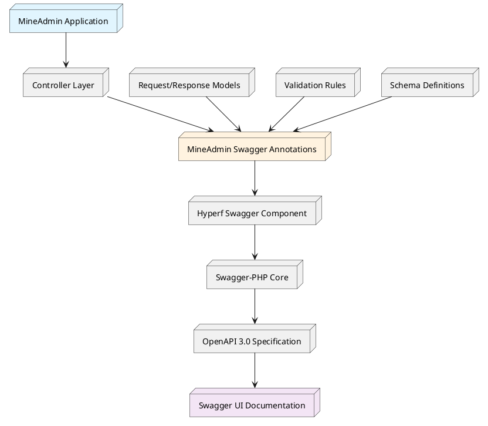
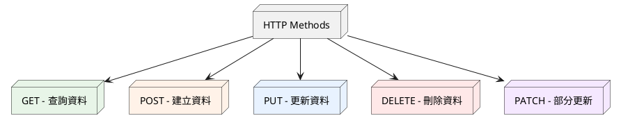
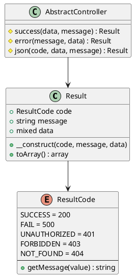
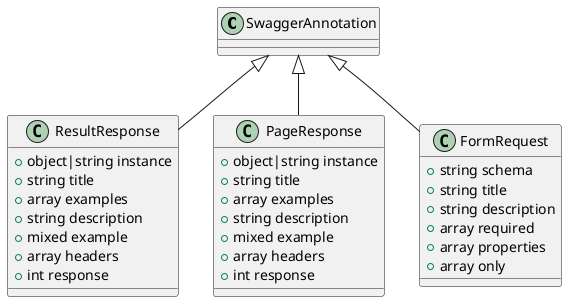
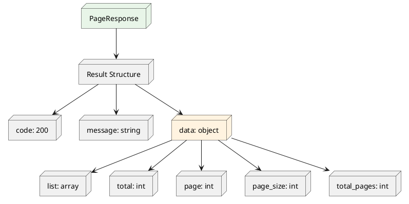

# 路由與API文件系統

## 目錄

1. [概述與架構](#_1-概述與架構)
2. [快速開始](#_2-快速開始)
3. [HTTP規範與最佳實踐](#_3-http規範與最佳實踐)
4. [響應結構體系統](#_4-響應結構體系統)
5. [MineAdmin自定義註解](#_5-mineadmin自定義註解)
6. [實際應用示例](#_6-實際應用示例)
10. [常見問題與解決方案](#_10-常見問題與解決方案)

---

## 1. 概述與架構

### 1.1 系統概述

MineAdmin 內建了完整的 API 文件生成系統，基於 [Swagger/OpenAPI 3.0](https://swagger.io) 規範，為開發者提供了強大的 API 文件自動生成和管理功能。

**訪問方式**: 本地開發時訪問 `http://localhost:9503/swagger` 檢視完整的 API 文件

### 1.2 架構層級

::: tip 技術棧架構

MineAdmin 的 API 文件系統採用多層架構設計：

- **[mineadmin/swagger](https://github.com/mineadmin/Swagger)** - MineAdmin 專用的 Swagger 註解封裝層
- **[hyperf/swagger](https://github.com/hyperf/swagger)** - Hyperf 框架的 Swagger 整合元件
- **[zircote/swagger-php](https://github.com/zircote/swagger-php)** - PHP Swagger 註解處理核心
- **[OpenAPI 規範](https://github.com/OAI/OpenAPI-Specification)** - 業界標準的 API 文件規範

:::

### 1.3 系統架構圖



### 1.4 核心優勢

- **自動化文件生成**: 基於程式碼註解自動生成完整的 API 文件
- **型別安全**: 強型別支援，確保文件與實際程式碼一致
- **實時同步**: 程式碼變更時文件自動更新
- **互動式測試**: 內建的 Swagger UI 支援直接測試 API
---

## 2. 快速開始

### 2.1 基礎配置

確保你的專案已正確安裝 MineAdmin Swagger 元件：

```bash
composer require mineadmin/swagger
```

### 2.2 第一個 API 介面

建立一個簡單的 API 介面：

```php
<?php

namespace App\Http\Admin\Controller;

use App\Http\Common\Result;
use Mine\Swagger\Attributes\ResultResponse;
use Hyperf\Swagger\Annotation as OA;

#[OA\Tag(name: "使用者管理", description: "使用者相關的API介面")]
class UserController extends AbstractController
{
    #[OA\Get(
        path: "/admin/user/info",
        summary: "獲取使用者資訊",
        description: "根據使用者ID獲取詳細的使用者資訊"
    )]
    #[ResultResponse(
        instance: new Result(data: ["id" => 1, "name" => "張三"]),
        title: "獲取成功",
        description: "成功獲取使用者資訊"
    )]
    public function getUserInfo(): Result
    {
        return $this->success([
            'id' => 1,
            'name' => '張三',
            'email' => 'zhangsan@example.com'
        ]);
    }
}
```

### 2.3 訪問文件

啟動服務後，訪問 `http://localhost:9503/swagger` 檢視生成的文件。

---

## 3. HTTP規範與最佳實踐

### 3.1 RESTful API 設計原則

MineAdmin 推薦遵循 RESTful 架構風格，確保 API 介面的一致性和可預測性。

#### 3.1.1 HTTP 方法對映



#### 3.1.2 標準路由設計模式

以使用者管理模組為例，展示標準的 RESTful API 設計：

| HTTP方法 | 路由路徑 | 功能描述 | 響應資料 |
|---------|----------|---------|----------|
| `GET` | `/admin/user/list` | 獲取使用者列表（分頁） | 使用者列表資料 |
| `GET` | `/admin/user/{id}` | 獲取單個使用者詳情 | 單個使用者資料 |
| `POST` | `/admin/user` | 建立新使用者 | 建立的使用者資料 |
| `PUT` | `/admin/user/{id}` | 完整更新使用者資訊 | 更新後的使用者資料 |
| `PATCH` | `/admin/user/{id}` | 部分更新使用者資訊 | 更新後的使用者資料 |
| `DELETE` | `/admin/user/{id}` | 刪除使用者 | 刪除確認資訊 |

#### 3.1.3 最佳實踐建議

::: tip 設計原則

1. **資源命名**: 使用名詞而非動詞，採用複數形式
   ```
   ✅ /admin/users
   ❌ /admin/getUsers
   ```

2. **巢狀資源**: 體現資源間的層次關係
   ```
   ✅ /admin/users/{id}/roles
   ❌ /admin/user-roles?user_id={id}
   ```

3. **狀態碼語義**: 正確使用 HTTP 狀態碼
   ```
   200 - 請求成功
   201 - 資源建立成功
   400 - 請求引數錯誤
   401 - 未授權訪問
   403 - 許可權不足
   404 - 資源不存在
   500 - 伺服器內部錯誤
   ```

4. **靈活性優先**: 規範是基礎，業務需求是核心
   - 遵循 RESTful 原則但不拘泥於嚴格規範
   - 以業務的可持續迭代為主要考量
   - 保持團隊內部的一致性

:::

### 3.2 URL 設計規範

#### 3.2.1 命名約定

```php
// 推薦的命名方式
GET    /admin/users              // 獲取使用者列表
GET    /admin/users/{id}         // 獲取指定使用者
POST   /admin/users              // 建立使用者
PUT    /admin/users/{id}         // 更新使用者
DELETE /admin/users/{id}         // 刪除使用者

// 特殊操作的命名
POST   /admin/users/{id}/enable  // 啟用使用者
POST   /admin/users/{id}/disable // 停用使用者
GET    /admin/users/search       // 搜尋使用者
```

#### 3.2.2 引數傳遞規範

```php
// 查詢引數 - 用於過濾、排序、分頁
GET /admin/users?page=1&page_size=20&status=active&sort=created_at,desc

// 路徑引數 - 用於唯一標識資源
GET /admin/users/123

// 請求體引數 - 用於複雜資料傳遞
POST /admin/users
Content-Type: application/json
{
    "username": "zhangsan",
    "email": "zhangsan@example.com",
    "roles": [1, 2, 3]
}
```

---

## 4. 響應結構體系統

### 4.1 統一響應格式

MineAdmin 採用統一的響應結構 `\App\Http\Common\Result`，確保所有 API 介面返回格式的一致性。

### 4.2 Result 類架構



### 4.3 核心實現程式碼

#### 4.3.1 Result 響應類

::: code-group

```php [Result.php]
<?php

declare(strict_types=1);
/**
 * This file is part of MineAdmin.
 */

namespace App\Http\Common;

use Hyperf\Contract\Arrayable;
use Hyperf\Swagger\Annotation as OA;

/**
 * 統一的API響應結構
 * @template T
 */
#[OA\Schema(title: 'API 響應結構', description: '統一的API響應格式')]
class Result implements Arrayable
{
    public function __construct(
        #[OA\Property(ref: 'ResultCode', title: '響應狀態碼', description: '業務狀態碼，不同於HTTP狀態碼')]
        public ResultCode $code = ResultCode::SUCCESS,
        
        #[OA\Property(title: '響應訊息', type: 'string', description: '響應的描述資訊')]
        public ?string $message = null,
        
        #[OA\Property(title: '響應資料', type: 'mixed', description: '實際的業務資料')]
        public mixed $data = []
    ) {
        if ($this->message === null) {
            $this->message = ResultCode::getMessage($this->code->value);
        }
    }

    /**
     * 轉換為陣列格式
     */
    public function toArray(): array
    {
        return [
            'code' => $this->code->value,
            'message' => $this->message,
            'data' => $this->data,
        ];
    }
}
```

```php [AbstractController.php]
<?php

namespace App\Http\Common\Controller;

use App\Http\Common\Result;
use App\Http\Common\ResultCode;

/**
 * 基礎控制器類
 * 提供統一的響應方法
 */
abstract class AbstractController
{
    /**
     * 成功響應
     */
    protected function success(mixed $data = [], ?string $message = null): Result
    {
        return new Result(ResultCode::SUCCESS, $message, $data);
    }

    /**
     * 錯誤響應
     */
    protected function error(?string $message = null, mixed $data = []): Result
    {
        return new Result(ResultCode::FAIL, $message, $data);
    }

    /**
     * 自定義響應
     */
    protected function json(ResultCode $code, mixed $data = [], ?string $message = null): Result
    {
        return new Result($code, $message, $data);
    }
    
    /**
     * 分頁響應
     */
    protected function paginate(array $list, int $total, int $page = 1, int $pageSize = 10): Result
    {
        return $this->success([
            'list' => $list,
            'total' => $total,
            'page' => $page,
            'page_size' => $pageSize,
            'total_pages' => ceil($total / $pageSize)
        ]);
    }
}
```

```php [AdminController.php]
<?php

namespace App\Http\Admin\Controller;

use App\Http\Common\Controller\AbstractController as Base;
use Hyperf\Context\ApplicationContext;
use Hyperf\HttpServer\Contract\RequestInterface;

/**
 * 管理後臺控制器基類
 * 擴充套件了分頁處理功能
 */
abstract class AbstractController extends Base
{
    /**
     * 獲取當前頁碼
     */
    protected function getCurrentPage(): int
    {
        return (int) $this->getRequest()->input('page', 1);
    }

    /**
     * 獲取每頁大小
     */
    protected function getPageSize(int $default = 10, int $max = 100): int
    {
        $size = (int) $this->getRequest()->input('page_size', $default);
        return min($size, $max); // 限制最大頁面大小
    }

    /**
     * 獲取請求例項
     */
    protected function getRequest(): RequestInterface
    {
        return ApplicationContext::getContainer()->get(RequestInterface::class);
    }
    
    /**
     * 獲取排序引數
     */
    protected function getOrderBy(string $default = 'id'): array
    {
        $sort = $this->getRequest()->input('sort', $default);
        $order = $this->getRequest()->input('order', 'asc');
        
        return [$sort, in_array(strtolower($order), ['asc', 'desc']) ? $order : 'asc'];
    }
}
```

:::

### 4.4 ResultCode 列舉類

MineAdmin 提供了一套完整的業務狀態碼列舉系統，用於標準化 API 響應的狀態資訊。

#### 4.4.1 核心實現

```php
<?php

declare(strict_types=1);
/**
 * This file is part of MineAdmin.
 */

namespace App\Http\Common;

use Hyperf\Constants\Annotation\Constants;
use Hyperf\Constants\Annotation\Message;
use Hyperf\Constants\ConstantsTrait;
use Hyperf\Swagger\Annotation as OA;

/**
 * 業務狀態碼列舉
 * 提供標準化的API響應狀態碼
 */
#[Constants]
#[OA\Schema(title: 'ResultCode', type: 'integer', default: 200, description: '業務狀態碼')]
enum ResultCode: int
{
    use ConstantsTrait;

    // 成功狀態
    #[Message('操作成功')]
    case SUCCESS = 200;

    // 通用錯誤狀態
    #[Message('操作失敗')]
    case FAIL = 500;

    #[Message('未授權訪問')]
    case UNAUTHORIZED = 401;

    #[Message('許可權不足')]
    case FORBIDDEN = 403;

    #[Message('資源不存在')]
    case NOT_FOUND = 404;

    #[Message('請求方法不被允許')]
    case METHOD_NOT_ALLOWED = 405;

    #[Message('請求格式不可接受')]
    case NOT_ACCEPTABLE = 406;

    #[Message('請求實體處理錯誤')]
    case UNPROCESSABLE_ENTITY = 422;
    
    // 業務相關錯誤
    #[Message('引數驗證失敗')]
    case VALIDATION_ERROR = 10001;
    
    #[Message('業務邏輯錯誤')]
    case BUSINESS_ERROR = 10002;
    
    #[Message('資料庫操作失敗')]
    case DATABASE_ERROR = 10003;
    
    #[Message('外部服務呼叫失敗')]
    case EXTERNAL_SERVICE_ERROR = 10004;
}
```

#### 4.4.2 響應格式示例

不同狀態碼對應的響應格式：

```json
// 成功響應
{
    "code": 200,
    "message": "操作成功",
    "data": {
        "id": 1,
        "username": "admin"
    }
}

// 錯誤響應
{
    "code": 10001,
    "message": "引數驗證失敗",
    "data": {
        "errors": {
            "username": ["使用者名稱不能為空"]
        }
    }
}

// 分頁響應
{
    "code": 200,
    "message": "操作成功",
    "data": {
        "list": [...],
        "total": 100,
        "page": 1,
        "page_size": 20,
        "total_pages": 5
    }
}
```

### 4.5 使用最佳實踐

#### 4.5.1 控制器中的使用

```php
class UserController extends AbstractController
{
    public function index(): Result
    {
        try {
            $users = $this->userService->getList();
            return $this->success($users, '獲取使用者列表成功');
        } catch (ValidationException $e) {
            return $this->json(ResultCode::VALIDATION_ERROR, [], $e->getMessage());
        } catch (\Exception $e) {
            return $this->error('系統異常，請稍後重試');
        }
    }
}
```

---

## 5. MineAdmin自定義註解

MineAdmin 提供了三個核心的自定義 Swagger 註解，用於簡化 API 文件的編寫和維護。所有註解都位於 `Mine\Swagger\Attributes\` 名稱空間下。

### 5.1 註解架構概覽



### 5.2 ResultResponse 註解

用於定義單個資源或操作的響應結構，自動生成標準的 API 響應文件。

#### 5.2.1 建構函式簽名

```php
ResultResponse::__construct(
    object|string $instance,           // 響應資料的類例項或類名
    ?string $title = null,             // 響應標題
    ?array $examples = null,           // 多個示例陣列
    ?string $description = null,       // 響應描述
    mixed $example = Generator::UNDEFINED, // 單個示例
    ?array $headers = null,            // 響應頭資訊
    ?int $response = 200               // HTTP狀態碼
)
```

#### 5.2.2 引數詳解

| 引數 | 型別 | 必填 | 說明 |
|-----|------|------|------|
| `$instance` | `object\|string` | ✅ | 響應資料的類例項或類名，支援自動解析註解 |
| `$title` | `string` | ❌ | 響應的標題，用於文件顯示 |
| `$examples` | `array` | ❌ | 多個響應示例，鍵值對形式 |
| `$description` | `string` | ❌ | 詳細的響應說明 |
| `$example` | `mixed` | ❌ | 單個響應示例，JSON字串或物件 |
| `$headers` | `array` | ❌ | 自定義響應頭資訊 |
| `$response` | `int` | ❌ | HTTP狀態碼，預設200 |

#### 5.2.3 實際應用示例

基於使用者登入介面的完整示例：

::: code-group

```php [登入控制器]
<?php

namespace App\Http\Admin\Controller;

use App\Http\Common\Result;
use App\Http\Admin\Request\PassportLoginRequest;
use App\Schema\PassportLoginVo;
use Mine\Swagger\Attributes\ResultResponse;
use Hyperf\Swagger\Annotation as OA;

class PassportController extends AbstractController
{
    #[OA\Post(
        path: '/admin/passport/login',
        summary: '使用者登入',
        description: '管理員使用者登入介面',
        tags: ['認證管理']
    )]
    #[ResultResponse(
        instance: new Result(data: new PassportLoginVo()),
        title: '登入成功',
        description: '使用者登入成功後返回的令牌資訊',
        example: '{"code":200,"message":"登入成功","data":{"access_token":"eyJ0eXAiOiJKV1QiLCJhbGciOiJIUzI1NiJ9...","refresh_token":"eyJ0eXAiOiJKV1QiLCJhbGciOiJIUzI1NiJ9...","expire_at":7200}}'
    )]
    public function login(PassportLoginRequest $request): Result
    {
        $credentials = $request->validated();
        $tokenData = $this->authService->login($credentials);
        
        return $this->success($tokenData, '登入成功');
    }
}
```

```php [響應資料模型]
<?php

namespace App\Schema;

use Hyperf\Swagger\Annotation as OA;

/**
 * 登入成功響應資料模型
 */
#[OA\Schema(
    title: '登入響應資料',
    description: '使用者登入成功後返回的令牌資訊',
    type: 'object'
)]
final class PassportLoginVo
{
    #[OA\Property(
        property: 'access_token',
        description: '訪問令牌，用於API請求認證',
        type: 'string',
        example: 'eyJ0eXAiOiJKV1QiLCJhbGciOiJIUzI1NiJ9.eyJpYXQiOjE3MjIwOTQwNTY...'
    )]
    public string $access_token;

    #[OA\Property(
        property: 'refresh_token',
        description: '重新整理令牌，用於獲取新的訪問令牌',
        type: 'string',
        example: 'eyJ0eXAiOiJKV1QiLCJhbGciOiJIUzI1NiJ9.eyJpYXQiOjE3MjIwOTQwNTY...'
    )]
    public string $refresh_token;

    #[OA\Property(
        property: 'expire_at',
        description: '令牌過期時間，單位：秒',
        type: 'integer',
        example: 7200
    )]
    public int $expire_at;

    #[OA\Property(
        property: 'user_info',
        description: '使用者基本資訊',
        type: 'object',
        properties: [
            'id' => ['type' => 'integer', 'description' => '使用者ID'],
            'username' => ['type' => 'string', 'description' => '使用者名稱'],
            'nickname' => ['type' => 'string', 'description' => '暱稱'],
        ]
    )]
    public array $user_info;
}
```

:::

#### 5.2.4 最佳實踐

::: warning 注意事項

1. **instance 引數**: 推薦使用具體的類例項而非類名，確保註解能正確解析
2. **示例資料**: 提供真實、完整的示例資料，便於前端開發者理解
3. **描述資訊**: 詳細說明響應的業務含義和使用場景
4. **狀態碼**: 根據實際業務情況設定合適的 HTTP 狀態碼

:::

### 5.3 PageResponse 註解

專門用於分頁資料的響應結構註解，自動生成包含分頁資訊的標準響應文件。

#### 5.3.1 建構函式簽名

`PageResponse` 的建構函式與 `ResultResponse` 完全一致，但在語義上專門用於分頁響應。

```php
PageResponse::__construct(
    object|string $instance,           // 分頁資料項的類例項或類名
    ?string $title = null,             // 響應標題
    ?array $examples = null,           // 多個示例陣列
    ?string $description = null,       // 響應描述
    mixed $example = Generator::UNDEFINED, // 單個示例
    ?array $headers = null,            // 響應頭資訊
    ?int $response = 200               // HTTP狀態碼
)
```

#### 5.3.2 分頁響應結構



### 5.4 FormRequest 註解

專門用於請求引數的結構化文件註解，基於現有的 Schema 類自動生成請求引數文件。

#### 5.4.1 建構函式簽名

```php
FormRequest::__construct(
    ?string $schema = null,        // 需要解析的 schema 類名
    ?string $title = null,         // 表單標題
    ?string $description = null,   // 表單描述
    ?array $required = null,       // 必填欄位陣列
    ?array $properties = null,     // 額外的屬性定義
    array $only = []               // 只顯示指定的欄位
)
```

#### 5.4.2 引數詳解

| 引數 | 型別 | 必填 | 說明 |
|-----|------|------|------|
| `$schema` | `string` | ❌ | 基礎 Schema 類名，用於欄位解析 |
| `$title` | `string` | ❌ | 請求表單的標題 |
| `$description` | `string` | ❌ | 請求表單的詳細描述 |
| `$required` | `array` | ❌ | 必填欄位列表 |
| `$properties` | `array` | ❌ | 額外的欄位屬性定義 |
| `$only` | `array` | ❌ | 只顯示指定的欄位，用於欄位過濾 |

---

## 6. 實際應用示例

### 6.1 完整的CRUD介面示例

以文章管理為例，展示完整的CRUD介面實現：

```php
<?php

namespace App\Http\Admin\Controller;

use App\Http\Common\Result;
use App\Http\Admin\Request\ArticleRequest;
use App\Schema\ArticleSchema;
use Mine\Swagger\Attributes\{ResultResponse, PageResponse, FormRequest};
use Hyperf\Swagger\Annotation as OA;

#[OA\Tag(name: "文章管理", description: "文章相關的CRUD操作")]
class ArticleController extends AbstractController
{
    /**
     * 獲取文章列表
     */
    #[OA\Get(
        path: "/admin/articles",
        summary: "獲取文章列表",
        description: "分頁獲取文章列表，支援搜尋過濾"
    )]
    #[PageResponse(instance: ArticleSchema::class, title: "文章列表")]
    public function index(): Result
    {
        $filters = $this->getRequest()->all();
        $page = $this->getCurrentPage();
        $pageSize = $this->getPageSize();
        
        $result = $this->articleService->paginate($filters, $page, $pageSize);
        return $this->paginate($result['list'], $result['total'], $page, $pageSize);
    }

    /**
     * 獲取單篇文章
     */
    #[OA\Get(
        path: "/admin/articles/{id}",
        summary: "獲取文章詳情",
        description: "根據ID獲取單篇文章的詳細資訊"
    )]
    #[OA\Parameter(name: "id", description: "文章ID", in: "path", required: true, schema: new OA\Schema(type: "integer"))]
    #[ResultResponse(instance: new Result(data: new ArticleSchema()), title: "文章詳情")]
    public function show(int $id): Result
    {
        $article = $this->articleService->findById($id);
        return $this->success($article);
    }

    /**
     * 建立文章
     */
    #[OA\Post(
        path: "/admin/articles",
        summary: "建立文章",
        description: "建立新的文章"
    )]
    #[OA\RequestBody(content: new OA\JsonContent(ref: ArticleRequest::class))]
    #[ResultResponse(instance: new Result(data: new ArticleSchema()), title: "建立成功", response: 201)]
    public function store(ArticleRequest $request): Result
    {
        $data = $request->validated();
        $article = $this->articleService->create($data);
        return $this->success($article, '文章建立成功');
    }

    /**
     * 更新文章
     */
    #[OA\Put(
        path: "/admin/articles/{id}",
        summary: "更新文章",
        description: "更新指定文章的資訊"
    )]
    #[OA\Parameter(name: "id", description: "文章ID", in: "path", required: true, schema: new OA\Schema(type: "integer"))]
    #[OA\RequestBody(content: new OA\JsonContent(ref: ArticleRequest::class))]
    #[ResultResponse(instance: new Result(data: new ArticleSchema()), title: "更新成功")]
    public function update(int $id, ArticleRequest $request): Result
    {
        $data = $request->validated();
        $article = $this->articleService->update($id, $data);
        return $this->success($article, '文章更新成功');
    }

    /**
     * 刪除文章
     */
    #[OA\Delete(
        path: "/admin/articles/{id}",
        summary: "刪除文章",
        description: "刪除指定的文章"
    )]
    #[OA\Parameter(name: "id", description: "文章ID", in: "path", required: true, schema: new OA\Schema(type: "integer"))]
    #[ResultResponse(instance: new Result(), title: "刪除成功")]
    public function destroy(int $id): Result
    {
        $this->articleService->delete($id);
        return $this->success([], '文章刪除成功');
    }
}
```

### 6.2 請求驗證類示例

```php
<?php

namespace App\Http\Admin\Request;

use App\Schema\ArticleSchema;
use Hyperf\Validation\Request\FormRequest;
use Mine\Swagger\Attributes\FormRequest as FormRequestAnnotation;

#[FormRequestAnnotation(
    schema: ArticleSchema::class,
    title: "文章請求引數",
    description: "建立或更新文章時的請求引數",
    required: ['title', 'content', 'status'],
    only: ['title', 'content', 'excerpt', 'status', 'category_id', 'tags']
)]
class ArticleRequest extends FormRequest
{
    public function authorize(): bool
    {
        return true;
    }

    public function rules(): array
    {
        return [
            'title' => 'required|string|max:200',
            'content' => 'required|string',
            'excerpt' => 'nullable|string|max:500',
            'status' => 'required|integer|in:0,1',
            'category_id' => 'nullable|integer|exists:categories,id',
            'tags' => 'nullable|array',
            'tags.*' => 'integer|exists:tags,id',
        ];
    }

    public function attributes(): array
    {
        return [
            'title' => '文章標題',
            'content' => '文章內容',
            'excerpt' => '文章摘要',
            'status' => '釋出狀態',
            'category_id' => '分類ID',
            'tags' => '標籤列表',
        ];
    }
}
```

### 6.3 資料模型Schema示例

```php
<?php

namespace App\Schema;

use Hyperf\Swagger\Annotation as OA;

#[OA\Schema(title: "文章資訊", description: "文章詳細資訊結構")]
class ArticleSchema
{
    #[OA\Property(property: "id", title: "文章ID", type: "integer")]
    public int $id;

    #[OA\Property(property: "title", title: "文章標題", type: "string", example: "這是一篇測試文章")]
    public string $title;

    #[OA\Property(property: "content", title: "文章內容", type: "string")]
    public string $content;

    #[OA\Property(property: "excerpt", title: "文章摘要", type: "string")]
    public ?string $excerpt;

    #[OA\Property(property: "status", title: "釋出狀態", type: "integer", description: "0-草稿，1-已釋出")]
    public int $status;

    #[OA\Property(property: "category", title: "文章分類", type: "object", 
        properties: [
            "id" => ["type" => "integer", "description" => "分類ID"],
            "name" => ["type" => "string", "description" => "分類名稱"]
        ]
    )]
    public ?array $category;

    #[OA\Property(property: "tags", title: "文章標籤", type: "array", 
        items: new OA\Items(type: "object", 
            properties: [
                "id" => ["type" => "integer", "description" => "標籤ID"],
                "name" => ["type" => "string", "description" => "標籤名稱"]
            ]
        )
    )]
    public array $tags;

    #[OA\Property(property: "created_at", title: "建立時間", type: "string", format: "date-time")]
    public string $created_at;

    #[OA\Property(property: "updated_at", title: "更新時間", type: "string", format: "date-time")]
    public string $updated_at;
}
```

---

## 7. 效能最佳化與最佳實踐

#### 7.1 選擇性掃描

```php
// config/autoload/swagger.php
// 只掃描必要的目錄，避免全專案掃描
    'scan' => [
        'paths' => [
            Finder::create()
                ->in([BASE_PATH . '/app/Http', BASE_PATH . '/app/Schema'])
                ->name('*.php')
                ->getIterator()
        ],
    ],
```

### 7.2 程式碼組織最佳實踐

#### 7.2.1 目錄結構建議

```
app/
├── Http/
│   ├── Admin/
│   │   ├── Controller/          # 管理後臺控制器
│   │   └── Request/            # 請求驗證類
│   └── Common/
│       ├── Result.php          # 統一響應結構
│       └── ResultCode.php      # 狀態碼列舉
├── Schema/                     # Swagger Schema 定義
│   ├── UserSchema.php
│   └── ArticleSchema.php
└── Service/                    # 業務邏輯層
    ├── UserService.php
    └── ArticleService.php
```

---

## 8. 錯誤處理與除錯

### 8.1 常見錯誤型別

#### 8.1.1 註解解析錯誤

```php
// ❌ 錯誤示例 - 註解語法錯誤
#[ResultResponse(
    instance: UserSchema,  // 缺少 ::class
    title = '使用者資訊'      // 使用了 = 而不是 :
)]

// ✅ 正確示例
#[ResultResponse(
    instance: UserSchema::class,
    title: '使用者資訊'
)]
```

#### 8.1.2 迴圈引用問題

```php
// ❌ 可能導致迴圈引用
class UserSchema
{
    #[OA\Property(ref: 'GroupSchema')]
    public GroupSchema $group;
}

class GroupSchema
{
    #[OA\Property(type: 'array', items: new OA\Items(ref: 'UserSchema'))]
    public array $users;
}

// ✅ 使用懶載入避免迴圈引用
class UserSchema
{
    #[OA\Property(ref: '#/components/schemas/GroupSchema')]
    public array $group;
}
```

### 8.2 除錯技巧

#### 8.2.1 啟用詳細錯誤日誌

```php
// config/autoload/logger.php
return [
    'swagger' => [
        'handler' => [
            'class' => Monolog\Handler\StreamHandler::class,
            'constructor' => [
                'stream' => BASE_PATH . '/runtime/logs/swagger.log',
                'level' => Monolog\Logger::DEBUG,
            ],
        ],
        'formatter' => [
            'class' => Monolog\Formatter\LineFormatter::class,
        ],
    ],
];
```

#### 8.2.2 文件相關命令

```shell
# 重新生成Swagger文件
php bin/hyperf.php gen:swagger
# 根據指定的 model 生成 Swagger Schema
php bin/hyperf.php gen:swagger-schema
```

---

## 10. 常見問題與解決方案

### 10.1 註解相關問題

#### 10.1.1 註解不生效

**問題描述**: 添加了註解但在Swagger文件中不顯示

**可能原因**:
1. 註解語法錯誤
2. 類未被掃描到
3. 快取問題

**解決方案**:

```php
// 1. 檢查註解語法
#[OA\Get(path: "/users", summary: "獲取使用者列表")]  // ✅ 正確
// #[OA\Get(path = "/users", summary = "獲取使用者列表")]  // ❌ 錯誤語法

// 2. 確保類在掃描範圍內
// config/autoload/swagger.php
    'scan' => [
        'paths' => [
            Finder::create()
                ->in([BASE_PATH . '/app/Http', BASE_PATH . '/app/Schema'])
                ->name('*.php')
                ->getIterator()
        ],
    ],

// 3. 清除快取並重新生成文件
php bin/hyperf.php swagger:generate
```

#### 10.1.2 Schema引用問題

**問題描述**: Schema引用無法正確解析

**解決方案**:

```php
// ❌ 錯誤的引用方式
#[OA\Property(ref: 'UserSchema')]

// ✅ 正確的引用方式
#[OA\Property(ref: '#/components/schemas/UserSchema')]

// 或者使用類引用
#[ResultResponse(instance: UserSchema::class)]
```

### 10.2 最佳實踐總結

#### 10.2.1 開發階段

1. **漸進式新增**: 先為核心介面新增文件，再逐步完善
2. **模板複用**: 建立通用的註解模板，提高開發效率
3. **即時驗證**: 開發過程中及時檢查文件生成效果

#### 10.2.2 生產環境

1. **定期更新**: 建立文件更新機制，確保文件與程式碼同步
2. **訪問控制**: 生產環境考慮對Swagger UI的訪問控制

#### 10.2.3 團隊協作

1. **規範制定**: 建立團隊統一的註解編寫規範
2. **Code Review**: 將API文件檢查納入程式碼審查流程
3. **自動化**: 透過CI/CD自動檢查文件完整性

---