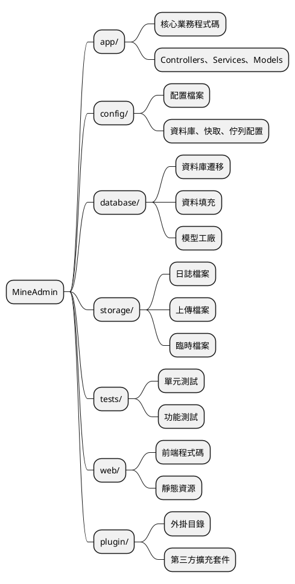
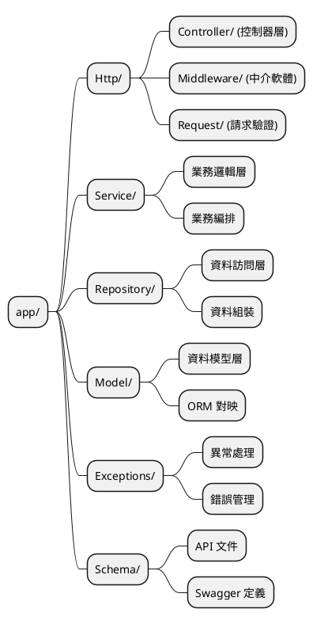
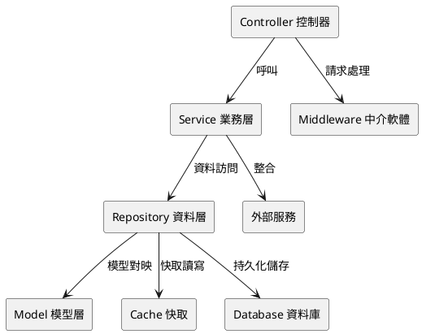

# 專案目錄結構

MineAdmin 採用現代化的分層架構設計，提供清晰的程式碼組織結構和最佳實踐。本文件將詳細介紹專案的目錄結構、設計理念以及開發規範。

## 概述

MineAdmin 的專案結構參考了 [Laravel](https://laravel.com/) 框架的設計理念，同時結合了現代化的分層架構模式。如果你熟悉 Laravel 開發，那麼理解 MineAdmin 的結構將會非常容易。

### 架構理念

MineAdmin 採用以下核心設計原則：

- **分層架構**：Controller → Service → Repository → Model 的清晰分層
- **職責分離**：每個目錄都有明確的職責邊界
- **可擴充套件性**：支援外掛化開發和模組化擴充套件
- **標準化**：遵循 PSR 規範和最佳實踐

## 專案根目錄結構



### 目錄詳細說明

#### `/app` - 應用核心目錄

應用程式的核心業務邏輯所在地，包含控制器、服務層、資料層等核心元件。

**主要特點：**
- 包含 99% 的業務程式碼
- 遵循 MVC 分層架構
- 支援模組化開發

#### `/config` - 配置目錄

存放所有應用程式配置檔案，提供靈活的環境配置管理。

**典型配置檔案：**
- `database.php` - 資料庫配置
- `cache.php` - 快取配置  
- `queue.php` - 佇列配置

#### `/database` - 資料庫目錄

管理資料庫相關的所有檔案，包括結構變更和測試資料。

**目錄結構：**
```
database/
├── migrations/     # 資料庫遷移檔案
├── seeders/        # 資料填充檔案
```

#### `/storage` - 儲存目錄

存放應用程式執行時產生的檔案和資料。

**目錄用途：**
- `uploads/` - 使用者上傳檔案
- `swagger/` - API 文件檔案

#### `/tests` - 測試目錄

包含自動化測試套件，確保程式碼質量和功能正確性。

**測試型別：**
- **單元測試** - 測試單個類或方法
- **功能測試** - 測試完整的業務流程
- **API 測試** - 測試 API 介面

#### `/web` - 前端目錄

存放前端應用程式碼和靜態資原始檔。

#### `/plugin` - 外掛目錄

存放從外掛市場下載的外掛包，支援系統功能擴充套件。

## App 目錄深度解析

`app` 目錄是整個應用的核心，採用嚴格的分層架構設計。



### Http 目錄 - 請求處理層

負責處理所有 HTTP 請求的入口層，包含控制器、中介軟體和請求驗證。

#### 目錄結構
```
Http/
├── Admin/              # 後臺管理模組
│   ├── Controller/     # 後臺控制器
│   ├── Middleware/     # 後臺中介軟體
│   ├── Request/        # 後臺請求驗證類
│   ├── Subscriber/     # 事件訂閱者
│   └── Vo/            # 值物件類
├── Api/                # API 介面模組
│   ├── Controller/     # API 控制器
│   │   └── V1/        # API 版本控制
│   ├── Middleware/     # API 中介軟體
│   └── Request/        # API 請求驗證類
│       └── V1/        # API 版本請求類
├── Common/             # 通用模組
│   ├── Controller/     # 通用控制器
│   ├── Event/         # 事件類
│   ├── Middleware/     # 通用中介軟體
│   ├── Request/        # 通用請求類
│   ├── Result.php      # 響應結果類
│   ├── ResultCode.php  # 結果狀態碼
│   └── Swagger/        # API 文件配置
└── CurrentUser.php     # 當前使用者上下文
```

#### 模組化架構說明

**Admin 模組** - 後臺管理功能
- 包含許可權管理、使用者管理、選單管理等後臺功能
- 採用完整的 MVC 結構，包含事件訂閱者和值物件

**Api 模組** - 對外 API 介面  
- 支援版本控制（V1, V2 等）
- 獨立的認證中介軟體和請求驗證
- RESTful API 設計規範

**Common 模組** - 通用元件
- 提供跨模組共享的基礎功能
- 統一的響應格式和狀態碼管理
- API 文件自動生成配置

### Service 目錄 - 業務邏輯層

Service 層是核心業務邏輯的實現場所，負責業務規則的編排和執行。

#### 設計原則

1. **單一職責** - 每個 Service 類只處理一個業務域
2. **依賴注入** - 透過建構函式注入依賴
3. **事務管理** - 確保業務操作的原子性
4. **異常處理** - 統一的異常處理機制

#### Service 層職責

**核心功能：**
- 業務邏輯編排和執行
- 事務管理和資料一致性
- 呼叫 Repository 層進行資料操作
- 業務規則驗證和處理

### Repository 目錄 - 資料訪問層

Repository 模式提供了資料訪問的抽象層，封裝了資料查詢和操作邏輯。

#### 設計特點

- **資料來源抽象** - 可以輕鬆切換資料來源（MySQL、Redis、ES等）
- **查詢複用** - 公共查詢邏輯的複用
- **快取整合** - 透明的快取層整合
- **效能最佳化** - 查詢最佳化和批次操作

#### Repository 層特點

**主要職責：**
- 資料訪問抽象層  
- 複雜查詢邏輯封裝
- 快取策略實現
- 資料來源切換和最佳化

### Model 目錄 - 資料模型層

Model 層基於 Hyperf 的 Eloquent ORM，提供資料庫表的物件關係對映。

#### 模型特性

- **關聯關係** - 定義表之間的關聯
- **訪問器/修改器** - 資料格式化
- **事件監聽** - 模型生命週期事件
- **軟刪除** - 邏輯刪除支援

#### Model 層特性

**核心功能：**
- 資料表對映和關係定義
- 屬性訪問器和修改器
- 模型事件和觀察者
- 資料型別轉換和驗證

### Exceptions 目錄 - 異常處理

統一的異常處理機制，提供友好的錯誤資訊和日誌記錄。


### Schema 目錄 - API 文件

包含 Swagger/OpenAPI 文件定義，用於 API 文件生成。

::: danger 重要提醒
Schema 類嚴格禁止參與業務邏輯排程，僅用於 API 文件生成。
:::


## 開發最佳實踐

### 程式碼組織規範

1. **命名規範**
   - 類名使用 `PascalCase`
   - 方法名使用 `camelCase`  
   - 常量使用 `UPPER_SNAKE_CASE`

2. **檔案組織**
   - 一個檔案一個類
   - 檔名與類名保持一致
   - 合理使用名稱空間

3. **依賴注入**
   - 優先使用建構函式注入
   - 避免使用靜態呼叫
   - 面向介面程式設計

### 架構模式建議



### 錯誤處理策略

1. **異常分類**
   - 業務異常 - 可預期的錯誤
   - 系統異常 - 不可預期的錯誤
   - 驗證異常 - 資料格式錯誤

2. **日誌記錄**
   - 關鍵操作記錄
   - 異常資訊記錄
   - 效能監控記錄

## 相關資源

### 參考文件

- [Laravel 官方文件](https://laravel.com/docs/11.x)
- [Laravel 中文文件](https://learnku.com/docs/laravel/10.x)
- [Hyperf 協程框架](https://hyperf.wiki/3.1/#/en/)

::: warning ORM 差異說明
MineAdmin 使用的是由 [Hyperf](https://github.com/hyperf/hyperf) 維護的協程版 Eloquent ORM，在用法上與 Laravel 官方版本存在一定差異。在開發時請注意協程環境下的特殊用法。
:::

