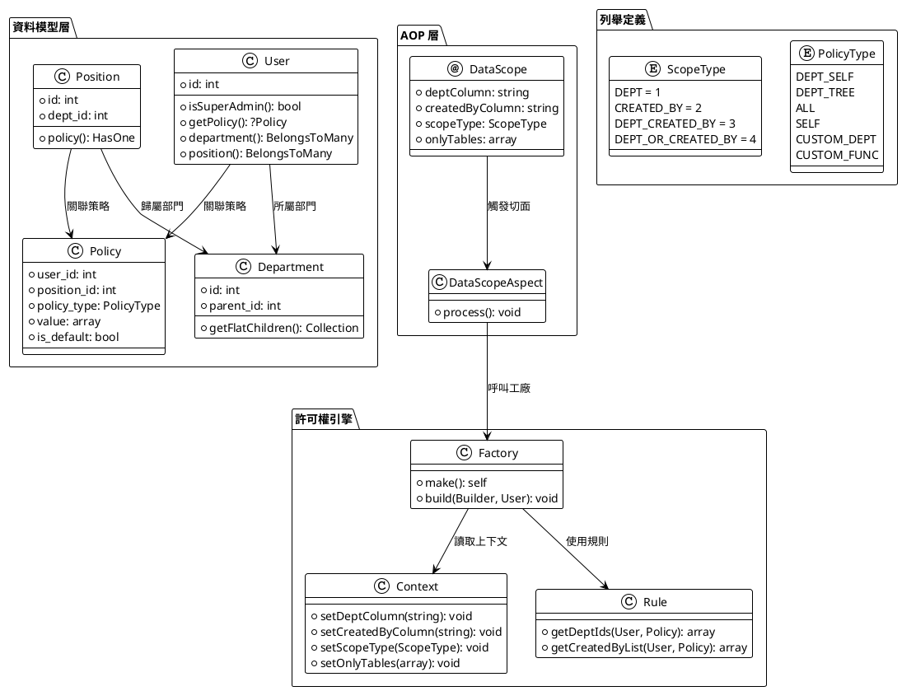
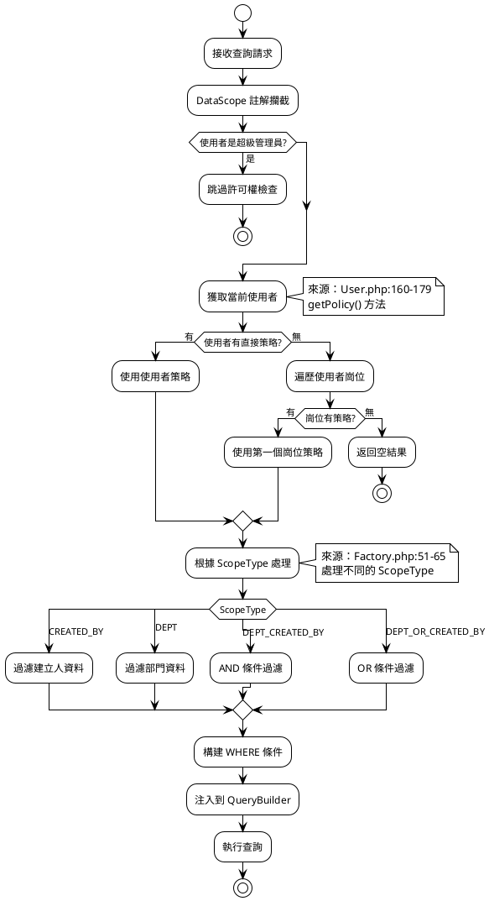
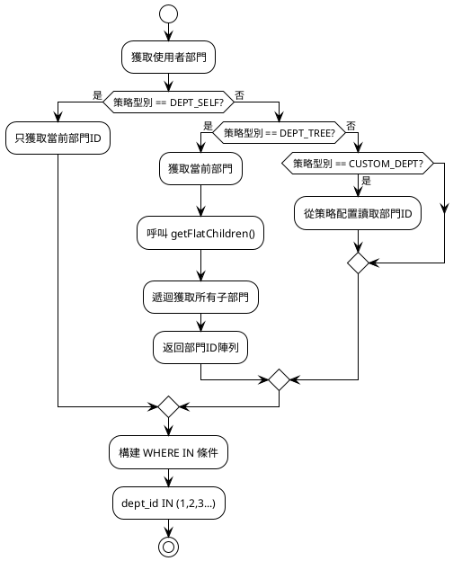
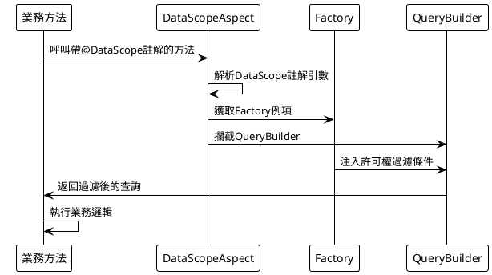

# 系統架構

## 資料許可權系統架構設計

MineAdmin 資料許可權系統基於 AOP（面向切面程式設計）設計，透過註解和切面攔截的方式自動為資料查詢注入許可權過濾條件。

## 核心元件架構圖



## 許可權解析流程



## 資料許可權執行機制

### Factory 工廠類

許可權過濾的核心實現：

```php
// /mineadmin/app/Library/DataPermission/Factory.php
class Factory
{
    public function build(Builder $builder, User $user): void 
    {
        // 1. 超級管理員繞過檢查
        if ($user->isSuperAdmin()) {
            return;
        }
        
        // 2. 獲取使用者策略
        if (($policy = $user->getPolicy()) === null) {
            return;
        }
        
        // 3. 獲取當前 ScopeType
        $scopeType = Context::getScopeType();
        
        // 4. 處理自定義函式
        if ($policy->policy_type === PolicyType::CustomFunc) {
            $customFunc = $policy->value[0] ?? null;
            $this->rule->loadCustomFunc($customFunc, $builder, $user, $policy, $scopeType);
        }
        
        // 5. 根據 ScopeType 處理不同的過濾邏輯
        switch ($scopeType) {
            case ScopeType::CREATED_BY:
                $this->handleCreatedBy($user, $policy, $builder);
                break;
            case ScopeType::DEPT:
                $this->handleDept($user, $policy, $builder);
                break;
            case ScopeType::DEPT_CREATED_BY:
                $this->handleDeptCreatedBy($user, $policy, $builder);
                break;
            case ScopeType::DEPT_OR_CREATED_BY:
                $this->handleDeptOrCreatedBy($user, $policy, $builder);
                break;
        }
    }
}
```

### 具體過濾實現

各種過濾條件的具體實現：

```php
// /mineadmin/app/Library/DataPermission/Factory.php:67-102

// 建立人過濾
private function handleCreatedBy(User $user, Policy $policy, Builder $builder): void
{
    $builder->when($this->rule->getCreatedByList($user, $policy), 
        static function (Builder $query, array $createdByList) {
            $query->whereIn(Context::getCreatedByColumn(), $createdByList);
        });
}

// 部門過濾
private function handleDept(User $user, Policy $policy, Builder $builder): void
{
    $builder->when($this->rule->getDeptIds($user, $policy), 
        static function (Builder $query, array $deptList) {
            $query->whereIn(Context::getDeptColumn(), $deptList);
        });
}

// 部門 AND 建立人過濾
private function handleDeptCreatedBy(User $user, Policy $policy, Builder $builder): void
{
    $builder->when($this->rule->getDeptIds($user, $policy), 
        static function (Builder $query, array $deptList) {
            $query->whereIn(Context::getDeptColumn(), $deptList);
        })->when($this->rule->getCreatedByList($user, $policy), 
        static function (Builder $query, array $createdByList) {
            $query->whereIn(Context::getCreatedByColumn(), $createdByList);
        });
}

// 部門 OR 建立人過濾
private function handleDeptOrCreatedBy(User $user, Policy $policy, Builder $builder): void
{
    $createdByList = $this->rule->getCreatedByList($user, $policy);
    $deptList = $this->rule->getDeptIds($user, $policy);
    
    $builder->where(static function (Builder $query) use ($createdByList, $deptList) {
        if ($createdByList) {
            $query->whereIn(Context::getCreatedByColumn(), $createdByList);
        }
        if ($deptList) {
            $query->orWhereIn(Context::getDeptColumn(), $deptList);
        }
    });
}
```

## Context 上下文管理

### 上下文儲存機制

```php
// /mineadmin/app/Library/DataPermission/Context.php
final class Context
{
    private const DEPT_COLUMN_KEY = 'data_permission_dept_column';
    private const CREATED_BY_COLUMN_KEY = 'data_permission_created_by_column';
    private const SCOPE_TYPE_KEY = 'data_permission_scope_type';
    private const ONLY_TABLES_KEY = 'data_permission_only_tables';

    public static function setDeptColumn(string $column = 'dept_id'): void
    {
        Ctx::set(self::DEPT_COLUMN_KEY, $column);
    }

    public static function getDeptColumn(): string
    {
        return Ctx::get(self::DEPT_COLUMN_KEY, 'dept_id');
    }
    
    // ... 其他方法類似
}
```

## 部門層級處理

### 遞迴部門樹演算法

```php
// /mineadmin/app/Model/Permission/Department.php
public function getFlatChildren(): Collection
{
    $flat = collect();
    $this->load('children'); // 預載入子部門
    
    $traverse = static function ($departments) use (&$traverse, $flat) {
        foreach ($departments as $department) {
            $flat->push($department);
            if ($department->children->isNotEmpty()) {
                $traverse($department->children); // 遞迴處理
            }
        }
    };
    
    $traverse($this->children);
    return $flat->prepend($this); // 包含自身
}
```

### 部門許可權處理流程



## AOP 切面機制

### DataScope 註解定義

```php
// /mineadmin/app/Library/DataPermission/Attribute/DataScope.php
#[\Attribute(\Attribute::TARGET_CLASS | \Attribute::TARGET_METHOD)]
class DataScope extends AbstractAnnotation
{
    public function __construct(
        private readonly string $deptColumn = 'dept_id',
        private readonly string $createdByColumn = 'created_by',
        private readonly ScopeType $scopeType = ScopeType::DEPT_CREATED_BY,
        private readonly ?array $onlyTables = null
    ) {}
}
```

### 切面攔截處理



## 自定義函式擴充套件

### 自定義函式配置

```php
// /mineadmin/config/autoload/department/custom.php
return [
    'testction' => function (Builder $builder, ScopeType $scopeType, Policy $policy, User $user) {
        // 只針對特定使用者生效
        if ($user->id !== 2) {
            return;
        }
        
        $createdByColumn = Context::getCreatedByColumn();
        $deptColumn = Context::getDeptColumn();
        
        switch ($scopeType) {
            case ScopeType::CREATED_BY:
                $builder->where($createdByColumn, $user->id);
                break;
            case ScopeType::DEPT:
                $builder->whereIn($deptColumn, 
                    $user->department()->get()->pluck('id'));
                break;
            case ScopeType::DEPT_CREATED_BY:
                $builder->whereIn($deptColumn, 
                    $user->department()->get()->pluck('id'));
                $builder->where($createdByColumn, $user->id);
                break;
            case ScopeType::DEPT_OR_CREATED_BY:
                $builder->whereIn($deptColumn, 
                    $user->department()->get()->pluck('id'));
                $builder->orWhere($createdByColumn, $user->id);
                break;
        }
    }
];
```

## 實際使用示例

### 在 Service 中的使用

```php
// /mineadmin/app/Service/Permission/UserService.php:94-98
class UserService
{
    #[DataScope(
        scopeType: ScopeType::CREATED_BY,
        onlyTables: ['user'],
        createdByColumn: 'id'
    )]
    public function page(array $params, int $page = 1, int $pageSize = 10): array
    {
        return parent::page($params, $page, $pageSize);
    }
}
```

這個真實的使用示例展示瞭如何在 MineAdmin 中應用資料許可權註解來控制使用者列表的訪問許可權。

透過這個架構設計，MineAdmin 實現了宣告式的資料許可權控制，開發者只需要在方法上新增 `@DataScope` 註解，系統就會自動根據當前使用者的許可權策略過濾資料。