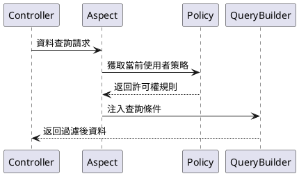

# 核心概念

本功能指在系統中實現資料的分層管理和許可權控制，主要包括部門管理、崗位管理、資料許可權等模組。

相對比 `master` 分支來說新增了部門管理和崗位管理的功能模組、實現了多種資料隔離方式，增強了系統的組織架構和角色定義能力。

## 新增功能

### 部門管理

#### 功能定位

組織架構的基礎單元，實現樹形層級管理。

#### 核心特性

- 支援無限級父子部門結構
- 部門關聯崗位和使用者
- 支援設定部門負責人

#### 資料模型

```php
 class Department {
    int $id;
    string $name; 
    int $parent_id;
    HasMany $positions; // 關聯崗位
    BelongsToMany $department_users; // 部門使用者
    BelongsToMany $leader; // 部門領導
  }
```

---

### 崗位管理

#### 功能定位

部門內的職能角色定義

#### 核心特性

- 必須歸屬於具體部門
- 可設定資料許可權策略
- 支援使用者多崗位分配

#### 資料模型

```php
class Position {
    int $id;
    string $name;
    int $dept_id;
    HasOne $policy; // 資料許可權策略
  }
```

## 資料許可權體系

### 策略型別

| 許可權標識碼 | 型別 | 作用域 | 備註 |
|-------|----|-----|----|
| DEPT_SELF | 部門 | 當前部門 | 僅限當前部門資料 |
| DEPT_TREE | 部門 | 當前部門及子部門 | 包括當前部門和所有子部門資料 |
| ALL | 全域性 | 全部資料 | 包括所有部門和使用者資料 |
| SELF | 個人 | 個人資料 | 僅限當前使用者資料 |
| CUSTOM_DEPT | 自定義 | 自定義部門 | 允許選擇特定部門 |
| CUSTOM_FUNC | 自定義 | 自定義函式 | 允許自定義處理邏輯 |

### 實現機制

資料許可權透過與`崗位` or `使用者` 關聯的`資料許可權策略`實現。每個崗位或使用者可以有一個或多個數據許可權策略，系統根據這些策略來過濾和控制資料訪問。

#### 策略模型

```php
class Policy {
    int $user_id; // 使用者ID
    int $position_id; // 崗位ID 
    PolicyType $policy_type;
    bool $is_default;
    array $value; // 策略值
  }
```

#### 執行流程


