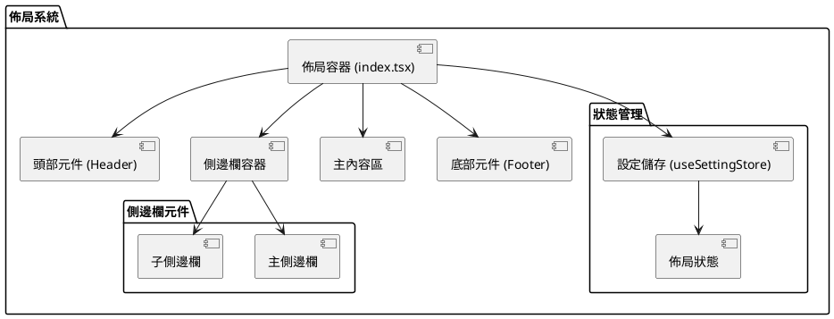

# 佈局系統

MineAdmin 3.0 的佈局系統是一個靈活且強大的前端佈局解決方案，支援多種佈局模式和動態切換。相比 2.0 版本，新的佈局系統採用了統一的架構設計，所有佈局邏輯都集中在 `src/layouts/index.tsx` 檔案中，提供了更好的維護性和擴充套件性。

## 佈局架構概覽



## 佈局模式

MineAdmin 支援三種主要的佈局模式：

### 1. 經典佈局 (Classic Layout)
- **特點**: 傳統的左側邊欄 + 主內容區佈局
- **適用場景**: 標準的後臺管理介面
- **元件結構**: 固定左側選單，右側內容區域

### 2. 混合佈局 (Mixed Layout)
- **特點**: 頂部選單 + 左側子選單的組合佈局
- **適用場景**: 需要多級選單導航的複雜應用
- **元件結構**: 頂部主選單，左側當前分類的子選單

### 3. 分欄佈局 (Columns Layout)
- **特點**: 多欄式選單佈局
- **適用場景**: 選單分類較多的大型應用
- **元件結構**: 左側主選單欄，中間子選單欄，右側內容區

## 佈局相關API

### useSettingStore API 參考

| 方法名 | 返回型別 | 說明 | 使用示例 |
|--------|----------|------|----------|
| `isMixedLayout()` | `boolean` | 判斷當前是否為混合佈局模式 | `store.isMixedLayout()` |
| `isColumnsLayout()` | `boolean` | 判斷當前是否為分欄佈局模式 | `store.isColumnsLayout()` |
| `isClassicLayout()` | `boolean` | 判斷當前是否為經典佈局模式 | `store.isClassicLayout()` |
| `getFixedAsideState()` | `boolean` | 獲取子側邊欄是否為固定狀態 | `store.getFixedAsideState()` |
| `getMenuCollapseState()` | `boolean` | 獲取選單是否為摺疊狀態 | `store.getMenuCollapseState()` |
| `getMobileState()` | `boolean` | 判斷當前是否為移動端狀態 | `store.getMobileState()` |

::: tip API 原始碼位置
- **GitHub**: [useSettingStore.ts](https://github.com/mineadmin/MineAdmin/blob/master/web/src/store/modules/useSettingStore.ts)
- **本地路徑**: `mineadmin/web/src/store/modules/useSettingStore.ts`
:::

### 使用示例

```typescript
// 在Vue元件中使用佈局API
import { useSettingStore } from '@/stores/modules/settingStore'

export default defineComponent({
  setup() {
    const settingStore = useSettingStore()
    
    // 檢查當前佈局模式
    const isClassic = computed(() => settingStore.isClassicLayout())
    const isMixed = computed(() => settingStore.isMixedLayout())
    const isColumns = computed(() => settingStore.isColumnsLayout())
    
    // 獲取選單狀態
    const isMenuCollapsed = computed(() => settingStore.getMenuCollapseState())
    const isAsideFixed = computed(() => settingStore.getFixedAsideState())
    
    // 響應式判斷裝置型別
    const isMobile = computed(() => settingStore.getMobileState())
    
    return {
      isClassic,
      isMixed, 
      isColumns,
      isMenuCollapsed,
      isAsideFixed,
      isMobile
    }
  }
})
```

## 佈局切換功能

### 動態佈局切換

```typescript
// 佈局模式切換示例
import { useSettingStore } from '@/stores/modules/settingStore'

const settingStore = useSettingStore()

// 切換到經典佈局
const switchToClassic = () => {
  settingStore.updateSettings({
    layout: 'classic'
  })
}

// 切換到混合佈局
const switchToMixed = () => {
  settingStore.updateSettings({
    layout: 'mixed'
  })
}

// 切換到分欄佈局
const switchToColumns = () => {
  settingStore.updateSettings({
    layout: 'columns'
  })
}

// 切換選單摺疊狀態
const toggleMenuCollapse = () => {
  settingStore.toggleMenuCollapse()
}
```

## 全域性樣式配置

### CSS 變數定義

::: tip 配置檔案位置
- **GitHub**: [https://github.com/mineadmin/mineadmin/blob/master/web/src/assets/styles/global.scss](https://github.com/mineadmin/mineadmin/blob/master/web/src/assets/styles/global.scss)
- **本地路徑**: `mineadmin/web/src/assets/styles/global.scss`
:::

```scss
/* 佈局尺寸變數 */
:root {
  /* ========== 頭部區域 ========== */
  --mine-g-header-height: 55px;
  --mine-g-toolbar-height: 55px;
  
  /* ========== 底部區域 ========== */
  --mine-g-footer-height: 50px;
  
  /* ========== 側邊欄區域 ========== */
  --mine-g-main-aside-width: 80px;           /* 主側邊欄寬度 */
  --mine-g-sub-aside-width: 200px;           /* 子側邊欄展開寬度 */
  --mine-g-sub-aside-collapse-width: 65px;   /* 子側邊欄摺疊寬度 */
  --mine-g-menu-retract-width: 15px;         /* 選單縮排寬度 */
  
  /* ========== 標籤欄 ========== */
  --mine-g-tabbar-height: 40px;
  
  /* ========== 主題色彩 ========== */
  --mine-g-box-shadow-color: rgb(0 0 0 / 18%);
  --el-color-primary: --ui-primery;
  
  /* ========== 響應式斷點 ========== */
  --mine-g-mobile-breakpoint: 768px;
  --mine-g-tablet-breakpoint: 1024px;
}
```

### 響應式佈局配置

```scss
/* 響應式佈局樣式 */
@media screen and (max-width: 768px) {
  :root {
    --mine-g-main-aside-width: 0px;
    --mine-g-sub-aside-width: 100vw;
    --mine-g-header-height: 50px;
  }
}

@media screen and (min-width: 768px) and (max-width: 1024px) {
  :root {
    --mine-g-main-aside-width: 60px;
    --mine-g-sub-aside-width: 180px;
  }
}
```

## 高階配置

### 自定義佈局樣式

```scss
/* 自定義佈局配置示例 */
.mine-layout {
  /* 自定義頭部樣式 */
  &__header {
    background: var(--el-bg-color);
    border-bottom: 1px solid var(--el-border-color-light);
    height: var(--mine-g-header-height);
  }
  
  /* 自定義側邊欄樣式 */
  &__aside {
    width: var(--mine-g-main-aside-width);
    transition: width 0.3s ease;
    
    &--collapsed {
      width: var(--mine-g-sub-aside-collapse-width);
    }
  }
  
  /* 自定義內容區域樣式 */
  &__main {
    margin-left: var(--mine-g-main-aside-width);
    transition: margin-left 0.3s ease;
    min-height: calc(100vh - var(--mine-g-header-height));
  }
}
```

### 佈局狀態持久化

```typescript
// 佈局狀態持久化配置
import { defineStore } from 'pinia'

export const useLayoutStore = defineStore('layout', {
  state: () => ({
    mode: 'classic' as 'classic' | 'mixed' | 'columns',
    isAsideCollapsed: false,
    isAsideFixed: true,
    isMobile: false
  }),
  
  persist: {
    key: 'mine-admin-layout',
    storage: localStorage,
    paths: ['mode', 'isAsideCollapsed', 'isAsideFixed']
  }
})
```

## 效能最佳化

### 佈局元件懶載入

```typescript
// 佈局元件非同步載入
import { defineAsyncComponent } from 'vue'

export const LayoutComponents = {
  Header: defineAsyncComponent(() => import('@/layouts/components/Header.vue')),
  Aside: defineAsyncComponent(() => import('@/layouts/components/Aside.vue')),
  Main: defineAsyncComponent(() => import('@/layouts/components/Main.vue')),
  Footer: defineAsyncComponent(() => import('@/layouts/components/Footer.vue'))
}
```

### 佈局切換動畫最佳化

```scss
/* 佈局切換動畫最佳化 */
.layout-transition {
  transition: all 0.3s cubic-bezier(0.4, 0, 0.2, 1);
  will-change: transform, width, margin;
}

/* 減少不必要的重繪 */
.layout-aside {
  contain: layout style paint;
  transform: translateZ(0); /* 啟用硬體加速 */
}
```

## 常見問題解決

### 1. 移動端佈局適配問題

```typescript
// 移動端適配解決方案
import { useBreakpoints } from '@vueuse/core'

const breakpoints = useBreakpoints({
  mobile: 0,
  tablet: 768,
  desktop: 1024
})

const isMobile = breakpoints.smaller('tablet')
const isTablet = breakpoints.between('tablet', 'desktop')
const isDesktop = breakpoints.greater('desktop')
```

### 2. 佈局閃爍問題

```scss
/* 防止佈局閃爍 */
.mine-layout {
  opacity: 0;
  transition: opacity 0.2s ease;
  
  &.loaded {
    opacity: 1;
  }
}
```

### 3. 側邊欄滾動問題

```scss
/* 側邊欄滾動最佳化 */
.layout-aside {
  overflow-y: auto;
  scrollbar-width: thin;
  scrollbar-color: var(--el-border-color) transparent;
  
  &::-webkit-scrollbar {
    width: 6px;
  }
  
  &::-webkit-scrollbar-thumb {
    background: var(--el-border-color);
    border-radius: 3px;
  }
}
```

## 相關文件

- [常用 Store](/front/high/store) - 狀態管理相關文件

::: tip 原始碼參考
完整的佈局系統原始碼可以在以下位置找到：
- **GitHub**: [web/src/layouts](https://github.com/mineadmin/mineadmin/tree/master/web/src/layouts)
- **本地路徑**: `mineadmin/web/src/layouts/`
:::