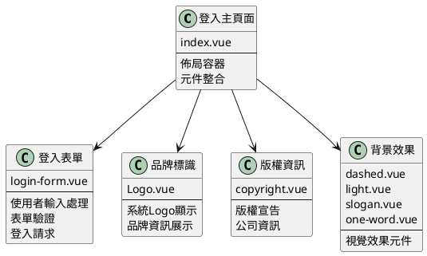
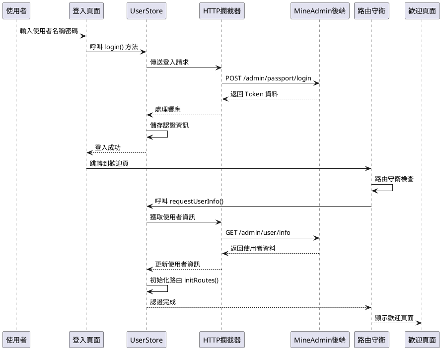
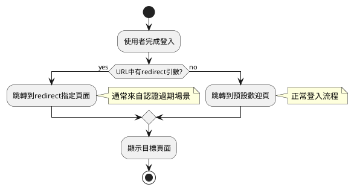

# 登入與歡迎頁

:::tip 概述
本章節詳細介紹 MineAdmin 3.0 的登入頁面架構、登入流程處理、Token 管理機制，以及登入成功後的歡迎頁配置。內容包括元件結構分析、資料流轉過程、路由守衛機制和自定義配置方法。

**重要說明**：本文件中所有程式碼示例均來自 MineAdmin 開源專案的實際程式碼，原始碼位於 [GitHub 倉庫](https://github.com/mineadmin/mineadmin)。
:::

## 登入頁面架構

### 頁面元件結構

登入頁面主檔案位於 `src/modules/base/views/login/index.vue`，採用元件化設計，將登入功能拆分為多個獨立的子元件，提高程式碼可維護性和複用性。

**原始碼位置**：
- **GitHub 地址**：[mineadmin/web/src/modules/base/views/login/index.vue](https://github.com/mineadmin/mineadmin/blob/master/web/src/modules/base/views/login/index.vue)
- **本地路徑**：`src/modules/base/views/login/index.vue`



### 響應式佈局設計

登入頁面採用響應式設計，適配桌面端和移動端：

```vue
<template>
  <div class="h-full min-w-[380px] w-full flex items-center justify-center overflow-hidden border-1 bg-blue-950 lg:justify-between lg:bg-white">
    <!-- 桌面端左側裝飾區域 -->
    <div class="relative hidden h-full w-10/12 md:hidden lg:flex">
      <div class="gradient-rainbow" />
      <Dashed />
      <Light />
      <Slogan />
      <OneWord />
    </div>
    
    <!-- 登入表單區域 -->
    <div class="login-form-container">
      <Logo />
      <LoginForm />
      <CopyRight />
    </div>
    
    <!-- 移動端背景效果 -->
    <div class="min-[380px] relative left-0 top-0 z-4 h-full max-w-[1024px] w-full flex lg:hidden">
      <Dashed />
      <Light />
    </div>
  </div>
</template>
```

### 元件庫說明

::: warning 元件庫注意事項
登入頁面的表單元件並非使用 `Element Plus` 元件庫，而是基於 MineAdmin 自身的基礎元件庫構建。這些元件專為系統設計，具有以下特點：

- **輕量化設計**：只包含必要的登入功能，減少依賴
- **統一樣式風格**：與整個系統的設計語言保持一致
- **定製化程度高**：可根據業務需求靈活調整

**自定義建議**：
- 不建議直接修改原始碼，以免影響後續版本升級
- 推薦透過[外掛系統](/zh-tw/front/high/plugins.md)替換登入元件
- 可透過路由配置覆蓋預設的 `login` 路由元件
:::

## 登入流程與資料處理

### 登入流程概覽

登入流程採用現代化的前後端分離架構，基於 JWT Token 進行身份認證，支援 Token 自動重新整理和許可權驗證。



### 核心資料流轉

::: info 開發提示
如果只需要修改登入頁面 UI 而不涉及登入邏輯，可以跳過本節的詳細流程說明，直接檢視[歡迎頁配置](#預設歡迎頁配置)部分。
:::

#### 1. 使用者登入認證

**檔案位置**：`src/store/modules/useUserStore.ts`

`login()` 方法負責處理使用者認證過程：

```typescript
// 登入方法核心邏輯
async login(loginParams: LoginParams) {
  try {
    // 傳送登入請求
    const response = await http.post('/admin/passport/login', loginParams)
    
    // 儲存認證資訊到本地儲存
    const { access_token, refresh_token, expire_at } = response.data
    
    // 儲存到 Pinia Store
    this.token = access_token
    this.refreshToken = refresh_token
    this.expireAt = expire_at
    
    // 儲存到瀏覽器快取
    cache.set('token', access_token)
    cache.set('refresh_token', refresh_token)
    cache.set('expire', useDayjs().unix() + expire_at, { exp: expire_at })
    
    return Promise.resolve(response)
  } catch (error) {
    return Promise.reject(error)
  }
}
```

#### 2. 路由守衛攔截

登入成功後頁面跳轉會觸發路由守衛，自動執行使用者資訊獲取：

```typescript
// 路由守衛邏輯（簡化版）
router.beforeEach(async (to, from, next) => {
  const userStore = useUserStore()
  
  if (to.path !== '/login' && !userStore.isLogin) {
    // 未登入，跳轉到登入頁
    next('/login')
  } else if (userStore.isLogin && !userStore.userInfo) {
    // 已登入但未獲取使用者資訊
    try {
      await userStore.requestUserInfo()
      next()
    } catch (error) {
      // 獲取使用者資訊失敗，清除登入狀態
      await userStore.logout()
      next('/login')
    }
  } else {
    next()
  }
})
```

#### 3. 使用者資訊獲取

**檔案位置**：`src/store/modules/useUserStore.ts`

`requestUserInfo()` 方法獲取使用者基礎資料和許可權資訊：

```typescript
async requestUserInfo() {
  try {
    // 並行請求使用者資料、選單許可權、角色資訊
    const [userInfo, menuList, roleList] = await Promise.all([
      http.get('/admin/user/info'),          // 使用者基礎資訊
      http.get('/admin/menu/index'),         // 選單許可權資料
      http.get('/admin/role/index')          // 角色許可權資料
    ])
    
    // 更新 Store 狀態
    this.userInfo = userInfo.data
    this.menuList = menuList.data
    this.roleList = roleList.data
    
    // 初始化路由系統
    const routeStore = useRouteStore()
    await routeStore.initRoutes()
    
    return Promise.resolve(userInfo)
  } catch (error) {
    return Promise.reject(error)
  }
}
```

#### 4. 動態路由初始化

**檔案位置**：`src/store/modules/useRouteStore.ts`

`initRoutes()` 方法根據使用者許可權動態生成路由：

```typescript
async initRoutes() {
  const userStore = useUserStore()
  const { menuList } = userStore
  
  // 根據選單資料生成路由配置
  const routes = this.generateRoutes(menuList)
  
  // 動態新增路由
  routes.forEach(route => {
    router.addRoute(route)
  })
  
  // 更新路由狀態
  this.isRoutesInitialized = true
}
```

### Token 管理機制

系統採用雙 Token 機制確保安全性和使用者體驗：

- **Access Token**：短期有效（預設 1 小時），用於 API 請求認證
- **Refresh Token**：長期有效（預設 2 小時），用於重新整理 Access Token

詳細的 Token 重新整理機制請參考 [請求與攔截器](/zh-tw/front/advanced/request.md#token-重新整理機制) 文件。

## 歡迎頁配置與路由管理

### 登入後跳轉邏輯

MineAdmin 支援多種登入後跳轉策略，確保使用者體驗的連續性：



#### 跳轉規則說明

1. **帶重定向引數的登入**
   ```
   /#/login?redirect=/admin/user/index
   ```
   登入成功後會自動跳轉到 `redirect` 引數指定的頁面。這種情況通常發生在：
   - 使用者訪問需要許可權的頁面但未登入時
   - Token 過期後自動跳轉到登入頁時

2. **預設登入跳轉**
   ```
   /#/login
   ```
   沒有 `redirect` 引數時，登入成功後跳轉到系統配置的預設歡迎頁面。

### 歡迎頁配置詳解

#### 預設配置結構

**配置檔案位置**：`src/provider/settings/index.ts`

MineAdmin 實際的預設歡迎頁配置：

```typescript
// MineAdmin 預設歡迎頁配置
welcomePage: {
  name: 'welcome',                    // 路由名稱
  path: '/welcome',                   // 路由路徑
  title: '歡迎頁',                 // 頁面標題
  icon: 'icon-park-outline:jewelry',  // 選單圖示
},
```

注意：MineAdmin 中歡迎頁的元件路徑是透過路由系統自動解析的，位於 `src/modules/base/views/welcome/index.vue`。

#### 配置項詳細說明

| 配置項 | 型別 | 必填 | 預設值 | 說明 |
|--------|------|------|---------|------|
| `name` | `string` | ✅ | `'welcome'` | 路由名稱，必須全域性唯一 |
| `path` | `string` | ✅ | `'/welcome'` | 訪問路徑，支援動態路由 |
| `title` | `string` | ✅ | `'歡迎頁'` | 頁面標題，顯示在瀏覽器標籤和麵包屑中 |
| `icon` | `string` | ❌ | `'icon-park-outline:jewelry'` | 圖示標識，用於選單顯示 |
| `component` | `Function` | ❌ | 動態匯入元件 | 頁面元件，支援非同步載入 |

### 自定義歡迎頁配置

::: tip 最佳實踐
為了保證系統升級時配置不被覆蓋，強烈建議在 `settings.config.ts` 中進行自定義配置，而不是直接修改 `index.ts` 檔案。
:::

#### 配置方式

**步驟 1**：編輯 `src/provider/settings/settings.config.ts`

注意：該檔案已存在於 MineAdmin 專案中，無需建立。

```typescript
import type { SystemSettings } from '#/global'

const globalConfigSettings: SystemSettings.all = {
  // 自定義歡迎頁配置
  welcomePage: {
    name: 'dashboard',                        // 修改為儀表板
    path: '/dashboard',                       // 路徑改為儀表板路徑
    title: '資料概覽',                        // 自定義標題
    icon: 'mdi:view-dashboard-outline',       // 使用儀表板圖示
  },
  
  // 其他系統配置...
  app: {
    // 應用相關配置
  }
}

export default globalConfigSettings
```

**步驟 2**：系統自動合併配置

系統啟動時會自動將 `settings.config.ts` 中的配置與預設配置進行深度合併：

```typescript
// MineAdmin 實際的配置合併邏輯
import { defaultsDeep } from 'lodash-es'
import globalConfigSettings from '@/provider/settings/settings.config.ts'

// 預設配置與使用者配置合併
const systemSetting = defaultsDeep(globalConfigSettings, defaultGlobalConfigSettings)
```

### 高階配置示例

#### 1. 條件化歡迎頁

根據使用者角色或許可權設定不同的歡迎頁：

```typescript
const globalConfigSettings: SystemSettings.all = {
  welcomePage: {
    name: 'adaptive-welcome',
    path: '/adaptive-welcome',
    title: '個性化歡迎頁',
    icon: 'mdi:account-star',
    // 使用自定義元件處理條件邏輯
    component: () => import('@/views/custom/AdaptiveWelcome.vue')
  }
}
```

#### 2. 多語言支援

結合國際化配置設定多語言歡迎頁：

```typescript
const globalConfigSettings: SystemSettings.all = {
  welcomePage: {
    name: 'welcome',
    path: '/welcome',
    // 使用國際化鍵值
    title: 'menu.welcome', 
    icon: 'icon-park-outline:jewelry',
  }
}
```

#### 3. 外部連結跳轉

配置登入後跳轉到外部系統：

```typescript
const globalConfigSettings: SystemSettings.all = {
  welcomePage: {
    name: 'external-system',
    path: 'https://external-dashboard.com',  // 外部連結
    title: '外部系統',
    icon: 'mdi:open-in-new',
    // 設定為外部連結型別
    meta: {
      isExternal: true,
      target: '_blank'
    }
  }
}
```

### 歡迎頁元件開發

#### 基礎元件結構

```vue
<!-- src/views/custom/CustomWelcome.vue -->
<template>
  <div class="welcome-container">
    <div class="welcome-header">
      <h1>{{ $t('welcome.title') }}</h1>
      <p>{{ $t('welcome.subtitle') }}</p>
    </div>
    
    <div class="welcome-content">
      <!-- 使用者資訊卡片 -->
      <UserInfoCard :user="userInfo" />
      
      <!-- 快捷操作 -->
      <QuickActions :actions="quickActions" />
      
      <!-- 資料統計 -->
      <DataStatistics :stats="systemStats" />
    </div>
  </div>
</template>

<script setup lang="ts">
import { ref, onMounted } from 'vue'
import { useUserStore } from '@/store/modules/useUserStore'
import UserInfoCard from '@/components/UserInfoCard.vue'
import QuickActions from '@/components/QuickActions.vue'
import DataStatistics from '@/components/DataStatistics.vue'

const userStore = useUserStore()
const userInfo = ref(userStore.userInfo)
const systemStats = ref({})
const quickActions = ref([
  { name: '使用者管理', icon: 'mdi:account-group', path: '/admin/user' },
  { name: '角色許可權', icon: 'mdi:shield-account', path: '/admin/role' },
  { name: '系統設定', icon: 'mdi:cog', path: '/admin/system' },
])

// MineAdmin 歡迎頁不需要動態載入資料
// 所有資料都是靜態的，直接在元件中定義

// MineAdmin 中歡迎頁使用的是靜態資料，不需要 API 呼叫
// 如果需要動態資料，可以新增相應的 API 呼叫
// 例如：useHttp().get('/admin/user/info') 等實際存在的 API
</script>

<style scoped>
.welcome-container {
  padding: 24px;
  max-width: 1200px;
  margin: 0 auto;
}

.welcome-header {
  text-align: center;
  margin-bottom: 32px;
}

.welcome-content {
  display: grid;
  grid-template-columns: repeat(auto-fit, minmax(300px, 1fr));
  gap: 24px;
}
</style>
```

## 安全考慮與最佳實踐

### 認證安全

1. **Token 安全儲存**
   - Access Token 儲存在記憶體中，避免 XSS 攻擊
   - Refresh Token 使用 HttpOnly Cookie 儲存
   - 敏感資訊不儲存在 localStorage 中

2. **路由許可權驗證**
   ```typescript
   // 路由守衛中的許可權檢查
   router.beforeEach(async (to, from, next) => {
     const userStore = useUserStore()
     
     // 檢查路由是否需要認證
     if (to.meta.requiresAuth && !userStore.isLogin) {
       next(`/login?redirect=${to.fullPath}`)
       return
     }
     
     // 檢查使用者許可權
     if (to.meta.permissions && !userStore.hasPermissions(to.meta.permissions)) {
       next('/403') // 許可權不足頁面
       return
     }
     
     next()
   })
   ```

### 效能最佳化

1. **元件懶載入**
   
   MineAdmin 使用模組化路由載入，元件會自動懶載入：
   ```typescript
   // MineAdmin 中的動態元件載入
   const moduleViews = import.meta.glob('../../modules/**/views/**/**.{vue,jsx,tsx}')
   const pluginViews = import.meta.glob('../../plugins/*/**/views/**/**.{vue,jsx,tsx}')
   
   // 自動解析元件路徑
   if (moduleViews[`../../modules/${item.component}${suffix}`]) {
     component = moduleViews[`../../modules/${item.component}${suffix}`]
   }
   ```

2. **資料預載入**
   
   MineAdmin 在路由守衛中處理使用者資訊載入：
   ```typescript
   // MineAdmin 的資料預載入機制
   router.beforeEach(async (to, from, next) => {
     if (userStore.isLogin) {
       if (userStore.getUserInfo() === null) {
         // 預載入使用者資訊、選單和許可權資料
         await userStore.requestUserInfo()
         next({ path: to.fullPath, query: to.query })
       }
       else {
         next()
       }
     }
   })
   ```

## 常見問題與解決方案

### Q: 登入成功後頁面沒有跳轉？

**MineAdmin 中可能的原因和解決方案**：

1. **路由配置問題**
   ```typescript
   // 檢查歡迎頁路由是否正確註冊
   const routes = [
     {
       name: 'welcome',
       path: '/welcome',
       component: () => import('@/views/Welcome.vue'),
       meta: { requiresAuth: true }
     }
   ]
   ```

2. **許可權驗證失敗**
   ```typescript
   // 確保使用者有訪問歡迎頁的許可權
   if (!userStore.hasPermission('welcome:access')) {
     // 處理許可權不足情況
   }
   ```

### Q: 自定義歡迎頁配置不生效？

**解決方案**：

1. **確認配置檔案路徑**
   ```bash
   src/provider/settings/settings.config.ts  # 正確路徑
   ```

2. **檢查配置語法**
   ```typescript
   // ❌ 錯誤：配置物件結構不正確
   const config = {
     welcomePage: '/dashboard'
   }
   
   // ✅ 正確：完整的配置物件
   const config = {
     welcomePage: {
       name: 'dashboard',
       path: '/dashboard',
       title: '儀表板'
     }
   }
   ```

3. **重啟開發伺服器**
   ```bash
   pnpm run dev
   ```

### Q: 如何實現登入後的個性化跳轉？

**解決方案**：

```typescript
// 在 UserStore 中實現個性化跳轉邏輯
async login(params: LoginParams) {
  const response = await http.post('/admin/passport/login', params)
  
  // 根據使用者角色確定跳轉頁面
  const userRole = response.data.user.role
  const redirectMap = {
    'admin': '/dashboard',
    'user': '/profile',
    'guest': '/welcome'
  }
  
  const targetPath = redirectMap[userRole] || '/welcome'
  
  // 執行跳轉
  await router.push(targetPath)
}
```

## 相關文件連結

- [系統配置詳解](/zh-tw/front/advanced/system-config.md) - 系統全域性配置說明
- [請求與攔截器](/zh-tw/front/advanced/request.md) - HTTP 請求和 Token 管理
- [路由與選單](/zh-tw/front/base/route-menu.md) - 路由系統配置
- [外掛系統](/zh-tw/front/high/plugins.md) - 外掛開發與配置
- [後端認證機制](/zh-tw/backend/security/passport.md) - 後端 JWT 認證實現

