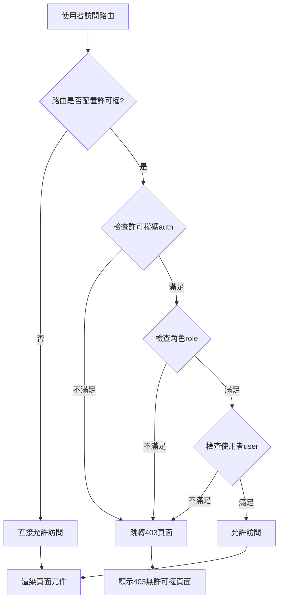
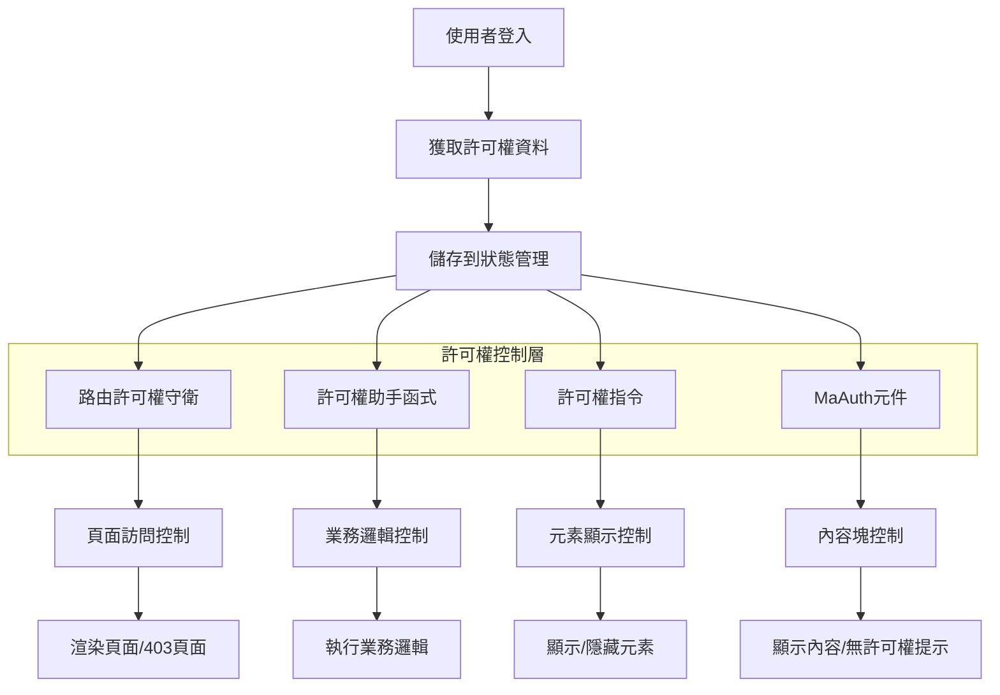

# MineAdmin 許可權控制系統

## 概述

MineAdmin 提供了一套完整的前端許可權控制系統，實現了細粒度的許可權管理。許可權控制分為兩個層面：

:::tip 許可權架構概覽
- **路由級許可權**：基於後端返回的選單資料控制頁面訪問許可權
- **內容級許可權**：透過助手函式、指令和元件控制頁面內容的顯示和隱藏

許可權系統與後端 Hyperf 框架深度整合，確保前後端許可權控制的一致性。
:::

### 許可權型別

MineAdmin 支援三種細粒度的許可權控制：

| 許可權型別 | 判斷依據 | 應用場景 | 實現方式 |
|---------|---------|---------|---------|
| **許可權碼許可權** | 選單的 `name` 欄位 | 功能模組許可權控制 | 函式、指令、元件 |
| **角色許可權** | 角色的 `code` 欄位 | 基於職責的許可權控制 | 函式、指令 |
| **使用者許可權** | 使用者的 `username` 欄位 | 特定使用者許可權控制 | 函式、指令 |

::: info 實現原理
許可權系統基於使用者登入後獲取的許可權資料，透過對比當前使用者擁有的許可權碼、角色碼和使用者標識來判斷是否有許可權訪問特定功能。許可權資料儲存在前端狀態管理中，實現高效的許可權驗證。
:::

## 許可權助手函式

### 函式引入和基本用法

MineAdmin 提供三個核心許可權判斷函式，位於 `web/src/utils/permission/` 目錄下：

```javascript
// 許可權碼檢查函式
import hasAuth from '@/utils/permission/hasAuth'
// 角色檢查函式  
import hasRole from '@/utils/permission/hasRole'
// 使用者檢查函式
import hasUser from '@/utils/permission/hasUser'
```

::: tip 函式位置說明
**原始碼路徑**：
- GitHub: `https://github.com/mineadmin/mineadmin/tree/master/web/src/utils/permission/`
- 本地開發: `/web/src/utils/permission/`

這些函式已在全域性註冊，支援在元件中直接呼叫。
:::

### 業務邏輯中使用

```vue
<script setup>
// 許可權碼驗證 - 支援單個許可權或許可權陣列
if (hasAuth('user:list') || hasAuth(['user:list', 'user:create'])) {
  // 使用者管理許可權驗證透過
  console.log('具有使用者管理許可權')
}

// 角色驗證 - 支援單個角色或角色陣列
if (hasRole('SuperAdmin') || hasRole(['admin', 'manager'])) {
  // 管理員角色驗證透過
  console.log('具有管理員許可權')
}

// 使用者驗證 - 支援單個使用者名稱或使用者名稱陣列
if (hasUser('admin') || hasUser(['admin', 'root'])) {
  // 特定使用者驗證透過
  console.log('特定使用者驗證透過')
}

// 複合許可權判斷示例
const canManageUsers = hasAuth(['user:list', 'user:create']) && hasRole('admin')
if (canManageUsers) {
  // 同時滿足許可權碼和角色要求
}
</script>
```

### 模板中使用

```vue
<script setup>
// 匯入許可權判斷函式
import hasAuth from '@/utils/permission/hasAuth'
import hasRole from '@/utils/permission/hasRole'
import hasUser from '@/utils/permission/hasUser'
</script>

<template>
  <div>
    <!-- 許可權碼驗證 -->
    <div v-if="hasAuth('user:list') || hasAuth(['user:list', 'user:create'])">
      <el-button type="primary">使用者管理</el-button>
    </div>
    
    <!-- 角色驗證 -->
    <div v-if="hasRole('SuperAdmin') || hasRole(['admin', 'manager'])">
      <el-button type="danger">系統設定</el-button>
    </div>

    <!-- 使用者驗證 -->
    <div v-if="hasUser('admin') || hasUser(['root', 'administrator'])">
      <el-button type="warning">高階功能</el-button>
    </div>

    <!-- 複合條件驗證 -->
    <div v-if="hasAuth('role:manage') && hasRole('admin')">
      <el-button>角色管理</el-button>
    </div>
  </div>
</template>
```

### 函式引數說明

所有許可權函式都支援以下兩種引數格式：

```javascript
// 字串格式 - 單一許可權檢查
hasAuth('user:list')
hasRole('admin')  
hasUser('admin')

// 陣列格式 - 多許可權檢查（OR邏輯）
hasAuth(['user:list', 'user:create', 'user:edit'])
hasRole(['admin', 'manager', 'supervisor'])
hasUser(['admin', 'root', 'system'])
```

::: warning 注意事項
- 陣列引數採用 **OR 邏輯**，即只要滿足其中任一條件即返回 `true`
- 如需 **AND 邏輯**，請使用多個函式呼叫組合：`hasAuth('a') && hasAuth('b')`
- 許可權碼建議採用 `模組:操作` 的命名規範，如 `user:list`、`role:create`
:::

### 路由許可權引數

許可權函式支援第二個可選引數 `checkRoute`，用於是否同時檢查路由許可權：

```javascript
// 第二個引數預設為 false，僅檢查功能許可權
hasAuth('user:list', false)  

// 設定為 true 時，同時檢查路由許可權
hasAuth('user:list', true)
```

## 許可權指令

MineAdmin 提供了三個許可權指令，簡化了模板中的許可權控制。指令位於 `web/src/directives/permission/` 目錄下：

::: tip 指令原始碼位置
**GitHub路徑**：
- `https://github.com/mineadmin/mineadmin/tree/master/web/src/directives/permission/auth/`
- `https://github.com/mineadmin/mineadmin/tree/master/web/src/directives/permission/role/`
- `https://github.com/mineadmin/mineadmin/tree/master/web/src/directives/permission/user/`

**本地路徑**：`/web/src/directives/permission/`
:::

### 指令使用方式

```vue
<template>
  <div>
    <!-- 許可權碼指令 - 支援字串和陣列 -->
    <div v-auth="'user:list'">
      單一許可權碼控制
    </div>
    <div v-auth="['user:list', 'user:create']">
      多許可權碼控制（滿足任一即可）
    </div>
    
    <!-- 角色指令 -->
    <div v-role="'admin'">
      單一角色控制
    </div>
    <div v-role="['admin', 'manager']">
      多角色控制（滿足任一即可）
    </div>

    <!-- 使用者指令 -->
    <div v-user="'admin'">
      單一使用者控制
    </div>
    <div v-user="['admin', 'root']">
      多使用者控制（滿足任一即可）
    </div>

    <!-- 實際業務場景示例 -->
    <el-button v-auth="'user:create'" type="primary">
      新增使用者
    </el-button>
    
    <el-button v-role="'SuperAdmin'" type="danger">
      刪除資料
    </el-button>
    
    <div v-auth="['log:operation', 'log:login']" class="log-panel">
      日誌檢視面板
    </div>
  </div>
</template>
```

### 指令 vs 函式對比

| 方式 | 優勢 | 適用場景 | 示例 |
|------|------|----------|------|
| **指令方式** | 簡潔直觀，自動控制元素顯示/隱藏 | 簡單的許可權控制，靜態許可權檢查 | `v-auth="'user:list'"` |
| **函式方式** | 靈活性高，支援複雜邏輯判斷 | 業務邏輯中的許可權判斷，動態許可權檢查 | `v-if="hasAuth('a') && hasRole('b')"` |

::: warning 指令使用注意事項
- 指令採用 **OR 邏輯**，陣列中任一條件滿足即顯示元素
- 指令直接控制 DOM 元素的顯示/隱藏，無許可權時元素不會渲染
- 複雜的許可權邏輯組合建議使用函式方式而非指令
:::

## MaAuth 許可權元件

### 元件介紹

`MaAuth` 元件是 MineAdmin 提供的許可權控制組件，適用於大範圍內容的許可權控制。相比函式和指令，元件方式更適合複雜的許可權展示邏輯。

::: info 元件原始碼位置
**GitHub 路徑**：`https://github.com/mineadmin/mineadmin/tree/master/web/src/components/ma-auth/index.vue`

**本地路徑**：`/web/src/components/ma-auth/index.vue`

該元件已全域性註冊，在任何 Vue 元件中都可直接使用，無需手動匯入。
:::

### 基本使用

```vue
<template>
  <!-- 單一許可權控制 -->
  <ma-auth :value="'user:list'">
    <div class="user-management">
      <h3>使用者管理面板</h3>
      <p>您擁有使用者列表檢視許可權</p>
    </div>
  </ma-auth>

  <!-- 多許可權控制（滿足任一許可權即顯示） -->
  <ma-auth :value="['user:list', 'user:create', 'user:edit']">
    <div class="user-operations">
      <el-button type="primary">新增使用者</el-button>
      <el-button type="success">編輯使用者</el-button>
      <el-button type="danger">刪除使用者</el-button>
    </div>
  </ma-auth>
</template>
```

### 無許可權時的提示

元件提供了 `#notAuth` 插槽，用於自定義無許可權時的顯示內容：

```vue
<template>
  <ma-auth :value="['admin:system', 'admin:config']">
    <!-- 有許可權時顯示的內容 -->
    <div class="admin-panel">
      <h2>系統管理</h2>
      <el-form>
        <el-form-item label="系統配置">
          <el-input placeholder="配置項" />
        </el-form-item>
      </el-form>
    </div>
    
    <!-- 無許可權時顯示的內容 -->
    <template #notAuth>
      <el-alert
        title="許可權不足"
        description="您沒有系統管理許可權，請聯絡管理員申請相關許可權"
        type="warning"
        :closable="false"
        show-icon
      />
    </template>
  </ma-auth>
</template>
```

### 高階用法

#### 巢狀許可權控制

```vue
<template>
  <ma-auth :value="'module:access'">
    <!-- 模組級許可權 -->
    <div class="module-container">
      <h2>業務模組</h2>
      
      <!-- 功能級許可權 -->
      <ma-auth :value="'feature:read'">
        <div class="read-section">
          <p>只讀內容區域</p>
        </div>
        <template #notAuth>
          <p class="text-gray">您沒有讀取許可權</p>
        </template>
      </ma-auth>

      <!-- 操作級許可權 -->
      <ma-auth :value="['feature:create', 'feature:edit']">
        <div class="action-buttons">
          <el-button>建立</el-button>
          <el-button>編輯</el-button>
        </div>
        <template #notAuth>
          <p class="text-muted">您沒有操作許可權</p>
        </template>
      </ma-auth>
    </div>
    
    <template #notAuth>
      <el-empty description="您沒有訪問此模組的許可權" />
    </template>
  </ma-auth>
</template>
```

#### 與其他元件結合

```vue
<template>
  <!-- 表格操作許可權控制 -->
  <el-table :data="tableData">
    <el-table-column label="姓名" prop="name" />
    <el-table-column label="操作">
      <template #default="{ row }">
        <ma-auth :value="'user:edit'">
          <el-button size="small" @click="editUser(row)">編輯</el-button>
          <template #notAuth>
            <el-button size="small" disabled>無許可權</el-button>
          </template>
        </ma-auth>
        
        <ma-auth :value="'user:delete'">
          <el-button size="small" type="danger" @click="deleteUser(row)">
            刪除
          </el-button>
        </ma-auth>
      </template>
    </el-table-column>
  </el-table>
</template>
```

### 元件引數

| 引數 | 型別 | 預設值 | 說明 |
|------|------|--------|------|
| `value` | `string \| string[]` | `[]` | 需要驗證的許可權碼，支援字串或陣列 |

### 元件插槽

| 插槽名 | 說明 | 引數 |
|--------|------|------|
| `default` | 有許可權時顯示的內容 | - |
| `notAuth` | 無許可權時顯示的內容 | - |

### 元件 vs 其他方式對比

| 方式 | 適用場景 | 優勢 | 劣勢 |
|------|----------|------|------|
| **MaAuth 元件** | 大塊內容許可權控制、需要無許可權提示 | 支援插槽自定義、程式碼結構清晰 | 稍顯冗餘 |
| **許可權指令** | 簡單元素許可權控制 | 簡潔直觀 | 不支援無許可權提示 |
| **許可權函式** | 複雜業務邏輯許可權判斷 | 靈活性最高 | 需要手動處理顯示邏輯 |

## 路由許可權控制

### 靜態路由許可權配置

MineAdmin 支援在路由級別進行許可權控制，透過在路由的 `meta` 屬性中配置許可權引數來實現訪問控制。

::: tip 路由許可權機制
**控制範圍**：僅對帶元件頁面的路由生效，不包含按鈕等頁面內元素

**檢查時機**：路由跳轉時自動檢查許可權

**許可權驗證失敗**：顯示 403 頁面

**原始碼位置**：`/web/src/router/` - 路由配置和許可權守衛邏輯
:::

### 路由許可權配置語法

在路由配置檔案中，透過 `meta` 物件配置許可權引數：

```javascript
// 示例路由配置
const routes = [
  {
    path: '/user',
    name: 'User',
    component: () => import('@/views/user/index.vue'),
    meta: {
      // 許可權碼控制 - 需要使用者管理許可權
      auth: ['user:list', 'user:manage'],
      
      // 角色控制 - 需要管理員或超級管理員角色
      role: ['admin', 'SuperAdmin'],
      
      // 使用者控制 - 特定使用者可訪問
      user: ['admin', 'root']
    }
  },
  {
    path: '/system',
    name: 'System',
    component: () => import('@/views/system/index.vue'),
    meta: {
      // 只需要許可權碼
      auth: ['system:config']
    }
  },
  {
    path: '/public',
    name: 'Public',
    component: () => import('@/views/public/index.vue'),
    meta: {
      // 不配置許可權引數或設定為空陣列，表示無許可權限制
      auth: []
    }
  }
]
```

### 許可權引數說明

| 引數 | 型別 | 說明 | 邏輯關係 |
|------|------|------|----------|
| `auth` | `string[]` | 許可權碼陣列，基於選單許可權控制 | OR（滿足任一許可權即可） |
| `role` | `string[]` | 角色碼陣列，基於使用者角色控制 | OR（滿足任一角色即可） |
| `user` | `string[]` | 使用者名稱陣列，基於特定使用者控制 | OR（滿足任一使用者即可） |

::: warning 許可權配置注意事項
- 所有許可權引數型別必須為 `string[]`（字串陣列）
- 同一路由可同時配置多種許可權型別，關係為 **AND 邏輯**
- 不配置許可權引數或設定為空陣列 `[]` 表示無許可權限制
- 許可權驗證失敗會自動跳轉到 403 頁面
:::

### 實際應用場景

#### 使用者管理模組

```javascript
// 使用者管理相關路由
const userRoutes = [
  {
    path: '/user',
    name: 'UserManagement',
    component: () => import('@/views/user/index.vue'),
    meta: {
      title: '使用者管理',
      auth: ['user:list'] // 需要使用者列表許可權
    },
    children: [
      {
        path: 'create',
        name: 'UserCreate',
        component: () => import('@/views/user/create.vue'),
        meta: {
          title: '新增使用者',
          auth: ['user:create'] // 需要使用者建立許可權
        }
      },
      {
        path: 'edit/:id',
        name: 'UserEdit',
        component: () => import('@/views/user/edit.vue'),
        meta: {
          title: '編輯使用者',
          auth: ['user:edit'] // 需要使用者編輯許可權
        }
      }
    ]
  }
]
```

#### 系統管理模組

```javascript
// 系統管理 - 需要多重許可權驗證
const systemRoutes = [
  {
    path: '/system',
    name: 'SystemManagement',
    component: () => import('@/views/system/index.vue'),
    meta: {
      title: '系統管理',
      auth: ['system:config'], // 需要系統配置許可權
      role: ['SuperAdmin']     // 且需要超級管理員角色
    }
  },
  {
    path: '/logs',
    name: 'SystemLogs',
    component: () => import('@/views/logs/index.vue'),
    meta: {
      title: '系統日誌',
      auth: ['log:operation', 'log:login'], // 需要操作日誌或登入日誌許可權
      role: ['admin', 'auditor']            // 且需要管理員或審計員角色
    }
  }
]
```

#### 特殊許可權控制

```javascript
// 開發除錯頁面 - 僅特定使用者可訪問
const devRoutes = [
  {
    path: '/dev-tools',
    name: 'DevTools',
    component: () => import('@/views/dev/index.vue'),
    meta: {
      title: '開發工具',
      user: ['admin', 'developer'], // 僅管理員和開發者使用者可訪問
      auth: ['dev:tools']          // 且需要開發工具許可權
    }
  }
]
```

### 許可權驗證流程



### 許可權守衛實現

MineAdmin 的路由許可權守衛邏輯位於路由配置中，核心實現邏輯：

```javascript
// 路由守衛示例（簡化版本）
router.beforeEach((to, from, next) => {
  const { auth, role, user } = to.meta || {}
  
  // 無許可權限制，直接透過
  if (!auth?.length && !role?.length && !user?.length) {
    return next()
  }
  
  // 檢查許可權碼
  if (auth?.length && !hasAuth(auth)) {
    return next({ name: '403' })
  }
  
  // 檢查角色
  if (role?.length && !hasRole(role)) {
    return next({ name: '403' })
  }
  
  // 檢查使用者
  if (user?.length && !hasUser(user)) {
    return next({ name: '403' })
  }
  
  next()
})
```

## 最佳實踐

### 許可權粒度建議

1. **頁面級許可權**：使用路由 meta 配置
2. **功能級許可權**：使用 MaAuth 元件
3. **元素級許可權**：使用許可權指令
4. **邏輯級許可權**：使用許可權函式

### 許可權命名規範

```javascript
// 推薦的許可權碼命名規範 - 模組:操作 格式
const permissionCodes = [
  'user:list',      // 使用者列表
  'user:create',    // 使用者建立
  'user:edit',      // 使用者編輯  
  'user:delete',    // 使用者刪除
  'role:manage',    // 角色管理
  'system:config',  // 系統配置
  'log:operation',  // 操作日誌
  'log:login'       // 登入日誌
]

// 角色命名建議
const roleCodes = [
  'SuperAdmin',     // 超級管理員
  'admin',          // 管理員
  'manager',        // 經理
  'operator',       // 操作員
  'viewer'          // 觀察者
]
```

### 效能最佳化建議

1. **避免深層巢狀**：過多的許可權元件巢狀會影響效能
2. **合理快取**：許可權資料應適當快取，避免頻繁請求
3. **按需載入**：結合路由懶載入，僅載入有許可權的頁面元件
4. **許可權預檢**：在資料請求前進行許可權預檢，避免無效請求

### 常見問題和解決方案

#### 1. 許可權驗證失效

**問題**：許可權函式返回 `false`，但實際應該有許可權

**解決方案**：
- 檢查使用者登入狀態和許可權資料是否正確載入
- 確認許可權碼、角色碼、使用者名稱拼寫正確
- 檢視瀏覽器控制檯是否有相關錯誤資訊

#### 2. 403 頁面頻繁出現

**問題**：使用者訪問頁面時經常看到 403 錯誤頁面

**解決方案**：
- 檢查路由 meta 配置是否過於嚴格
- 確認使用者角色和許可權分配是否合理
- 考慮新增預設許可權或降低許可權要求

#### 3. 許可權元件不生效

**問題**：MaAuth 元件沒有正確控制內容顯示

**解決方案**：
```vue
<!-- 確保正確的屬性名 -->
<ma-auth :value="['user:list']"> <!-- 正確：使用 :value -->
  內容
</ma-auth>

<!-- 錯誤示例 -->
<ma-auth :auth="['user:list']">   <!-- 錯誤：屬性名不對 -->
  內容
</ma-auth>
```

## 許可權系統架構圖



### 核心特性

- **多層次許可權控制**：從路由到元素的全方位許可權管控
- **三種許可權型別**：許可權碼、角色、使用者三種粒度的許可權驗證
- **多種實現方式**：函式、指令、元件三種使用方式滿足不同場景
- **易於整合**：與 Vue 3 和 Element Plus 深度整合，使用簡便

### 原始碼位置總結

| 功能 | GitHub 路徑 | 本地路徑 |
|------|-------------|----------|
| 許可權函式 | `https://github.com/mineadmin/mineadmin/tree/master/web/src/utils/permission/` | `/web/src/utils/permission/` |
| 許可權指令 | `https://github.com/mineadmin/mineadmin/tree/master/web/src/directives/permission/` | `/web/src/directives/permission/` |
| 許可權元件 | `https://github.com/mineadmin/mineadmin/tree/master/web/src/components/ma-auth/` | `/web/src/components/ma-auth/` |
| 路由配置 | `https://github.com/mineadmin/mineadmin/tree/master/web/src/router/` | `/web/src/router/` |

### 選擇建議

根據不同的應用場景選擇合適的許可權控制方式：

- **頁面級控制** → 路由 meta 配置
- **大塊內容控制** → MaAuth 元件  
- **簡單元素控制** → 許可權指令
- **複雜業務邏輯** → 許可權函式

透過合理使用這些許可權控制工具，可以構建出安全、易維護的前端許可權管理系統。

