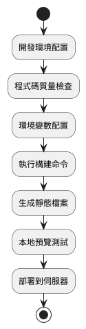

# 構建與預覽

本文件詳細介紹 MineAdmin 前端專案的構建、預覽和部署流程，包含效能最佳化、環境配置和常見問題解決方案。

## 構建流程概覽



## 構建（打包）

### 基礎構建

專案開發完成後，需要進行生產環境構建以部署到伺服器。

```bash
# 執行構建命令
pnpm run build
```

構建成功後，會在專案根目錄的 `./web` 下生成 `dist` 資料夾，包含所有打包好的靜態檔案。

### 構建前檢查

為確保構建質量，建議在構建前執行程式碼質量檢查：

```bash
# 完整的程式碼質量檢查
pnpm run lint

# 或分別執行
pnpm run lint:tsc      # TypeScript 型別檢查
pnpm run lint:eslint   # ESLint 程式碼規範檢查
pnpm run lint:stylelint # 樣式程式碼檢查
```

### 環境變數配置

#### 基礎路徑配置

::: warning 重要配置
如果訪問地址不是域名的根節點，必須正確配置 `VITE_APP_ROOT_BASE`
:::

```bash
# 域名根節點部署：https://www.example.com/
VITE_APP_ROOT_BASE = /

# 子路徑部署：https://www.example.com/app/
VITE_APP_ROOT_BASE = /app/

# 多級子路徑：https://www.example.com/admin/system/
VITE_APP_ROOT_BASE = /admin/system/
```

#### 生產環境變數

在 `.env.production` 檔案中配置生產環境變數：

```bash
# API 服務地址
VITE_APP_API_BASEURL = http://hyperf:9501

# 代理字首
VITE_PROXY_PREFIX = /prod

# 是否生成 Source Map（建議生產環境關閉）
VITE_BUILD_SOURCEMAP = false

# 壓縮配置
VITE_BUILD_COMPRESS = gzip,brotli

# 打包歸檔（可選）
VITE_BUILD_ARCHIVE = 
```

## 本地預覽

### 預覽構建結果

構建完成後，透過本地伺服器預覽確保專案正常執行：

```bash
# 啟動預覽伺服器
pnpm run serve
```

預覽伺服器會啟動一個 HTTP 服務，自動開啟瀏覽器訪問構建後的專案。

### 預覽配置說明

預覽服務使用 `http-server` 工具，預設配置：
- 服務目錄：`./dist`
- 自動開啟瀏覽器：`-o` 引數
- 訪問地址：通常為 `http://localhost:8080`

### E2E 測試

在預覽階段可以執行端到端測試：

```bash
# 執行 E2E 測試
pnpm run test:e2e
```

## 構建最佳化

### 壓縮配置

MineAdmin 支援多種壓縮演算法以減小檔案體積：

```bash
# 僅啟用 Gzip 壓縮
VITE_BUILD_COMPRESS = gzip

# 僅啟用 Brotli 壓縮（壓縮率更高）
VITE_BUILD_COMPRESS = brotli

# 同時啟用兩種壓縮（推薦）
VITE_BUILD_COMPRESS = gzip,brotli
```

::: info 壓縮演算法對比
- **Gzip**: 相容性好，壓縮比約 70-80%
- **Brotli**: 壓縮比約 75-85%，但需要較新的瀏覽器支援
- **建議**: 同時啟用兩種演算法，伺服器根據客戶端支援情況自動選擇
:::

### 效能最佳化建議

#### 1. Source Map 控制

```bash
# 生產環境建議關閉（提升構建速度，減小檔案體積）
VITE_BUILD_SOURCEMAP = false

# 開發階段可以開啟（便於除錯）
VITE_BUILD_SOURCEMAP = true
```

#### 2. 程式碼分割

Vite 預設會進行程式碼分割，無需額外配置。構建後會生成：
- `index.[hash].js` - 主入口檔案
- `vendor.[hash].js` - 第三方依賴
- `[name].[hash].js` - 非同步模組

#### 3. 資源最佳化

構建過程會自動進行：
- CSS 壓縮和合並
- 圖片資源最佳化
- 字型檔案處理
- 靜態資源 Hash 命名

## 部署配置

### Nginx 配置示例

針對不同的壓縮配置，Nginx 需要相應的模組支援：

```nginx
server {
    listen 80;
    server_name your-domain.com;
    root /path/to/dist;
    index index.html;

    # 啟用 Gzip 壓縮
    gzip on;
    gzip_vary on;
    gzip_min_length 1024;
    gzip_types text/plain text/css application/json application/javascript text/xml application/xml application/xml+rss text/javascript;

    # 啟用 Brotli 壓縮（需要 nginx-module-brotli）
    brotli on;
    brotli_comp_level 6;
    brotli_types text/plain text/css application/json application/javascript text/xml application/xml application/xml+rss text/javascript;

    # SPA 路由支援
    location / {
        try_files $uri $uri/ /index.html;
    }

    # 靜態資源快取
    location ~* \.(js|css|png|jpg|jpeg|gif|ico|svg)$ {
        expires 1y;
        add_header Cache-Control "public, immutable";
    }
}
```

### CDN 部署

如果使用 CDN 部署，需要配置：

```bash
# CDN 域名
VITE_APP_CDN_URL = https://cdn.example.com

# 啟用 CDN 資源路徑
VITE_APP_USE_CDN = true
```

## 常見問題與解決方案

### 構建失敗

#### 1. TypeScript 型別錯誤

```bash
# 錯誤資訊示例
error TS2307: Cannot find module 'xxx'

# 解決方案
pnpm run lint:tsc  # 先檢查型別錯誤
# 修復型別問題後重新構建
```

#### 2. 記憶體不足

```bash
# 增加 Node.js 記憶體限制
NODE_OPTIONS="--max-old-space-size=4096" pnpm run build
```

#### 3. 依賴問題

```bash
# 清理依賴並重新安裝
rm -rf node_modules
rm pnpm-lock.yaml
pnpm install
```

### 預覽問題

#### 1. 介面請求失敗

檢查 `.env.production` 中的 API 地址配置：

```bash
# 確保 API 地址可訪問
VITE_APP_API_BASEURL = http://your-api-server:port
```

#### 2. 路由訪問 404

確保伺服器配置了 SPA 路由支援，或檢查路由模式配置：

```bash
# Hash 模式（相容性更好）
VITE_APP_ROUTE_MODE = hash

# History 模式（需要伺服器支援）
VITE_APP_ROUTE_MODE = history
```

#### 3. 靜態資源載入失敗

檢查基礎路徑配置：

```bash
# 確保與部署路徑一致
VITE_APP_ROOT_BASE = /your-app-path/
```

### 效能問題

#### 1. 構建時間過長

```bash
# 使用並行構建
VITE_BUILD_PARALLEL = true

# 跳過某些檢查（僅在必要時使用）
VITE_SKIP_TYPE_CHECK = true
```

#### 2. 打包體積過大

分析打包體積：

```bash
# 安裝分析工具
pnpm add -D vite-bundle-analyzer

# 分析構建結果
pnpm run build --analyze
```

## 自動化部署

### CI/CD 配置示例

```yaml
# .github/workflows/deploy.yml
name: Deploy

on:
  push:
    branches: [main]

jobs:
  build-and-deploy:
    runs-on: ubuntu-latest
    
    steps:
    - uses: actions/checkout@v3
    
    - name: Setup Node.js
      uses: actions/setup-node@v3
      with:
        node-version: '18'
        
    - name: Install pnpm
      uses: pnpm/action-setup@v2
      with:
        version: 8
        
    - name: Install dependencies
      run: pnpm install
      
    - name: Lint code
      run: pnpm run lint
      
    - name: Build project
      run: pnpm run build
      
    - name: Deploy to server
      run: |
        # 部署指令碼
        rsync -avz ./dist/ user@server:/path/to/deployment/
```