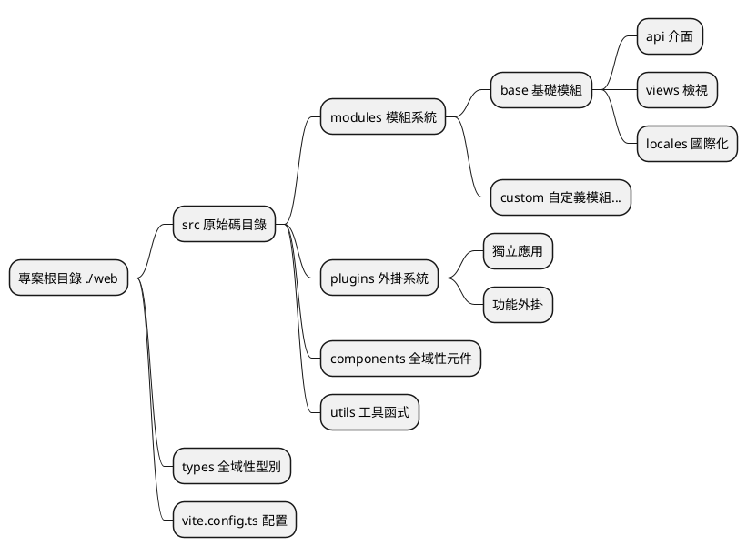
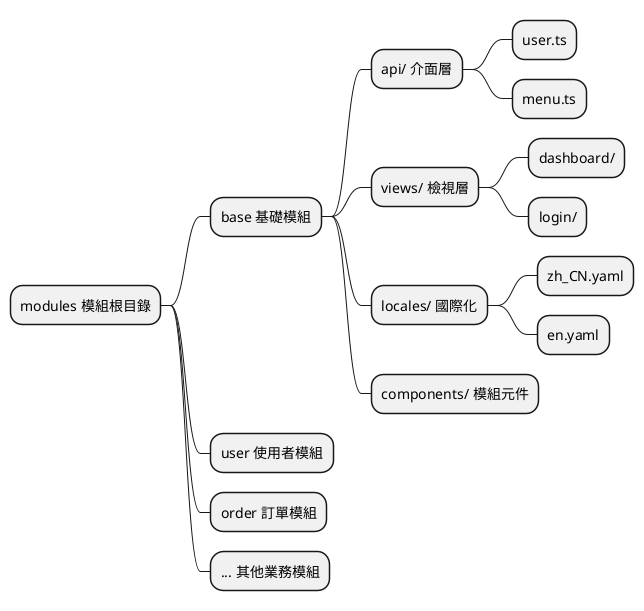
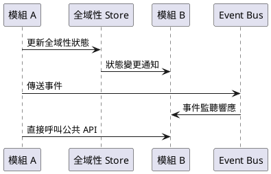
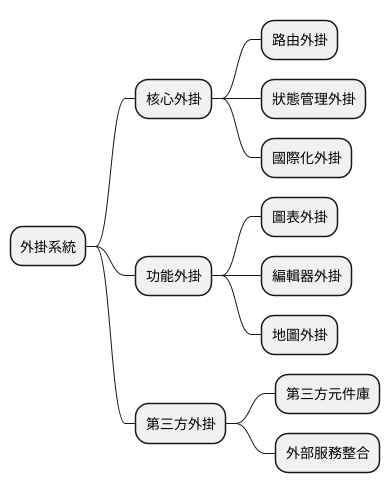
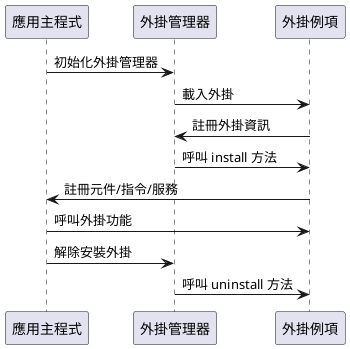
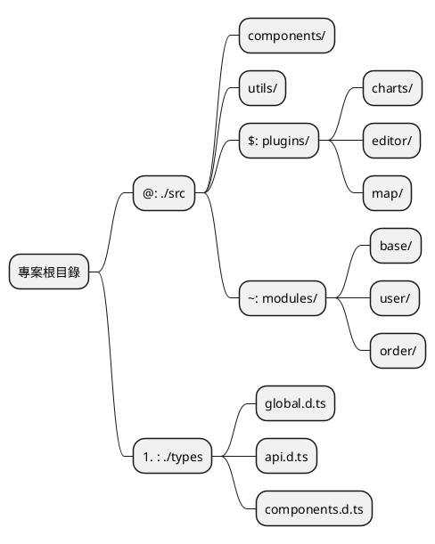
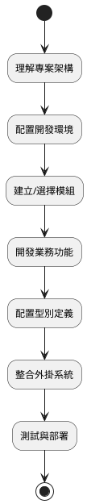

# 基礎概念

整個專案進行了重構，現在我們將會介紹一些基礎概念，以便於你更好的理解整個文件，請務必仔細先閱讀這一部分。

::: tip
以下所講全部針對原始碼根目錄下的 `./web` 裡的結構
:::

## 專案整體架構

本專案採用現代化的前端開發架構，基於 Vue 3 + TypeScript + Vite 構建，實現了模組化、外掛化的開發模式。



## 全域性型別系統

由於新版採用 `TypeScript` 所寫，全域性的型別定義都在 `./types` 目錄下存放著，可在裡面找到相關的資料型別結構。

### 型別檔案組織結構

```
./types/
├── api.d.ts          # API 相關型別定義
├── components.d.ts   # 元件型別定義
├── global.d.ts       # 全域性型別定義
├── modules.d.ts      # 模組型別定義
└── utils.d.ts        # 工具函式型別定義
```

### 使用示例

在專案中可以透過別名 `#` 快速引入型別：

```typescript
// 引入 API 型別
import type { ApiResponse, UserInfo } from '#/api'

// 引入全域性型別
import type { MenuConfig, RouteConfig } from '#/global'

// 在元件中使用
interface ComponentProps {
  userInfo: UserInfo
  menuConfig: MenuConfig[]
}
```

### 型別定義最佳實踐

- **命名規範**：使用 PascalCase 命名介面和型別
- **檔案組織**：按功能模組劃分型別檔案
- **型別匯出**：使用 `export type` 匯出型別定義
- **泛型支援**：合理使用泛型提高型別複用性

## 模組化架構

新版本進行模組化劃分，目錄為 `./src/modules`。每個模組管理著所屬業務的 `api`、`types`、`locales` 以及 `檢視檔案`，實現業務的完全隔離和獨立管理。

### 模組結構設計



### 標準模組目錄結構

```
./src/modules/[模組名]/
├── api/                 # API 介面定義
│   ├── user.ts         # 使用者相關介面
│   ├── menu.ts         # 選單相關介面
│   └── index.ts        # 介面統一匯出
├── components/          # 模組專用元件
│   ├── UserForm.vue    # 使用者表單元件
│   └── MenuTree.vue    # 選單樹元件
├── locales/            # 模組國際化檔案
│   ├── zh_CN.yaml      # 中文語言包
│   ├── en.yaml         # 英文語言包
│   └── index.ts        # 語言包匯出
├── views/              # 檢視頁面
│   ├── user/           # 使用者管理頁面
│   │   ├── index.vue   # 使用者列表頁
│   │   └── detail.vue  # 使用者詳情頁
│   └── dashboard/      # 儀表板頁面
│       └── index.vue
└── index.ts           # 模組統一匯出
```

### 模組開發流程

1. **建立模組目錄**：在 `./src/modules/` 下建立新的模組資料夾
2. **定義模組結構**：按照標準結構建立相應目錄和檔案
3. **配置路由**：在模組中定義路由配置
4. **開發業務邏輯**：編寫 API、元件和檢視
5. **新增國際化**：配置多語言支援
6. **模組匯出**：透過 index.ts 統一匯出模組內容

### 模組間通訊



### 模組使用示例

```typescript
// 在其他模組中使用 base 模組的 API
import { userApi, menuApi } from '~/base/api'
import type { UserInfo } from '~/base/types'

// 在元件中使用模組功能
export default defineComponent({
  async setup() {
    // 呼叫使用者 API
    const userList = await userApi.getUsers()
    
    // 呼叫選單 API
    const menuTree = await menuApi.getMenuTree()
    
    return {
      userList,
      menuTree
    }
  }
})
```

## 外掛系統

新版前端中新增了一個 `./src/plugins` 目錄，專門存放獨立應用或者外掛等。外掛系統支援功能的熱插拔，提高了系統的可擴充套件性和靈活性。

### 外掛架構設計



### 外掛目錄結構

```
./src/plugins/
├── charts/              # 圖表外掛
│   ├── components/      # 外掛元件
│   ├── utils/          # 工具函式
│   ├── types/          # 型別定義
│   └── index.ts        # 外掛入口
├── editor/             # 編輯器外掛
│   ├── components/
│   ├── config/
│   └── index.ts
├── map/                # 地圖外掛
└── shared/             # 外掛間共享資源
    ├── utils/          # 共享工具
    ├── components/     # 共享元件
    └── types/          # 共享型別
```

### 外掛生命週期



### 外掛開發規範

#### 1. 外掛基本結構

```typescript
// ./src/plugins/example/index.ts
import type { App } from 'vue'
import type { PluginOptions } from './types'

export interface ExamplePlugin {
  install(app: App, options?: PluginOptions): void
  uninstall?(app: App): void
}

export const examplePlugin: ExamplePlugin = {
  install(app: App, options?: PluginOptions) {
    // 註冊全域性元件
    app.component('ExampleComponent', ExampleComponent)
    
    // 註冊全域性指令
    app.directive('example', exampleDirective)
    
    // 提供全域性方法
    app.config.globalProperties.$example = exampleMethod
    
    // 註冊外掛配置
    app.provide('exampleConfig', options)
  },
  
  uninstall(app: App) {
    // 清理資源
    delete app.config.globalProperties.$example
  }
}

export default examplePlugin
```

#### 2. 外掛配置檔案

```typescript
// ./src/plugins/example/config.ts
export interface PluginConfig {
  name: string
  version: string
  description: string
  dependencies?: string[]
  permissions?: string[]
}

export const pluginConfig: PluginConfig = {
  name: 'example-plugin',
  version: '1.0.0',
  description: '示例外掛',
  dependencies: ['vue', 'vue-router'],
  permissions: ['read:user', 'write:user']
}
```

### 外掛使用示例

#### 1. 註冊外掛

```typescript
// main.ts
import { createApp } from 'vue'
import App from './App.vue'
import examplePlugin from '$/example'

const app = createApp(App)

// 註冊外掛
app.use(examplePlugin, {
  // 外掛配置選項
  theme: 'dark',
  locale: 'zh-CN'
})

app.mount('#app')
```

#### 2. 在元件中使用外掛

```vue
<template>
  <div>
    <!-- 使用外掛註冊的全域性元件 -->
    <ExampleComponent :data="exampleData" />
    
    <!-- 使用外掛指令 -->
    <div v-example="directiveOptions">
      外掛指令示例
    </div>
  </div>
</template>

<script setup lang="ts">
import { getCurrentInstance } from 'vue'

const instance = getCurrentInstance()

// 使用外掛提供的全域性方法
const result = instance?.proxy?.$example('param')

// 或者透過 inject 獲取外掛配置
const exampleConfig = inject('exampleConfig')
</script>
```

### 外掛管理最佳實踐

- **命名規範**：使用 kebab-case 命名外掛目錄
- **版本管理**：在外掛配置中明確版本資訊
- **依賴宣告**：清晰宣告外掛依賴關係
- **資源清理**：實現 uninstall 方法進行資源清理
- **型別支援**：為外掛提供完整的 TypeScript 型別定義
- **文件完善**：為每個外掛提供使用文件和示例

## 別名系統

在 `vite.config.ts` 檔案中定義了路徑別名系統，簡化檔案引入路徑，提高開發效率和程式碼可維護性。

### 別名配置

```typescript
// vite.config.ts
export default defineConfig({
  resolve: {
    alias: {
      '@': path.resolve(__dirname, 'src'),
      '#': path.resolve(__dirname, 'types'),
      '$': path.resolve(__dirname, 'src/plugins'),
      '~': path.resolve(__dirname, 'src/modules'),
    },
  },
})
```

### 別名對映表

| 別名 | 目錄路徑 | 用途描述 | 使用場景 |
|------|----------|----------|----------|
| `@` | `./src` | 原始碼根目錄 | 引入元件、工具函式、樣式等 |
| `#` | `./types` | 全域性型別定義 | 引入 TypeScript 型別定義 |
| `$` | `./src/plugins` | 外掛目錄 | 引入外掛內的檔案和元件 |
| `~` | `./src/modules` | 模組目錄 | 引入模組內的 API、元件、檢視 |

### 別名使用示例

#### 1. 基礎路徑別名 (@)

```typescript
// ❌ 使用相對路徑（不推薦）
import Utils from '../../../utils/common'
import Button from '../../../components/Button.vue'

// ✅ 使用別名（推薦）
import Utils from '@/utils/common'
import Button from '@/components/Button.vue'
```

#### 2. 型別定義別名 (#)

```typescript
// 引入全域性型別
import type { 
  ApiResponse, 
  UserInfo, 
  MenuConfig 
} from '#/global'

// 引入 API 型別
import type { LoginParams } from '#/api'

// 在介面中使用
interface ComponentProps {
  userInfo: UserInfo
  menuList: MenuConfig[]
}
```

#### 3. 外掛別名 ($)

```typescript
// 引入圖表外掛
import ChartPlugin from '$/charts'
import { useChart } from '$/charts/hooks'

// 引入編輯器外掛
import EditorPlugin from '$/editor'
import EditorComponent from '$/editor/components/RichEditor.vue'
```

#### 4. 模組別名 (~)

```typescript
// 引入 base 模組的 API
import { userApi, menuApi } from '~/base/api'

// 引入使用者模組的元件
import UserForm from '~/user/components/UserForm.vue'
import UserList from '~/user/views/UserList.vue'

// 引入模組的型別
import type { UserModuleState } from '~/user/types'
```

### 別名系統架構圖



### 別名配置最佳實踐

#### 1. IDE 支援配置

為了獲得更好的 IDE 智慧提示和路徑跳轉支援，需要配置 `tsconfig.json`：

```json
{
  "compilerOptions": {
    "baseUrl": ".",
    "paths": {
      "@/*": ["src/*"],
      "#/*": ["types/*"],
      "$/*": ["src/plugins/*"],
      "~/*": ["src/modules/*"]
    }
  }
}
```

#### 2. 使用規範

- **一致性**：團隊內部統一使用別名，避免混用相對路徑
- **可讀性**：別名應該語義明確，易於理解
- **層級控制**：避免過深的路徑層級，合理使用別名簡化路徑
- **型別安全**：配合 TypeScript 確保路徑引用的型別安全

#### 3. 常見使用模式

```typescript
// 元件內綜合使用示例
<script setup lang="ts">
// 全域性型別
import type { UserInfo, ApiResponse } from '#/global'

// 全域性工具
import { formatDate, validateForm } from '@/utils/common'

// 模組 API
import { userApi } from '~/base/api'

// 外掛功能
import { useChart } from '$/charts/hooks'

// 全域性元件
import MaButton from '@/components/MaButton.vue'

// 模組元件
import UserForm from '~/user/components/UserForm.vue'
</script>
```

### 別名系統優勢

1. **簡化路徑**：避免複雜的相對路徑引用
2. **提高可維護性**：檔案移動時無需修改大量引用路徑
3. **增強可讀性**：透過別名快速識別檔案所屬模組
4. **統一規範**：團隊開發中保持一致的引用風格
5. **IDE 友好**：配合 TypeScript 和 IDE 提供更好的開發體驗

## 總結

透過以上基礎概念的介紹，我們瞭解了專案的核心架構設計：

### 架構特點

- **模組化設計**：業務功能按模組劃分，實現高內聚低耦合
- **外掛化架構**：支援功能的熱插拔和擴充套件
- **型別安全**：基於 TypeScript 提供完整的型別支援
- **路徑最佳化**：透過別名系統簡化檔案引用

### 開發流程



### 下一步

在掌握了這些基礎概念後，建議按以下順序深入學習：

1. **[開始使用](/zh-tw/front/base/start)** - 環境搭建和專案啟動
2. **[配置說明](/zh-tw/front/base/configure)** - 詳細配置選項
3. **[路由選單](/zh-tw/front/base/route-menu)** - 路由和選單配置
4. **[模組開發](/zh-tw/front/advanced/module)** - 深入模組化開發
5. **[外掛開發](/zh-tw/front/high/plugins)** - 外掛系統詳解

透過系統性的學習和實踐，你將能夠高效地在此架構基礎上進行前端開發工作。