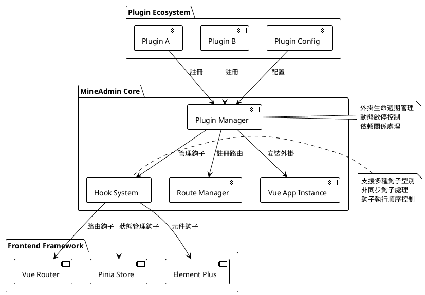
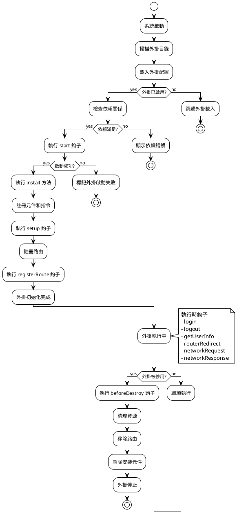

# 外掛系統

::: tip 外掛系統說明
`3.0` 前端從核心層面支援了外掛系統，相比 `2.0` 在設計之初沒有考慮外掛功能，
在改變系統介面或者行為、功能的時候都需要去修改原始碼，而後導致後續無法升級，跟官方程式碼差別越來越大，
後面增加了應用商店功能，雖然可以強行支援外掛，外掛也必須修改原始碼，而且在需要初始化的地方，外掛無法去擴充套件實現，只能去修改 `main.js`。

**現在以上問題全部都不存在了，前端外掛系統提供了強有力的支援，從替換介面、增加功能、引入第三方元件或者自研元件都可以無縫融入到系統裡去，
而且還提供了多種 `hooks(鉤子）` ，甚至可以去影響和改變前端的執行**
:::

## 外掛系統架構概覽

外掛系統基於現代前端架構設計，提供了完整的生命週期管理和擴充套件能力：



### 核心特性

- **零侵入設計**: 外掛開發無需修改核心程式碼
- **動態載入**: 支援外掛的動態啟用和停用
- **生命週期管理**: 完整的外掛生命週期鉤子
- **型別安全**: 完整的 TypeScript 型別定義
- **效能最佳化**: 懶載入和按需載入支援
- **錯誤隔離**: 外掛錯誤不影響主應用執行

## 外掛資料型別介紹

::: info 型別定義檔案
型別定義在 `types/global.d.ts` 內
:::

:::details 點選檢視完整型別定義
```ts
declare namespace Plugin {
  /**
   * 外掛基礎資訊
   */
  interface Info {
    /** 外掛名稱，格式：作者名稱空間/外掛名 */
    name: string
    /** 外掛版本，遵循語義化版本 */
    version: string
    /** 外掛作者 */
    author: string
    /** 外掛描述 */
    description: string
    /** 外掛啟動順序，數值越大越先啟動，預設為 0 */
    order?: number
    /** 外掛依賴列表 */
    dependencies?: string[]
    /** 外掛關鍵詞，用於搜尋 */
    keywords?: string[]
    /** 外掛主頁地址 */
    homepage?: string
    /** 外掛許可證 */
    license?: string
    /** 最低系統版本要求 */
    minSystemVersion?: string
  }

  /**
   * 外掛配置
   */
  interface Config {
    /** 外掛基礎資訊 */
    info: Info
    /** 是否啟用外掛 */
    enable: boolean
    /** 外掛開發模式，用於除錯 */
    devMode?: boolean
    /** 外掛自定義配置項 */
    settings?: Record<string, any>
  }

  /**
   * 外掛檢視路由定義
   */
  interface Views extends Route.RouteRecordRaw {
    /** 路由元資訊擴充套件 */
    meta?: {
      /** 頁面標題 */
      title?: string
      /** 國際化鍵值 */
      i18n?: string
      /** 頁面圖示 */
      icon?: string
      /** 是否需要許可權驗證 */
      requireAuth?: boolean
      /** 所需許可權列表 */
      permissions?: string[]
      /** 是否快取頁面 */
      keepAlive?: boolean
      /** 頁面是否隱藏 */
      hidden?: boolean
      /** 選單排序 */
      order?: number
    }
  }

  /**
   * 鉤子函式型別定義
   */
  interface HookHandlers {
    /** 外掛啟動鉤子，可用於初始化驗證 */
    start?: (config: Config) => Promise<boolean | void> | boolean | void
    /** 系統初始化完成鉤子，可訪問 Vue 上下文 */
    setup?: () => Promise<void> | void
    /** 路由註冊鉤子，可修改路由配置 */
    registerRoute?: (router: Router, routesRaw: Route.RouteRecordRaw[] | Views[] | MineRoute.routeRecord[]) => Promise<void> | void
    /** 使用者登入鉤子 */
    login?: (formInfo: LoginFormData) => Promise<void> | void
    /** 使用者退出登入鉤子 */
    logout?: () => Promise<void> | void
    /** 獲取使用者資訊鉤子 */
    getUserInfo?: (userInfo: UserInfo) => Promise<void> | void
    /** 路由跳轉鉤子（外鏈無效） */
    routerRedirect?: (context: { from: RouteLocationNormalized, to: RouteLocationNormalized }, router: Router) => Promise<void> | void
    /** 網路請求攔截鉤子 */
    networkRequest?: <T = any>(request: AxiosRequestConfig) => Promise<AxiosRequestConfig> | AxiosRequestConfig
    /** 網路響應攔截鉤子 */
    networkResponse?: <T = any>(response: AxiosResponse<T>) => Promise<AxiosResponse<T>> | AxiosResponse<T>
    /** 錯誤處理鉤子 */
    error?: (error: Error, context?: string) => Promise<void> | void
    /** 頁面載入完成鉤子 */
    mounted?: () => Promise<void> | void
    /** 頁面銷燬鉤子 */
    beforeDestroy?: () => Promise<void> | void
  }

  /**
   * 外掛主配置介面
   */
  interface PluginConfig {
    /** 外掛安裝函式，註冊元件、指令等 */
    install: (app: App<Element>) => Promise<void> | void
    /** 外掛配置資訊 */
    config: Config
    /** 外掛路由定義 */
    views?: Views[]
    /** 外掛鉤子函式 */
    hooks?: HookHandlers
    /** 外掛自定義屬性 */
    [key: string]: any
  }

  /**
   * 外掛儲存狀態
   */
  interface PluginStore {
    /** 已安裝的外掛列表 */
    plugins: Map<string, PluginConfig>
    /** 外掛啟用狀態 */
    enabledPlugins: Set<string>
    /** 外掛載入狀態 */
    loadingPlugins: Set<string>
    /** 外掛錯誤資訊 */
    pluginErrors: Map<string, Error>
  }

  /**
   * 外掛管理器介面
   */
  interface PluginManager {
    /** 註冊外掛 */
    register(name: string, plugin: PluginConfig): Promise<boolean>
    /** 解除安裝外掛 */
    unregister(name: string): Promise<boolean>
    /** 啟用外掛 */
    enable(name: string): Promise<boolean>
    /** 停用外掛 */
    disable(name: string): Promise<boolean>
    /** 獲取外掛資訊 */
    getPlugin(name: string): PluginConfig | null
    /** 獲取所有外掛 */
    getAllPlugins(): Map<string, PluginConfig>
    /** 檢查外掛依賴 */
    checkDependencies(name: string): Promise<boolean>
  }
}

/**
 * 登入表單資料型別
 */
interface LoginFormData {
  username: string
  password: string
  captcha?: string
  remember?: boolean
}

/**
 * 使用者資訊型別
 */
interface UserInfo {
  id: number
  username: string
  nickname: string
  email: string
  avatar: string
  roles: string[]
  permissions: string[]
  [key: string]: any
}
```
:::

## 建立外掛

### 目錄結構與命名規範

所有外掛都放在 `src/plugins` 目錄下，且外掛有別名 `$` 指向了此目錄，外掛跟後端結構相同，
由 `開發作者名稱空間/外掛名稱` 組成外掛目錄。斜槓左邊是**作者名稱空間**，可在 [MineAdmin官網設定](https://www.mineadmin.com)，
斜槓右邊則為**外掛名稱**，在這個作者名稱空間下唯一。

#### 標準外掛目錄結構

```bash
src/plugins/
├── mine-admin/          # 官方外掛名稱空間
│   ├── app-store/       # 應用商店外掛
│   ├── basic-ui/        # 基礎UI庫外掛
│   └── demo/            # 官方演示外掛
├── author-name/         # 第三方開發者名稱空間
│   └── plugin-name/     # 具體外掛目錄
│       ├── index.ts     # 外掛入口檔案（必須）
│       ├── config.ts    # 外掛配置檔案（可選）
│       ├── package.json # 外掛包資訊（推薦）
│       ├── README.md    # 外掛說明文件（推薦）
│       ├── views/       # 頁面元件目錄
│       │   ├── index.vue
│       │   └── components/
│       ├── components/  # 可複用元件
│       ├── composables/ # 組合式函式
│       ├── utils/       # 工具函式
│       ├── assets/      # 靜態資源
│       ├── locales/     # 國際化檔案
│       │   ├── zh.json
│       │   ├── en.json
│       │   └── ja.json
│       ├── types/       # TypeScript 型別定義
│       └── tests/       # 測試檔案
```

#### 命名規範建議

- **外掛名稱**: 使用小寫字母和連字元，如 `file-manager`、`data-export`
- **作者空間**: 使用小寫字母和連字元，避免特殊字元
- **檔案命名**: 遵循 kebab-case 規範
- **元件名稱**: 使用 PascalCase，如 `FileUploader.vue`

::: tip 最佳實踐
- 本地開發的外掛也可以被系統識別，但無法上傳到 MineAdmin 應用市場
- 建議為外掛新增 `package.json` 以便管理依賴和版本
- 使用 TypeScript 開發可獲得更好的型別提示和錯誤檢查
- 遵循 Vue 3 組合式 API 最佳實踐
:::

::: warning 注意事項
- 外掛名稱在同一作者空間下必須唯一
- 避免使用系統保留字作為外掛名稱
- 外掛目錄一旦建立，不建議隨意更改名稱
:::

### 外掛生命週期



## 外掛開發指南

### 基礎外掛示例

讓我們透過一個完整的檔案管理外掛來了解外掛開發的完整流程：

#### 1. 建立外掛入口檔案 `index.ts`

```ts
// src/plugins/zhang-san/file-manager/index.ts
import type { App } from 'vue'
import type { Router, RouteRecordRaw } from 'vue-router'
import type { Plugin } from '#/global'
import { ElMessage, ElNotification } from 'element-plus'

// 匯入外掛元件
import FileManagerComponent from './components/FileManager.vue'
import FileUploader from './components/FileUploader.vue'

// 匯入工具函式
import { formatFileSize, validateFileType } from './utils/fileUtils'

// 外掛配置
const pluginConfig: Plugin.PluginConfig = {
  // 外掛安裝方法 - 在這裡註冊全域性元件、指令、外掛等
  async install(app: App) {
    try {
      // 註冊全域性元件
      app.component('FileManager', FileManagerComponent)
      app.component('FileUploader', FileUploader)
      
      // 註冊全域性指令
      app.directive('file-drop', {
        mounted(el, binding) {
          el.addEventListener('dragover', (e: DragEvent) => {
            e.preventDefault()
            e.stopPropagation()
          })
          
          el.addEventListener('drop', async (e: DragEvent) => {
            e.preventDefault()
            e.stopPropagation()
            const files = Array.from(e.dataTransfer?.files || [])
            await binding.value(files)
          })
        }
      })
      
      // 新增全域性屬性
      app.config.globalProperties.$fileUtils = {
        formatSize: formatFileSize,
        validateType: validateFileType
      }
      
      console.log('檔案管理外掛安裝成功')
    } catch (error) {
      console.error('檔案管理外掛安裝失敗:', error)
      throw error
    }
  },

  // 外掛基礎配置
  config: {
    enable: import.meta.env.NODE_ENV !== 'production', // 生產環境停用
    devMode: import.meta.env.DEV,
    info: {
      name: 'zhang-san/file-manager',
      version: '2.1.0',
      author: '張三',
      description: '企業級檔案管理外掛，支援上傳、下載、預覽、許可權控制等功能',
      keywords: ['檔案管理', '檔案上傳', '許可權控制'],
      homepage: 'https://github.com/zhang-san/file-manager',
      license: 'MIT',
      minSystemVersion: '3.0.0',
      dependencies: ['mine-admin/basic-ui'],
      order: 10 // 較高優先順序
    },
    settings: {
      maxFileSize: 50 * 1024 * 1024, // 50MB
      allowedTypes: ['image/*', 'application/pdf', '.docx', '.xlsx'],
      uploadChunkSize: 1024 * 1024, // 1MB
      enablePreview: true,
      enableVersionControl: false
    }
  },

  // 外掛鉤子函式
  hooks: {
    // 外掛啟動驗證
    async start(config) {
      console.log('檔案管理外掛啟動中...', config.info.name)
      
      // 檢查必要的許可權
      const hasPermission = await checkFilePermissions()
      if (!hasPermission) {
        ElMessage.error('檔案管理外掛需要檔案操作許可權')
        return false // 阻止外掛啟動
      }
      
      // 初始化外掛設定
      await initializeSettings(config.settings)
      return true
    },

    // 系統初始化完成後執行
    async setup() {
      // 初始化檔案儲存
      await initFileStorage()
      
      // 註冊檔案型別對映
      registerFileTypes()
      
      // 監聽系統事件
      window.addEventListener('beforeunload', handleBeforeUnload)
    },

    // 路由註冊鉤子
    async registerRoute(router: Router, routesRaw) {
      // 動態新增檔案管理相關路由
      const adminRoutes = routesRaw.find(route => route.path === '/admin')
      if (adminRoutes && adminRoutes.children) {
        adminRoutes.children.push({
          path: 'files',
          name: 'FileManagement',
          component: () => import('./views/FileManagement.vue'),
          meta: {
            title: '檔案管理',
            icon: 'FolderOpened',
            requireAuth: true,
            permissions: ['file:read'],
            keepAlive: true
          }
        })
      }
      
      console.log('檔案管理路由註冊完成')
    },

    // 使用者登入後鉤子
    async login(formInfo) {
      console.log('使用者登入，初始化檔案許可權')
      await refreshFilePermissions(formInfo.username)
    },

    // 使用者登出鉤子
    async logout() {
      console.log('使用者登出，清理檔案快取')
      await clearFileCache()
    },

    // 獲取使用者資訊後鉤子
    async getUserInfo(userInfo) {
      // 根據使用者角色設定檔案許可權
      await setFilePermissions(userInfo.roles, userInfo.permissions)
    },

    // 網路請求攔截
    async networkRequest(config) {
      // 為檔案上傳請求新增特殊處理
      if (config.url?.includes('/upload')) {
        config.timeout = 300000 // 5分鐘超時
        config.headers = {
          ...config.headers,
          'X-File-Plugin': 'zhang-san/file-manager'
        }
      }
      return config
    },

    // 網路響應攔截
    async networkResponse(response) {
      // 處理檔案下載響應
      if (response.headers['content-type']?.includes('application/octet-stream')) {
        const contentDisposition = response.headers['content-disposition']
        if (contentDisposition) {
          const filename = extractFilename(contentDisposition)
          response.metadata = { filename }
        }
      }
      return response
    },

    // 錯誤處理
    async error(error, context) {
      if (context === 'file-upload') {
        ElNotification.error({
          title: '檔案上傳失敗',
          message: error.message,
          duration: 5000
        })
      }
    },

    // 外掛銷燬前清理
    async beforeDestroy() {
      console.log('檔案管理外掛即將銷燬，清理資源...')
      
      // 取消進行中的上傳任務
      await cancelAllUploads()
      
      // 清理事件監聽器
      window.removeEventListener('beforeunload', handleBeforeUnload)
      
      // 清理臨時檔案
      await cleanupTempFiles()
    }
  },

  // 外掛路由定義
  views: [
    {
      name: 'zhangsan:filemanager:index',
      path: '/plugins/file-manager',
      component: () => import('./views/FileManagerIndex.vue'),
      meta: {
        title: '檔案管理器',
        i18n: 'plugin.fileManager.title',
        icon: 'FolderOpened',
        requireAuth: true,
        permissions: ['file:read'],
        keepAlive: true,
        hidden: false
      }
    },
    {
      name: 'zhangsan:filemanager:upload',
      path: '/plugins/file-manager/upload',
      component: () => import('./views/FileUpload.vue'),
      meta: {
        title: '檔案上傳',
        i18n: 'plugin.fileManager.upload',
        icon: 'Upload',
        requireAuth: true,
        permissions: ['file:create'],
        keepAlive: false
      }
    }
  ]
}

// 輔助函式
async function checkFilePermissions(): Promise<boolean> {
  try {
    // 檢查檔案API是否可用
    return 'File' in window && 'FileReader' in window && 'FileList' in window
  } catch {
    return false
  }
}

async function initializeSettings(settings: Record<string, any>) {
  // 初始化外掛配置
  const userSettings = await getUserPluginSettings('zhang-san/file-manager')
  Object.assign(settings, userSettings)
}

async function initFileStorage() {
  // 初始化檔案儲存配置
  console.log('初始化檔案儲存系統')
}

function registerFileTypes() {
  // 註冊支援的檔案型別
  console.log('註冊檔案型別對映')
}

function handleBeforeUnload(event: BeforeUnloadEvent) {
  // 檢查是否有未完成的上傳任務
  if (hasOngoingUploads()) {
    event.preventDefault()
    event.returnValue = '您有檔案正在上傳，確定要離開嗎？'
  }
}

// 匯出外掛配置
export default pluginConfig

// 匯出型別定義供其他外掛使用
export type { FileManagerConfig } from './types/index'
```

#### 2. 外掛配置檔案 `config.ts`

```ts
// src/plugins/zhang-san/file-manager/config.ts
export interface FileManagerUserConfig {
  // 上傳配置
  upload: {
    maxFileSize: number
    allowedTypes: string[]
    chunkSize: number
    concurrent: number
  }
  
  // 預覽配置
  preview: {
    enabled: boolean
    supportedTypes: string[]
    maxPreviewSize: number
  }
  
  // 儲存配置
  storage: {
    provider: 'local' | 'oss' | 's3' | 'cos'
    bucket?: string
    region?: string
    accessKey?: string
    secretKey?: string
  }
  
  // 安全配置
  security: {
    enableVirusScan: boolean
    allowExecutableFiles: boolean
    quarantineEnabled: boolean
  }
}

export const defaultConfig: FileManagerUserConfig = {
  upload: {
    maxFileSize: 50 * 1024 * 1024, // 50MB
    allowedTypes: [
      'image/jpeg', 'image/png', 'image/gif', 'image/webp',
      'application/pdf',
      'application/vnd.openxmlformats-officedocument.wordprocessingml.document',
      'application/vnd.openxmlformats-officedocument.spreadsheetml.sheet',
      'text/plain'
    ],
    chunkSize: 1024 * 1024, // 1MB
    concurrent: 3
  },
  
  preview: {
    enabled: true,
    supportedTypes: ['image/*', 'application/pdf', 'text/plain'],
    maxPreviewSize: 10 * 1024 * 1024 // 10MB
  },
  
  storage: {
    provider: 'local'
  },
  
  security: {
    enableVirusScan: false,
    allowExecutableFiles: false,
    quarantineEnabled: true
  }
}
```

::: info 開發完成
以上展示了一個完整的企業級外掛開發示例，包含了錯誤處理、許可權驗證、資源清理等最佳實踐。
:::

### Vue 元件整合示例

#### 建立外掛元件

```vue
<!-- src/plugins/zhang-san/file-manager/components/FileManager.vue -->
<template>
  <div class="file-manager">
    <el-card class="manager-header">
      <el-row :gutter="16" justify="space-between">
        <el-col :span="12">
          <el-breadcrumb separator="/">
            <el-breadcrumb-item 
              v-for="(item, index) in breadcrumbs" 
              :key="index"
              @click="navigateToPath(item.path)"
              class="cursor-pointer"
            >
              {{ item.name }}
            </el-breadcrumb-item>
          </el-breadcrumb>
        </el-col>
        <el-col :span="12" class="text-right">
          <el-space>
            <el-button 
              type="primary" 
              :icon="Upload" 
              @click="showUploadDialog = true"
            >
              上傳檔案
            </el-button>
            <el-button 
              :icon="FolderAdd" 
              @click="createFolder"
            >
              新建資料夾
            </el-button>
          </el-space>
        </el-col>
      </el-row>
    </el-card>

    <el-card class="manager-content">
      <el-table
        v-loading="loading"
        :data="fileList"
        style="width: 100%"
        @selection-change="handleSelectionChange"
        @row-dblclick="handleRowDoubleClick"
      >
        <el-table-column type="selection" width="55" />
        
        <el-table-column prop="name" label="名稱" min-width="200">
          <template #default="{ row }">
            <el-space>
              <el-icon :size="18">
                <component :is="getFileIcon(row)" />
              </el-icon>
              <span>{{ row.name }}</span>
            </el-space>
          </template>
        </el-table-column>
        
        <el-table-column prop="size" label="大小" width="120">
          <template #default="{ row }">
            {{ formatFileSize(row.size) }}
          </template>
        </el-table-column>
        
        <el-table-column prop="type" label="型別" width="120" />
        
        <el-table-column prop="modifiedAt" label="修改時間" width="180">
          <template #default="{ row }">
            {{ formatDate(row.modifiedAt) }}
          </template>
        </el-table-column>
        
        <el-table-column label="操作" width="200">
          <template #default="{ row }">
            <el-space>
              <el-button 
                size="small" 
                type="primary" 
                text 
                @click="previewFile(row)"
                :disabled="!canPreview(row)"
              >
                預覽
              </el-button>
              <el-button 
                size="small" 
                type="success" 
                text 
                @click="downloadFile(row)"
              >
                下載
              </el-button>
              <el-button 
                size="small" 
                type="danger" 
                text 
                @click="deleteFile(row)"
              >
                刪除
              </el-button>
            </el-space>
          </template>
        </el-table-column>
      </el-table>
    </el-card>

    <!-- 上傳對話方塊 -->
    <FileUploadDialog 
      v-model="showUploadDialog"
      :current-path="currentPath"
      @upload-success="refreshFileList"
    />
    
    <!-- 檔案預覽對話方塊 -->
    <FilePreviewDialog
      v-model="showPreviewDialog"
      :file="previewFile"
    />
  </div>
</template>

<script setup lang="ts">
import { ref, computed, onMounted } from 'vue'
import { ElMessage, ElMessageBox } from 'element-plus'
import { Upload, FolderAdd, Document, Picture, VideoPlay, Folder } from '@element-plus/icons-vue'
import { useFileManagerStore } from '../composables/useFileManager'
import FileUploadDialog from './FileUploadDialog.vue'
import FilePreviewDialog from './FilePreviewDialog.vue'
import type { FileItem } from '../types/index'

// 響應式資料
const fileManagerStore = useFileManagerStore()
const loading = ref(false)
const showUploadDialog = ref(false)
const showPreviewDialog = ref(false)
const selectedFiles = ref<FileItem[]>([])
const previewFile = ref<FileItem | null>(null)

// 計算屬性
const fileList = computed(() => fileManagerStore.currentFiles)
const currentPath = computed(() => fileManagerStore.currentPath)
const breadcrumbs = computed(() => fileManagerStore.breadcrumbs)

// 方法
const refreshFileList = async () => {
  loading.value = true
  try {
    await fileManagerStore.loadFiles(currentPath.value)
  } catch (error) {
    ElMessage.error('載入檔案列表失敗')
  } finally {
    loading.value = false
  }
}

const handleSelectionChange = (selection: FileItem[]) => {
  selectedFiles.value = selection
}

const handleRowDoubleClick = (row: FileItem) => {
  if (row.type === 'folder') {
    fileManagerStore.navigateToFolder(row.path)
  } else {
    previewFile(row)
  }
}

const getFileIcon = (file: FileItem) => {
  if (file.type === 'folder') return Folder
  if (file.mimeType?.startsWith('image/')) return Picture
  if (file.mimeType?.startsWith('video/')) return VideoPlay
  return Document
}

const formatFileSize = (bytes: number): string => {
  if (bytes === 0) return '0 B'
  const k = 1024
  const sizes = ['B', 'KB', 'MB', 'GB']
  const i = Math.floor(Math.log(bytes) / Math.log(k))
  return parseFloat((bytes / Math.pow(k, i)).toFixed(2)) + ' ' + sizes[i]
}

const formatDate = (dateString: string): string => {
  return new Date(dateString).toLocaleString('zh-CN')
}

const canPreview = (file: FileItem): boolean => {
  const previewTypes = ['image/', 'text/', 'application/pdf']
  return previewTypes.some(type => file.mimeType?.startsWith(type))
}

const previewFile = (file: FileItem) => {
  if (canPreview(file)) {
    previewFile.value = file
    showPreviewDialog.value = true
  } else {
    ElMessage.warning('該檔案型別不支援預覽')
  }
}

const downloadFile = async (file: FileItem) => {
  try {
    await fileManagerStore.downloadFile(file)
    ElMessage.success('檔案下載已開始')
  } catch (error) {
    ElMessage.error('檔案下載失敗')
  }
}

const deleteFile = async (file: FileItem) => {
  try {
    await ElMessageBox.confirm(
      `確定要刪除檔案 "${file.name}" 嗎？`,
      '刪除確認',
      { type: 'warning' }
    )
    
    await fileManagerStore.deleteFile(file)
    ElMessage.success('檔案刪除成功')
    await refreshFileList()
  } catch (error) {
    if (error !== 'cancel') {
      ElMessage.error('檔案刪除失敗')
    }
  }
}

const createFolder = async () => {
  try {
    const { value: folderName } = await ElMessageBox.prompt(
      '請輸入資料夾名稱',
      '新建資料夾',
      { inputPattern: /^[^\\/:*?"<>|]+$/, inputErrorMessage: '資料夾名稱不能包含特殊字元' }
    )
    
    await fileManagerStore.createFolder(currentPath.value, folderName)
    ElMessage.success('資料夾建立成功')
    await refreshFileList()
  } catch (error) {
    if (error !== 'cancel') {
      ElMessage.error('資料夾建立失敗')
    }
  }
}

const navigateToPath = (path: string) => {
  fileManagerStore.navigateToFolder(path)
}

// 生命週期
onMounted(() => {
  refreshFileList()
})
</script>

<style scoped lang="scss">
.file-manager {
  height: 100%;
  display: flex;
  flex-direction: column;
  
  .manager-header {
    margin-bottom: 16px;
    flex-shrink: 0;
  }
  
  .manager-content {
    flex: 1;
    overflow: hidden;
    
    :deep(.el-card__body) {
      height: 100%;
      padding: 0;
    }
    
    :deep(.el-table) {
      height: 100%;
    }
  }
  
  .cursor-pointer {
    cursor: pointer;
    
    &:hover {
      color: var(--el-color-primary);
    }
  }
}
</style>
```

## 組合式函式（Composables）

外掛可以提供可複用的組合式函式，供其他元件使用：

```ts
// src/plugins/zhang-san/file-manager/composables/useFileManager.ts
import { ref, reactive, computed } from 'vue'
import { ElMessage } from 'element-plus'
import type { FileItem, FileManagerState } from '../types/index'

export function useFileManager() {
  // 狀態管理
  const state = reactive<FileManagerState>({
    currentPath: '/',
    files: [],
    selectedFiles: [],
    loading: false,
    uploadProgress: new Map()
  })

  // 計算屬性
  const currentFiles = computed(() => state.files)
  const breadcrumbs = computed(() => {
    const paths = state.currentPath.split('/').filter(Boolean)
    const breadcrumbs = [{ name: '根目錄', path: '/' }]
    
    let currentPath = ''
    for (const path of paths) {
      currentPath += `/${path}`
      breadcrumbs.push({ name: path, path: currentPath })
    }
    
    return breadcrumbs
  })

  // 檔案操作方法
  const loadFiles = async (path: string = state.currentPath): Promise<void> => {
    state.loading = true
    try {
      const response = await fetch(`/api/files?path=${encodeURIComponent(path)}`)
      if (!response.ok) throw new Error('Failed to load files')
      
      const files = await response.json()
      state.files = files
      state.currentPath = path
    } catch (error) {
      ElMessage.error('載入檔案列表失敗')
      throw error
    } finally {
      state.loading = false
    }
  }

  const uploadFile = async (file: File, path: string): Promise<void> => {
    const uploadId = `${path}/${file.name}`
    state.uploadProgress.set(uploadId, 0)

    try {
      const formData = new FormData()
      formData.append('file', file)
      formData.append('path', path)

      const response = await fetch('/api/files/upload', {
        method: 'POST',
        body: formData,
        onUploadProgress: (progressEvent) => {
          if (progressEvent.total) {
            const percent = Math.round((progressEvent.loaded * 100) / progressEvent.total)
            state.uploadProgress.set(uploadId, percent)
          }
        }
      })

      if (!response.ok) throw new Error('Upload failed')
      
      ElMessage.success(`檔案 ${file.name} 上傳成功`)
      await loadFiles(path)
    } catch (error) {
      ElMessage.error(`檔案 ${file.name} 上傳失敗`)
      throw error
    } finally {
      state.uploadProgress.delete(uploadId)
    }
  }

  const deleteFile = async (file: FileItem): Promise<void> => {
    try {
      const response = await fetch(`/api/files?path=${encodeURIComponent(file.path)}`, {
        method: 'DELETE'
      })
      
      if (!response.ok) throw new Error('Delete failed')
      ElMessage.success('檔案刪除成功')
    } catch (error) {
      ElMessage.error('檔案刪除失敗')
      throw error
    }
  }

  const createFolder = async (parentPath: string, folderName: string): Promise<void> => {
    try {
      const response = await fetch('/api/folders', {
        method: 'POST',
        headers: { 'Content-Type': 'application/json' },
        body: JSON.stringify({ parent: parentPath, name: folderName })
      })
      
      if (!response.ok) throw new Error('Create folder failed')
      ElMessage.success('資料夾建立成功')
    } catch (error) {
      ElMessage.error('資料夾建立失敗')
      throw error
    }
  }

  const navigateToFolder = async (path: string): Promise<void> => {
    await loadFiles(path)
  }

  const downloadFile = async (file: FileItem): Promise<void> => {
    try {
      const response = await fetch(`/api/files/download?path=${encodeURIComponent(file.path)}`)
      if (!response.ok) throw new Error('Download failed')
      
      const blob = await response.blob()
      const url = window.URL.createObjectURL(blob)
      const a = document.createElement('a')
      a.href = url
      a.download = file.name
      a.click()
      window.URL.revokeObjectURL(url)
    } catch (error) {
      ElMessage.error('檔案下載失敗')
      throw error
    }
  }

  return {
    // 狀態
    ...toRefs(state),
    
    // 計算屬性
    currentFiles,
    breadcrumbs,
    
    // 方法
    loadFiles,
    uploadFile,
    deleteFile,
    createFolder,
    navigateToFolder,
    downloadFile
  }
}
```

## 高階外掛模式

### 外掛間通訊

外掛可以透過事件系統進行通訊：

```ts
// 外掛A：釋出事件
import { EventBus } from '@/utils/eventBus'

// 在外掛鉤子中
hooks: {
  setup() {
    // 釋出檔案上傳完成事件
    EventBus.emit('file:uploaded', {
      fileName: 'example.pdf',
      fileSize: 1024,
      uploadTime: new Date()
    })
  }
}

// 外掛B：監聽事件
hooks: {
  setup() {
    // 監聽檔案上傳完成事件
    EventBus.on('file:uploaded', (fileInfo) => {
      console.log('檔案上傳完成:', fileInfo)
      // 執行相關業務邏輯
      updateFileStats(fileInfo)
    })
  },
  
  beforeDestroy() {
    // 清理事件監聽器
    EventBus.off('file:uploaded')
  }
}
```

### 外掛依賴管理

```ts
// 高階外掛依賴示例
const pluginConfig: Plugin.PluginConfig = {
  config: {
    info: {
      name: 'zhang-san/advanced-file-manager',
      dependencies: [
        'mine-admin/basic-ui@^2.0.0',    // 版本範圍
        'li-si/image-processor@latest',   // 最新版本
        'wang-wu/cloud-storage'           // 任意版本
      ]
    }
  },

  hooks: {
    async start(config) {
      // 檢查依賴是否滿足
      const dependencyChecker = usePluginDependencies()
      const unsatisfiedDeps = await dependencyChecker.check(config.info.dependencies)
      
      if (unsatisfiedDeps.length > 0) {
        console.error('未滿足的依賴:', unsatisfiedDeps)
        return false
      }
      
      return true
    }
  }
}
```

### 外掛配置釋出與管理

```bash
# 釋出外掛配置到使用者可編輯目錄
pnpm plugin:publish zhang-san/file-manager

# 批次釋出所有外掛配置
pnpm plugin:publish-all

# 重置外掛配置到預設狀態
pnpm plugin:reset zhang-san/file-manager
```

外掛配置釋出後的使用：

```ts
// 獲取使用者自定義配置
import { usePluginConfig } from '@/composables/usePlugin'

const { config, updateConfig } = usePluginConfig('zhang-san/file-manager')

// 在元件中使用配置
const maxFileSize = computed(() => config.value.upload.maxFileSize)

// 更新配置
const updateUploadConfig = async (newConfig: Partial<UploadConfig>) => {
  await updateConfig({
    upload: {
      ...config.value.upload,
      ...newConfig
    }
  })
}
```

## 動態外掛管理

### 外掛狀態控制

```ts
// 獲取外掛管理器例項
const pluginManager = usePluginManager()

// 啟用外掛
const enablePlugin = async (pluginName: string) => {
  try {
    const success = await pluginManager.enable(pluginName)
    if (success) {
      ElMessage.success(`外掛 ${pluginName} 已啟用`)
    } else {
      ElMessage.error('外掛啟用失敗，請檢查依賴關係')
    }
  } catch (error) {
    ElMessage.error(`啟用外掛時發生錯誤: ${error.message}`)
  }
}

// 停用外掛
const disablePlugin = async (pluginName: string) => {
  try {
    const success = await pluginManager.disable(pluginName)
    if (success) {
      ElMessage.success(`外掛 ${pluginName} 已停用`)
    }
  } catch (error) {
    ElMessage.error(`停用外掛時發生錯誤: ${error.message}`)
  }
}

// 傳統方式（相容性保持）
const { disabled, enabled } = usePluginStore()

// 啟用外掛
enabled('zhang-san/demo')

// 停用外掛
disabled('li-si/demo')
```

### 外掛熱過載（開發環境）

```ts
// 開發環境下支援外掛熱過載
if (import.meta.hot) {
  import.meta.hot.accept('./index.ts', (newModule) => {
    console.log('外掛熱過載中...')
    
    // 重新註冊外掛
    pluginManager.unregister('zhang-san/file-manager')
    pluginManager.register('zhang-san/file-manager', newModule.default)
    
    console.log('外掛熱過載完成')
  })
}
```

## 外掛故障排查

### 常見問題與解決方案

#### 1. 外掛載入失敗

**問題現象**: 外掛在系統啟動時不被識別或載入失敗

**排查步驟**:
1. 檢查外掛目錄結構是否正確
2. 確認 `index.ts` 檔案存在且語法正確
3. 驗證外掛配置是否完整
4. 檢視瀏覽器控制檯錯誤資訊

**解決方案**:
```ts
// 外掛診斷工具
const diagnosePlugin = (pluginName: string) => {
  console.group(`診斷外掛: ${pluginName}`)
  
  // 檢查外掛是否存在
  const plugin = pluginManager.getPlugin(pluginName)
  if (!plugin) {
    console.error('❌ 外掛未找到，請檢查目錄結構')
    return false
  }
  
  // 檢查必要配置
  const requiredFields = ['config', 'install']
  for (const field of requiredFields) {
    if (!(field in plugin)) {
      console.error(`❌ 缺少必要欄位: ${field}`)
      return false
    }
  }
  
  console.log('✅ 外掛配置檢查透過')
  console.groupEnd()
  return true
}
```

#### 2. 依賴關係錯誤

**問題現象**: 外掛因依賴不滿足而無法啟動

**解決方案**:
```ts
// 檢查並安裝缺失依賴
const fixDependencies = async (pluginName: string) => {
  const plugin = pluginManager.getPlugin(pluginName)
  const dependencies = plugin.config.info.dependencies || []
  
  for (const dep of dependencies) {
    const [name, version] = dep.split('@')
    if (!pluginManager.getPlugin(name)) {
      console.warn(`缺少依賴: ${name}`)
      // 提示使用者安裝依賴
      ElMessageBox.confirm(
        `外掛 ${pluginName} 需要依賴 ${name}，是否現在安裝？`,
        '依賴確認',
        { type: 'warning' }
      ).then(() => {
        // 跳轉到應用商店安裝依賴
        router.push(`/plugins/app-store?search=${name}`)
      })
    }
  }
}
```

#### 3. 效能問題

**問題現象**: 外掛執行緩慢或佔用資源過多

**解決方案**:
```ts
// 效能監控工具
const monitorPluginPerformance = (pluginName: string) => {
  const metrics = {
    memory: 0,
    executionTime: new Map(),
    errorCount: 0
  }
  
  // 監控記憶體使用
  const checkMemory = () => {
    if (performance.memory) {
      metrics.memory = performance.memory.usedJSHeapSize
    }
  }
  
  // 監控函式執行時間
  const wrapFunction = (obj: any, methodName: string) => {
    const originalMethod = obj[methodName]
    obj[methodName] = function(...args: any[]) {
      const start = performance.now()
      const result = originalMethod.apply(this, args)
      const end = performance.now()
      
      metrics.executionTime.set(methodName, end - start)
      if (end - start > 100) { // 超過100ms警告
        console.warn(`${pluginName}.${methodName} 執行時間: ${(end - start).toFixed(2)}ms`)
      }
      
      return result
    }
  }
  
  return metrics
}
```

### 除錯技巧

#### 1. 啟用詳細日誌

```ts
// 在外掛中新增詳細日誌
const debug = (message: string, data?: any) => {
  if (import.meta.env.DEV) {
    console.log(`[${pluginName}] ${message}`, data)
  }
}

hooks: {
  start(config) {
    debug('外掛啟動', config)
    return true
  },
  
  setup() {
    debug('外掛初始化完成')
  }
}
```

#### 2. 使用開發者工具

```ts
// 暴露除錯介面到瀏覽器控制檯
if (import.meta.env.DEV) {
  window.__PLUGIN_DEBUG__ = {
    getPlugin: (name: string) => pluginManager.getPlugin(name),
    listPlugins: () => pluginManager.getAllPlugins(),
    enablePlugin: (name: string) => pluginManager.enable(name),
    disablePlugin: (name: string) => pluginManager.disable(name),
    reloadPlugin: (name: string) => {
      pluginManager.unregister(name)
      // 重新匯入並註冊外掛
    }
  }
}
```

## 外掛生態系統

### 官方外掛

在 `src/plugins/mine-admin` 下是官方外掛，目前內建了：

#### `basic-ui` - 基礎UI元件庫
- **功能**: 提供系統基礎UI元件和樣式
- **版本**: 2.0.0+
- **依賴**: 無
- **說明**: 為其他外掛提供統一的UI基礎

```ts
// 使用基礎UI元件
import { MButton, MCard, MTable } from 'mine-admin/basic-ui'

// 在外掛中使用
install(app) {
  // basic-ui 已經全域性註冊，可直接使用
  app.component('CustomButton', {
    template: `<m-button type="primary"><slot /></m-button>`
  })
}
```

#### `app-store` - 應用市場
- **功能**: 外掛商店，支援外掛的安裝、更新、解除安裝
- **版本**: 1.5.0+
- **依賴**: `mine-admin/basic-ui`
- **說明**: 連線MineAdmin應用市場，管理第三方外掛

#### `demo` - 演示外掛
- **功能**: 展示外掛系統各種功能的示例程式碼
- **版本**: 1.0.0+
- **依賴**: `mine-admin/basic-ui`
- **說明**: 開發者參考示例，包含各種鉤子使用方法

### 第三方外掛生態

#### 推薦外掛類別

**檔案管理類**
- `file-manager/core` - 企業級檔案管理
- `storage/cloud-sync` - 雲端儲存同步
- `media/gallery` - 多媒體畫廊

**資料處理類**
- `data/excel-tools` - Excel處理工具
- `report/builder` - 報表構建器
- `chart/visualization` - 資料視覺化

**系統增強類**
- `theme/switcher` - 主題切換
- `security/two-fa` - 雙因素認證
- `performance/optimizer` - 效能最佳化

### 外掛開發資源

- **官方文件**: [https://docs.mineadmin.com/plugins](https://docs.mineadmin.com/plugins)
- **外掛模板**: [https://github.com/mineadmin/plugin-template](https://github.com/mineadmin/plugin-template)
- **開發工具**: [MineAdmin CLI](https://www.npmjs.com/package/@mineadmin/cli)
- **社群論壇**: [https://community.mineadmin.com](https://community.mineadmin.com)

## 總結

MineAdmin 3.0 的前端外掛系統提供了企業級的擴充套件能力，透過本文件的指導，您可以：

### 核心優勢
1. **零侵入設計** - 無需修改核心程式碼即可擴充套件功能
2. **型別安全** - 完整的 TypeScript 型別定義確保開發質量
3. **生命週期管理** - 豐富的鉤子系統支援精細控制
4. **動態管理** - 支援外掛的熱插拔和狀態管理
5. **效能最佳化** - 內建懶載入和資源管理機制

### 開發建議
1. **遵循規範** - 使用標準的目錄結構和命名規範
2. **注重測試** - 編寫充分的單元測試和整合測試
3. **考慮效能** - 採用最佳實踐避免記憶體洩漏和效能問題
4. **保障安全** - 實施輸入驗證和許可權控制
5. **維護文件** - 為外掛提供清晰的使用文件

### 未來展望

外掛系統將持續發展，計劃支援更多特性：
- **視覺化外掛編輯器** - 圖形化配置外掛
- **外掛市場整合** - 一鍵安裝和更新
- **雲端同步** - 外掛配置雲端備份
- **AI輔助開發** - 智慧程式碼生成和最佳化建議

::: tip 最佳實踐
建議開發者從簡單的外掛開始，逐步掌握系統的各項功能。參考官方演示外掛的實現，在實踐中不斷改進和最佳化。
:::

::: warning 相容性提醒
在開發外掛時，請注意 MineAdmin 版本相容性，確保外掛能在目標環境中穩定執行。建議定期關注系統更新，及時適配新版本特性。
:::
