# 部署

本文將講述如何在各種環境中部署 MineAdmin 的前後端應用程式，包括開發、測試、生產環境的最佳實踐。

## 部署架構概覽

MineAdmin 採用前後端分離架構，基於以下技術棧：
- **後端**: PHP 8.1+ + Hyperf 框架 + Swoole 擴充套件
- **前端**: Vue 3 + TypeScript + Vite
- **資料庫**: MySQL 5.7+ / PostgreSQL (可選)
- **快取**: Redis 6.0+
- **容器化**: Docker + Docker Compose

```plantuml
@startuml MineAdmin 部署架構圖
!theme plain

skinparam rectangle {
    BackgroundColor LightBlue
    BorderColor Black
}

skinparam component {
    BackgroundColor LightGreen
    BorderColor Black
}

rectangle "負載均衡" as LB {
    component "Nginx/HAProxy" as nginx
}

rectangle "Web 層" as Web {
    component "前端靜態資源\n(Vue 3 + Vite)" as frontend
}

rectangle "API 層" as API {
    component "MineAdmin 後端\n(PHP 8.1 + Hyperf)" as backend1
    component "MineAdmin 後端\n(PHP 8.1 + Hyperf)" as backend2
}

rectangle "資料層" as Data {
    component "MySQL 5.7+" as mysql
    component "Redis 6.0+" as redis
}

LB --> Web
LB --> API
API --> Data

@enduml
```



## 環境準備

### PHP 擴充套件要求

基於 [`mineadmin/Dockerfile`](https://github.com/mineadmin/MineAdmin/blob/master/Dockerfile) 的配置：

**必需擴充套件:**
- cURL >= 7.68
- Fileinfo 
- OpenSSL >= 1.1
- PDO
- Redis >= 5.3
- JSON
- Tokenizer
- SimpleXML
- XMLWriter

**可選擴充套件:**
- PDO_MYSQL (MySQL 支援)
- PDO_PGSQL (PostgreSQL 支援)  
- Swoole >= 5.1 (高效能模式)
- Swow >= 1.5 
- XlsWriter (Excel 檔案支援)

**PHP 配置最佳化:**
```ini
# /etc/php/8.1/php.ini 或相應版本路徑
upload_max_filesize = 128M
post_max_size = 128M
memory_limit = 1G
max_execution_time = 300
max_input_vars = 3000
date.timezone = Asia/Shanghai
```

## 後端部署

### 1. 環境配置

#### 建立環境配置檔案

複製並配置環境檔案，參考 [`mineadmin/.env.example`](https://github.com/mineadmin/MineAdmin/blob/master/.env.example)：

```shell
cp .env.example .env
```

**開發環境配置 (.env)**:
```bash
APP_NAME=MineAdmin
APP_ENV=dev
APP_DEBUG=true
APP_URL=http://127.0.0.1:9501

# 資料庫配置
DB_DRIVER=mysql
DB_HOST=127.0.0.1
DB_PORT=3306
DB_DATABASE=mineadmin
DB_USERNAME=root
DB_PASSWORD=your_password
DB_CHARSET=utf8mb4
DB_COLLATION=utf8mb4_unicode_ci
DB_PREFIX=

# Redis 配置
REDIS_HOST=127.0.0.1
REDIS_AUTH=
REDIS_PORT=6379
REDIS_DB=0

# JWT 金鑰 (請生成新的金鑰)
JWT_SECRET=your_jwt_secret_key_here
```

**生產環境配置**:
```bash
APP_NAME=MineAdmin
APP_ENV=prod
APP_DEBUG=false
APP_URL=https://your-domain.com

# 資料庫配置 (使用內網 IP)
DB_DRIVER=mysql
DB_HOST=10.0.0.10
DB_PORT=3306
DB_DATABASE=mineadmin
DB_USERNAME=mineadmin
DB_PASSWORD=strong_password_here
DB_CHARSET=utf8mb4
DB_COLLATION=utf8mb4_unicode_ci
DB_PREFIX=

# Redis 配置 (使用內網 IP，啟用密碼)
REDIS_HOST=10.0.0.11
REDIS_AUTH=redis_password_here
REDIS_PORT=6379
REDIS_DB=0

# JWT 金鑰 (64 字元強金鑰)
JWT_SECRET=generated_64_character_jwt_secret_key_here
```

#### 生成 JWT 金鑰

```shell
# 生成安全的 JWT 金鑰
php -r "echo base64_encode(random_bytes(64)) . PHP_EOL;"
```

### 2. 資料庫初始化

#### 資料庫遷移

執行資料庫遷移，基於 [`mineadmin/databases/migrations/`](https://github.com/mineadmin/MineAdmin/tree/master/databases/migrations) 目錄中的遷移檔案：

```shell
# 執行資料庫遷移
php bin/hyperf.php migrate

# 檢視遷移狀態
php bin/hyperf.php migrate:status
```

**主要資料表包括**:
- `user` - 使用者表
- `menu` - 選單表  
- `role` - 角色表
- `rules` - 許可權規則表
- `attachment` - 附件表
- `user_login_log` - 使用者登入日誌
- `user_operation_log` - 使用者操作日誌

#### 資料填充（可選）

```shell
# 執行資料填充
php bin/hyperf.php db:seed
```

### 3. 直接伺服器部署

#### 使用 Supervisord 程序管理

建立 Supervisor 配置檔案 `/etc/supervisor/conf.d/mineadmin.conf`:

```ini
[program:mineadmin]
command=php /var/www/mineadmin/bin/hyperf.php start
directory=/var/www/mineadmin
autostart=true
autorestart=true
startretries=3
user=www-data
redirect_stderr=true
stdout_logfile=/var/log/mineadmin.log
stdout_logfile_maxbytes=50MB
stdout_logfile_backups=10
```

啟動服務:
```shell
# 重新載入配置
sudo supervisorctl reread
sudo supervisorctl update

# 啟動 MineAdmin
sudo supervisorctl start mineadmin

# 檢視狀態
sudo supervisorctl status mineadmin
```

#### 使用 Systemd 服務管理

建立系統服務檔案 `/etc/systemd/system/mineadmin.service`:

```ini
[Unit]
Description=MineAdmin Hyperf Service
After=network.target mysql.service redis.service

[Service]
Type=forking
User=www-data
Group=www-data
WorkingDirectory=/var/www/mineadmin
ExecStart=/usr/bin/php /var/www/mineadmin/bin/hyperf.php start -d
ExecStop=/bin/kill -TERM $MAINPID
ExecReload=/bin/kill -USR1 $MAINPID
Restart=always
RestartSec=5
StandardOutput=journal
StandardError=journal
SyslogIdentifier=mineadmin

[Install]
WantedBy=multi-user.target
```

管理服務:
```shell
# 啟用並啟動服務
sudo systemctl enable mineadmin
sudo systemctl start mineadmin

# 檢視服務狀態
sudo systemctl status mineadmin

# 檢視日誌
sudo journalctl -u mineadmin -f
```

### 4. 容器化部署 (推薦)

#### 單容器部署

基於專案根目錄的 [`Dockerfile`](https://github.com/mineadmin/MineAdmin/blob/master/Dockerfile):

```shell
# 構建映象
docker build -t mineadmin:latest .

# 執行容器 (開發環境)
docker run -d \
  --name mineadmin \
  -p 9501:9501 \
  -p 9503:9503 \
  -v $(pwd)/.env:/opt/www/.env \
  -v $(pwd)/storage:/opt/www/storage \
  mineadmin:latest

# 檢視容器狀態
docker ps -a
docker logs mineadmin
```

#### Docker Compose 部署（完整環境）

使用專案提供的 [`docker-compose.yml`](https://github.com/mineadmin/MineAdmin/blob/master/docker-compose.yml) 配置：

**開發環境 docker-compose.yml**:
```yaml
name: mineadmin-dev

volumes:
  mine_redis_data:
  mine_mysql_data:
  mine_uploads:

networks:
  mineadmin:
    driver: bridge

services:
  redis:
    image: redis:7.2-alpine
    container_name: mineadmin-redis
    ports:
      - "6379:6379"
    volumes:
      - mine_redis_data:/data
    command: redis-server --appendonly yes --requirepass ${REDIS_PASSWORD:-}
    environment:
      - TZ=Asia/Shanghai
    networks:
      - mineadmin
    healthcheck:
      test: ["CMD", "redis-cli", "ping"]
      interval: 10s
      timeout: 5s
      retries: 3
    deploy:
      resources:
        limits:
          memory: 512M

  mysql:
    image: mysql:8.0
    container_name: mineadmin-mysql
    volumes:
      - mine_mysql_data:/var/lib/mysql
      - ./docker/mysql/conf.d:/etc/mysql/conf.d
    ports:
      - "3306:3306"
    environment:
      MYSQL_ROOT_PASSWORD: ${DB_PASSWORD:-root}
      MYSQL_DATABASE: ${DB_DATABASE:-mineadmin}
      MYSQL_USER: ${DB_USERNAME:-mineadmin}
      MYSQL_PASSWORD: ${DB_PASSWORD:-root}
      MYSQL_CHARACTER_SET_SERVER: utf8mb4
      MYSQL_COLLATION_SERVER: utf8mb4_unicode_ci
      TZ: Asia/Shanghai
    networks:
      - mineadmin
    healthcheck:
      test: ["CMD", "mysqladmin", "ping", "-h", "localhost"]
      interval: 10s
      timeout: 5s
      retries: 5
    deploy:
      resources:
        limits:
          memory: 1G

  app:
    build:
      context: .
      dockerfile: Dockerfile
      args:
        - timezone=Asia/Shanghai
    container_name: mineadmin-app
    volumes:
      - ./:/opt/www
      - mine_uploads:/opt/www/storage/uploads
    ports:
      - "9501:9501"
      - "9503:9503"
    environment:
      - TZ=Asia/Shanghai
      - APP_ENV=dev
    depends_on:
      mysql:
        condition: service_healthy
      redis:
        condition: service_healthy
    networks:
      - mineadmin
    healthcheck:
      test: ["CMD", "curl", "-f", "http://localhost:9501/"]
      interval: 30s
      timeout: 10s
      retries: 3
```

**生產環境部署**:
```shell
# 建立生產環境配置
cp .env.example .env.prod

# 啟動服務
docker-compose --env-file .env.prod up -d

# 檢視服務狀態
docker-compose ps

# 檢視日誌
docker-compose logs -f app
```

#### Kubernetes 部署

**ConfigMap 配置**:
```yaml
apiVersion: v1
kind: ConfigMap
metadata:
  name: mineadmin-config
  namespace: mineadmin
data:
  .env: |
    APP_NAME=MineAdmin
    APP_ENV=prod
    APP_DEBUG=false
    APP_URL=https://admin.yourdomain.com
    
    DB_DRIVER=mysql
    DB_HOST=mysql-service
    DB_PORT=3306
    DB_DATABASE=mineadmin
    DB_USERNAME=mineadmin
    DB_PASSWORD=your_secure_password
    DB_CHARSET=utf8mb4
    DB_COLLATION=utf8mb4_unicode_ci
    DB_PREFIX=
    
    REDIS_HOST=redis-service
    REDIS_AUTH=your_redis_password
    REDIS_PORT=6379
    REDIS_DB=0
    
    JWT_SECRET=your_64_character_jwt_secret
```

**Deployment 配置**:
```yaml
apiVersion: apps/v1
kind: Deployment
metadata:
  name: mineadmin-deployment
  namespace: mineadmin
spec:
  replicas: 3
  selector:
    matchLabels:
      app: mineadmin
  template:
    metadata:
      labels:
        app: mineadmin
    spec:
      containers:
      - name: mineadmin
        image: mineadmin:latest
        ports:
        - containerPort: 9501
        - containerPort: 9503
        env:
        - name: APP_ENV
          value: "prod"
        - name: TZ
          value: "Asia/Shanghai"
        volumeMounts:
        - name: config-volume
          mountPath: /opt/www/.env
          subPath: .env
        - name: storage-volume
          mountPath: /opt/www/storage
        resources:
          requests:
            memory: "256Mi"
            cpu: "250m"
          limits:
            memory: "1Gi"
            cpu: "500m"
        livenessProbe:
          httpGet:
            path: /
            port: 9501
          initialDelaySeconds: 30
          periodSeconds: 10
        readinessProbe:
          httpGet:
            path: /
            port: 9501
          initialDelaySeconds: 10
          periodSeconds: 5
      volumes:
      - name: config-volume
        configMap:
          name: mineadmin-config
      - name: storage-volume
        persistentVolumeClaim:
          claimName: mineadmin-storage-pvc
```

**Service 配置**:
```yaml
apiVersion: v1
kind: Service
metadata:
  name: mineadmin-service
  namespace: mineadmin
spec:
  selector:
    app: mineadmin
  ports:
    - name: http
      protocol: TCP
      port: 80
      targetPort: 9501
  type: ClusterIP
```

**Ingress 配置**:
```yaml
apiVersion: networking.k8s.io/v1
kind: Ingress
metadata:
  name: mineadmin-ingress
  namespace: mineadmin
  annotations:
    nginx.ingress.kubernetes.io/rewrite-target: /
    nginx.ingress.kubernetes.io/ssl-redirect: "true"
    nginx.ingress.kubernetes.io/proxy-body-size: "128m"
    cert-manager.io/cluster-issuer: "letsencrypt-prod"
spec:
  tls:
  - hosts:
    - admin.yourdomain.com
    secretName: mineadmin-tls
  rules:
  - host: admin.yourdomain.com
    http:
      paths:
      - path: /
        pathType: Prefix
        backend:
          service:
            name: mineadmin-service
            port:
              number: 80
```

### 5. 反向代理與負載均衡

<el-alert type="warning">無論何時都不建議將應用程式直接暴露在公網環境，最好是透過反向代理進行流量轉發</el-alert>

基於 [`mineadmin/config/autoload/server.php`](https://github.com/mineadmin/MineAdmin/blob/master/config/autoload/server.php) 的伺服器配置，應用預設監聽 9501 埠。

#### Nginx 反向代理

**生產環境 Nginx 配置** (`/etc/nginx/sites-available/mineadmin`):

```nginx
# 上游伺服器配置 (負載均衡)
upstream mineadmin_backend {
    # 權重輪詢
    server 127.0.0.1:9501 weight=1 max_fails=3 fail_timeout=30s;
    server 127.0.0.1:9502 weight=1 max_fails=3 fail_timeout=30s backup;
    
    # 會話保持
    ip_hash;
    
    # 健康檢查 (需要 nginx_upstream_check_module)
    # check interval=3000 rise=2 fall=5 timeout=1000 type=http;
}

# HTTPS 重定向
server {
    listen 80;
    server_name admin.yourdomain.com;
    return 301 https://$server_name$request_uri;
}

# 主要配置
server {
    listen 443 ssl http2;
    server_name admin.yourdomain.com;
    
    # SSL 配置
    ssl_certificate /etc/ssl/certs/mineadmin.crt;
    ssl_certificate_key /etc/ssl/private/mineadmin.key;
    ssl_protocols TLSv1.2 TLSv1.3;
    ssl_ciphers HIGH:!aNULL:!MD5;
    ssl_prefer_server_ciphers on;
    ssl_session_cache shared:SSL:10m;
    ssl_session_timeout 5m;
    
    # 安全頭
    add_header X-Frame-Options "SAMEORIGIN" always;
    add_header X-XSS-Protection "1; mode=block" always;
    add_header X-Content-Type-Options "nosniff" always;
    add_header Referrer-Policy "no-referrer-when-downgrade" always;
    add_header Content-Security-Policy "default-src 'self' http: https: data: blob: 'unsafe-inline'" always;
    add_header Strict-Transport-Security "max-age=31536000; includeSubDomains" always;
    
    # 日誌配置
    access_log /var/log/nginx/mineadmin.access.log;
    error_log /var/log/nginx/mineadmin.error.log warn;
    
    # 客戶端配置
    client_max_body_size 128M;
    client_body_timeout 60s;
    client_header_timeout 60s;
    
    # Gzip 壓縮
    gzip on;
    gzip_vary on;
    gzip_min_length 1024;
    gzip_types text/plain text/css text/xml text/javascript application/javascript application/xml+rss application/json;
    
    # 靜態資源快取
    location ~* \.(js|css|png|jpg|jpeg|gif|ico|svg|woff|woff2|ttf|eot)$ {
        expires 1y;
        add_header Cache-Control "public, immutable";
        access_log off;
    }
    
    # API 代理
    location / {
        proxy_pass http://mineadmin_backend;
        proxy_http_version 1.1;
        proxy_set_header Upgrade $http_upgrade;
        proxy_set_header Connection 'upgrade';
        proxy_set_header Host $host;
        proxy_set_header X-Real-IP $remote_addr;
        proxy_set_header X-Forwarded-For $proxy_add_x_forwarded_for;
        proxy_set_header X-Forwarded-Proto $scheme;
        proxy_cache_bypass $http_upgrade;
        
        # 超時配置
        proxy_connect_timeout 30s;
        proxy_send_timeout 60s;
        proxy_read_timeout 60s;
        
        # 緩衝區配置
        proxy_buffering on;
        proxy_buffer_size 4k;
        proxy_buffers 8 4k;
        
        # 錯誤處理
        proxy_next_upstream error timeout invalid_header http_500 http_502 http_503;
        proxy_next_upstream_tries 3;
        proxy_next_upstream_timeout 30s;
    }
    
    # 健康檢查端點
    location /health {
        access_log off;
        return 200 "healthy\n";
        add_header Content-Type text/plain;
    }
}
```

**啟用站點**:
```shell
# 建立軟連結
sudo ln -s /etc/nginx/sites-available/mineadmin /etc/nginx/sites-enabled/

# 測試配置
sudo nginx -t

# 過載配置
sudo systemctl reload nginx
```

#### HAProxy 負載均衡

**HAProxy 配置** (`/etc/haproxy/haproxy.cfg`):

```haproxy
global
    daemon
    maxconn 4096
    log stdout local0

defaults
    mode http
    log global
    option httplog
    option dontlognull
    option redispatch
    retries 3
    timeout connect 5000ms
    timeout client 50000ms
    timeout server 50000ms

# 前端配置
frontend mineadmin_frontend
    bind *:80
    bind *:443 ssl crt /etc/ssl/certs/mineadmin.pem
    redirect scheme https if !{ ssl_fc }
    
    # 安全頭
    http-response set-header X-Frame-Options SAMEORIGIN
    http-response set-header X-XSS-Protection "1; mode=block"
    http-response set-header X-Content-Type-Options nosniff
    
    default_backend mineadmin_backend

# 後端配置
backend mineadmin_backend
    balance roundrobin
    option httpchk GET /health
    http-check expect status 200
    
    server app1 127.0.0.1:9501 check inter 2000ms rise 2 fall 3
    server app2 127.0.0.1:9502 check inter 2000ms rise 2 fall 3 backup

# 統計頁面
stats enable
stats uri /haproxy/stats
stats refresh 30s
stats hide-version
stats auth admin:your_password_here
```

### 6. 效能最佳化

#### Swoole 效能調優

基於 [`mineadmin/config/autoload/server.php`](https://github.com/mineadmin/MineAdmin/blob/master/config/autoload/server.php) 配置調整：

```php
<?php
// config/autoload/server.php

return [
    'mode' => SWOOLE_PROCESS,
    'servers' => [
        [
            'name' => 'http',
            'type' => Server::SERVER_HTTP,
            'host' => '0.0.0.0',
            'port' => 9501,
            'sock_type' => SWOOLE_SOCK_TCP,
            'callbacks' => [
                Event::ON_REQUEST => [Hyperf\HttpServer\Server::class, 'onRequest'],
            ],
        ],
    ],
    'settings' => [
        // 效能最佳化配置
        Constant::OPTION_WORKER_NUM => swoole_cpu_num() * 2, // 工作程序數
        Constant::OPTION_MAX_COROUTINE => 100000, // 最大協程數
        Constant::OPTION_OPEN_TCP_NODELAY => true, // TCP_NODELAY
        Constant::OPTION_MAX_REQUEST => 50000, // 工作程序最大請求數
        Constant::OPTION_SOCKET_BUFFER_SIZE => 2 * 1024 * 1024, // Socket 緩衝區大小
        Constant::OPTION_PACKAGE_MAX_LENGTH => 10 * 1024 * 1024, // 最大包長度
        // HTTP2 支援
        Constant::OPTION_OPEN_HTTP2_PROTOCOL => true,
        
        // 程序管理
        Constant::OPTION_PID_FILE => BASE_PATH . '/runtime/hyperf.pid',
        Constant::OPTION_LOG_FILE => BASE_PATH . '/runtime/logs/swoole.log',
        Constant::OPTION_LOG_LEVEL => SWOOLE_LOG_INFO,
        
        // 記憶體最佳化
        Constant::OPTION_BACKLOG => 128,
        Constant::OPTION_HEARTBEAT_CHECK_INTERVAL => 30,
        Constant::OPTION_HEARTBEAT_IDLE_TIME => 60,
    ],
];
```

#### 資料庫連線池最佳化

基於 [`mineadmin/config/autoload/databases.php`](https://github.com/mineadmin/MineAdmin/blob/master/config/autoload/databases.php) 配置：

```php
<?php
// config/autoload/databases.php

return [
    'default' => [
        'driver' => env('DB_DRIVER', 'mysql'),
        'host' => env('DB_HOST', 'localhost'),
        'port' => env('DB_PORT', 3306),
        'database' => env('DB_DATABASE', 'mineadmin'),
        'username' => env('DB_USERNAME', 'root'),
        'password' => env('DB_PASSWORD'),
        'charset' => env('DB_CHARSET', 'utf8mb4'),
        'collation' => env('DB_COLLATION', 'utf8mb4_unicode_ci'),
        'prefix' => env('DB_PREFIX', ''),
        
        // 連線池配置 (生產環境最佳化)
        'pool' => [
            'min_connections' => 10,        // 最小連線數
            'max_connections' => 100,       // 最大連線數
            'connect_timeout' => 10.0,      // 連線超時時間
            'wait_timeout' => 3.0,          // 等待超時時間
            'heartbeat' => -1,              // 心跳間隔
            'max_idle_time' => 60,          // 最大空閒時間
        ],
        
        // 查詢快取配置
        'cache' => [
            'handler' => RedisHandler::class,
            'cache_key' => 'MineAdmin:%s:m:%s:%s:%s',
            'prefix' => 'model-cache',
            'ttl' => 86400 * 7,             // 快取時間
            'empty_model_ttl' => 60,        // 空模型快取時間
            'load_script' => true,
            'use_default_value' => false,
        ],
    ],
];
```

#### Redis 快取最佳化

```redis
# /etc/redis/redis.conf 生產環境配置

# 基礎配置
bind 127.0.0.1
port 6379
timeout 0
keepalive 300
requirepass your_redis_password

# 記憶體最佳化
maxmemory 2gb
maxmemory-policy allkeys-lru
maxmemory-samples 10

# 持久化配置
save 900 1
save 300 10
save 60 10000
rdbcompression yes
rdbchecksum yes
dbfilename dump.rdb
dir /var/lib/redis

# AOF 配置
appendonly yes
appendfilename "appendonly.aof"
appendfsync everysec
no-appendfsync-on-rewrite no
auto-aof-rewrite-percentage 100
auto-aof-rewrite-min-size 64mb

# 客戶端連線
maxclients 10000
tcp-keepalive 60
tcp-backlog 511

# 日誌配置
loglevel notice
logfile /var/log/redis/redis-server.log
```

### 7. 安全配置

#### 生產環境安全配置

基於 [`mineadmin/config/config.php`](https://github.com/mineadmin/MineAdmin/blob/master/config/config.php) 的除錯配置：

```php
<?php
// config/config.php - 生產環境安全配置

return [
    'app_name' => env('APP_NAME', 'MineAdmin'),
    
    // 生產環境必須關閉除錯模式
    'scan_cacheable' => true,   // 啟用掃描快取
    'debug' => false,           // 關閉除錯模式
    
    // 日誌級別配置 (生產環境)
    StdoutLoggerInterface::class => [
        'log_level' => [
            LogLevel::ALERT,
            LogLevel::CRITICAL,
            LogLevel::EMERGENCY,
            LogLevel::ERROR,
            LogLevel::WARNING,
            // LogLevel::INFO,    // 生產環境可以關閉 INFO 日誌
            // LogLevel::DEBUG,   // 生產環境必須關閉 DEBUG 日誌
        ],
    ],
];
```

#### 防火牆配置

**UFW 防火牆規則**:
```shell
# 重置防火牆規則
sudo ufw --force reset

# 預設拒絕所有連線
sudo ufw default deny incoming
sudo ufw default allow outgoing

# 允許 SSH (修改為非預設埠)
sudo ufw allow 22022/tcp

# 允許 HTTP/HTTPS
sudo ufw allow 80/tcp
sudo ufw allow 443/tcp

# 允許內網資料庫連線
sudo ufw allow from 10.0.0.0/8 to any port 3306
sudo ufw allow from 10.0.0.0/8 to any port 6379

# 啟用防火牆
sudo ufw enable

# 檢視狀態
sudo ufw status verbose
```

**iptables 防火牆規則**:
```shell
#!/bin/bash
# /etc/iptables/rules.sh

# 清空現有規則
iptables -F
iptables -X
iptables -t nat -F
iptables -t nat -X

# 設定預設策略
iptables -P INPUT DROP
iptables -P FORWARD DROP
iptables -P OUTPUT ACCEPT

# 允許本地迴環
iptables -A INPUT -i lo -j ACCEPT

# 允許已建立的連線
iptables -A INPUT -m state --state ESTABLISHED,RELATED -j ACCEPT

# 允許 SSH (非預設埠)
iptables -A INPUT -p tcp --dport 22022 -j ACCEPT

# 允許 HTTP/HTTPS
iptables -A INPUT -p tcp --dport 80 -j ACCEPT
iptables -A INPUT -p tcp --dport 443 -j ACCEPT

# 防 DDoS 攻擊
iptables -A INPUT -p tcp --dport 80 -m limit --limit 25/minute --limit-burst 100 -j ACCEPT
iptables -A INPUT -p tcp --dport 443 -m limit --limit 25/minute --limit-burst 100 -j ACCEPT

# 儲存規則
iptables-save > /etc/iptables/rules.v4
```

### 8. 監控與日誌

#### 系統監控配置

**Prometheus + Grafana 監控配置**:

```yaml
# docker-compose.monitoring.yml
version: '3.8'

services:
  prometheus:
    image: prom/prometheus:latest
    container_name: prometheus
    ports:
      - "9090:9090"
    volumes:
      - ./monitoring/prometheus:/etc/prometheus
      - prometheus_data:/prometheus
    command:
      - '--config.file=/etc/prometheus/prometheus.yml'
      - '--storage.tsdb.path=/prometheus'
      - '--web.console.libraries=/etc/prometheus/console_libraries'
      - '--web.console.templates=/etc/prometheus/consoles'

  grafana:
    image: grafana/grafana:latest
    container_name: grafana
    ports:
      - "3000:3000"
    volumes:
      - grafana_data:/var/lib/grafana
      - ./monitoring/grafana:/etc/grafana/provisioning
    environment:
      - GF_SECURITY_ADMIN_PASSWORD=your_password

  node-exporter:
    image: prom/node-exporter:latest
    container_name: node-exporter
    ports:
      - "9100:9100"

volumes:
  prometheus_data:
  grafana_data:
```


#### 日誌管理

**結構化日誌配置**:
```php
<?php
// config/autoload/logger.php

use Monolog\Formatter\JsonFormatter;
use Monolog\Handler\RotatingFileHandler;
use Monolog\Handler\StreamHandler;
use Monolog\Logger;

return [
    'default' => [
        'handlers' => [
            [
                'class' => RotatingFileHandler::class,
                'constructor' => [
                    'filename' => BASE_PATH . '/runtime/logs/mineadmin.log',
                    'maxFiles' => 14,
                    'level' => Logger::DEBUG,
                ],
                'formatter' => [
                    'class' => JsonFormatter::class,
                    'constructor' => [],
                ],
            ],
            [
                'class' => StreamHandler::class,
                'constructor' => [
                    'stream' => 'php://stdout',
                    'level' => env('APP_DEBUG') ? Logger::DEBUG : Logger::INFO,
                ],
                'formatter' => [
                    'class' => JsonFormatter::class,
                    'constructor' => [],
                ],
            ],
        ],
    ],
];
```

**ELK Stack 日誌收集**:
```yaml
# docker-compose.logging.yml
version: '3.8'

services:
  elasticsearch:
    image: docker.elastic.co/elasticsearch/elasticsearch:7.17.0
    container_name: elasticsearch
    environment:
      - discovery.type=single-node
      - "ES_JAVA_OPTS=-Xms1g -Xmx1g"
    ports:
      - "9200:9200"
    volumes:
      - elasticsearch_data:/usr/share/elasticsearch/data

  logstash:
    image: docker.elastic.co/logstash/logstash:7.17.0
    container_name: logstash
    volumes:
      - ./logging/logstash/config:/usr/share/logstash/config
      - ./logging/logstash/pipeline:/usr/share/logstash/pipeline
    ports:
      - "5044:5044"
      - "5000:5000/tcp"
      - "5000:5000/udp"
      - "9600:9600"
    depends_on:
      - elasticsearch

  kibana:
    image: docker.elastic.co/kibana/kibana:7.17.0
    container_name: kibana
    ports:
      - "5601:5601"
    environment:
      ELASTICSEARCH_URL: http://elasticsearch:9200
      ELASTICSEARCH_HOSTS: http://elasticsearch:9200
    depends_on:
      - elasticsearch

volumes:
  elasticsearch_data:
```

### 9. 除錯模式與環境切換

在 [`mineadmin/config/config.php`](https://github.com/mineadmin/MineAdmin/blob/master/config/config.php) 配置檔案中，除錯選項決定了錯誤資訊的展示級別，預設遵迴圈境變數 `APP_DEBUG` 的值。

**環境配置說明**:

| 環境 | APP_ENV | APP_DEBUG | 說明 |
|------|---------|-----------|------|
| 開發 | dev | true | 顯示詳細錯誤資訊，啟用熱過載 |
| 測試 | test | false | 模擬生產環境，記錄詳細日誌 |
| 生產 | prod | false | 隱藏錯誤資訊，最佳化效能 |

::: danger 安全警告
在生產環境中，`APP_DEBUG` 必須設定為 `false`。如果設定為 `true`，將可能暴露敏感資訊（資料庫配置、API 金鑰等）給終端使用者，存在嚴重安全風險。
:::

**環境切換命令**:
```shell
# 切換到生產環境
export APP_ENV=prod
export APP_DEBUG=false

# 重啟服務
supervisorctl restart mineadmin
```

## 前端部署

MineAdmin 前端基於 Vue 3 + TypeScript + Vite 構建，支援現代化的 SPA 單頁應用部署。

### 1. 構建準備

#### 環境要求

基於 [`mineadmin/web/package.json`](https://github.com/mineadmin/MineAdmin/blob/master/web/package.json) 配置：

- **Node.js**: >= 18.16.0
- **包管理器**: pnpm (推薦) >= 8.0.0
- **構建工具**: Vite >= 4.0.0

#### 依賴安裝

```shell
# 進入前端目錄
cd web

# 安裝依賴 (推薦使用 pnpm)
pnpm install

# 或使用 npm
npm install
```

### 2. 構建配置

#### 環境變數配置

建立不同環境的配置檔案：

**開發環境** (`.env.development`):
```bash
# API 基礎地址
VITE_API_BASE_URL=http://127.0.0.1:9501
VITE_API_PREFIX=/api

# 應用配置
VITE_APP_NAME=MineAdmin
VITE_APP_VERSION=3.0.0

# 開發配置
VITE_DEV_MOCK=false
VITE_DEV_PROXY=true
```

**生產環境** (`.env.production`):
```bash
# API 基礎地址
VITE_API_BASE_URL=https://api.yourdomain.com
VITE_API_PREFIX=/api

# 應用配置
VITE_APP_NAME=MineAdmin
VITE_APP_VERSION=3.0.0

# 生產配置
VITE_BUILD_COMPRESS=gzip
VITE_BUILD_ANALYZE=false
VITE_BUILD_DROP_CONSOLE=true
```

#### Vite 構建配置最佳化

```typescript
// vite.config.ts 生產環境最佳化配置
import { defineConfig } from 'vite'
import { resolve } from 'path'

export default defineConfig(({ command, mode }) => {
  const isProduction = mode === 'production'
  
  return {
    base: '/', // 根路徑部署
    
    // 構建配置
    build: {
      outDir: 'dist',
      assetsDir: 'assets',
      sourcemap: !isProduction, // 生產環境停用 sourcemap
      minify: 'terser',
      
      // 程式碼分割
      rollupOptions: {
        output: {
          // 手動分包
          manualChunks: {
            'vue-vendor': ['vue', 'vue-router', 'pinia'],
            'element-plus': ['element-plus'],
            'lodash': ['lodash-es'],
            'utils': ['axios', 'dayjs']
          },
          
          // 靜態資源命名
          chunkFileNames: 'js/[name]-[hash].js',
          entryFileNames: 'js/[name]-[hash].js',
          assetFileNames: '[ext]/[name]-[hash].[ext]'
        }
      },
      
      // 壓縮配置
      terserOptions: {
        compress: {
          drop_console: isProduction, // 生產環境移除 console
          drop_debugger: isProduction
        }
      },
      
      // 大檔案警告閾值
      chunkSizeWarningLimit: 1500
    },
    
    // 開發伺服器配置
    server: {
      port: 3000,
      host: '0.0.0.0',
      proxy: {
        '/api': {
          target: 'http://127.0.0.1:9501',
          changeOrigin: true,
          secure: false
        }
      }
    }
  }
})
```

### 3. 直接伺服器部署

#### 構建靜態資源

```shell
# 開發環境構建
pnpm build --mode development

# 生產環境構建
pnpm build --mode production

# 構建並分析包大小
pnpm build --mode production && pnpm analyze
```

#### Nginx 靜態檔案配置

**完整的 Nginx 前端配置** (`/etc/nginx/sites-available/mineadmin-frontend`):

```nginx
server {
    listen 80;
    server_name www.yourdomain.com;
    return 301 https://$server_name$request_uri;
}

server {
    listen 443 ssl http2;
    server_name www.yourdomain.com;
    
    # SSL 配置
    ssl_certificate /etc/ssl/certs/yourdomain.crt;
    ssl_certificate_key /etc/ssl/private/yourdomain.key;
    ssl_protocols TLSv1.2 TLSv1.3;
    ssl_ciphers HIGH:!aNULL:!MD5;
    ssl_prefer_server_ciphers on;
    ssl_session_cache shared:SSL:10m;
    ssl_session_timeout 5m;
    
    # 安全頭
    add_header X-Frame-Options "SAMEORIGIN" always;
    add_header X-XSS-Protection "1; mode=block" always;
    add_header X-Content-Type-Options "nosniff" always;
    add_header Referrer-Policy "strict-origin-when-cross-origin" always;
    add_header Content-Security-Policy "default-src 'self'; script-src 'self' 'unsafe-inline' 'unsafe-eval'; style-src 'self' 'unsafe-inline'; img-src 'self' data: blob:; font-src 'self' data:;" always;
    add_header Strict-Transport-Security "max-age=31536000; includeSubDomains" always;
    
    # 文件根目錄
    root /var/www/mineadmin/web/dist;
    index index.html;
    
    # 日誌配置
    access_log /var/log/nginx/mineadmin-frontend.access.log;
    error_log /var/log/nginx/mineadmin-frontend.error.log warn;
    
    # Gzip 壓縮
    gzip on;
    gzip_vary on;
    gzip_min_length 1024;
    gzip_comp_level 6;
    gzip_types
        text/plain
        text/css
        text/xml
        text/javascript
        application/json
        application/javascript
        application/xml+rss
        application/atom+xml
        image/svg+xml;
    
    # Brotli 壓縮 (如果已安裝)
    # brotli on;
    # brotli_comp_level 6;
    # brotli_types text/plain text/css application/json application/javascript text/xml application/xml;
    
    # 靜態資源快取策略
    location ~* \.(js|css|png|jpg|jpeg|gif|ico|svg|webp|avif)$ {
        expires 1y;
        add_header Cache-Control "public, no-transform, immutable";
        add_header Vary "Accept-Encoding";
        access_log off;
        
        # 預壓縮檔案支援
        location ~* \.(js|css)$ {
            gzip_static on;
        }
    }
    
    # 字型檔案快取
    location ~* \.(woff|woff2|ttf|eot)$ {
        expires 1y;
        add_header Cache-Control "public, no-transform, immutable";
        add_header Access-Control-Allow-Origin "*";
        access_log off;
    }
    
    # HTML 檔案不快取
    location ~* \.html$ {
        expires -1;
        add_header Cache-Control "no-cache, no-store, must-revalidate";
        add_header Pragma "no-cache";
    }
    
    # API 代理到後端服務
    location ^~ /api/ {
        proxy_pass http://127.0.0.1:9501;
        proxy_http_version 1.1;
        proxy_set_header Upgrade $http_upgrade;
        proxy_set_header Connection 'upgrade';
        proxy_set_header Host $host;
        proxy_set_header X-Real-IP $remote_addr;
        proxy_set_header X-Forwarded-For $proxy_add_x_forwarded_for;
        proxy_set_header X-Forwarded-Proto $scheme;
        proxy_cache_bypass $http_upgrade;
        
        # CORS 支援
        add_header Access-Control-Allow-Origin "*" always;
        add_header Access-Control-Allow-Methods "GET, POST, PUT, DELETE, OPTIONS" always;
        add_header Access-Control-Allow-Headers "DNT,User-Agent,X-Requested-With,If-Modified-Since,Cache-Control,Content-Type,Range,Authorization" always;
        
        if ($request_method = 'OPTIONS') {
            add_header Access-Control-Allow-Origin "*";
            add_header Access-Control-Allow-Methods "GET, POST, PUT, DELETE, OPTIONS";
            add_header Access-Control-Allow-Headers "DNT,User-Agent,X-Requested-With,If-Modified-Since,Cache-Control,Content-Type,Range,Authorization";
            add_header Access-Control-Max-Age 1728000;
            add_header Content-Type 'text/plain; charset=utf-8';
            add_header Content-Length 0;
            return 204;
        }
    }
    
    # 單頁應用路由支援
    location / {
        try_files $uri $uri/ /index.html;
        
        # 預載入關鍵資源
        add_header Link "</assets/index.css>; rel=preload; as=style" always;
        add_header Link "</assets/index.js>; rel=preload; as=script" always;
    }
    
    # 健康檢查
    location = /health {
        access_log off;
        return 200 "healthy\n";
        add_header Content-Type text/plain;
    }
    
    # 安全配置
    location ~ /\. {
        deny all;
        access_log off;
        log_not_found off;
    }
    
    location ~* \.(env|log|ini)$ {
        deny all;
        access_log off;
        log_not_found off;
    }
}
```

### 4. 容器化部署（推薦）

#### 多階段構建 Dockerfile

基於專案提供的 [`mineadmin/web/Dockerfile`](https://github.com/mineadmin/MineAdmin/blob/master/web/Dockerfile) 最佳化：

```dockerfile
# 第一階段：構建應用
FROM node:20-alpine3.20 AS builder

# 安裝構建依賴
RUN apk add --no-cache git python3 make g++

# 設定工作目錄
WORKDIR /app

# 複製 package 檔案
COPY package.json pnpm-lock.yaml ./

# 安裝 pnpm 和依賴
RUN npm install -g pnpm@latest && \
    pnpm config set registry https://registry.npmmirror.com && \
    pnpm install --frozen-lockfile

# 複製原始碼
COPY . .

# 構建引數
ARG NODE_ENV=production
ARG API_BASE_URL=https://api.yourdomain.com

# 設定環境變數
ENV NODE_ENV=$NODE_ENV
ENV VITE_API_BASE_URL=$API_BASE_URL

# 構建應用
RUN pnpm build --mode $NODE_ENV

# 第二階段：生產執行環境
FROM nginx:1.25-alpine AS production

# 安裝必要工具
RUN apk add --no-cache tzdata && \
    ln -sf /usr/share/zoneinfo/Asia/Shanghai /etc/localtime && \
    echo "Asia/Shanghai" > /etc/timezone

# 建立 nginx 使用者和目錄
RUN addgroup -g 1001 -S nginx-app && \
    adduser -S -D -H -u 1001 -h /var/cache/nginx -s /sbin/nologin -G nginx-app -g nginx-app nginx-app

# 複製構建產物
COPY --from=builder /app/dist /usr/share/nginx/html

# 複製 Nginx 配置
COPY --from=builder /app/docker/nginx.conf /etc/nginx/nginx.conf
COPY --from=builder /app/docker/default.conf /etc/nginx/conf.d/default.conf

# 設定許可權
RUN chown -R nginx-app:nginx-app /usr/share/nginx/html && \
    chown -R nginx-app:nginx-app /var/cache/nginx && \
    chown -R nginx-app:nginx-app /var/log/nginx && \
    chmod -R 755 /usr/share/nginx/html

# 健康檢查
HEALTHCHECK --interval=30s --timeout=3s --start-period=5s --retries=3 \
  CMD curl -f http://localhost/health || exit 1

# 暴露埠
EXPOSE 80

# 使用非 root 使用者執行
USER nginx-app

# 啟動 Nginx
CMD ["nginx", "-g", "daemon off;"]
```

#### Docker Compose 前端部署

```yaml
# docker-compose.frontend.yml
version: '3.8'

services:
  frontend:
    build:
      context: ./web
      dockerfile: Dockerfile
      args:
        - NODE_ENV=production
        - API_BASE_URL=https://api.yourdomain.com
    container_name: mineadmin-frontend
    ports:
      - "80:80"
      - "443:443"
    volumes:
      - ./docker/nginx/ssl:/etc/nginx/ssl:ro
      - ./docker/nginx/conf.d:/etc/nginx/conf.d:ro
      - frontend_logs:/var/log/nginx
    environment:
      - TZ=Asia/Shanghai
    restart: unless-stopped
    healthcheck:
      test: ["CMD", "curl", "-f", "http://localhost/health"]
      interval: 30s
      timeout: 10s
      retries: 3
      start_period: 40s
    labels:
      - "traefik.enable=true"
      - "traefik.http.routers.frontend.rule=Host(`www.yourdomain.com`)"
      - "traefik.http.routers.frontend.tls=true"
      - "traefik.http.routers.frontend.tls.certresolver=letsencrypt"
    deploy:
      resources:
        limits:
          memory: 256M
          cpus: '0.5'
        reservations:
          memory: 128M
          cpus: '0.25'

volumes:
  frontend_logs:
```

**部署命令**:
```shell
# 構建並啟動
docker-compose -f docker-compose.frontend.yml up -d --build

# 檢視日誌
docker-compose -f docker-compose.frontend.yml logs -f

# 更新部署
docker-compose -f docker-compose.frontend.yml down
docker-compose -f docker-compose.frontend.yml up -d --build
```

### 5. CDN 與靜態資源最佳化

#### CDN 配置

```typescript
// vite.config.ts CDN 配置
export default defineConfig({
  build: {
    rollupOptions: {
      external: ['vue', 'vue-router', 'element-plus'],
      output: {
        globals: {
          'vue': 'Vue',
          'vue-router': 'VueRouter',
          'element-plus': 'ElementPlus'
        }
      }
    }
  },
  
  plugins: [
    // CDN 外掛配置
    cdn({
      modules: [
        {
          name: 'vue',
          global: 'Vue',
          spare: 'https://unpkg.com/vue@3/dist/vue.global.prod.js'
        },
        {
          name: 'vue-router',
          global: 'VueRouter',
          spare: 'https://unpkg.com/vue-router@4/dist/vue-router.global.prod.js'
        },
        {
          name: 'element-plus',
          global: 'ElementPlus',
          spare: 'https://unpkg.com/element-plus/dist/index.full.min.js',
          css: 'https://unpkg.com/element-plus/dist/index.css'
        }
      ]
    })
  ]
})
```

#### 阿里雲 OSS 靜態資源上傳

```shell
#!/bin/bash
# 自動化部署指令碼

# 構建專案
pnpm build --mode production

# 上傳到 OSS
ossutil cp -r dist/ oss://your-bucket/mineadmin/ --update

# 重新整理 CDN 快取
aliyun cdn RefreshObjectCaches --ObjectPath "https://cdn.yourdomain.com/*"

echo "部署完成！"
```

### 6. 效能最佳化

#### Webpack Bundle 分析

```shell
# 安裝分析工具
pnpm add -D rollup-plugin-visualizer

# 生成分析報告
pnpm build --mode production
```

#### 預載入最佳化

```html
<!-- public/index.html 關鍵資源預載入 -->
<!DOCTYPE html>
<html lang="zh-CN">
<head>
  <meta charset="UTF-8">
  <meta name="viewport" content="width=device-width, initial-scale=1.0">
  <title>MineAdmin</title>
  
  <!-- DNS 預解析 -->
  <link rel="dns-prefetch" href="//api.yourdomain.com">
  <link rel="dns-prefetch" href="//cdn.yourdomain.com">
  
  <!-- 關鍵資源預載入 -->
  <link rel="preload" href="/assets/index.css" as="style">
  <link rel="preload" href="/assets/index.js" as="script">
  
  <!-- 字型預載入 -->
  <link rel="preload" href="/assets/fonts/main.woff2" as="font" type="font/woff2" crossorigin>
</head>
<body>
  <div id="app"></div>
</body>
</html>
```

### 7. 故障排除

#### 常見部署問題

**1. 路由 404 問題**
```nginx
# Nginx 配置確保包含
location / {
    try_files $uri $uri/ /index.html;
}
```

**2. API 跨域問題**
```typescript
// vite.config.ts 開發環境代理
export default defineConfig({
  server: {
    proxy: {
      '/api': {
        target: process.env.VITE_API_BASE_URL,
        changeOrigin: true,
        secure: false
      }
    }
  }
})
```

**3. 靜態資源載入失敗**
```nginx
# 檢查 Nginx 檔案許可權
location ~* \.(js|css|png|jpg|gif|ico|svg)$ {
    expires 1y;
    add_header Cache-Control "public";
    
    # 確保檔案存在
    try_files $uri =404;
}
```

**4. 記憶體不足構建失敗**
```shell
# 增加 Node.js 記憶體限制
export NODE_OPTIONS="--max-old-space-size=4096"
pnpm build
```

#### 日誌除錯

```shell
# 檢視 Nginx 錯誤日誌
tail -f /var/log/nginx/error.log

# 檢視 Docker 容器日誌
docker logs mineadmin-frontend -f

# 瀏覽器網路除錯
# F12 -> Network -> 檢視失敗的請求
```

**配置檔案**:
- [x] `.env` 檔案已正確配置
- [x] 資料庫連線引數已測試
- [x] Redis 連線引數已測試
- [x] JWT 金鑰已生成並配置

**安全設定**:
- [x] `APP_DEBUG` 已設定為 `false`（生產環境）
- [x] 資料庫密碼符合強密碼策略
- [x] Redis 已設定認證密碼
- [x] 防火牆規則已配置

**效能基準測試**:
```bash
# 使用 Apache Bench 進行壓力測試
ab -n 1000 -c 10 http://localhost:9501/api/system/info

# 使用 wrk 進行更詳細的效能測試
wrk -t4 -c100 -d30s --timeout 10s http://localhost:9501/api/system/info
```

## 常見問題排查

### 後端常見問題

** 記憶體不足導致程序崩潰**
```bash
# 症狀：日誌中出現 "Cannot allocate memory" 
# 解決方案：調整 PHP 記憶體限制
echo "memory_limit = 1G" >> /etc/php/8.1/php.ini

# 或調整 Swoole 工作程序數
# config/autoload/server.php
Constant::OPTION_WORKER_NUM => min(swoole_cpu_num(), 4)
```

**資料庫連線超時**
```bash
# 症狀：大量 "Connection timed out" 錯誤
# 解決方案：調整資料庫連線池配置
# config/autoload/databases.php
'pool' => [
    'min_connections' => 1,
    'max_connections' => 20,
    'connect_timeout' => 10.0,
    'wait_timeout' => 3.0,
    'max_idle_time' => 60,
]
```

**Redis 連線失敗**
```bash
# 症狀：Redis 相關操作報錯
# 檢查 Redis 服務狀態
systemctl status redis-server

# 檢查 Redis 配置
redis-cli ping

# 檢查防火牆
sudo ufw status | grep 6379
```

** 檔案上傳許可權問題**
```bash
# 症狀：檔案上傳失敗，403 錯誤
# 解決方案：設定正確的目錄許可權
chown -R www-data:www-data storage/
chmod -R 755 storage/
chmod -R 777 storage/uploads/
```

### 前端常見問題

** 打包構建失敗**
```bash
# 症狀：pnpm build 失敗，記憶體不足
# 解決方案：增加 Node.js 記憶體限制
export NODE_OPTIONS="--max-old-space-size=8192"
pnpm build

# 或使用增量構建
pnpm build --mode development
```

**2. 路由 404 問題**
```nginx
# 症狀：重新整理頁面出現 404
# 解決方案：確保 Nginx 配置包含 SPA 路由支援
location / {
    try_files $uri $uri/ /index.html;
}
```

**3. API 跨域問題**
```bash
# 症狀：瀏覽器控制檯出現 CORS 錯誤
# 解決方案：檢查 Nginx 代理配置
location ^~ /api/ {
    proxy_pass http://127.0.0.1:9501;
    
    # 新增 CORS 頭
    add_header Access-Control-Allow-Origin "*" always;
    add_header Access-Control-Allow-Methods "GET, POST, PUT, DELETE, OPTIONS" always;
    add_header Access-Control-Allow-Headers "DNT,User-Agent,X-Requested-With,If-Modified-Since,Cache-Control,Content-Type,Range,Authorization" always;
}
```

**4. 靜態資源載入失敗**
```nginx
# 症狀：CSS/JS 檔案 404
# 檢查 Nginx 配置中的資源路徑
location ~* \.(js|css|png|jpg|gif|ico|svg)$ {
    root /var/www/mineadmin/web/dist;
    expires 1y;
    try_files $uri =404;
}
```

### 容器部署問題

**1. Docker 構建失敗**
```bash
# 症狀：Docker build 過程中網路超時
# 解決方案：使用國內映象源
docker build --build-arg NPM_REGISTRY=https://registry.npmmirror.com .

# 或使用多階段構建快取
docker build --target builder -t mineadmin:builder .
docker build --cache-from mineadmin:builder -t mineadmin:latest .
```

**2. 容器啟動失敗**
```bash
# 症狀：容器啟動後立即退出
# 檢視容器日誌
docker logs mineadmin-app

# 進入容器除錯
docker exec -it mineadmin-app /bin/sh

# 檢查容器健康狀態
docker inspect --format='{{.State.Health.Status}}' mineadmin-app
```

**3. 容器間網路通訊問題**
```bash
# 症狀：應用無法連線到資料庫容器
# 檢查 Docker 網路
docker network ls
docker network inspect mineadmin_default

# 使用服務名進行連線
# .env 檔案中使用容器服務名
DB_HOST=mysql
REDIS_HOST=redis
```

### 效能最佳化問題

**1. 響應時間過慢**
```bash
# 檢查系統負載
top
iostat -x 1

# 檢查 Swoole 程序狀態
ps aux | grep hyperf

# 分析慢查詢
# 在 MySQL 配置中啟用慢查詢日誌
slow_query_log = 1
slow_query_log_file = /var/log/mysql/mysql-slow.log
long_query_time = 0.5
```

**2. 記憶體使用率過高**
```bash
# 檢查記憶體使用
free -h
ps aux --sort=-%mem | head

# 調整 Swoole 配置
# config/autoload/server.php
Constant::OPTION_MAX_REQUEST => 10000  # 減少最大請求數
Constant::OPTION_WORKER_NUM => 2       # 減少工作程序數
```

##  🔗 相關資源

- **原始碼倉庫**: [github.com/mineadmin/mineadmin](https://github.com/mineadmin/mineadmin)
- **Hyperf 官方文件**: [hyperf.wiki](https://hyperf.wiki)
- **技術支援**: [GitHub Issues](https://github.com/mineadmin/mineadmin/issues)
