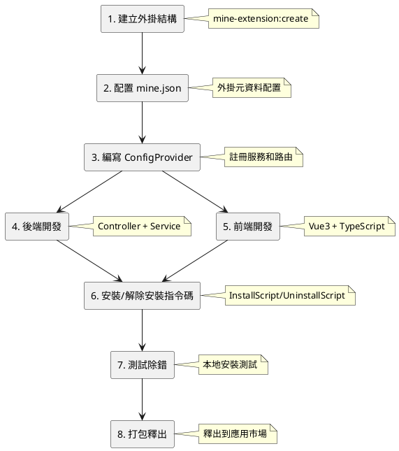

# 外掛開發指南

本指南基於實際的 MineAdmin 官方外掛程式碼，詳細介紹外掛的完整開發流程。

## 開發流程概覽



## 外掛結構規範

基於 `app-store` 和 `code-generator` 外掛的實際程式碼，MineAdmin 外掛有兩種典型結構：

### 簡單外掛結構（適合純後端或簡單功能）

```
plugin/mine-admin/plugin-name/
├── mine.json                      # 外掛配置檔案
├── install.lock                   # 安裝標記（自動生成）
└── src/
    ├── ConfigProvider.php         # 配置提供者
    ├── Controller/                # 控制器
    │   └── IndexController.php
    └── Service/                   # 服務層
        └── Service.php
```

### 完整外掛結構（適合複雜業務）

```
plugin/mine-admin/plugin-name/
├── mine.json                      # 外掛配置檔案
├── install.lock                   # 安裝標記（自動生成）
├── README.md                      # 外掛說明
├── src/                          # 後端程式碼
│   ├── ConfigProvider.php        # 配置提供者
│   ├── InstallScript.php         # 安裝指令碼
│   ├── UninstallScript.php       # 解除安裝指令碼
│   ├── Http/
│   │   ├── Controller/           # 控制器
│   │   ├── Request/              # 請求驗證
│   │   └── Vo/                   # 值物件
│   ├── Model/                    # 資料模型
│   ├── Repository/               # 倉儲層
│   └── Service/                  # 服務層
├── web/                          # 前端程式碼
│   ├── index.ts                  # 外掛入口
│   ├── api/                      # API介面
│   ├── views/                    # Vue元件
│   └── locales/                  # 語言包
├── Database/                     # 資料庫
│   ├── Migrations/               # 遷移檔案
│   └── Seeder/                   # 種子資料
├── languages/                    # 後端語言包
│   └── zh_CN/
└── publish/                      # 釋出資源
    └── template/                 # 模板檔案
```

## 後端開發

### 1. ConfigProvider 配置提供者

基於 app-store 外掛的實際實現：

```php
<?php
declare(strict_types=1);

namespace Plugin\MineAdmin\AppStore;

class ConfigProvider
{
    public function __invoke(): array
    {
        return [
            // 註解掃描配置 - 必須配置
            'annotations' => [
                'scan' => [
                    'paths' => [
                        __DIR__,
                    ],
                ],
            ],
            // 依賴注入（可選）
            'dependencies' => [
                // Interface::class => Implementation::class
            ],
            // 命令列（可選）
            'commands' => [
                // Command::class
            ],
            // 中介軟體（可選）
            'middlewares' => [
                'http' => [
                    // Middleware::class
                ],
            ],
            // 事件監聽器（可選）
            'listeners' => [
                // Listener::class
            ],
        ];
    }
}
```

### 2. 控制器開發

參考 app-store 的 IndexController 實現：

```php
<?php
declare(strict_types=1);

namespace Plugin\MineAdmin\AppStore\Controller;

use Hyperf\Di\Annotation\Inject;
use Hyperf\HttpServer\Annotation\Controller;
use Hyperf\HttpServer\Annotation\GetMapping;
use Hyperf\HttpServer\Annotation\PostMapping;
use Mine\Annotation\Auth;
use Mine\Annotation\Permission;
use Mine\Annotation\RemoteState;
use Plugin\MineAdmin\AppStore\Service\Service;
use Psr\Http\Message\ResponseInterface;

#[Controller(prefix: "admin/plugin/store")]
#[Auth]
class IndexController extends AbstractController
{
    #[Inject]
    protected Service $service;

    /**
     * 遠端外掛列表
     */
    #[GetMapping("index")]
    #[Permission("plugin:store:index")]
    public function index(): ResponseInterface
    {
        return $this->success(
            $this->service->getAppList($this->request->all())
        );
    }

    /**
     * 下載外掛
     */
    #[PostMapping("download")]
    #[Permission("plugin:store:download")]
    public function download(): ResponseInterface
    {
        $params = $this->request->all();
        $this->service->download($params);
        return $this->success();
    }

    /**
     * 安裝外掛
     */
    #[PostMapping("install")]
    #[Permission("plugin:store:install")]
    public function install(): ResponseInterface
    {
        $params = $this->request->all();
        $this->service->install($params);
        return $this->success();
    }

    /**
     * 解除安裝外掛
     */
    #[PostMapping("unInstall")]
    #[Permission("plugin:store:uninstall")]
    public function unInstall(): ResponseInterface
    {
        $params = $this->request->all();
        $this->service->unInstall($params);
        return $this->success();
    }

    /**
     * 本地外掛安裝列表
     */
    #[GetMapping("getInstallList")]
    #[RemoteState]
    public function getInstallList(): ResponseInterface
    {
        return $this->success(
            $this->service->getLocalAppInstallList()
        );
    }

    /**
     * 本地上傳安裝
     */
    #[PostMapping("uploadInstall")]
    #[Permission("plugin:store:uploadInstall")]
    public function uploadInstall(): ResponseInterface
    {
        return $this->success(
            $this->service->uploadLocalApp($this->request->all())
        );
    }
}
```

**關鍵註解說明**：
- `#[Controller]`: 定義控制器路由字首
- `#[Auth]`: 需要登入驗證
- `#[Permission]`: 許可權驗證
- `#[GetMapping]`/`#[PostMapping]`: 定義路由方法
- `#[Inject]`: 依賴注入
- `#[RemoteState]`: 遠端狀態管理

### 3. 服務層開發

基於 app-store 的 Service 實現模式：

```php
<?php
declare(strict_types=1);

namespace Plugin\MineAdmin\AppStore\Service;

use App\Service\MineAppStoreService;
use Hyperf\Di\Annotation\Inject;
use Mine\AppStore\Plugin;
use Mine\Exception\MineException;

class Service
{
    #[Inject]
    protected MineAppStoreService $service;

    /**
     * 獲取應用列表
     */
    public function getAppList(array $params): array
    {
        return $this->service->getAppList($params);
    }

    /**
     * 下載應用
     */
    public function download(array $params): void
    {
        $app = $this->service->getAppInfo($params['identifier']);
        
        if (empty($app['download_url'])) {
            throw new MineException('該應用無法下載', 500);
        }
        
        if (Plugin::hasLocalInstalled($params['identifier'])) {
            throw new MineException('應用已經存在本地，如需重新下載，請先刪除本地應用', 500);
        }
        
        $this->service->download($params);
    }

    /**
     * 安裝應用
     */
    public function install(array $params): void
    {
        $pluginName = $params['name'];
        
        if (!Plugin::hasLocal($pluginName)) {
            throw new MineException('外掛不存在', 500);
        }
        
        if (Plugin::hasLocalInstalled($pluginName)) {
            throw new MineException('外掛已經安裝', 500);
        }
        
        Plugin::forceRefreshJsonPath($pluginName);
        Plugin::install($pluginName);
    }

    /**
     * 解除安裝應用
     */
    public function unInstall(array $params): void
    {
        $pluginName = $params['name'];
        
        if (!Plugin::hasLocalInstalled($pluginName)) {
            throw new MineException('外掛未安裝', 500);
        }
        
        Plugin::uninstall($pluginName);
    }

    /**
     * 獲取本地已安裝外掛列表
     */
    public function getLocalAppInstallList(): array
    {
        $list = [];
        $plugins = Plugin::getLocalPlugins();
        
        foreach ($plugins as $name => $info) {
            $app = ['identifier' => $name];
            $app['name'] = $info['name'] ?? '未知';
            $app['status'] = $info['status'] ?? false;
            $app['version'] = $info['version'] ?? '0.0.0';
            $app['description'] = $info['description'] ?? '暫無描述';
            $app['created_at'] = $info['created_at'] ?? '';
            $list[] = $app;
        }
        
        return $list;
    }

    /**
     * 本地上傳安裝
     */
    public function uploadLocalApp(array $params): void
    {
        if (empty($params['path'])) {
            throw new MineException('請上傳外掛包', 500);
        }
        
        // 解壓並驗證外掛包
        $zipFile = new \ZipArchive();
        $result = $zipFile->open($params['path']);
        
        if ($result !== true) {
            throw new MineException('外掛包解壓失敗', 500);
        }
        
        // 獲取外掛資訊並安裝
        $mineJson = $zipFile->getFromName('mine.json');
        if (!$mineJson) {
            throw new MineException('外掛包格式錯誤，缺少mine.json', 500);
        }
        
        $config = json_decode($mineJson, true);
        $pluginName = $config['name'] ?? null;
        
        if (!$pluginName) {
            throw new MineException('外掛包配置錯誤', 500);
        }
        
        // 解壓到外掛目錄
        $targetPath = Plugin::getPluginPath($pluginName);
        $zipFile->extractTo($targetPath);
        $zipFile->close();
        
        // 重新整理快取並安裝
        Plugin::forceRefreshJsonPath($pluginName);
        Plugin::install($pluginName);
    }
}
```

### 4. 模型層（如需資料庫）

參考 code-generator 外掛的模型實現：

```php
<?php
declare(strict_types=1);

namespace Plugin\MineAdmin\CodeGenerator\Model;

use Mine\MineModel;

class SettingGenerateColumns extends MineModel
{
    protected ?string $table = 'setting_generate_columns';
    
    protected array $fillable = [
        'id', 'table_id', 'column_name', 'column_comment',
        'column_type', 'default_value', 'is_nullable',
        'is_pk', 'is_list', 'is_query', 'is_required',
        'is_sort', 'is_edit', 'is_readonly', 'query_type',
        'view_type', 'dict_type', 'extra', 'sort',
        'created_by', 'updated_by', 'created_at', 'updated_at'
    ];
    
    protected array $casts = [
        'is_pk' => 'boolean',
        'is_list' => 'boolean', 
        'is_query' => 'boolean',
        'is_required' => 'boolean',
        'is_sort' => 'boolean',
        'is_edit' => 'boolean',
        'is_readonly' => 'boolean',
    ];
}
```

## 前端開發

### 1. 外掛入口檔案 (index.ts)

基於 app-store 的前端實現：

```typescript
import type { App } from 'vue'
import type { Plugin } from '#/global'

const pluginConfig: Plugin.PluginConfig = {
  install(app: App) {
    // Vue外掛安裝鉤子
    console.log('app-store plugin install')
  },
  config: {
    enable: true,
    info: {
      name: 'app-store',
      version: '1.0.0',
      author: 'MineAdmin Team',
      description: 'MineAdmin應用市場視覺化外掛'
    }
  },
  views: [
    {
      name: 'plugin:store',
      path: '/plugin/store',
      meta: {
        title: 'app_store.app_store',
        i18n: true,
        icon: 'material-symbols:app-shortcut',
        type: 'M',
        hidden: false,
        componentPath: '/plugin/mine-admin/app-store/views/index.vue',
        componentName: 'plugin:mine-admin:app-store:index',
      },
      component: () => import('./views/index.vue'),
    }
  ],
}

export default pluginConfig
```

### 2. API 介面封裝

```typescript
// api/app-store.ts
import { request } from '@/utils/request'

// 獲取遠端外掛列表
export const getAppList = (params: any) => {
  return request.get('/admin/plugin/store/index', { params })
}

// 下載外掛
export const downloadApp = (data: any) => {
  return request.post('/admin/plugin/store/download', data)
}

// 安裝外掛
export const installApp = (data: any) => {
  return request.post('/admin/plugin/store/install', data)
}

// 解除安裝外掛
export const uninstallApp = (data: any) => {
  return request.post('/admin/plugin/store/unInstall', data)
}

// 獲取本地已安裝外掛
export const getInstalledList = () => {
  return request.get('/admin/plugin/store/getInstallList')
}

// 上傳本地外掛安裝
export const uploadInstall = (data: any) => {
  return request.post('/admin/plugin/store/uploadInstall', data)
}
```

### 3. Vue 元件開發

```vue
<!-- views/index.vue -->
<template>
  <div class="app-store-container">
    <el-tabs v-model="activeTab">
      <el-tab-pane label="應用市場" name="market">
        <AppMarket />
      </el-tab-pane>
      <el-tab-pane label="已安裝" name="installed">
        <InstalledApps />
      </el-tab-pane>
      <el-tab-pane label="本地上傳" name="upload">
        <LocalUpload />
      </el-tab-pane>
    </el-tabs>
  </div>
</template>

<script setup lang="ts">
import { ref } from 'vue'
import AppMarket from './components/AppMarket.vue'
import InstalledApps from './components/InstalledApps.vue'
import LocalUpload from './components/LocalUpload.vue'

const activeTab = ref('market')
</script>
```

### 4. 國際化支援

```typescript
// locales/zh_CN.ts
export default {
  app_store: {
    app_store: '應用市場',
    app_list: '應用列表',
    installed: '已安裝',
    install: '安裝',
    uninstall: '解除安裝',
    download: '下載',
    upload: '上傳',
    local_upload: '本地上傳',
    upload_tips: '請選擇外掛包檔案（.zip格式）',
  }
}
```

## 安裝與解除安裝指令碼

### InstallScript.php

基於 code-generator 外掛的實際實現：

```php
<?php
declare(strict_types=1);

namespace Plugin\MineAdmin\CodeGenerator;

use Hyperf\Command\Concerns\InteractsWithIO;
use Hyperf\Context\ApplicationContext;
use Hyperf\Contract\ApplicationInterface;
use Mine\Helper\Filesystem;
use Symfony\Component\Console\Input\ArrayInput;
use Symfony\Component\Console\Output\ConsoleOutput;
use Symfony\Component\Console\Output\NullOutput;

class InstallScript
{
    use InteractsWithIO;

    public function __invoke()
    {
        // 設定輸出
        $this->output = new ConsoleOutput();
        
        try {
            $this->info('========================================');
            $this->info('MineAdmin 程式碼生成器外掛');
            $this->info('========================================');
            $this->info('開始安裝外掛...');
            
            // 1. 複製模板檔案
            $this->copyTemplates();
            
            // 2. 複製語言包
            $this->copyLanguages();
            
            // 3. 釋出依賴資源
            $this->publishVendor();
            
            // 4. 執行資料庫遷移
            $this->runMigrations();
            
            $this->info('外掛安裝成功！');
            $this->info('========================================');
            
        } catch (\Throwable $e) {
            $this->error('外掛安裝失敗：' . $e->getMessage());
            throw $e;
        }
    }
    
    /**
     * 複製模板檔案
     */
    protected function copyTemplates(): void
    {
        $source = dirname(__DIR__) . '/publish/template';
        $target = BASE_PATH . '/runtime/generate/template';
        
        if (!is_dir($target)) {
            mkdir($target, 0755, true);
        }
        
        Filesystem::copy($source, $target, false);
        $this->info('模板檔案複製成功');
    }
    
    /**
     * 複製語言包
     */
    protected function copyLanguages(): void
    {
        $source = dirname(__DIR__) . '/languages';
        $target = BASE_PATH . '/storage/languages';
        
        Filesystem::copy($source, $target, false);
        $this->info('語言包複製成功');
    }
    
    /**
     * 釋出依賴包資源
     */
    protected function publishVendor(): void
    {
        $app = ApplicationContext::getContainer()->get(ApplicationInterface::class);
        $app->setAutoExit(false);
        
        $input = new ArrayInput([
            'command' => 'vendor:publish',
            'package' => 'hyperf/translation',
        ]);
        
        $app->run($input, new NullOutput());
        $this->info('依賴資源釋出成功');
    }
    
    /**
     * 執行資料庫遷移
     */
    protected function runMigrations(): void
    {
        $migrationPath = dirname(__DIR__) . '/Database/Migrations';
        
        if (!is_dir($migrationPath)) {
            return;
        }
        
        $app = ApplicationContext::getContainer()->get(ApplicationInterface::class);
        $app->setAutoExit(false);
        
        $input = new ArrayInput([
            'command' => 'migrate',
            '--path' => $migrationPath,
            '--force' => true,
        ]);
        
        $app->run($input, new NullOutput());
        $this->info('資料庫遷移執行成功');
    }
}
```

### UninstallScript.php

```php
<?php
declare(strict_types=1);

namespace Plugin\MineAdmin\CodeGenerator;

use Hyperf\Command\Concerns\InteractsWithIO;
use Symfony\Component\Console\Output\ConsoleOutput;

class UninstallScript
{
    use InteractsWithIO;

    public function __invoke()
    {
        $this->output = new ConsoleOutput();
        
        $this->info('========================================');
        $this->info('即將解除安裝程式碼生成器外掛');
        $this->info('========================================');
        
        try {
            // 清理模板檔案
            $this->cleanTemplates();
            
            // 清理語言包
            $this->cleanLanguages();
            
            // 清理資料庫（可選，根據需求決定是否清理）
            if ($this->confirm('是否清理資料庫表？')) {
                $this->cleanDatabase();
            }
            
            $this->info('外掛解除安裝成功！');
            
        } catch (\Throwable $e) {
            $this->error('外掛解除安裝失敗：' . $e->getMessage());
            throw $e;
        }
    }
    
    protected function cleanTemplates(): void
    {
        $templatePath = BASE_PATH . '/runtime/generate/template';
        if (is_dir($templatePath)) {
            // 遞迴刪除目錄
            $this->removeDirectory($templatePath);
            $this->info('模板檔案清理成功');
        }
    }
    
    protected function cleanLanguages(): void
    {
        // 清理語言包檔案
        $langFile = BASE_PATH . '/storage/languages/zh_CN/code-generator.php';
        if (file_exists($langFile)) {
            unlink($langFile);
            $this->info('語言包清理成功');
        }
    }
    
    protected function cleanDatabase(): void
    {
        // 執行資料庫清理
        // 注意：這裡需要謹慎處理，避免誤刪使用者資料
        $this->info('資料庫表清理成功');
    }
    
    private function removeDirectory(string $dir): void
    {
        if (!is_dir($dir)) {
            return;
        }
        
        $files = array_diff(scandir($dir), ['.', '..']);
        foreach ($files as $file) {
            $path = $dir . '/' . $file;
            is_dir($path) ? $this->removeDirectory($path) : unlink($path);
        }
        rmdir($dir);
    }
}
```

## 資料庫遷移

基於 code-generator 的遷移檔案：

```php
<?php
use Hyperf\Database\Schema\Schema;
use Hyperf\Database\Schema\Blueprint;
use Hyperf\Database\Migrations\Migration;

return new class extends Migration
{
    /**
     * Run the migrations.
     */
    public function up(): void
    {
        Schema::create('setting_generate_tables', function (Blueprint $table) {
            $table->engine = 'InnoDB';
            $table->comment('生成業務表');
            $table->bigIncrements('id')->comment('主鍵');
            $table->string('table_name', 200)->comment('表名稱');
            $table->string('table_comment', 500)->comment('表註釋');
            $table->string('module_name', 100)->comment('模組名');
            $table->string('namespace', 255)->comment('名稱空間');
            $table->string('menu_name', 100)->comment('選單名稱');
            $table->bigInteger('belong_menu_id')->nullable()->comment('所屬選單');
            $table->string('package_name', 100)->nullable()->comment('包名');
            $table->addColumn('string', 'type', ['length' => 100])->comment('生成型別');
            $table->addColumn('string', 'generate_mode', ['length' => 30])->default('1')->comment('生成方式');
            $table->addColumn('string', 'generate_menus', ['length' => 255])->nullable()->comment('生成選單列表');
            $table->addColumn('string', 'build_menu', ['length' => 10])->default('1')->comment('構建選單');
            $table->addColumn('string', 'component_type', ['length' => 30])->default('1')->comment('元件型別');
            $table->json('options')->nullable()->comment('其他配置');
            $table->bigInteger('created_by')->comment('建立者');
            $table->bigInteger('updated_by')->comment('更新者');
            $table->datetimes();
            $table->unique('table_name');
            $table->index('table_name');
        });
    }

    /**
     * Reverse the migrations.
     */
    public function down(): void
    {
        Schema::dropIfExists('setting_generate_tables');
    }
};
```

## 測試與除錯

### 1. 本地安裝測試

```bash
# 建立外掛
php bin/hyperf.php mine-extension:create mine-admin/my-plugin

# 安裝外掛
php bin/hyperf.php mine-extension:install mine-admin/my-plugin

# 檢視已安裝外掛
php bin/hyperf.php mine-extension:local-list

# 解除安裝外掛
php bin/hyperf.php mine-extension:uninstall mine-admin/my-plugin
```

### 2. 除錯技巧

```php
// 在服務層新增日誌
use Hyperf\Context\ApplicationContext;
use Psr\Log\LoggerInterface;

$logger = ApplicationContext::getContainer()->get(LoggerInterface::class);
$logger->info('除錯資訊', ['data' => $data]);

// 使用 dd() 函式除錯
dd($variable);

// 使用異常丟擲除錯
throw new \Exception('除錯資訊: ' . json_encode($data));
```

### 3. 前端除錯

```typescript
// 在瀏覽器控制檯檢視
console.log('除錯資訊', data)

// 使用 Vue DevTools 除錯元件狀態

// 檢視網路請求
// 使用瀏覽器的 Network 面板檢視 API 請求和響應
```

## 開發最佳實踐 ⭐

### 1. 程式碼規範

- **命名規範**：
  - 外掛名：`vendor/plugin-name` 格式
  - 名稱空間：`Plugin\Vendor\PluginName`
  - 類名：PascalCase
  - 方法名：camelCase

- **PSR規範**：
  - 遵循 PSR-4 自動載入規範
  - 遵循 PSR-12 編碼規範

### 2. 目錄組織原則

- 後端程式碼統一放在 `src/` 目錄
- 前端程式碼統一放在 `web/` 目錄
- 資料庫相關放在 `Database/` 目錄
- 靜態資源放在 `publish/` 目錄
- 語言包放在 `languages/` 和 `web/locales/` 目錄

### 3. 配置管理 (重要)

- **不要依賴 ConfigProvider 的 publish 功能**
- **在 InstallScript 中處理所有檔案複製和配置釋出**
- **在 InstallScript 中執行資料庫遷移**
- **在 InstallScript 中進行環境檢測**

### 4. 安全考慮

```php
// 引數驗證
use Hyperf\Validation\Request\FormRequest;

class StoreRequest extends FormRequest
{
    public function rules(): array
    {
        return [
            'name' => 'required|string|max:100',
            'email' => 'required|email',
        ];
    }
}

// 許可權控制
#[Permission("plugin:module:action")]
public function action() {}

// SQL注入防護 - 使用引數繫結
$model->where('name', '=', $name)->get();

// XSS防護 - 前端處理
{{ data | escape }}
```

### 5. 效能最佳化

```php
// 使用依賴注入減少耦合
#[Inject]
protected Service $service;

// 使用快取
use Hyperf\Cache\Annotation\Cacheable;

#[Cacheable(prefix: "plugin", ttl: 3600)]
public function getData() {}

// 路由懶載入
component: () => import('./views/index.vue')

// 資料庫查詢最佳化
$query->select(['id', 'name'])->with('relation')->limit(20);
```

### 6. 錯誤處理

```php
use Mine\Exception\MineException;

// 業務異常
if (!$condition) {
    throw new MineException('錯誤資訊', 500);
}

// try-catch 處理
try {
    // 業務邏輯
} catch (\Throwable $e) {
    $this->logger->error('操作失敗', [
        'error' => $e->getMessage(),
        'trace' => $e->getTraceAsString()
    ]);
    throw new MineException('操作失敗: ' . $e->getMessage());
}
```

## 常見問題解決

### Q: 外掛安裝後無法訪問？
A: 
1. 檢查 ConfigProvider 的 annotations 配置是否正確
2. 確認控制器的 #[Controller] 註解路由字首
3. 檢查許可權註解 #[Permission] 是否已在系統中配置

### Q: 配置檔案沒有釋出？
A: ConfigProvider 的 publish 功能在外掛中不可靠，請在 InstallScript 中手動處理配置釋出。

### Q: 資料庫遷移失敗？
A: 
1. 檢查資料庫連線配置
2. 確認遷移檔案路徑正確
3. 檢視遷移命令的錯誤輸出

### Q: 前端元件不顯示？
A: 
1. 檢查 web/index.ts 的路由配置
2. 確認元件路徑正確
3. 檢視瀏覽器控制檯錯誤資訊

### Q: 依賴包衝突？
A: 
1. 在 mine.json 中正確配置 composer 依賴版本約束
2. 使用 `composer update` 更新依賴
3. 檢查與主專案的依賴相容性

## 相關文件

- [外掛結構詳解](./structure.md)
- [生命週期管理](./lifecycle.md)
- [API 參考文件](./api.md)
- [示例程式碼](./examples.md)
- [mine.json 配置](./mineJson.md)
- [ConfigProvider 說明](./configProvider.md)