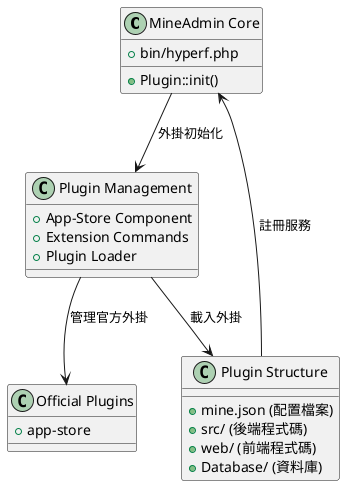

# MineAdmin 外掛系統

MineAdmin 外掛系統提供了強大的擴充套件能力，允許開發者建立可複用的功能模組，實現系統的模組化和可擴充套件性。

## 外掛系統架構

MineAdmin 的外掛系統基於 Hyperf 框架的 ConfigProvider 機制，提供了完整的外掛生命週期管理和自動化部署能力。



## 核心元件

### 1. 外掛載入器
- **檔案**: `bin/hyperf.php` ([GitHub](https://github.com/mineadmin/mineadmin/blob/master/bin/hyperf.php))
- **原理**: 透過 `Plugin::init()` 方法在應用啟動時自動載入所有已安裝的外掛
- **實現**: 掃描 `plugin/` 目錄下的所有外掛並註冊其 ConfigProvider

### 2. App-Store 元件
- **倉庫**: [mineadmin/appstore](https://github.com/mineadmin/appstore)
- **功能**: 提供外掛的下載、安裝、解除安裝、更新等管理功能
- **配置**: 透過 `ConfigProvider` 註冊服務和配置

### 3. 外掛配置系統
- **核心檔案**: `mine.json` 
- **原理**: 定義外掛的元資料、依賴關係、安裝指令碼等資訊
- **載入**: 在外掛安裝時解析並註冊到系統中

## 官方外掛

MineAdmin 預設提供以下官方外掛：

| 外掛名稱 | 功能描述 | 倉庫地址 |
|---------|----------|----------|
| app-store | 應用市場管理外掛，提供外掛的下載、安裝、解除安裝、更新等管理功能 | [GitHub](https://github.com/mineadmin/appstore) |

> 注：其他外掛如程式碼生成器、定時任務管理等可透過應用市場獲取或自行開發

## 外掛型別

MineAdmin 支援三種類型的外掛：

### Mixed (混合型外掛)
包含前端和後端完整功能的外掛，提供完整的業務模組。

### Backend (後端外掛) 
僅包含後端邏輯的外掛，主要提供 API 服務和業務邏輯。

### Frontend (前端外掛)
僅包含前端介面的外掛，主要提供使用者介面元件。

## 快速開始

### 環境準備

開發 MineAdmin 外掛需要：

1. **熟悉技術棧**：MineAdmin 和 Hyperf 框架
2. **獲取 AccessToken**：
   - 登入 [MineAdmin 官網](https://www.mineadmin.com/login)
   - 進入個人中心 → [設定頁面](https://www.mineadmin.com/member/setting)
   - 獲取 AccessToken

3. **配置環境變數**：
```ini
# .env 檔案
MINE_ACCESS_TOKEN=你的AccessToken
```

::: warning 注意
請妥善保管 AccessToken，避免洩露！
:::

### 開發者認證

- **本地開發**：無需認證，可自由開發和分發
- **應用市場釋出**：需要開發者認證，聯絡 MineAdmin 團隊開通許可權

## 相關文件

- [快速入門指南](./guide.md) - 建立第一個外掛
- [開發指南](./develop.md) - 詳細開發流程
- [外掛結構](./structure.md) - 目錄結構規範
- [生命週期管理](./lifecycle.md) - 安裝解除安裝流程
- [API 參考](./api.md) - 介面文件
- [示例程式碼](./examples.md) - 實際案例